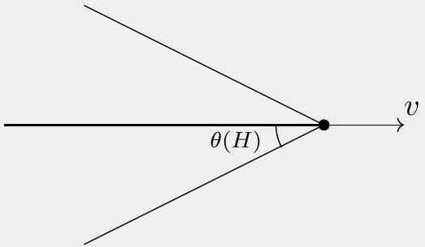
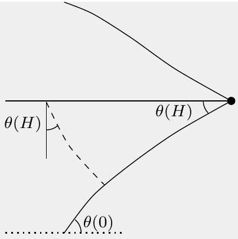
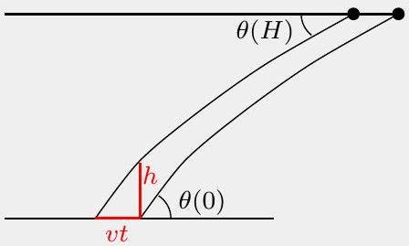

## Problem B2: Where's the Kaboom?

A plane is flying horizontally at constant velocity $v$ and altitude $z = H$. The speed of sound at altitude $z$ is given by

$$
c ( z ) = \alpha \sqrt { T ( z ) } ,
$$

where $\alpha$ is a constant. Suppose $v > c ( H )$, and define the Mach number as

$$
M \equiv \frac { v } { c ( H ) } > 1 .
$$

If $c ( z )$ is constant for all $z$, then the envelope is a cone with half angle $\theta$ where $\sin \theta = \frac { 1 } { M }$ and propagates with the speed of sound $c$.

a. Sketch the envelope.

## Solution

The envelope is a cone with half angle $\theta$ where $\sin \theta = \frac { 1 } { M }$.

b. Now, the speed of sound depends on the altitude because the temperature is not uniform. For the altitudes we are interested in, the following linear model works well:
$$
T ( z ) = T _ { 0 } - \beta z ,
$$
where $\beta > 0$ is a constant. Sketch the envelope of the boom.

## Solution

The half angle of the cone $\theta$ is also the incident angle of sonic boom ray, and since $c ( z )$ is not constant $\theta = \theta ( z )$ depends on $z$. Using Snell's law on the sonic boom ray, we get $\frac { \sin \theta ( 0 ) } { c ( 0 ) } = \frac { \sin \theta ( H ) } { c ( H ) } = \frac { 1 } { v }$. This means that sonic wave travels on a curve with reduced steepness on the bottom.

c. If the Mach number is large enough then the sonic boom hits the ground. Assume it is large enough. On the ground, there are two sensors at $z = 0$ and $z = h$, one directly above the other. Assume $h \ll H$ and $\beta h \ll T _ { 0 }$. At time $t _ { 1 }$, the top sensor receives the sonic boom signal and at a later time, the bottom sensor also receives the signal. Express the Mach number $M$ of the airplane in terms of $H , h , t , T _ { 0 } , \alpha , \beta$, where $t = t _ { 2 } - t _ { 1 }$.

## Solution

The following pictures shows the boom at $t _ { 1 }$ and $t _ { 2 }$.

From expression $\sin \theta ( 0 ) = \frac { c ( 0 ) } { v } , \cot \theta ( 0 ) = \frac { v t } { h }$ and trigonometry identity $\cot ^ { 2 } \theta ( 0 ) + 1 =$ $\frac { 1 } { \sin ^ { 2 } \theta ( 0 ) }$ we get

$$
\begin{gathered}
v = \frac { 1 } { \sqrt { \frac { 1 } { \alpha ^ { 2 } T _ { 0 } } - \frac { t ^ { 2 } } { h ^ { 2 } } } } \\
M = \frac { v } { c ( H ) } = \left[ \left( 1 - \frac { \beta H } { T _ { 0 } } \right) \left( 1 - \frac { \alpha ^ { 2 } t ^ { 2 } T _ { 0 } } { h ^ { 2 } } \right) \right] ^ { - \frac { 1 } { 2 } } \approx \left( 1 + \frac { \beta H } { 2 T _ { 0 } } \right) \left( 1 + \frac { \alpha ^ { 2 } t ^ { 2 } T _ { 0 } } { 2 h ^ { 2 } } \right)
\end{gathered}
$$

d. If the plane travels slower without changing direction, its sonic boom could become no longer audible from the ground for the Mach number $1 < M < M _ { \text {max } }$. What is the upper limit for the Mach number $M _ { \text {max } }$ for which this can occur? Express your answer in terms of $T _ { 0 } , H , \alpha , \beta$. You do not necessarily need all of these parameters.

## Solution

When angle $\theta$ rises to 90° the rays that are leading to the boom curve more and travel up. It is similar to the mirage phenomenon. So, the condition when it occurs near the ground is

$\theta ( 0 ) = 90 ^ { \circ }$. This means that $v = c ( 0 )$, so the Mach number is

$$
M _ { \max } = \frac { c ( 0 ) } { c ( H ) } = \sqrt { \frac { T _ { 0 } } { T _ { 0 } - \beta H } } .
$$

## Solution

Real numbers: $\beta = 6.5 \mathrm {~K} / \mathrm { km } , H = 11 \mathrm {~km} , T _ { 0 } = 300 \mathrm {~K}$ give $M _ { \text {max } } \approx 1.146$.
Credit: Boom Technology uses this phenomenon to create their boomless supersonic jet XB-1 and Overture for commercial supersonic flights.
