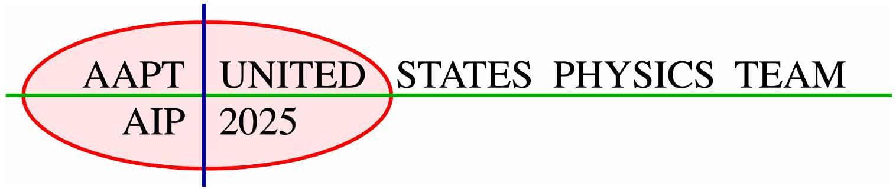
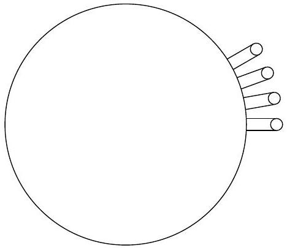
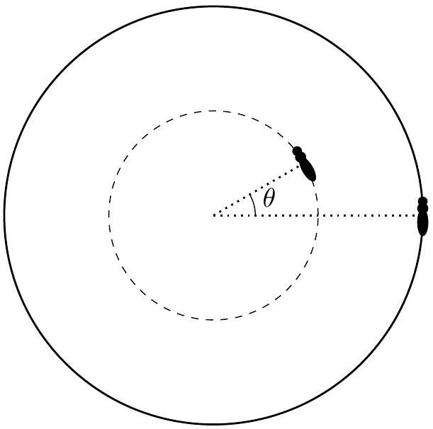

## USA Physics Olympiad Exam

## Instructions for the Student

- All smartphones, tablets, smartwatches, and other internet-connected devices must be handed in before the exam begins. You may only use the desktop computer, laptop, or Chromebook designated for taking the exam.
- You must remain in the exam room for the entire testing period.
- You should receive:
    - This instruction page
    - A reference sheet (on the next page)
    - Problem cover sheets
    - Blank paper for solutions and scratch work

Read this page carefully before the exam begins.

- You may use a calculator, provided its memory has been cleared. You may not use any symbolic math, programming, or graphing features. Calculators may not be shared. Cell phones or any other unauthorized electronics may not be used at any time while the exam is in progress or while exam materials are present. Outside books or references are not allowed.
- When the exam begins, click on the link for Part A. Once you click "Start," a timer will begin. You will have 90 minutes to complete three problems. Each problem is worth 25 points, but they may differ in difficulty. When finished, you may review your work, but do not proceed to Part B.
- After 90 minutes, your proctor will collect your Part A answer sheets. Do not include scratch work. You will then have a short break.
- After the break, click on the link for Part B. You will again have 90 minutes to complete three problems. Each is worth 25 points.
- At the end of Part B, you must return:
    - Your Part B answer sheets (no scratch work)
    - All blank and used scratch paper
    - These instruction pages

- Do not discuss any part of the exam until April 11th. Any violation may result in disqualification.

## Instructions for Writing Your Solutions

- All work must be done on the provided blank pages. You may use as many plain and/or graph sheets as needed for each problem. Work outside of these pages will not be graded.
- To help with grading, please draw a clear box around your final answer to each subpart.
- Organize your work clearly and explain your reasoning concisely. Partial credit may be awarded for well-reasoned work, even if the final answer is incorrect.
- You may write in either pencil or pen, but make sure your work is legible and scan-friendly.

## REFERENCE SHEET

## Fundamental Constants

$$
\begin{array} { l l }
g = 9.8 \mathrm {~N} / \mathrm { kg } & G = 6.67 \times 10 ^ { - 11 } \mathrm {~N} \cdot \mathrm {~m} ^ { 2 } / \mathrm { kg } ^ { 2 } \\
k = 1 / 4 \pi \epsilon _ { 0 } = 8.99 \times 10 ^ { 9 } \mathrm {~N} \cdot \mathrm {~m} ^ { 2 } / \mathrm { C } ^ { 2 } & k _ { \mathrm { m } } = \mu _ { 0 } / 4 \pi = 10 ^ { - 7 } \mathrm {~T} \cdot \mathrm {~m} / \mathrm { A } \\
c = 3.00 \times 10 ^ { 8 } \mathrm {~m} / \mathrm { s } & k _ { \mathrm { B } } = 1.38 \times 10 ^ { - 23 } \mathrm {~J} / \mathrm { K } \\
N _ { \mathrm { A } } = 6.02 \times 10 ^ { 23 } ( \mathrm {~mol} ) ^ { - 1 } & R = N _ { \mathrm { A } } k _ { \mathrm { B } } = 8.31 \mathrm {~J} / ( \mathrm { mol } \cdot \mathrm {~K} ) \\
\sigma = 5.67 \times 10 ^ { - 8 } \mathrm {~J} / \left( \mathrm { s } \cdot \mathrm {~m} ^ { 2 } \cdot \mathrm {~K} ^ { 4 } \right) & e = 1.602 \times 10 ^ { - 19 } \mathrm { C } \\
1 \mathrm { eV } = 1.602 \times 10 ^ { - 19 } \mathrm {~J} & h = 6.63 \times 10 ^ { - 34 } \mathrm {~J} \cdot \mathrm {~s} = 4.14 \times 10 ^ { - 15 } \mathrm { eV } \cdot \mathrm {~s} \\
m _ { e } = 9.109 \times 10 ^ { - 31 } \mathrm {~kg} = 0.511 \mathrm { MeV } / \mathrm { c } ^ { 2 } &
\end{array}
$$

## Useful Approximations

$$
\begin{aligned}
( 1 + x ) ^ { n } & \approx 1 + n x + n ( n - 1 ) x ^ { 2 } / 2 \text { for } | n x | \ll 1 \\
e ^ { x } & \approx 1 + x + x ^ { 2 } / 2 + x ^ { 3 } / 6 \text { for } | x | \ll 1 \\
\sin \theta & \approx \theta - \theta ^ { 3 } / 6 \text { for } | \theta | \ll 1 \\
\cos \theta & \approx 1 - \theta ^ { 2 } / 2 \text { for } | \theta | \ll 1
\end{aligned}
$$

## Useful Identities

$$
\begin{array} { c l }
\sum _ { k = 0 } ^ { N } \cos ( k a + \phi ) = \frac { \sin \left( \frac { ( N + 1 ) a } { 2 } \right) \cdot \cos \left( \frac { N a } { 2 } + \phi \right) } { \sin \left( \frac { a } { 2 } \right) } & \sum _ { k = 0 } ^ { N } \sin ( k a + \phi ) = \frac { \sin \left( \frac { ( N + 1 ) a } { 2 } \right) \cdot \sin \left( \frac { N a } { 2 } + \phi \right) } { \sin \left( \frac { a } { 2 } \right) } \\
\sum _ { k = 1 } ^ { N } \cos ^ { 2 } ( k a ) = \frac { N } { 2 } + \frac { 1 } { 2 } \sum _ { k = 1 } ^ { N } \cos ( 2 k a ) & \sum _ { k = 1 } ^ { N } \sin ^ { 2 } ( k a ) = \frac { N } { 2 } - \frac { 1 } { 2 } \sum _ { k = 1 } ^ { N } \cos ( 2 k a )
\end{array}
$$

## You may use this sheet for both parts of the exam.

## End of Instructions for the Student

## DO NOT CLICK THE LINK FOR PART A UNTIL YOU ARE TOLD TO BEGIN

We acknowledge the US Physics Team coaches and other people for their contributions to this year's exam (in alphabetical order):

Tengiz Bibilashvili, Kellan Colburn, Natalie LeBaron, Rishab Parthasarathy, Mai Qi, Kye Shi, Heng Yuan and Elena Yudovina.

## Problem A1: Shake It

Most hairy mammals shake after getting wet; shaking the water off is energetically advantageous to waiting for it to dry on its own. In this problem, we investigate the mechanics of shaking off water. For simplicity, we will model animals as solid cylinders with the sides covered in fur. You may ignore gravity throughout the problem.

a. We can model the shaking by assuming that the angular position of the cylinder undergoes a sinusoidal oscillation: $\theta = A \cos ( \omega t )$. (The rotation is about the axis of rotational symmetry.) Letting the radius of the cylindrical animal be $R$, derive an expression for the magnitude of the acceleration of a point on the surface of the animal under such a motion.

## Solution

Since we're ignoring gravity, there's two components to the acceleration: radial, $R \dot { \theta } ^ { 2 }$, and tangential, $R \ddot { \theta }$. (Terms involving $\dot { R }$ vanish, since the radius is constant.) They add in quadrature, so the magnitude is

$$
R \sqrt { ( A \omega \sin ( \omega t ) ) ^ { 4 } + \left( A \omega ^ { 2 } \cos ( \omega t ) \right) ^ { 2 } } = A R \omega ^ { 2 } \sqrt { A ^ { 2 } \sin ^ { 4 } ( \omega t ) + \cos ^ { 2 } ( \omega t ) }
$$

b. For the rest of this problem, rather than modeling sinusoidal motion, we will assume that the cylindrical animal is simply spinning at constant angular speed $\omega$. Wet fur tends to separate into cylindrical clumps of radius $r \ll R$. A droplet of water on the end of a clump of fur will be separated from it if the centripetal force overcomes the forces due to surface tension. Derive an approximate relationship (valid up to scalar numerical constants) between the surface tension $\sigma$, the radius $r$ of the fur clump, the radius $R$ of the animal, the angular speed $\omega$, and the density $\rho$ of water. The diagram below show the cross-section of the animal, showing four clumps of fur with droplets on their end.

## Solution

At first glance this doesn't look like a valid dimensional analysis problem, since there are two lengths involved ( $r$ and $R$ ). However, the surface tension force can depend only on $r$ and $\sigma$, while the centripetal force depends only on $R , \omega$, and the mass of the droplets $m \propto \rho r ^ { 3 }$. Since surface tension has units of force per linear distance, the two forces scale as $r \sigma$ and $\left( \rho r ^ { 3 } \right) \left( \omega ^ { 2 } R \right)$, and we write $\omega ^ { 2 } \sim \frac { \sigma r } { \rho r ^ { 3 } R }$.
Note that the surface tension term "should" be proportional to $2 \pi r \sigma$, since the circumference of the fur clump (rather than its radius) is the relevant linear dimension; but this doesn't

change the scaling behavior.

c. Experimentally, it is observed that all mammalian fur forms clumps of similar radius. Under the assumption that different animals all have the same density and are simply scaled copies of each other (i.e. larger animals are both longer and fatter), the relationship between an animal's mass $M$ and its angular velocity of shaking $\omega$ is of the form $\omega \sim M ^ { n }$ : find the value of $n$.

## Solution

Since $\sigma , \rho$, and $r$ are constant, we simply have $\omega \sim R ^ { - 1 / 2 }$. Since the animals are proportional cylinders, we have $M \sim R ^ { 3 }$, so $\omega \sim M ^ { - 1 / 6 }$.

d. Shaking requires energy, which we can crudely model as the rotational energy of the corresponding cylinder. An alternative strategy for the animal is to simply air-dry their fur, which requires energy to evaporate the water. Assume a wet animal has approximately 5\% of their body weight in water, and has to supply all the energy for evaporating the water. Our model predicts that for some animal sizes, it will be energetically advantageous to air dry themselves: estimate the range of animal masses for which this is true. You may use the following facts: a mouse weighs 20 g, has a radius of 1 cm, and shakes itself with angular velocity $\omega = 30$ rad/s. The latent heat of vaporization of water at room temperature is $\lambda = 2430 \mathrm {~J} / \mathrm { g }$.

## Solution

Since we found $\omega \sim M ^ { - 1 / 6 }$, the energy of shaking scales as $M R ^ { 2 } \omega ^ { 2 } \sim M ^ { 4 / 3 }$, while the energy of air-drying simply scales with the animal mass. So, for large enough animals, air drying should be energetically advantageous. However, constants are important!

For a cylindrical mouse, we find that the energy of shaking is

$$
E _ { \text {shaking, mouse } } = \frac { 1 } { 2 } \left( \frac { 1 } { 2 } M R ^ { 2 } \right) \omega ^ { 2 } = 0.00045 \mathrm {~J}
$$

and the energy of evaporating the water is

$$
E _ { \text {evaporation, mouse } } = 0.05 M \lambda = 2430 \mathrm {~J} .
$$

For an arbitrary cylindrical animal, we have

$$
E _ { \text {shaking } } = E _ { \text {shaking, mouse } } \cdot \left( M / M _ { \text {mouse } } \right) ^ { 4 / 3 }
$$

and

$$
E _ { \text {evaporation } } = E _ { \text {evaporation, mouse } } \cdot \left( M / M _ { \text {mouse } } \right)
$$

For these to become equal, we must have

$$
\frac { M } { M _ { \mathrm { mouse } } } \gtrsim \left( \frac { 2430 \mathrm {~J} } { 0.00045 \mathrm {~J} } \right) ^ { 3 } = 1.6 \times 10 ^ { 20 }
$$

or $M \gtrsim 3 \times 10 ^ { 18 } \mathrm {~kg}$. This is the right order of magnitude for the mass of an asteroid (and many orders of magnitude too heavy to be a land mammal), so it's not surprising that just about all mammals prefer to remove the water mechanically instead!

This analysis was based on the article Dickerson, Andrew K et al. "Wet mammals shake at tuned frequencies to dry." Journal of the Royal Society, Interface vol. 9,77 (2012): 3208-18, accessible online at https://pmc.ncbi.nlm.nih.gov/articles/PMC3481573/

## Problem A2: Black Tides

Consider a spherically symmetric, nonrotating star of mass $m$ and radius $r$. If it gets too close to the supermassive black hole of mass $M \gg m$ at the center of a galaxy, it will be ripped apart by tidal forces. Throughout this problem, neglect relativistic effects and give answers in terms of $G , M , m$, and $r$. When asked for numbers, assume the star is Sun-like, so that $m = 2 \times 10 ^ { 30 } \mathrm {~kg}$, $r = 7 \times 10 ^ { 8 } \mathrm {~m}$, and $M = 10 ^ { 6 } m$, and give all numeric answers to one significant figure.

a. Suppose the star orbits the black hole in a circle of radius $R$. What is the radius of curvature of the trajectory of each point on the star's surface? Note that the star does not rotate as it orbits.

## Solution

As the star rotates about the black hole, each point on the surface will trace out a circle with radius $R$. The circle will be translated with respect to the star's orbit.

b. Gas on the star's surface facing the black hole is attracted to the star by the star's gravity, and pulled away from the star by the black hole's tidal force. Write an expression for the tidal acceleration at the point closest to the black hole.

## Solution

The tidal acceleration is equal to the difference in the gravitational acceleration due to the black hole at the center and the near surface of the star,

$$
g _ { T } = \frac { G M } { ( R - r ) ^ { 2 } } - \frac { G M } { R ^ { 2 } } \approx \frac { 2 G M r } { R ^ { 3 } }
$$

where we used the binomial expansion.

c. At a radius $R$ where the gravitational and tidal forces are in equilibrium, the star will start being tidally ripped apart. This effect can only be observed when $R$ is outside the black hole's Schwarzschild radius $R _ { s } = 2 G M / c ^ { 2 }$. Find an expression for $R$ and numerically evaluate the ratio $R / R _ { s }$.

## Solution

Setting the tidal acceleration expression equal to $G m / r ^ { 2 }$ yields $R = r ( 2 M / m ) ^ { 1 / 3 }$. This is known as the solid-body Roche limit. In reality, a star can start breaking up at larger orbital radii, because its shape can be deformed, the star can be rotating, and the gas inside carries pressure. However, the Roche limit is a decent estimate of when tidal effects become very important.
We then numerically compute $R = 9 \times 10 ^ { 10 } \mathrm {~m}$ and $R _ { s } = 2 G M / c ^ { 2 } = 3 \times 10 ^ { 9 } \mathrm {~m}$, so the ratio is $R / R _ { s } = 30$. In other words, tidal disruption of such a star occurs well outside the black hole's horizon, so the events are observable, and general relativistic effects can be safely neglected.

For the rest of the problem, we consider a star on a parabolic orbit whose periapsis (distance of closest approach) is equal to the radius $R$ found in part 1. Near periapsis, the star will be torn

apart in a "tidal disruption event". As a very rough model of this phenomenon, assume the star is initially a single rigid body. The moment it reaches periapsis, it fragments into many rigid pieces which do not interact with other, and feel only the black hole's gravity.

d. Afterward, some of the fragments will escape from the black hole, while the rest remain bound. Numerically evaluate the fraction of the mass which escapes.

## Solution

The fragment at the center of the star has zero energy, since it's directly on the parabolic orbit. At periapsis, the fragments all have the same kinetic energy, since the star was a rigid body, but the ones further away from the black hole than the center have a less negative potential energy, so they have a positive total energy. Since $R \gg r$, about half of the star is further away than the center, so a fraction 0.5 of the mass escapes, independent of the parameters $m , M$, and $r$.

e. An escaping fragment has speed $v _ { f }$ when it is far from the black hole. Find the maximum possible value of $v _ { f }$, among all fragments, and evaluate it numerically.

## Solution

At the moment of the disruption, the entire star has speed $v _ { 0 } = \sqrt { 2 G M / R }$. The fragments with the highest total energy are those at the far side of the star, a distance $R + r$ from the black hole. Applying conservation of energy per unit mass gives

$$
\frac { 1 } { 2 } v _ { f } ^ { 2 } = \frac { 1 } { 2 } v _ { 0 } ^ { 2 } - \frac { G M } { R + r } = \frac { G M } { R } - \frac { G M } { R + r } \approx \frac { G M r } { R ^ { 2 } } .
$$

Solving for $v _ { f }$ and substituting in our earlier result for $R$ gives

$$
v _ { f } = \left( \frac { 2 M } { m } \right) ^ { 1 / 6 } \sqrt { \frac { G m } { r } } = 5 \times 10 ^ { 6 } \mathrm {~m} / \mathrm { s } .
$$

f. A bound fragment orbits with period $T _ { f }$. Find the minimum possible value of $T _ { f }$, among all fragments, and evaluate it numerically.

## Solution

The shortest period occurs for fragments at the near side of the star, a distance $R - r$ from the black hole. By similar reasoning to the previous part, the energy per unit mass of such fragments is $- G M r / R ^ { 2 }$. In addition, we know that the total energy per unit mass in an elliptical orbit is $- G M / ( 2 a )$ where $a$ is the semimajor axis; combining these gives

$$
a = \frac { R ^ { 2 } } { 2 r } = \left( \frac { M } { m } \right) ^ { 2 / 3 } \frac { r } { 2 ^ { 1 / 3 } } .
$$

Finally, Kepler's third law states that the period is

$$
T _ { f } = 2 \pi \sqrt { \frac { a ^ { 3 } } { G M } } = 2 \pi \sqrt { \frac { r ^ { 3 } } { 2 G m } } \sqrt { \frac { M } { m } } = 7 \times 10 ^ { 6 } \mathrm {~s} = 80 \text { days. }
$$

As bound fragments return to the location of the initial disruption, they collide with other debris, causing them to be absorbed into the black hole's accretion disk. This process produces an enormous amount of light, with the luminosity (or energy emitted over time) proportional to the mass absorption rate. If $t = 0$ at the moment the star fragments apart, then light begins to be emitted at the time you found in part 5, and afterward the luminosity scales as $L \propto 1 / t ^ { n }$ for a constant $n$.

g. Find the value of $n$. Assume for simplicity that the total energies of the bound fragments are uniformly distributed between their minimum and maximum values.

## Solution

The mass that falls into the accretion disk in the interval $( t , t + d t )$ consists of particles whose orbital period $T _ { f }$ is in that range. By Kepler's third law, the total energy of the particles is related to the orbital period as $E \propto T _ { f } ^ { - 2 / 3 }$, so the width of the energy band of the particles that fall in during that time scales as $d E \propto T _ { f } ^ { - 5 / 3 } d t$. Thus, we have $n = 5 / 3$. This is the canonical light curve power law for tidal disruption events. For further discussion, see the article Stellar disruption by a supermassive black hole by Lodato, King, and Pringle.

## Problem A3: Bitter and Magnetic

In this problem, we explore some of the design considerations for an electromagnet.

a. Consider an electromagnet consisting of a long solenoid, i.e. a spiral of thin wire wrapped in a single layer around a cylindrical nonmagnetic core. The wire is wrapped in such a way that the adjacent coils almost touch. When a current is sent through the wire, a magnetic field is generated inside the solenoid; this magnetic field exerts an outward force on the wire. Find the pressure $P$ on the solenoid in terms of the magnetic field $B$ inside the solenoid.

## Solution

The energy density of the magnetic field inside the solenoid is $B ^ { 2 } / \left( 2 \mu _ { 0 } \right)$; this is also the pressure it exerts on the outer walls of the solenoid. (To see that "energy density" is the same as "pressure", consider the work done when a portion of the wall is displaced by some distance.)
Alternatively, we can think about the force on a small segment of wire of length $d s$. If the current in the wire is $I$, the force on the segment will be $\tilde { B } \times I d s$, where $\tilde { B }$ is the average magnetic field through the wire. We must have $\tilde { B } = B / 2$ by symmetry - the field is $B$ inside the solenoid, 0 on the outside, and to a small segment of wire the solenoid just looks like an infinite plane. Also, $I = B / \left( \mu _ { 0 } n \right)$, where $n$ is the number of turns per unit length of the wire. Thus, the force on the segment is $B ^ { 2 } / \left( 2 \mu _ { 0 } n \right) d s$, and the area of the segment's cross-section is $d s / n$, leading to a pressure of $B ^ { 2 } / \left( 2 \mu _ { 0 } \right)$.

b. The pressure on the "walls" of the solenoid is counteracted by tension inside the wire. Derive an expression for the maximal achievable magnetic field $B$ in terms of coil radius $a$, wire diameter (thickness) $t \ll a$, and wire tensile strength $\sigma$. (The tensile strength of a material is the force per unit cross-sectional area that needs to be applied in order to pull the material apart.) Assume the wire is circular in cross-section.

## Solution

We need to convert pressure into tension. Consider a wire segment subtending an angle $d \theta$ : the outward force on it is

$$
\frac { B ^ { 2 } } { 2 \mu _ { 0 } } \cdot t \cdot R d \theta
$$

Denoting the tension in the wire by $T$, the inward force is $2 T ( d \theta / 2 ) = T d \theta$. Since $T = \frac { \pi } { 4 } t ^ { 2 } \sigma$, the necessary inequality is

$$
\frac { 2 } { \pi } \frac { B ^ { 2 } } { \mu _ { 0 } } \frac { a } { t } \leq \sigma
$$

or

$$
B \leq \sqrt { \frac { \pi } { 2 } \sigma \mu _ { 0 } \frac { t } { a } } .
$$

c. Let $a = 0.1 \mathrm {~m} , t = 0.001 \mathrm {~m}$. The tensile strength of copper is $\sigma = 250 \mathrm { MPa }$, and the permeability of free space is $\mu _ { 0 } = 4 \pi \times 10 ^ { - 7 } \mathrm { H } / \mathrm { m }$. What is the maximum magnetic field that can be achieved in a single-layer solenoid made out of such a wire without the wire snapping?

## Solution

$$
B \leq \sqrt { \frac { \sigma \mu _ { 0 } \pi t } { 2 a } } \approx 2.2 \mathrm {~T}
$$

d. In theory, we could generate a stronger field by increasing the wire thickness, but the nonuniform distribution of current inside the wire makes this difficult to analyze.
Instead, consider wrapping the solenoid in many layers of wire. We will place adjacent layers a distance $t$ apart so that they just barely don't touch, and will adjust the current through each wire to equalize the tensile stress. The wire coils span the space from an inner core radius of $a$ to an outer radius of $b$. Estimate the maximum achievable field strength inside this electromagnet. You may assume that the wire is thin $( t \ll a , t \ll b - a )$.

## Solution

Number the coils from the outside in, and let $I _ { k }$ be the current inside the $k$ th coil. For the outermost coil, the situation is as in part b, so the field inside it satisfies

$$
B _ { 1 } \leq \sqrt { \frac { \sigma \mu _ { 0 } \pi t } { 2 b } }
$$

For coil $k$, the energy density inside it is $B _ { k } ^ { 2 } / \left( 2 \mu _ { 0 } \right)$ and the energy density outside it is $B _ { k - 1 } ^ { 2 } / \left( 2 \mu _ { 0 } \right)$. The constraint on tensile stress becomes

$$
B _ { k } ^ { 2 } - B _ { k - 1 } ^ { 2 } \leq \frac { \pi } { 2 } \sigma \mu _ { 0 } \frac { t } { b - t k }
$$

Letting $N = ( b - a ) / t$ be the number of coils, we have

$$
B ^ { 2 } = B _ { N } ^ { 2 } \leq \sum _ { k = 1 } ^ { N } \left( B _ { k } ^ { 2 } - B _ { k - 1 } ^ { 2 } \right) = \frac { \pi } { 2 } \sigma \mu _ { 0 } \sum _ { k = 1 } ^ { N } \frac { t } { b - t k } \approx \frac { \pi } { 2 } \sigma \mu _ { 0 } \int _ { b } ^ { a } \frac { - d u } { u } = \frac { \pi } { 2 } \sigma \mu _ { 0 } \ln ( b / a ) .
$$

e. Estimate the numeric value of the maximum magnetic field that can be achieved in a multi-layer solenoid described above with $a = 0.1 \mathrm {~m}$ and $b = 0.3 \mathrm {~m}$.

## Solution

The maximum possible field will be

$$
B = \sqrt { \frac { \pi } { 2 } \sigma \mu _ { 0 } \ln ( 3 ) } = 23.3 \mathrm {~T} .
$$

## Problem B1: Scroll 'n' Roll

Consider a disk with mass $m$ and radius $R$ placed on a large and frictionless table. An ant with mass $m$ is placed on top of the disk. The ant can move freely without sliding on the disk.

a. Initially, the ant starts on the edge of the disk, and both the ant and the disk are at rest (relative to the table). Then, the ant starts walking across the disk's diameter, such that in the frame of the disk, the ant has (constant) velocity $v$. What is ant's velocity in the frame of the table?

## Solution

By conservation of momentum,

$$
\begin{align*}
m v _ { d } & = m \left( v - v _ { d } \right)  \tag{0-1}\\
v _ { d } & = \frac { v } { 2 } \tag{0-2}
\end{align*}
$$

The ant's velocity is $v - v _ { d } = v / 2$.

b. Suppose instead that the ant walks counterclockwise along the edge of the disk at constant speed $v$ in the frame of the disk. What is the ant's speed in the frame of the table?

## Solution

For the solution, we're considering the disk to be the unit disk, and the ant to be positioned at $( x = 1 , y = 0 )$ crawling counterclockwise (which is also the $+ y$ direction).
We can decompose the movement of the disk into a rotation about the (fixed) disk-ant center of mass, and a rotation about its own center. Write $\omega _ { c m }$ for the angular velocity of the disk about the combined center of mass, and $\omega _ { d }$ for the angular velocity of the disk about its center.

Letting $v ^ { \prime }$ be the ant's speed in the table's reference frame, we find

$$
\begin{equation*}
v ^ { \prime } = v + \omega _ { c m } \frac { R } { 2 } + \omega _ { d } R \tag{0-3}
\end{equation*}
$$

Conservation of linear momentum and conservation of angular momentum give

$$
\begin{align*}
m v ^ { \prime } - m \omega _ { c m } \frac { R } { 2 } & = 0  \tag{0-4}\\
v ^ { \prime } m \frac { R } { 2 } + \omega _ { d } I _ { d } + \omega _ { c m } I _ { c m } & = 0 \tag{0-5}
\end{align*}
$$

where $I _ { d }$ is the moment of inertia of the disk about its own center of mass, and $I _ { c m }$ is the moment of inertia of the disk about the combined center of mass. By the parallel axis

theorem,

$$
\begin{align*}
I _ { 1 } & = \frac { 1 } { 2 } m R ^ { 2 }  \tag{0-6}\\
I _ { 2 } & = \frac { 3 } { 4 } m R ^ { 2 } \tag{0-7}
\end{align*}
$$

Solving everything, we find

$$
\begin{align*}
& \omega _ { d } = - \frac { v } { R }  \tag{0-8}\\
\omega _ { c m } = \frac { v } { 2 R } & \tag{0-9}
\end{align*}
$$

and therefore

$$
v ^ { \prime } = \frac { R } { 4 } .
$$

c. Now there are two ants on the disk! The second ant (also of mass $m$ ) starts at distance $R / 2$ from the center of the disk, with an angle offset by $\theta$ from the first ant. The second ant walks counterclockwise around this circle with radius $R / 2$ at speed $v / 2$ (relative to the disk). Find all $\theta$ such that the second ant is stationary in the frame of the table.

## Solution

First, if $\theta = 0$, the second ant is starting out at the center of mass; we claim this means that he doesn't affect the movement of the system. Since the disk is rotating at $\omega _ { d } = - v / R$ about its center, the original position of the ant would be moving at velocity $- v / 2$ relative to the center of the disk; hence, by moving at $v / 2$ relative to the center of the disk, the ant manages exactly to stay in place.
Now suppose there is some other such angle $\theta$. Consider the triangle formed by the two ants and the center of the circle. The description of the ants' movement ensures that this triangle moves as a rigid body (the relative positions of the ants and the center of the disk remain fixed). The center of mass of the system, which is at the center of this triangle, is fixed in the reference plane of the table. If we were to also fix the second-ant vertex in place,

the system simply wouldn't be able to move. The only way out is to make the "center of the triangle" and the "vertex" coincide, by placing the second ant at the center of mass.

## Problem B2: Where's the Kaboom?

A plane is flying horizontally at constant velocity $v$ and altitude $z = H$. The speed of sound at altitude $z$ is given by

$$
c ( z ) = \alpha \sqrt { T ( z ) } ,
$$

where $\alpha$ is a constant. Suppose $v > c ( H )$, and define the Mach number as

$$
M \equiv \frac { v } { c ( H ) } > 1 .
$$

If $c ( z )$ is constant for all $z$, then the envelope is a cone with half angle $\theta$ where $\sin \theta = \frac { 1 } { M }$ and propagates with the speed of sound $c$.

a. Sketch the envelope.

## Solution

The envelope is a cone with half angle $\theta$ where $\sin \theta = \frac { 1 } { M }$.

b. Now, the speed of sound depends on the altitude because the temperature is not uniform. For the altitudes we are interested in, the following linear model works well:
$$
T ( z ) = T _ { 0 } - \beta z ,
$$
where $\beta > 0$ is a constant. Sketch the envelope of the boom.

## Solution

The half angle of the cone $\theta$ is also the incident angle of sonic boom ray, and since $c ( z )$ is not constant $\theta = \theta ( z )$ depends on $z$. Using Snell's law on the sonic boom ray, we get $\frac { \sin \theta ( 0 ) } { c ( 0 ) } = \frac { \sin \theta ( H ) } { c ( H ) } = \frac { 1 } { v }$. This means that sonic wave travels on a curve with reduced steepness on the bottom.

c. If the Mach number is large enough then the sonic boom hits the ground. Assume it is large enough. On the ground, there are two sensors at $z = 0$ and $z = h$, one directly above the other. Assume $h \ll H$ and $\beta h \ll T _ { 0 }$. At time $t _ { 1 }$, the top sensor receives the sonic boom signal and at a later time, the bottom sensor also receives the signal. Express the Mach number $M$ of the airplane in terms of $H , h , t , T _ { 0 } , \alpha , \beta$, where $t = t _ { 2 } - t _ { 1 }$.

## Solution

The following pictures shows the boom at $t _ { 1 }$ and $t _ { 2 }$.

From expression $\sin \theta ( 0 ) = \frac { c ( 0 ) } { v } , \cot \theta ( 0 ) = \frac { v t } { h }$ and trigonometry identity $\cot ^ { 2 } \theta ( 0 ) + 1 =$ $\frac { 1 } { \sin ^ { 2 } \theta ( 0 ) }$ we get

$$
\begin{gathered}
v = \frac { 1 } { \sqrt { \frac { 1 } { \alpha ^ { 2 } T _ { 0 } } - \frac { t ^ { 2 } } { h ^ { 2 } } } } \\
M = \frac { v } { c ( H ) } = \left[ \left( 1 - \frac { \beta H } { T _ { 0 } } \right) \left( 1 - \frac { \alpha ^ { 2 } t ^ { 2 } T _ { 0 } } { h ^ { 2 } } \right) \right] ^ { - \frac { 1 } { 2 } } \approx \left( 1 + \frac { \beta H } { 2 T _ { 0 } } \right) \left( 1 + \frac { \alpha ^ { 2 } t ^ { 2 } T _ { 0 } } { 2 h ^ { 2 } } \right)
\end{gathered}
$$

d. If the plane travels slower without changing direction, its sonic boom could become no longer audible from the ground for the Mach number $1 < M < M _ { \text {max } }$. What is the upper limit for the Mach number $M _ { \text {max } }$ for which this can occur? Express your answer in terms of $T _ { 0 } , H , \alpha , \beta$. You do not necessarily need all of these parameters.

## Solution

When angle $\theta$ rises to 90° the rays that are leading to the boom curve more and travel up. It is similar to the mirage phenomenon. So, the condition when it occurs near the ground is

$\theta ( 0 ) = 90 ^ { \circ }$. This means that $v = c ( 0 )$, so the Mach number is

$$
M _ { \max } = \frac { c ( 0 ) } { c ( H ) } = \sqrt { \frac { T _ { 0 } } { T _ { 0 } - \beta H } } .
$$

## Solution

Real numbers: $\beta = 6.5 \mathrm {~K} / \mathrm { km } , H = 11 \mathrm {~km} , T _ { 0 } = 300 \mathrm {~K}$ give $M _ { \text {max } } \approx 1.146$.
Credit: Boom Technology uses this phenomenon to create their boomless supersonic jet XB-1 and Overture for commercial supersonic flights.

## Problem B3: Locked and Moded

a. Consider two mirrors facing each other separated by a distance $L$ (a Fabry-Pérot resonator). The cavity (the space between the two mirrors) is in vacuum (index of refraction $n = 1$, no dispersion), and the mirrors have high reflectivities so that the main resonance condition is that an integer multiple of half-wavelengths fit into the cavity. A light pulse containing multiple different frequencies travels between the mirrors and interferes with itself.
    i. State the condition for resonance in terms of $L$ and wavelength $\lambda$.
    ii. Write down an expression for the resonant angular frequencies $\omega _ { m }$, with $m$ counting each of the possible resonances.
    iii. What is the angular frequency spacing $\Delta \omega \equiv \omega _ { m + 1 } - \omega _ { m }$ between adjacent angular frequencies?

## Solution

For a Fabry-Pérot resonator of length $L$ in vacuum, an integer number of half-wavelengths must fit into the cavity. Mathematically, we express this resonance condition as:

$$
m \frac { \lambda } { 2 } = L ,
$$

where $m$ is a positive integer. Rearranging gives

$$
\frac { \lambda } { 2 } = \frac { L } { m } \quad \Longrightarrow \quad \lambda = \frac { 2 L } { m }
$$

Now for the resonant angular frequencies:
The angular frequency $\omega$ of light in vacuum is related to its wavelength by

$$
\omega = \frac { 2 \pi c } { \lambda } ,
$$

where $c$ is the speed of light in vacuum. Substituting $\lambda _ { m }$ into this relation gives

$$
\omega _ { m } = \frac { 2 \pi c } { \lambda _ { m } } = \frac { 2 \pi c } { 2 L / m } = \frac { m \pi c } { L } .
$$

The spacing between adjacent modes, e.g. for mode $m$ and $m + 1$, is

$$
\Delta \omega = \omega _ { m + 1 } - \omega _ { m } = \frac { ( m + 1 ) \pi c } { L } - \frac { m \pi c } { L } = \frac { \pi c } { L }
$$

b. The electric field at the antinodes of the standing waves in the resonator is a superposition of oscillations at the resonant angular frequencies and is given by:
$$
E _ { \text {before } } ( t ) = \sum _ { k = - \infty } ^ { + \infty } E _ { k } \cos [ ( k \Delta \omega ) t ] .
$$

Now suppose we introduce a gain medium (such as a doped crystal) into the laser cavity. The gain medium completely absorbs incoming light and re-emits it over a finite range of $N$ angular frequencies centered around some angular frequency $\omega _ { 0 }$, which coincides with one of the $\omega _ { m }$ values determined above. Within this bandwidth, the gain medium amplifies and supports oscillations at all $\omega _ { m }$ that fall within the range. (Assume $N$ is an odd number.)

Assume that each of these $N$ angular frequencies-also referred to as modes-has the same amplitude $E _ { 0 }$, and that their phases are locked such that there is zero relative phase between them at $t = 0$. This condition is known as mode locking. Set their common phase so that all electric fields are expressed as cosine functions, consistent with the form of $E _ { \text {before } } ( t )$.

i. Write an expression for the total electric field $E _ { \text {after } } ( t )$ as the sum of these $N$ equally spaced angular frequencies (with zero relative phase).

## Solution

We assume $N$ frequencies equally spaced by $\Delta \omega$ around a central frequency $\omega _ { 0 }$, all having amplitude $E _ { 0 }$ and zero phase difference. One convenient way to index these frequencies is by letting $k$ run symmetrically about 0 :

$$
\omega _ { k } = \omega _ { 0 } + k \Delta \omega , \quad k = - \frac { N - 1 } { 2 } , - \frac { N - 3 } { 2 } , \ldots , \frac { N - 3 } { 2 } , \frac { N - 1 } { 2 } .
$$

(If $N$ is even, a similar indexing can be used, but the main idea remains the same.) Because all modes are in phase (zero relative phase), a real representation can be written by summing cosines:

$$
E _ { \mathrm { after } } ( t ) = E _ { 0 } \sum _ { k = - \frac { N - 1 } { 2 } } ^ { + \frac { N - 1 } { 2 } } \cos \left[ \left( \omega _ { 0 } + k \Delta \omega \right) t \right]
$$

ii. Show that in the limit of many angular frequencies $\left( \Delta \omega \ll \omega _ { 0 } , N \gg 1 \right)$, the time-dependent electric field approximately takes the following form:
$$
E _ { \mathrm { after } } ( t ) \approx E _ { 0 } f \left( \omega _ { 0 } , t \right) \frac { \sin \left( \frac { N ( \Delta \omega ) t } { 2 } \right) } { \sin \left( \frac { ( \Delta \omega ) t } { 2 } \right) }
$$
and determine the function $f \left( \omega _ { 0 } , t \right)$.

## Solution

$$
E _ { \mathrm { after } } ( t ) = E _ { 0 } \sum _ { k = - \frac { N - 1 } { 2 } } ^ { + \frac { N - 1 } { 2 } } \cos \left[ \left( \omega _ { 0 } + k \Delta \omega \right) t \right] = E _ { 0 } \sum _ { k = 0 } ^ { N } \cos \left[ \left( \omega _ { 0 } - \frac { N - 1 } { 2 } \Delta \omega + k \Delta \omega \right) t \right] =
$$

$$
\begin{gathered}
E _ { 0 } \cos \left( \omega _ { 0 } t + \frac { 1 } { 2 } \Delta \omega t \right) \frac { \sin \left( \frac { ( N + 1 ) \Delta \omega t } { 2 } \right) } { \sin \left( \frac { \Delta \omega t } { 2 } \right) } \approx E _ { 0 } \cos \left( \omega _ { 0 } t \right) \frac { \sin \left( \frac { N ( \Delta \omega ) t } { 2 } \right) } { \sin \left( \frac { ( \Delta \omega ) t } { 2 } \right) } \\
f \left( \omega _ { 0 } , t \right) = \cos \left( \omega _ { 0 } t \right)
\end{gathered}
$$

c. To answer the next part of the problem, assume $N$ is odd and find the following limit when $a = \pi m$, where $m$ is an integer:
$$
\lim _ { x \rightarrow a } \frac { \sin ( N x ) } { \sin x }
$$

## Solution

For indicated values of $a$, both numerator and denominator are approaching to 0 . Using L'Hôpital's rule, we get

$$
\lim _ { x \rightarrow \pi m } \frac { \sin ( N x ) } { \sin x } = \lim _ { x \rightarrow \pi m } \frac { N \cos ( N x ) } { \cos x } = \frac { N \cos ( \pi N m ) } { \cos ( \pi m ) } = N .
$$

The answer is positive, because for odd values of $N , N m$ and $m$ are both odd or both even.

d. Mode locking can dramatically increase the peak intensity $I$ of the laser output. Use the expression $I = \gamma E ^ { 2 }$, where $\gamma$ is a known constant, to answer the following questions.
    i. Determine to the total instantaneous intensity $I _ { \text {after } } ( t )$ of the electric field.

## Solution

$$
E _ { \mathrm { after } } ( t ) = E _ { 0 } \cos \left( \omega _ { 0 } t \right) \frac { \sin \left( \frac { N ( \Delta \omega ) t } { 2 } \right) } { \sin \left( \frac { ( \Delta \omega ) t } { 2 } \right) }
$$

Total instantaneous intensity $I _ { \text {after } } ( t )$ : we're given

$$
I _ { \mathrm { after } } ( t ) = \gamma \left[ E _ { \mathrm { after } } ( t ) \right] ^ { 2 } ,
$$

Substituting $E _ { \text {after } } ( t )$ gives

$$
I _ { \mathrm { after } } ( t ) = \gamma \left[ E _ { 0 } \cos \left( \omega _ { 0 } t \right) \frac { \sin \left( \frac { N ( \Delta \omega ) t } { 2 } \right) } { \sin \left( \frac { ( \Delta \omega ) t } { 2 } \right) } \right] ^ { 2 }
$$

ii. What is the maximum possible intensity of the total field, and at what time(s) is this achieved?

## Solution

All $N$ modes add constructively when their phases align. In the ideal phase-locked case, there is a moment in time (and corresponding phase) at which every mode's cosine term is at its maximum (i.e. $\cos \left( \omega _ { m } t \right) = 1$ for each $m$ ). At that instant, the field amplitudes sum linearly:

$$
E _ { \mathrm { total } } = \sum _ { m = 1 } ^ { N } E _ { 0 } = N E _ { 0 } .
$$

Since $I _ { \text {total } } ( t ) \propto \left[ E _ { \text {after } } ( t ) \right] ^ { 2 }$, the maximum intensity occurs when $\left| E _ { \text {after } } \right|$ is largest, i.e. $E _ { \text {after } } = N E _ { 0 }$. Consequently,

$$
I _ { \max } = \gamma \left( N E _ { 0 } \right) ^ { 2 } .
$$

This perfect alignment occurs when

$$
\omega _ { 0 } t + k \Delta \omega t \approx 2 \pi \times ( \text { integer } )
$$

for each $k$ in the range $- \frac { N - 1 } { 2 } \ldots \frac { N - 1 } { 2 }$, which means $( \Delta \omega ) t = 2 \pi m$ for some integer $m$.
You can also obtain this result by looking at the $\sin ( N a ) / \sin ( a )$ term in the expression for the total field: the alignment occurs at zeros of the denominator, i.e. $\frac { ( \Delta \omega ) t } { 2 } = \pi \cdot m$, i.e.

$$
t = \frac { 2 \pi m } { \Delta \omega } .
$$

In theory, we should be worried about the value of the cosine term at that time; however, the constraint that $\omega _ { 0 }$ as well as $\omega _ { 0 } + k ( \Delta \omega )$ are all modes of the resonator ensures that $\left| \cos \left( \omega _ { 0 } t \right) \right| = 1$ at those times.

e. The uncertainty principle states $\Delta x \Delta p \geq \frac { \hbar } { 2 }$. In optics, we are more commonly interested in the duration of the pulse rather than its spatial extent; the two are related via $\Delta x = c \Delta t$.Consider the problem of setting up a very short laser pulse. Use the uncertainty principle to estimate the required bandwidth (range of frequencies). Compare that to the relationship between pulse duration and gain bandwidth that we're achieving in this problem.

## Solution

From uncertainty principle: since $p = \frac { \hbar \omega } { c }$, the uncertainty principle can be stated as $\Delta t \Delta \omega \geq 1$, or "bandwidth $\geq 1 / ($ pulse duration $)$ ".
In our set-up, the bandwidth is $N \Delta \omega$ (not just $\Delta \omega !$ ), but we need to estimate the pulse duration. This is the time scale over which the intensity falls to a constant fraction of its original value. The intensity is dominated by the term $\frac { \sin ( N ( \Delta \omega ) t / 2 ) } { \sin ( ( \Delta \omega ) t / 2 ) }$. If we Taylor-expand this around $t = 0$, we write

$$
\frac { ( N ( \Delta \omega ) t / 2 ) - \frac { 1 } { 3 } ( N ( \Delta \omega ) t / 2 ) ^ { 3 } } { ( ( \Delta \omega ) t / 2 ) - \frac { 1 } { 3 } ( ( \Delta \omega ) t / 2 ) ^ { 3 } } .
$$

Cancelling out the linear term, we get

$$
N \left( 1 - \frac { 1 } { 3 } N ^ { 2 } ( ( \Delta \omega ) t / 2 ) ^ { 2 } \right) \left( 1 + \frac { 1 } { 3 } ( ( \Delta \omega ) t / 2 ) ^ { 2 } \right) = N \left( 1 - \frac { 1 } { 3 } \left( N ^ { 2 } - 1 \right) ( ( \Delta \omega ) t / 2 ) ^ { 2 } \right)
$$

This will become small when $\left( N ^ { 2 } - 1 \right) \left( \frac { ( \Delta \omega ) t } { 2 } \right) ^ { 2 } \sim 1$, or $t \sim \frac { 1 } { N ( \Delta \omega ) }$, so the relationship is exactly as in the uncertainty principle.
