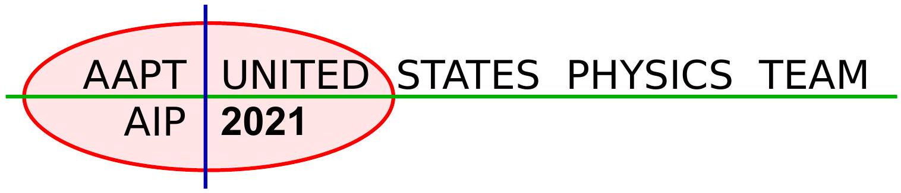
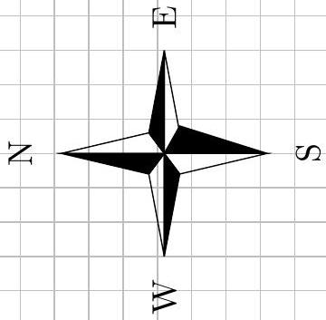
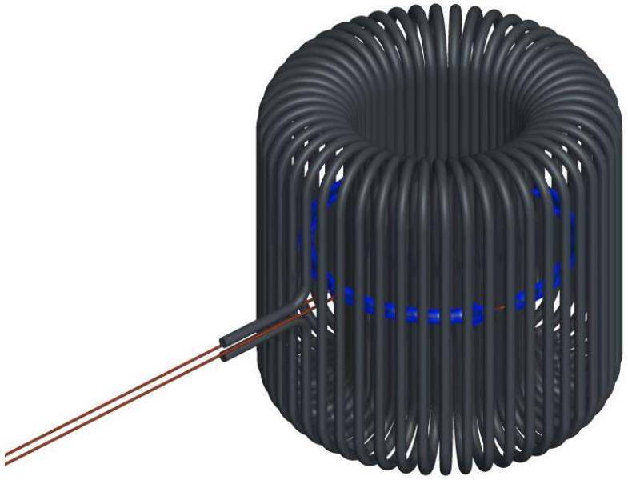
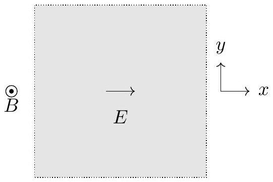
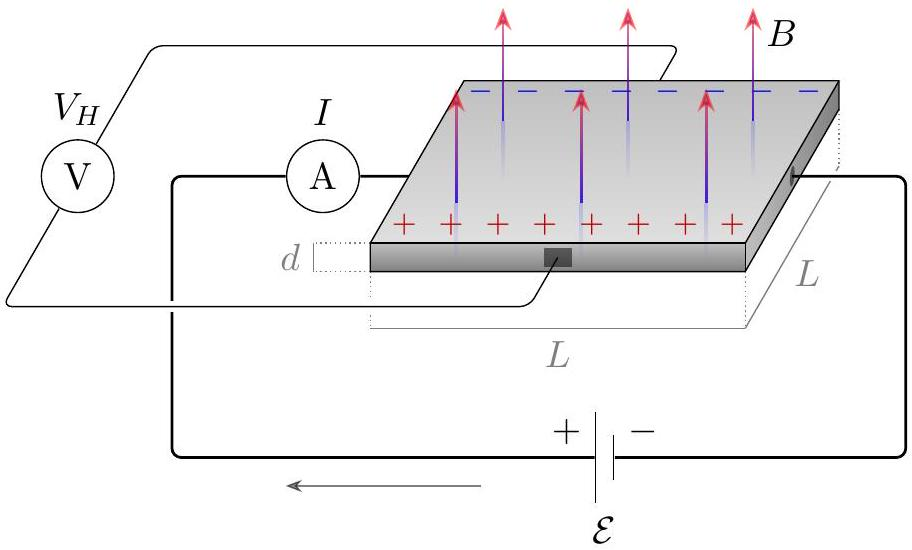
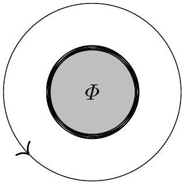
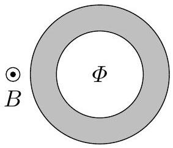

## Traveling Team Selection Exam

## Information About The 2021 USAPhO+

- The 2021 USAPhO+ is a 5-hour exam taking place on Saturday, May 8 from noon to 5 PM, Eastern time.
- The exam is hosted by AAPT on the platform provided by Art of Problem Solving. It will be proctored by the US Physics Team coaches via Zoom.
- Before you start the exam, make sure you are provided with blank paper, both for your answers and scratch work, writing utensils, graph paper and a ruler, a hand-held scientific calculator with memory and programs erased, and a computer for you to log into the USAPhO+ testing page.
- At the end of the exam, you have 20 minutes to upload solutions to all of the problems for that part. For each problem, scan or photograph each page of your solution, combine them into a single PDF file, and upload them on the testing platform.
- USAPhO+ graders are not responsible for missing pages or illegible handwriting. No late submissions will be accepted.

Congratulations again on your qualification for the USAPhO+. We wish you the best of luck on the challenging problems to follow.

We acknowledge the following people for their contributions to this year's exam (in alphabetical order):
JiaJia Dong, Mark Eichenlaub, Abijith Krishnan, Kye W. Shi, Brian Skinner, Mike Winer, and Kevin Zhou.

Question 1
The Jet Stream
The jet stream is an eastward wind current that moves over the continental United States at an altitude of 23, 000 to 35, 000 feet (the range of typical cruising altitudes of commercial airlines). This strong current affects flight times significantly: flights traveling eastward fly significantly faster than flights traveling westward.

This problem consists of two independent parts. In the first part, you will consider a simple model for airplane flight. In the second part, you will determine the jet stream speed on a fictitious planet called Orb.

1. The power that a plane expends is used both to combat drag and to generate lift. Throughout this part of the problem, you may assume that the plane travels with horizontal velocity $\mathbf { v } _ { \text {rel } }$ relative to the air, the density of air is $\rho _ { \text {air } }$, the mass of the plane is $m$, and the cross-sectional area of the plane is $A _ { \mathrm { cs } }$.
    (a) The drag force on an airplane is given by
$$
\mathbf { F } _ { \mathrm { drag } } = - \frac { 1 } { 2 } c _ { d } \rho _ { \mathrm { air } } A _ { \mathrm { cs } } \left| \mathbf { v } _ { \mathrm { rel } } \right| \mathbf { v } _ { \mathrm { rel } } ,
$$
where $c _ { d }$ is the drag coefficient (which depends on the shape of the plane). Write an expression for the power expended by the airplane to combat the drag force from the air.

Solution
We have that $P = \mathbf { F } \cdot \mathbf { v }$, so

$$
P _ { \mathrm { drag } } = \frac { 1 } { 2 } c _ { d } \rho _ { \mathrm { air } } A _ { \mathrm { cs } } v _ { \mathrm { rel } } ^ { 3 } .
$$

(b) Airplanes generate lift by deflecting air downward.
    i. Estimate the air mass per unit time which is deflected by the wings of the plain.

Solution
The mass flux is given by $\rho v _ { \text {rel } }$, so the rate is

$$
\rho _ { \text {air } } v _ { \text {rel } } A _ { \mathrm { cs } } .
$$

ii. Estimate the power expended by the plane for lift.

Solution
Suppose the deflected air has velocity $u$ downward. Then the lift force is given by

$$
m g = \rho v _ { \mathrm { rel } } A u .
$$

The power is given by

$$
P = F u = \frac { m ^ { 2 } g ^ { 2 } } { \rho _ { \mathrm { air } } v _ { \mathrm { rel } } A _ { \mathrm { cs } } } .
$$

This is the power that goes into accelerating the air downward, so by energy conservation it must have come from the plane's engine.
(c) Estimate the speed at which an airplane flies relative to the air by minimizing the power expended by the plane. To get a numeric answer, you may use the following parameters:
$$
m _ { \text {plane } } \sim 8 \times 10 ^ { 4 } \mathrm {~kg} , \quad \rho _ { \text {air } } \sim 1 \mathrm {~kg} / \mathrm { m } ^ { 3 } , \quad c _ { d } \sim 10 ^ { - 2 } , \quad A _ { \mathrm { cs } } \sim 100 \mathrm {~m} ^ { 2 } .
$$

## Solution

The total power is given by

$$
P \sim \frac { m ^ { 2 } g ^ { 2 } } { \rho _ { \mathrm { air } } v _ { \mathrm { rel } } A _ { \mathrm { cs } } } + \frac { 1 } { 2 } c _ { d } \rho A _ { \mathrm { cs } } v _ { \mathrm { rel } } ^ { 3 } .
$$

The minimum power occurs when the derivative vanishes, which roughly gives

$$
v _ { \mathrm { rel } } \sim \left( \frac { m ^ { 2 } g ^ { 2 } } { c _ { d } \rho ^ { 2 } A ^ { 2 } } \right) ^ { 1 / 4 } \sim 300 \mathrm {~m} / \mathrm { s } .
$$

Next, we estimate the jet stream speed using flight times. Because the jet stream speed on Earth varies greatly with location, time of year, and climate effects (such as El Niño and La Niña), you will instead consider the fictitious planet Orb, where the jet stream is eastward and uniform in the region of interest. At the end of the problem is a map of the region, whose area is much smaller than the surface area of Orb (i.e., you can neglect the curvature of Orb).
2. At cruising altitude, we asume all airplanes travel at a fixed speed $v _ { \text {rel } }$ relative to the air. (This is not necessarily the same as your answer to 1(c), which was just a rough estimate.) Additionally, we assume that flights occur in three stages - (1) taxi and takeoff, (2) flight at cruising altitude, (3) landing and taxi - and that stages (1) and (3) take a fixed total time $t _ { 0 }$ for every flight.

(a) Suppose a plane, at cruising altitude, is traveling at an angle $\theta$ away from due east relative to the ground. What is the speed of the plane relative to the ground? Give your answer in terms of $v _ { \text {rel } } , \theta$, and $v _ { w }$, the speed of the jet stream relative to the Earth's surface.

## Solution

The velocity of the plane relative to the ground, $\mathbf { v }$, the velocity of the plane relative to the air, $\mathbf { v } _ { \text {rel } }$, and the jet stream velocity, $\mathbf { v } _ { w }$, all form a triangle under tip-tail addition. Then, from law of cosines,

$$
v _ { \mathrm { rel } } ^ { 2 } = v ^ { 2 } + v _ { w } ^ { 2 } - 2 v v _ { w } \cos \theta .
$$

Solving gives us

$$
v = v _ { w } \cos \theta + \sqrt { v _ { \mathrm { rel } } ^ { 2 } - v _ { w } ^ { 2 } \sin ^ { 2 } \theta } .
$$

Of course, we assumed $v _ { w } < v _ { \text {rel } }$, as otherwise flying westward would not even be possible.

(b) If the plane travels a distance $D$, what is the total travel time $t$, including taxi, takeoff, and landing?

## Solution

The answer is given by

$$
t = \frac { D } { v } + t _ { 0 } ,
$$

where $v$ is our answer to the previous part.

(c) Below, we present some data on airplane flights on Planet Orb. Each of the flight times shown below has an independent uncertainty of $\Delta t = 5 \mathrm {~min}$. From the data and the map, determine $v _ { w }$ and $v _ { \text {rel } }$, giving your answers in km per hour with uncertainties. Indicate clearly what two quantities you are plotting against each other on each graph that you plot.

| Departure City | Arrival City | $t$ (min) |
| :--- | :--- | :--- |
| Noethersville | Rubinstead | 185 |
| Rubinstead | Noethersville | 286 |
| Curieton | Franklinport | 107 |
| Franklinport | Curieton | 244 |
| Planck Town | Maxwellbury | 143 |
| Maxwellbury | Planck Town | 256 |
| Rubinstead | Boltzmannburg | 92 |
| Boltzmannburg | Rubinstead | 190 |
| Einsteinopolis | Maxwellbury | 160 |
| Maxwellbury | Einsteinopolis | 384 |
| Planck Town | Franklinport | 128 |
| Franklinport | Planck Town | 266 |
| Einsteinopolis | Franklinport | 188 |
| Franklinport | Einsteinopolis | 431 |
| Boltzmannburg | Maxwellbury | 135 |
| Maxwellbury | Boltzmannburg | 150 |

| Departure City | Arrival City | $t$ (min) |
| :--- | :--- | :--- |
| Noethersville | Einsteinopolis | 68 |
| Einsteinopolis | Noethersville | 74 |
| Franklinport | Newton City | 144 |
| Newton City | Franklinport | 129 |
| Curieton | Rubinstead | 186 |
| Rubinstead | Curieton | 175 |
| Planck Town | Curieton | 95 |
| Curieton | Planck Town | 102 |
| Planck Town | Rubinstead | 249 |
| Rubinstead | Planck Town | 250 |

## Solution

Note that the pairs of cities given in the second table are directly north/south of each other. For such cities, we expect the times in either direction to be equal, up to the timing uncertainty, and the expression for the time simplifies to

$$
t _ { N S } = \frac { D } { \sqrt { v _ { \mathrm { rel } } ^ { 2 } - v _ { w } ^ { 2 } } } + t _ { 0 }
$$

We can read $t _ { N S }$ off the second table, and calculate $D$ from the figure. The unknown quantity $t _ { 0 }$ goes into the intercept, while the slope is

$$
\frac { 1 } { \sqrt { v _ { \mathrm { rel } } ^ { 2 } - v _ { w } ^ { 2 } } } = 0.0768 \pm 0.0048 \mathrm {~min} / \mathrm { km } .
$$

Next, consider the pairs of cities given in the second table. We can cancel out the effect of $t _ { 0 }$ by considering the difference in flight times in the two directions,

$$
t _ { 12 } - t _ { 21 } = - \frac { D } { v _ { w } \cos \theta + \sqrt { v _ { \mathrm { rel } } ^ { 2 } - v _ { w } ^ { 2 } \sin ^ { 2 } \theta } } + \frac { D } { - v _ { w } \cos \theta + \sqrt { v _ { \mathrm { rel } } ^ { 2 } - v _ { w } ^ { 2 } \sin ^ { 2 } \theta } } .
$$

After some simplification, we find

$$
t _ { 12 } - t _ { 21 } = \frac { 2 D v _ { w } \cos \theta } { v _ { \mathrm { rel } } ^ { 2 } - v _ { w } ^ { 2 } }
$$

Therefore, plotting the time difference versus $D \cos \theta$, where $\theta$ can also be measured from the graph, gives

$$
\frac { 2 v _ { w } } { v _ { \mathrm { rel } } ^ { 2 } - v _ { w } ^ { 2 } } = 0.0722 \pm 0.0003 \mathrm {~min} / \mathrm { km } .
$$

Combining these results gives the answers,

$$
v _ { \text {rel } } = 860 \pm 50 \mathrm {~km} / \mathrm { h } , \quad v _ { w } = 370 \pm 30 \mathrm {~km} / \mathrm { h } .
$$

Uncertainty on the times should be propagated through the calculation using the usual rules, while the uncertainties on the slopes are found by drawing the steepest and shallowest fit lines.

Einsteinopolis
Noethersville
200 km
Rubinstead
Curieton
Planck Town
Boltzmannburg
Newton City
Maxwellbury
Franklinport

## Question 2

## The Dark Forest

Dark matter could be made of hypothetical, extremely light particles called axions. Because individual axions are so light, experiments do not search for individual axions, but rather for the classical axion field formed by a large collection of axions, which oscillates as

$$
a ( t ) = a _ { 0 } \sin ( \omega t ) .
$$

This is analogous to how a large collection of photons can form a classical electromagnetic field. In the presence of a magnetic field B and an axion field $a$, the axion field produces an effective current

$$
\mathbf { J } = g \dot { a } \mathbf { B }
$$

where we define $\dot { a } = d a / d t$. The effective current produces electromagnetic fields in exactly the same way as ordinary current, though it does not come from the motion of actual charges. Experiments can search for axion dark matter using systems which are resonantly driven by this current.

You may use fundamental constants in your answers, such as

$$
\begin{array} { r l r l }
c & = 3.00 \times 10 ^ { 8 } \mathrm {~m} / \mathrm { s } & \hbar & = 1.055 \times 10 ^ { - 34 } \mathrm {~J} \cdot \mathrm {~s} \\
G & = 6.67 \times 10 ^ { - 11 } \mathrm {~N} \cdot \mathrm {~m} ^ { 2 } / \mathrm { kg } ^ { 2 } & \mu _ { 0 } & = 4 \pi \times 10 ^ { - 7 } \mathrm {~N} / \mathrm { A } ^ { 2 } \\
& k _ { B } & = 1.602 \times 10 ^ { - 19 } \mathrm { C } \\
\end{array}
$$

You do not have to provide numeric answers unless asked. When asked to "estimate", you may drop constants of order one. The numeric values provided below are from standard references where $\hbar$, $c , \mu _ { 0 }$, and $\epsilon _ { 0 }$ are set to one; to get correct numeric results, you must restore these factors yourself.

1. First, we will describe some physical properties of the axion field.
(a) Consider a single axion at rest, with mass $m$. Find its associated angular frequency $\omega$. This will be the angular frequency of the corresponding classical field, when there are many axions.

## Solution

The axion is a quantum particle and satisfies the de Broglie relation $E = \hbar \omega$, and its energy comes from its rest mass, $E = m c ^ { 2 }$. Thus,

$$
\omega = \frac { m c ^ { 2 } } { \hbar } .
$$

(b) Suppose dark matter is distributed spherically symmetrically in the galaxy with uniform density $\rho$. The solar system is a distance $r$ from the center of the galaxy and orbits around it with period $T$. Neglecting everything besides dark matter, find the dark matter density $\rho$.

## Solution

Setting the centripetal acceleration equal to the gravitational acceleration,

$$
r \omega ^ { 2 } = \frac { G M } { r ^ { 2 } } , \quad M = \frac { 4 } { 3 } \pi r ^ { 3 } \rho .
$$

Solving for $\rho$, we find
$$
\rho = \frac { 3 \pi } { G T ^ { 2 } } .
$$
(c) The energy density of the axion field is $m ^ { 2 } a _ { 0 } ^ { 2 } / \left( 2 \hbar ^ { 3 } c \right)$. Find the axion field amplitude $a _ { 0 }$.

\section*{Solution}
The dark matter density comes from the mass-energy of the axion field, so
$$
\rho c ^ { 2 } = \frac { m ^ { 2 } a _ { 0 } ^ { 2 } } { 2 \hbar ^ { 3 } c } , \quad a _ { 0 } = \sqrt { \frac { 2 \rho \hbar ^ { 3 } c ^ { 3 } } { m ^ { 2 } } } .
$$
(d) The radius and period of the Sun's orbit, as well as a typical axion mass, are
$$
r = 2.5 \times 10 ^ { 20 } \mathrm {~m} , \quad T = 7.1 \times 10 ^ { 15 } \mathrm {~s} , \quad m = 1.0 \times 10 ^ { - 9 } \mathrm { eV } .
$$
Numerically compute the axion field amplitude $a _ { 0 }$.

## Solution

Plugging in numbers and noting that the provided value of the axion mass is really its energy (and hence dividing it by $c ^ { 2 }$ ) gives the value

$$
a _ { 0 } = 2.36 \times 10 ^ { - 4 } \mathrm {~kg} \mathrm {~m} ^ { 3 } / \mathrm { s } ^ { 3 } .
$$

(e) In this problem, we treat the axion field as spatially uniform within a terrestrial laboratory. To verify that this assumption is reasonable, numerically estimate the axion field's wavelength $\lambda$, assuming the axions have the same galactic speed as the Sun.

## Solution

The axion speed is

$$
v = \frac { 2 \pi r } { T } = 2 \times 10 ^ { 5 } \mathrm {~m} / \mathrm { s } .
$$

Using the de Broglie relation again,

$$
\lambda = \frac { h } { p } = \frac { h } { m v } \sim 10 ^ { 6 } \mathrm {~m} .
$$

As expected, this is much larger than the apparatus considered below. (Note: a common mistake was to write $v = f \lambda$, but this is only true for waves which travel at a constant speed, such as light. To see the problem, note that if you apply the de Broglie relations, this equation becomes $v = E / p$. That's true for photons, where $E = p c$, but certainly not true for massive particles. Some students also tried the Compton wavelength $\lambda = h / m c$, but this is a different quantity, namely the wavelength of a photon if it had the same energy as an axion at rest.)

(f) In part (a), you found $\omega$ by neglecting the axion's speed. In reality, the axion's finite speed changes the frequency to $\omega + \Delta \omega$, in a frame at rest with respect to the galactic center. Numerically estimate $\Delta \omega / \omega$ to show that it is reasonable to neglect this effect.

## Solution

Because $E = \hbar \omega$, we need to see how the energy is changed. We have

$$
\frac { \Delta E } { E } \approx \frac { m v ^ { 2 } / 2 } { m c ^ { 2 } } = \frac { v ^ { 2 } } { 2 c ^ { 2 } }
$$

where we used the fact that $v$, computed above, is nonrelativistic. We thus find

$$
\frac { \Delta \omega } { \omega } \sim 3 \times 10 ^ { - 7 }
$$

which is small as expected. (Note that the usual Doppler shift formula would not work here, and trying to use it would get the wrong answer. The Doppler shift formula applies to particles with constant speed, which satisfy $\omega = v k$. The axion is massive; when at rest, it has $\omega \neq 0$ and $k = 0$. However, you could also get the answer by Lorentz transforming the four-vector $( \omega , \mathbf { k } )$.)

The ABRACADABRA ${ } ^ { 1 }$ experiment, currently taking data at MIT, is a toroidal solenoid with inner and outer radius $R _ { \text {in } }$ and $R _ { \text {out } }$ and height $h$. You may assume $h \gg R _ { \text {out } }$ for simplicity. A superconducting wire carrying current $I$ wraps $N$ times around the toroid, where $N$ is high enough to neglect the discreteness of the wires. A circular pickup loop with radius slightly less than $R _ { \text {in } }$ is placed at the center of the toroid.
2. Now, we will find the axion signal generated in the ABRACADABRA apparatus.
(a) Find the magnetic field $\mathbf { B } ( \mathbf { r } )$ inside the toroid due to the superconducting current.

[^0]

## Solution

Using Ampere's law,

$$
\mathbf { B } = \frac { \mu _ { 0 } N I } { 2 \pi r } \hat { \theta } .
$$

(b) The superconducting wires lose their superconductivity when exposed to a magnetic field greater than $B _ { \text {max } }$. Find the maximum possible current $I _ { \text {max } }$ that can be used, and assume this current is used in later parts.

## Solution

The maximum field is at $r = R _ { \text {in } }$, so

$$
B _ { \max } = \frac { \mu _ { 0 } N I _ { \max } } { 2 \pi R _ { \mathrm { in } } } , \quad I _ { \max } = \frac { 2 \pi R _ { \mathrm { in } } B _ { \max } } { \mu _ { 0 } N } .
$$

(c) Assuming that $\omega$ is small, find the magnetic flux $\Phi _ { B } ( t )$ through the pickup loop due to the axion field in terms of $a _ { 0 } , g , \omega , B _ { \text {max } }$, and the dimensions of the apparatus. (You may ignore any currents induced on the surfaces of the superconducting wires. Accounting for them makes the problem much harder, but does not substantially affect the final result.)

## Solution

The effective current is

$$
\mathbf { J } = g \dot { a } \mathbf { B } = g a _ { 0 } B _ { \max } \frac { R _ { \mathrm { in } } } { r } \omega \cos ( \omega t ) \hat { \theta } .
$$

The resulting field is like that of an array of concentric solenoids, where we may neglect fringe fields because $h \gg R _ { \text {out } }$. Therefore, the axion-produced field $\mathbf { B } _ { \text {ax } }$ inside the pickup loop is uniform. For simplicity, we define

$$
J _ { 0 } = g a _ { 0 } B _ { \max } \omega .
$$

Then using Ampere's law, we have

$$
B _ { \mathrm { ax } } = \mu _ { 0 } J _ { 0 } \cos ( \omega t ) \int \frac { R _ { \text {in } } } { r } d r = \mu _ { 0 } J _ { 0 } R _ { \text {in } } \log \left( R _ { \text {out } } / R _ { \text {in } } \right) \cos ( \omega t ) .
$$

The magnetic flux is then

$$
\Phi _ { B } = \pi R _ { \mathrm { in } } ^ { 2 } B _ { \mathrm { ax } } = \pi \mu _ { 0 } J _ { 0 } R _ { \mathrm { in } } ^ { 3 } \log \left( R _ { \mathrm { out } } / R _ { \mathrm { in } } \right) \cos ( \omega t ) .
$$

(d) If $\omega$ is too large, the result above breaks down due to radiation effects. Estimate the frequency $\omega _ { c }$ where this happens.

## Solution

In the calculations above, we have assumed that the fields are quasistatic, neglecting the

radiation propagation time. This approximation breaks down when
$$
\omega _ { c } \sim \frac { c } { R _ { \mathrm { in } } }
$$
past which the flux will be diminished. Since this calculation is approximate, the answers $c / R _ { \text {out } }$ or $c / h$ are also acceptable.
(e) Using the design values
$$
R _ { \text {in } } = 0.5 \mathrm {~m} , \quad R _ { \text {out } } = 1.0 \mathrm {~m} , \quad h = 2.0 \mathrm {~m}
$$
estimate the numerical value of $\omega / \omega _ { c }$.

## Solution

Plugging numbers in, we find

$$
\omega _ { c } \sim 6.0 \times 10 ^ { 8 } \mathrm {~s} ^ { - 1 } , \quad \omega \sim 1.5 \times 10 ^ { 6 } \mathrm {~s} ^ { - 1 } .
$$

Then we have

$$
\omega / \omega _ { c } \sim 0.0025
$$

which is small as expected. Any answer within an order of magnitude is acceptable.

(f) Let $\Phi _ { 0 }$ be the amplitude of the time-varying axion flux. Using the typical values
$$
B _ { \max } = 5.0 \mathrm {~T} , \quad g = 1.0 \times 10 ^ { - 16 } \mathrm { GeV } ^ { - 1 }
$$
and your previous results, compute the numerical value of $\Phi _ { 0 }$.

## Solution

First, we have to restore the dimensions of $g$. Notice that since current $g \dot { a } B$ has the same units as displacement current $\epsilon _ { 0 } \dot { E }$, the quantities $g a$ and $( E / B ) \epsilon _ { 0 }$ must have the same dimensions, and furthermore $E / B$ has dimensions of speed.
Now, in 1(c) we found that $a$ has dimensions of energy times velocity, while the value of $g$ given here has dimensions of inverse energy. Thus, the combination $g a$ only has dimensions of speed, which means a factor of $\epsilon _ { 0 }$ was left out. In other words, if we denote the value given above as $g ^ { \prime }$, the true value of $g$ is $\epsilon _ { 0 } g ^ { \prime }$.
To avoid mistakes, it's best to group terms in the long expression for $\Phi _ { 0 }$, so that each piece has simple units and a reasonable magnitude. We have

$$
\Phi _ { 0 } = \left( \pi R _ { \mathrm { in } } ^ { 2 } B _ { 0 } \right) \log \left( \frac { R _ { \mathrm { out } } } { R _ { \mathrm { in } } } \right) R _ { \mathrm { in } } \mu _ { 0 } \epsilon _ { 0 } g ^ { \prime } a _ { 0 } \omega
$$

and using $c ^ { 2 } = 1 / \mu _ { 0 } \epsilon _ { 0 }$ gives

$$
\begin{aligned}
\Phi _ { 0 } & = \left( \pi R _ { \text {in } } ^ { 2 } B _ { 0 } \right) \log \left( \frac { R _ { \text {out } } } { R _ { \text {in } } } \right) \frac { \omega R _ { \text {in } } } { c } \frac { g ^ { \prime } a _ { 0 } } { c } \\
& = ( 3.9 \mathrm {~Wb} ) ( 0.693 ) ( 0.0025 ) \left( 4.91 \times 10 ^ { - 19 } \right) \\
& = 3.3 \times 10 ^ { - 21 } \mathrm {~Wb} .
\end{aligned}
$$

The pickup loop has inductance $L$ and is attached to a capacitor, forming a circuit with resonant frequency equal to the axion frequency $\omega$. The circuit also has a small internal resistance $R$ in series, and is at temperature $T$. The axion signal can be detected by monitoring the current in the circuit. The main source of noise is thermal noise, which causes fluctuations in the current.
3. We will now estimate the sensitivity of ABRACADABRA to axions.

(a) The axion produces a current which oscillates sinusoidally. Find the signal current amplitude $I _ { s }$ in terms of $\omega , \Phi _ { 0 }$, and the circuit parameters.

## Solution

Since the axion is at the resonant frequency, the impedance of the circuit is approximately $R$. Therefore the current is

$$
I = \frac { \mathcal { E } } { R } = - \frac { 1 } { R } \frac { d \Phi _ { B } } { d t } .
$$

The amplitude is

$$
I _ { s } = \frac { \omega \Phi _ { 0 } } { R } .
$$

(b) Find the average value of the current squared $\left\langle I ^ { 2 } \right\rangle$ in the circuit due to thermal noise.

## Solution

The energy stored in the inductor is $L I ^ { 2 } / 2$. By the equipartition theorem, the average energy stored in any such quadratic degree of freedom is $k _ { B } T / 2$, so

$$
\left\langle I ^ { 2 } \right\rangle = \frac { k _ { B } T } { L } .
$$

This effect is also called Johnson noise.

(c) At any moment in time, the noise current is oscillating sinusoidally with typical amplitude $I _ { n } = \sqrt { \left\langle I ^ { 2 } \right\rangle }$, which is much larger than $I _ { s }$. However, the phase of the noise current also fluctuates randomly, so that after a typical time $t _ { c }$, its phase will be roughly independent of the phase it had before. Find an estimate for $t _ { c }$ in terms of $\omega$ and the circuit parameters. (Hint: at any given moment, the thermal noise current is simultaneously being produced by the random motion of electrons in the circuit, and damped by the resistor.)

## Solution

The noise current that exists in the circuit at any given moment, by definition, came from the thermal motion of electrons in the circuit up to a time $t _ { c }$ ago. Therefore, $t _ { c }$ is roughly the characteristic time for decay of current in the circuit. There are many ways

to calculate this, but a simple way is to note that
$$
t _ { c } \sim \frac { Q } { \omega } , \quad Q = \frac { \omega L } { R }
$$
where $Q$ is the quality factor. Thus,
$$
t _ { c } \sim \frac { L } { R } .
$$
(d) Suppose the experiment runs for a total time $t _ { e } \gg t _ { c }$. Roughly estimate the average amplitude of the noise current over this period of time.

## Solution

Uncertainty goes down by $\sqrt { n }$ when averaging $n$ independent trials. Here we have $n = t _ { e } / t _ { c }$, so

$$
\bar { I } _ { n } = I _ { n } \sqrt { \frac { t _ { c } } { t _ { e } } } .
$$

(e) The axion is detectable if the signal current amplitude is larger than the averaged noise current amplitude, and the circuit parameters are
$$
L = 1 \mathrm { mH } , \quad R = 10 \mathrm {~m} \Omega , \quad T = 0.1 \mathrm {~K} .
$$
Roughly numerically estimate the time needed to potentially detect the axion. (Hint: if your answer seems strange, note that in reality, the axion's phase also fluctuates over time, because of the effect of part 1(f). In addition, we don't know $\omega$ ahead of time, so the experiment needs to be run many times. We ignored these effects here to keep things simple.)

## Solution

By setting $I _ { s } = \bar { I } _ { n }$ and solving for $t _ { e }$, we find

$$
t _ { e } \sim \frac { k _ { B } T R } { \omega ^ { 2 } \Phi _ { 0 } ^ { 2 } } = 550 \mathrm {~s} .
$$

In reality, you would need to repeat this experiment millions of times to scan a sufficient range of $\omega$, and the time in each step would be longer, because after some point the average axion signal also starts going down as $1 / \sqrt { n }$.

Question 3
Great Hall
The classical Hall effect was first measured by Edwin Hall in 1879, shortly after the publication of Maxwell's equations. In all parts of this problem, materials contain $n _ { V }$ electrons per unit volume, and each electron has charge $q _ { e } < 0$ and mass $m _ { e }$. You may use these quantities in all of your answers. We will begin by investigating the implications of the classical Hall effect.

1. An infinite plate in the $x y$ plane, with thickness $d$ in the $z$ direction, is placed in a uniform magnetic field $\mathbf { B } = B \hat { z }$ as shown. An electric field $\mathbf { E } = E \hat { x }$ is applied in the plane of the plate and the system is allowed to reach a steady state.

(a) If the electrons have velocity $\mathbf { v }$ at steady state, what is the current density $\mathbf { J }$ ? Recall that $\mathbf { J }$ is defined as the total flow of charge through a unit cross-section area per unit time.
Solution
The current density is given by $n _ { V } q _ { e } \mathbf { v }$.
(b) In the Drude model, electrons are subject to both the Lorentz force and a damping force $- \gamma \mathbf { v }$, where $\gamma$ is a constant that depends on the material. In the above system, what is the current density in the steady state? Give both the magnitude and direction of J , e.g. in polar coordinates.

Solution
The equation of motion for an electron is

$$
q _ { e } E \hat { \mathbf { x } } - q _ { e } v _ { x } B \hat { \mathbf { y } } + q _ { e } v _ { y } B \hat { \mathbf { x } } - \gamma v _ { x } \hat { \mathbf { x } } - \gamma v _ { y } \hat { \mathbf { y } } = 0 .
$$

Solving the system of equations gives us

$$
v _ { x } = \frac { \gamma q _ { e } E } { \gamma ^ { 2 } + q _ { e } ^ { 2 } B ^ { 2 } } , \quad v _ { y } = \frac { - q _ { e } ^ { 2 } E B } { \gamma ^ { 2 } + q _ { e } ^ { 2 } B ^ { 2 } } .
$$

Then,

$$
J _ { x } = \frac { \gamma n _ { V } q _ { e } ^ { 2 } E } { \gamma ^ { 2 } + q _ { e } ^ { 2 } B ^ { 2 } } , \quad J _ { y } = \frac { - n _ { V } q _ { e } ^ { 3 } E B } { \gamma ^ { 2 } + q _ { e } ^ { 2 } B ^ { 2 } }
$$

As requested, we compute the magnitude and direction:
$$
| \mathbf { J } | = \frac { q _ { e } ^ { 2 } n _ { V } E } { \sqrt { \gamma ^ { 2 } + B ^ { 2 } q _ { e } ^ { 2 } } } , \quad \theta = - \arctan \left( \frac { B q _ { e } } { \gamma } \right) .
$$
(c) Compute the electrical resistivity,
$$
\rho _ { 0 } = \lim _ { B \rightarrow 0 } \frac { E } { \left| J _ { x } \right| }
$$
and the transverse Hall resistivity
$$
\rho _ { H } = \lim _ { \gamma \rightarrow 0 } \frac { E } { \left| J _ { y } \right| } .
$$

## Solution

The two resistivities are

$$
\rho _ { 0 } = \frac { \gamma } { n _ { V } q _ { e } ^ { 2 } } , \quad \rho _ { H } = \frac { B } { n _ { V } q _ { e } } .
$$

(d) A Hall effect sensor detects the strength of magnetic fields. Consider the following circuit consisting of a square plate of side length $L$ and thickness $d$ in a perpendicular uniform magnetic field $B$.

A longitudinal $\operatorname { emf } \mathcal { E }$ is applied to the plate. At steady state, a Hall voltage $V _ { H }$ is measured across the plate due to the buildup of charge on either side of the plate. If the electrical resistivity of the plate at zero magnetic field is $\rho _ { 0 }$, what is the Hall voltage $V _ { H }$ and the current $I$ through the plate? Express your answer in terms of $\rho _ { 0 } , \mathcal { E } , B$, and the dimensions of the plate.

## Solution

The Hall voltage is such that the electric field from the external EMF and from the charge buildup causes the current to flow in the $x$ direction. Our equation of motion is thus

$$
q _ { e } \mathcal { E } / L \hat { \mathbf { x } } + q _ { e } V _ { H } / L \hat { \mathbf { y } } - q _ { e } v _ { x } B \hat { \mathbf { y } } - \gamma v _ { x } \hat { \mathbf { x } } = 0 .
$$

Then, we have the two equations

$$
V _ { H } = L v _ { x } B . \quad L v _ { x } = \frac { q _ { e } \mathcal { E } } { \gamma } .
$$

Substituting gives us

$$
\begin{gathered}
V _ { H } = \frac { q _ { e } \mathcal { E } B } { \gamma } = \frac { \mathcal { E } B } { n _ { V } q _ { e } \rho _ { 0 } } , \\
I = n _ { V } q _ { e } v _ { x } L w = \frac { n _ { V } q _ { e } ^ { 2 } \mathcal { E } d } { \gamma } = \frac { \mathcal { E } d } { \rho _ { 0 } } .
\end{gathered}
$$

Experiments in the 20th century revealed that in many materials, the Hall resistivity could only take certain discrete values. We will now show how this follows from Bohr quantization. (These next parts are independent of the first part of the problem.)

2. A zero-resistance loop of wire of radius $R$ and cross-sectional area $A _ { w }$ carries a counterclockwise current $I$. A solenoid through the middle of the loops carries magnetic flux $\Phi$ out of the page, which we define to be the positive $\hat { z }$ direction.

    (a) If the electrons all have the same speed, what is the angular momentum of each electron?

\section*{Solution}
The current is $I = q _ { e } n _ { V } a A _ { w }$, where $v$ is the speed of each electron. Then the angular momentum is
$$
m _ { e } v R \hat { \mathbf { z } } = \frac { I m _ { e } R } { q _ { e } n _ { V } A _ { w } } \hat { \mathbf { z } } .
$$
Note that the angular momentum points into the page, because the electrons have negative charge.
(b) If we allow the flux in the solenoid to change, the usual, "mechanical" angular momentum $L$ of each electron is not conserved. Instead, a quantity called the canonical angular momentum, $L _ { \text {can } } = L + C q _ { e } \Phi$, for some constant $C$, is conserved. Find $C$.

## Solution

We compute the change in angular momentum associated with a change in flux $\Delta \Phi$. By Faraday's Law, there is an induced electric field resulting from the change in magnetic flux.

$$
2 \pi R E = - \frac { d \Phi } { d t } .
$$

The electric field results in a force $q _ { e } E$ on each electron, and thus we find that

$$
2 \pi R \frac { m _ { e } } { q _ { e } } \frac { d v } { d t } = - \frac { d \Phi } { d t } .
$$

Then, the rate of change in angular momentum is

$$
R m _ { e } \frac { d v } { d t } = \frac { q _ { e } } { 2 \pi } \frac { d \Phi } { d t } .
$$

Therefore,

$$
\Delta L = - \frac { q _ { e } } { 2 \pi } \Delta \Phi .
$$

Then, for $L + C q _ { e } \Phi$ to be conserved,

$$
C = \frac { 1 } { 2 \pi } .
$$

(c) The Bohr quantization condition says that for a closed circular orbit, an integer number of de Broglie wavelengths must fit in its circumference. The de Broglie wavelength is
$$
\lambda = \frac { h } { p _ { \text {can } } } ,
$$
where $h$ is Planck's constant, and $p _ { \text {can } } = L _ { \text {can } } / R$ is the canonical momentum. For a given solenoid flux $\Phi$, what is the set of allowed mechanical angular momenta $L$ ?

## Solution

The circumference of such an orbit is $2 \pi R$. A de Broglie wavelength is given by

$$
\lambda = \frac { h R } { L _ { \mathrm { can } } } .
$$

Then,

$$
n = \frac { 2 \pi L _ { \mathrm { can } } } { h } = \frac { L _ { \mathrm { can } } } { \hbar } ,
$$

or $L _ { \text {can } } = n \hbar$ where $\hbar = h / 2 \pi$. Then the allowed mechanical momenta satisfy

$$
L = n \hbar - \frac { q _ { e } \Phi } { 2 \pi } ,
$$

where $n$ is an integer.

(d) What is the minimum possible change in the magnetic flux for which the same set of mechanical angular momenta is allowed? This is known as the flux quantum.

## Solution

We require $\frac { \left| q _ { e } \right| \Delta \Phi } { 2 \pi } = \hbar$ such that we get the same set of allowed mechanical angular momenta. Then,

$$
\Delta \Phi = \frac { h } { \left| q _ { e } \right| } .
$$

Note that for a superconducting ring, the flux quantum is $h / 2 \left| q _ { e } \right|$ because the electrons come in Cooper pairs, but this wasn't part of this problem.
3. Now, consider an annulus held perpendicular to a fixed, uniform external magnetic field $B$, and suppose an additional, tunable magnetic flux $\Phi$ threads the center of the annulus, with both pointing out of the page. The annulus has a transverse Hall resistance $R _ { H }$ (i.e., an EMF of $\mathcal { E }$ around the annulus generates a perpendicular current $\mathcal { E } / R _ { H }$ via the Hall effect) and you may neglect its self-inductance.

    (a) Suppose $\Phi$ begins to increase slowly and steadily in time. After a short time, the electrons will begin flowing steadily from one side of the annulus to the other. Do the electrons move inward or outward? Justify your answer.

## Solution

The increasing flux induces a clockwise EMF. The Lorentz force on an electron is

$$
q _ { e } ( \mathbf { E } + \mathbf { v } \times \mathbf { B } ) \text {. }
$$

Then, $\mathbf { v } \times \mathbf { B }$ must oppose E. Therefore, $\mathbf { v }$ must point radially inward by the right hand rule. Therefore, electrons must be flowing radially inward.

(b) If the threaded flux increases by $\Delta \Phi$, how many electrons pass from one edge of the annulus to the other? You may use $R _ { H }$, among other variables, in your answer.

## Solution

We have that

$$
| I | = \frac { 1 } { R _ { H } } \left| \frac { \mathrm {~d} \Phi } { \mathrm {~d} t } \right| \Longrightarrow \Delta Q = \frac { 1 } { R _ { H } } \Delta \Phi .
$$

Therefore, the number of electrons that pass from one edge to another is

$$
\frac { \Delta \Phi } { R _ { H } \left| q _ { e } \right| } .
$$

(c) As we showed in 2(d), if the magnetic flux changes by the flux quantum $\Phi _ { q }$, the allowed orbits from Bohr quantization are unchanged. Quantum mechanics thus tells us that in conventional materials, if the magnetic flux changes by $\Phi _ { q }$, an integer number $k$ of electrons must pass from one edge to another. What constraint does this place on the Hall resistance?

## Solution

We set

$$
\left| q _ { e } \right| \nu = \frac { h } { R _ { H } \left| q _ { e } \right| } \Longrightarrow R _ { H } = \frac { h } { k q _ { e } ^ { 2 } } .
$$

This is known as the integer quantum Hall effect, and it applies to any material shape.

[^0]:    ${ } ^ { 1 }$ aka, A Broadband/Resonant Approach to Cosmic Axion Detection with an Amplifying B-field Ring Apparatus.
