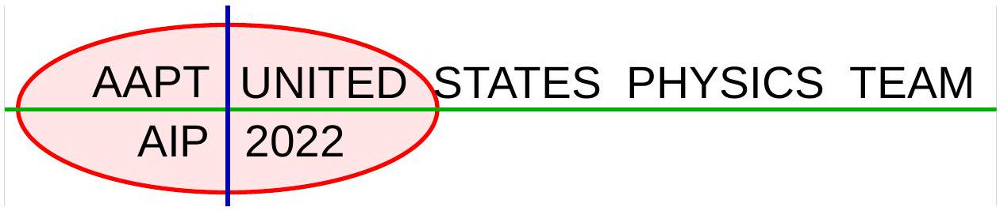
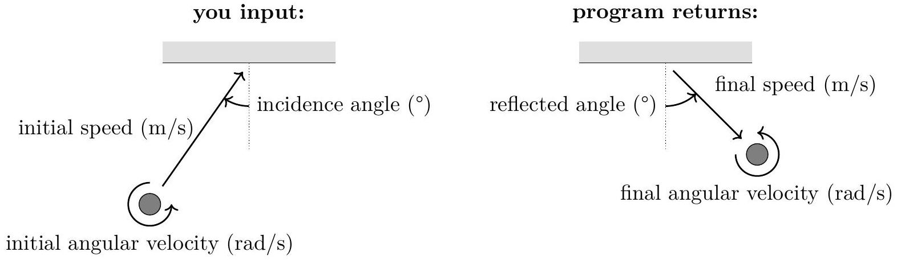
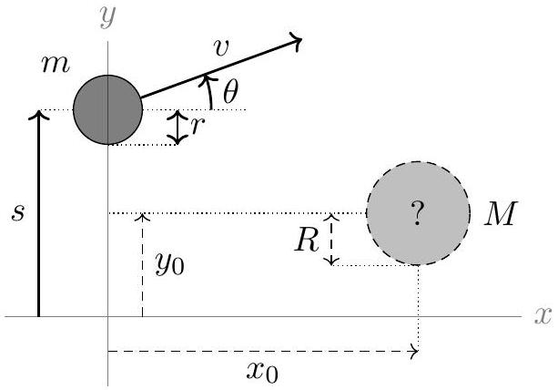

Experimental Test Selection Test
3 hours allowed

Because it was not possible to do physical lab experiments this year, the labs used for team selection have been replaced with this single, simulation-based lab.

## The Future Circular Collider

## 1 Safety Warnings

There are no unusual safety concerns in this experiment.

## 2 Overview

Particle physicists, condensed matter physicists, atomic physicists, and chemists all gain insight into the structure of matter by scattering experiments. In these experiments, we smash particles into other particles, look at what comes out, and infer what happened during the collision. In this lab, you will carry on this tradition by analyzing simulated collisions involving circular disks sliding on a horizontal table, with specified initial conditions. The disks always lay flat on the table, which is frictionless. In the simulation, collisions between objects obey the following rules:

- The relative velocity along the normal direction is flipped in sign and multiplied by the coefficient of restitution $c$, where $c = 1$ for a perfectly elastic collision.
- The relative velocity along the tangential direction is changed by friction in the usual way: if it is zero, static friction tries to keep it zero, and if it is nonzero, it is pushed towards zero by a kinetic friction force $\mu N$, where $N$ is the normal force.

There are many ways to extract the requested parameters, so you will be graded primarily on the precision and accuracy of your results. The initial conditions you specify will receive both inherent absolute and relative uncertainties, so you should choose appropriate values and perform multiple trials to get an accurate result. An uncertainty estimate is expected for all parts, but depending on how you carry out the experiment, each subpart might or might not require a graph. As always, include in your report any diagrams, supporting calculations, and other information necessary to show how you obtained your results.

## 3 Equipment

This is a pure simulation experiment, with no physical equipment. The only thing required is the collision-black-box program to simulate collisions, which can be downloaded here.

The procedure to run the program depends on the operating system. On Windows:

- Search for powershell in the start menu and run it to open a terminal. You will do the entire lab by typing commands into this terminal.
- Navigate to the folder containing the downloaded collision-black-box program, by running cd <path-to-folder>. On most computers, the right command to run is cd ~/Downloads.
- Use collision-black-box-windows.exe wall to run the first part of the experiment, and use collision-black-box-windows.exe disk to run the second part.

On macOS, the procedure is somewhat more complicated:

- Launch the Terminal app. You will do the entire lab by typing commands into this terminal.
- Navigate to the folder containing the downloaded collision-black-box program, by running cd <path-to-folder>. On most computers, the right command to run is cd ~/Downloads.
- Run chmod +x collision-black-box-macos to mark the file as an executable program.
- Run open . to open the current folder in Finder. In Finder, control-click the collision-black-box program to open a menu, and select Open. Confirm the dialog box that comes up. Another terminal will quickly appear and disappear. The program has now been granted permission to run.
- Return to the terminal and use ./collision-black-box-macos wall to run the first part of the experiment, and use ./collision-black-box-macos disk to run the second part.

## 4 Experiment

### 4.1 Collision with Wall

In this part, you will launch a disk with mass $M$, radius $R$ and moment of inertia $I = \beta M R ^ { 2 }$ towards a fixed, long vertical wall. You specify the initial speed and counter-clockwise angular velocity of the disk, and the angle of its initial velocity incident to the normal of the wall. The program will simulate the collision and return the final values of these parameters after collision.

The parameters you specify must be in the following ranges:

- $0.5 \mathrm {~m} / \mathrm { s } \leq$ initial speed $\leq 10 \mathrm {~m} / \mathrm { s }$.
- -50 rad/s $\leq$ initial angular velocity $\leq 50 \mathrm { rad } / \mathrm { s }$.
- 0° $\leq$ incidence angle $\leq 75 ^ { \circ }$.

To simulate imperfections in the disk-firing mechanism, the initial values you specify are always affected by the following uncertainties:

- Initial speed: relative uncertainty 5 \%, compounded with absolute uncertainty 0.05 m/s.
- Initial angular velocity: relative uncertainty 5 \%, compounded with absolute uncertainty 0.2 rad/s.
- Incidence angle: absolute uncertainty 1°.
1. (a) Find the coefficient of restitution $c$ between the disk and wall.
(b) Find the radius $R$ of the disk, and the values of $\mu$ and $\beta$.

## Solution

For each parameter, a decent final result should have the central value within the following ranges:

$$
\begin{aligned}
c & = 0.70 \pm 0.02 , \\
\mu & = 0.43 \pm 0.02 , \\
R & = ( 0.350 \pm 0.005 ) \mathrm { m } , \\
\beta & = 0.80 \pm 0.03 .
\end{aligned}
$$

In addition, a good measurement procedure and reasonable uncertainty estimate is required. Your uncertainties should be comparable to the ones above, or smaller, if you took many good measurements. They should also not be overconfident, i.e. they should not be so small that the true value lies far outside your range. We'll discuss error analysis later, but first let's analyze the problem in general.

Assume the wall is along the $x$-axis, so that the normal direction is along the $y$-axis. Let initial and final quantities be denoted by unprimed and primed variables, respectively, so that

$$
v _ { x } = v \sin \theta , \quad v _ { y } = v \cos \theta , \quad v _ { x } ^ { \prime } = v ^ { \prime } \sin \theta ^ { \prime } , \quad v _ { y } ^ { \prime } = v ^ { \prime } \cos \theta ^ { \prime } .
$$

By definition, the coefficient of restitution satisfies

$$
v _ { y } ^ { \prime } = c v _ { y } .
$$

The tangential impulse $J _ { x }$ from friction changes both $v _ { x }$ and $\omega$,

$$
\begin{aligned}
J _ { x } & = M \left( v _ { x } ^ { \prime } - v _ { x } \right) , \\
J _ { x } R & = \beta M R ^ { 2 } \left( \omega - \omega ^ { \prime } \right) .
\end{aligned}
$$

If the disk stops slipping against the wall by the end of the collision, then $v _ { x } ^ { \prime } = R \omega ^ { \prime }$, which implies

$$
\begin{aligned}
& J _ { x } = M \left( v _ { x } ^ { \prime } - v _ { x } \right) , \\
& J _ { x } = \beta M \left( R \omega - v _ { x } ^ { \prime } \right) ,
\end{aligned} \quad \Longrightarrow \quad J _ { x } = \frac { \beta } { 1 + \beta } M \left( R \omega - v _ { x } \right) .
$$

If the disk slips throughout the entire duration of the collision, then friction imparts an impulse $J _ { x } = \pm \mu J _ { y }$ (with sign depending on the direction of slipping), where $J _ { y }$ is the normal impulse,

$$
J _ { y } = M \left( v _ { y } + v _ { y } ^ { \prime } \right) = M v _ { y } ( 1 + c ) .
$$

Thus, the change in horizontal velocity is

$$
v _ { x } ^ { \prime } - v _ { x } = \frac { J _ { x } } { M } = \begin{cases} \frac { \beta } { 1 + \beta } \left( R \omega - v _ { x } \right) & \text { disk stops slipping } \\ \mu v _ { y } ( 1 + c ) & \text { disk slips throughout } \end{cases}
$$

with a similar result for $\omega ^ { \prime } - \omega = \left( v _ { x } ^ { \prime } - v _ { x } \right) / \beta R$.
We could now charge ahead and take a ton of data points with random values of $v , \theta$, and $\omega$, then try to find parameters that fit the data, but this is laborious and not very efficient. It's better to first think conceptually about how we can extract each parameter.

- We don't need to use general values of all three input parameters. We would still have enough information to solve the problem if we always used $\theta = 0$, in which case our above results become
$$
v _ { y } ^ { \prime } = c v , \quad v _ { x } ^ { \prime } = \begin{cases} \frac { \beta } { 1 + \beta } ( R \omega ) & \text { disk stops slipping } \\ \mu v ( 1 + c ) & \text { disk slips throughout } , \end{cases}
$$

There are many alternatives; for instance, it's also possible to solve the problem fixing $\omega = 0$.

- Note that $\mu$ only matters when the disk slips throughout, while $R$ only matters when the disk stops slipping. When $\theta = 0$, these cases correspond to large and small $\omega / v$, respectively. We have to investigate both cases, but we don't know a priori where the cutoff between them is.
- We could guarantee that the disk always slips by taking a large $\omega$ and tiny $v$, and take the opposite to guarantee the disk stops slipping. But we want to avoid small values of $v$ and $\omega$, because in this case the absolute uncertainties on each input parameter will lead to large relative uncertainties, giving an imprecise result.

With that in mind, we can solve the problem as follows.

- To extract $c$, we set $\omega = \theta = 0$ and $v = 10 \mathrm {~m} / \mathrm { s }$. We then calculate $c = v ^ { \prime } / v$ and average the result across several trials, using the spread in the results to estimate the uncertainty. (This is a small value of $\omega$, leading to a huge relative uncertainty on $\omega$, but that's acceptable because it doesn't affect the result.)
Because $v ^ { \prime }$ and $v$ are proportional, one could also vary $v$, plot $v ^ { \prime }$ versus $v$, and find the slope $c$ of the line. But this isn't actually useful, because as we mentioned above, measurements with small $v$ are strictly worse. (Also, the simulation accounts for the time it takes for the collision to happen, so these data points take longer to get.) Plotting a line is useful if we want to get rid of some unknown intercept, or find two parameters at once, neither of which apply here.
- Continuing to set $\theta = 0$, we experiment with large values of $v$ and $\omega$ to see when the disk stops slipping during the collision. (It's easy to identify this, because when the disk stops slipping, $v _ { x } ^ { \prime }$ is independent of $v$, while when it slips throughout, $v _ { x } ^ { \prime }$ is independent of $\omega$.)
- We pick parameters where $v$ and $\omega$ are large but slipping happens throughout, such as $v = 8 \mathrm {~m} / \mathrm { s }$ and $\omega = 50 \mathrm { rad } / \mathrm { s }$, and compute
$$
\mu = \frac { v _ { x } ^ { \prime } } { v ( 1 + c ) } .
$$
We again average the result across several trials, using the spread to estimate the uncertainty.
- We pick parameters where slipping stops, such as $v = 10 \mathrm {~m} / \mathrm { s }$ and $\omega = 30 \mathrm { rad } / \mathrm { s }$, and compute
$$
R = \frac { v _ { x } ^ { \prime } } { \omega } , \quad \beta = \frac { \omega ^ { \prime } } { \omega - \omega ^ { \prime } }
$$
We again average the result across several trials, using the spread to estimate the uncertainty.

This is one quick and efficient method, but there are many other ways. For example, to find $R$, you could try using fixing a nonzero negative $\theta$ and adjusting $\omega$ until $\omega ^ { \prime } = \omega$, which occurs when the disk has no relative tangential velocity with the wall. You could also find the parameters by plotting lines.

### 4.2 Collision with Disk

In this part, you will launch a "probe" disk towards a hidden, second disk on the table, which begins at rest with its center at an unknown position $\left( x _ { 0 } , y _ { 0 } \right)$ (where $x _ { 0 } > 0$ ), with mass $M$ and radius $R$. The probe disk has radius $r = ( 0.250 \pm 0.001 ) \mathrm { m }$, but you may choose its mass $m$, initial position $( 0 , s )$, initial speed $v$, and the initial direction $\theta$ of its velocity (as an angle relative to the horizontal). Both disks are frictionless, so that rotation is irrelevant. The program will simulate the collision, if it occurs, and return the final velocity (speed and angle) of the probe disk.

The parameters you choose must be in the following ranges:

- $1 \mathrm {~kg} \leq m \leq 5 \mathrm {~kg}$.
- $- 2 \mathrm {~m} \leq s \leq 2 \mathrm {~m}$.
- $0.5 \mathrm {~m} / \mathrm { s } \leq v \leq 10.0 \mathrm {~m} / \mathrm { s }$.
- $- 90 ^ { \circ } \leq \theta \leq 90 ^ { \circ }$.

The parameters you specify are affected by the following uncertainties:

- m: relative $1 \%$, plus absolute 0.05 kg .
- $s$ : absolute 2 mm.
- $v$ : relative $1 \%$, plus absolute 0.05 m/s.
- $\theta$ : absolute $0.1 ^ { \circ }$.
2. (a) Find the initial position $\left( x _ { 0 } , y _ { 0 } \right)$ of the hidden disk.
(b) Find the radius $R$ of the hidden disk.
(c) Find the mass $M$ of the hidden disk and the coefficient of restitution $c$ between the disks.

## Solution

For all parts here, we always want to use $v = 10 \mathrm {~m} / \mathrm { s }$. As mentioned above, this reduces the effect of the absolute uncertainty on $v$, and makes the simulation run faster. For the first two parts, it's also nice to choose a high value of $m$ so that the probe disk doesn't get bounced backwards, which makes things a bit more confusing.

(a) We initially have no clue where the hidden disk is. To find it, it's easiest to set $\theta = 0$ and vary $s$ in steps of $r$ until we hit it for the first time, which should take just a couple tries.
Now we can find the vertical position $y _ { 0 }$ of the disk by adjusting $s$ until $\theta ^ { \prime } = 0$, indicating a head-on collision. This requires multiple trials, since the uncertainties in the input parameters will affect $\theta ^ { \prime }$. You can find $y _ { 0 }$ by plotting $s$ versus $\theta ^ { \prime }$ in the region of interest, drawing a line through the noisy data, and seeing where it crosses $\theta ^ { \prime } = 0$. (Or, if you're short on time, you could just imagine doing this and eyeball the answer directly from the data.) In either case, a good final result is
$$
y _ { 0 } = ( - 1.230 \pm 0.003 ) \mathrm { m } .
$$
To find $x _ { 0 }$, we can try hitting the probe disk from the side. For example, we could take $\theta = 45 ^ { \circ }$ to keep the calculations simple, then vary $s$ until we hit the disk again. Then we adjust $s$ until $\theta ^ { \prime } = \theta$, again indicating a head-on collision, and extract $x _ { 0 } = y _ { 0 } - s$. A good final result is
$$
x _ { 0 } = ( 0.696 \pm 0.003 ) \mathrm { m } .
$$
In both cases, there isn't a simple way to analytically estimate the uncertainty, but you should be able to get a comparable result by examining the data.
(b) The easiest way to do this is to set $\theta = 0$ and fire at $s = y _ { 0 } + \Delta s$, for various values of $\Delta s$. A collision will occur when $| \Delta s | \leq r + R$, and we adjust $| \Delta s |$ until we reach the point where a collision occurs about half the time. A good final result is
$$
R = ( 0.145 \pm 0.002 ) \mathrm { m } .
$$
Several students forgot to subtract off the probe disk radius $r$. Also note that you must add the uncertainty of $r$ in quadrature, so your final uncertainty in $R$ can't possibly be less than 0.001 m.
(c) For simplicity, we consider head-on collisions, $\theta = 0$ and $s = y _ { 0 }$, and vary $m$. Solving the collision,
$$
v ^ { \prime } = v - \frac { M v } { M + m } ( 1 + c ) .
$$
We can't disentangle the parameters $M$ and $c$, so this part requires plotting a line. Note that
$$
\frac { v } { v - v ^ { \prime } } = \frac { 1 } { 1 + c } \frac { m } { M } + \frac { 1 } { 1 + c } .
$$
Thus, plotting $v / \left( v - v ^ { \prime } \right)$ versus $m$ gives a line with slope $1 / ( M ( 1 + c ) )$ and intercept $1 / ( 1 + c )$. (Note that a rebound angle $\theta ^ { \prime } \approx 180 ^ { \circ }$ corresponds to a negative $v ^ { \prime }$ here.) A good final result is
$$
M = ( 1.41 \pm 0.07 ) \mathrm { kg } , \quad c = 0.85 \pm 0.05
$$
where you can estimate the uncertainties from the set of possible best fit lines.

We hope this simulation lab taught a few important practical lessons. First, to get results efficiently, it often helps to explore the parameter space before settling on a plan. Second, it is usually not useful to analytically compute the most general possible result; the best plans are usually simple and physically intuitive, and focus on special regions of parameter space. Finally, while the standard uncertainty propagation formulas are important, there are many other ways to estimate uncertainties.
