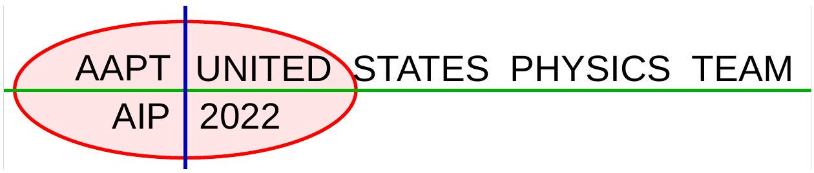
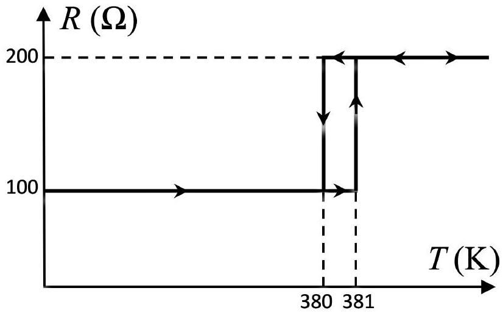
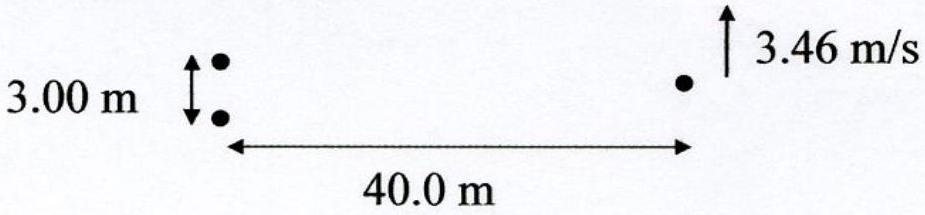
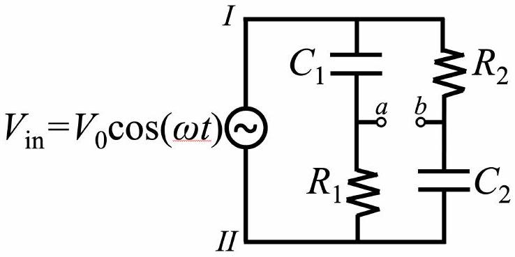
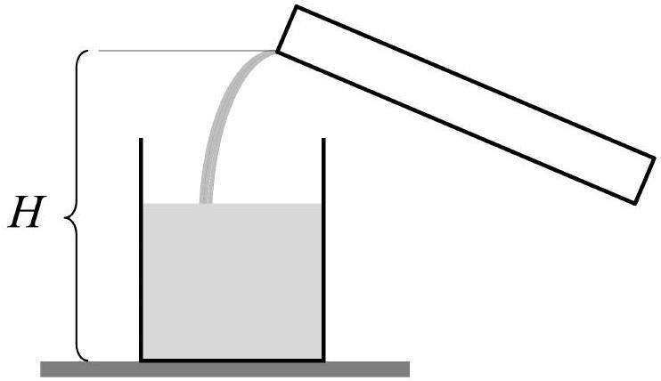
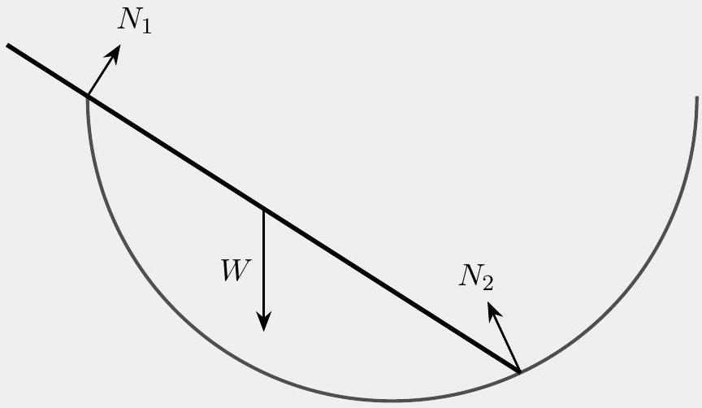
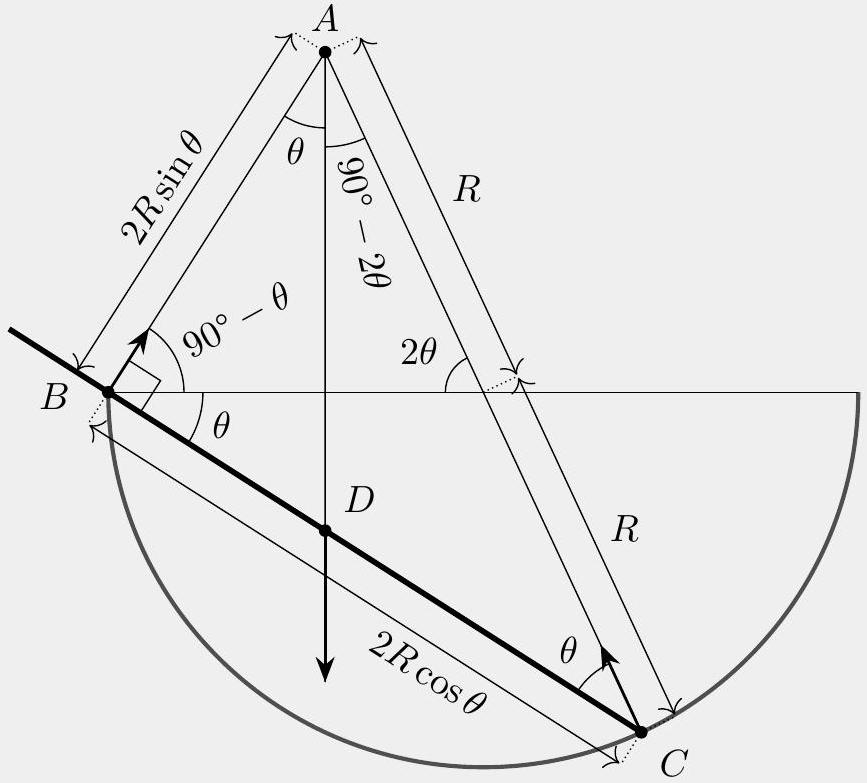
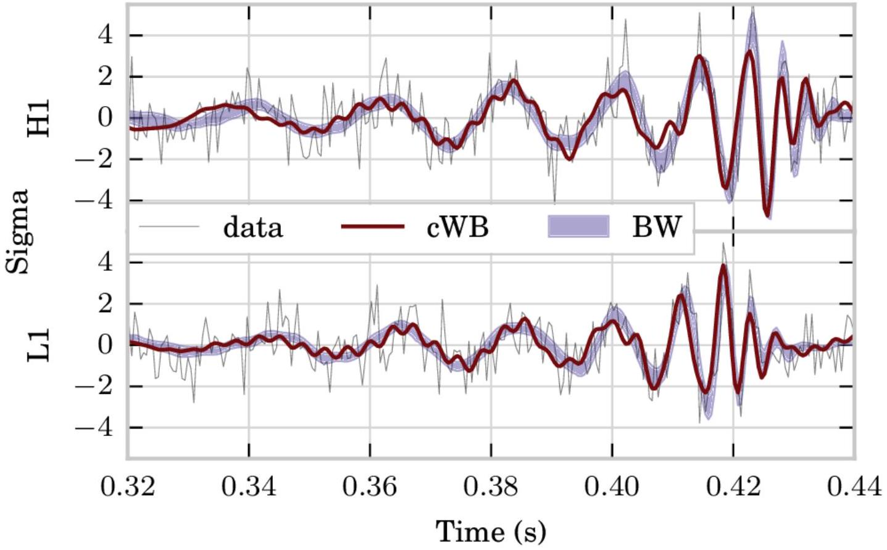

## $36 ^ { \text {th } }$ Annual   US Physics Team Training Camp   College Park, Maryland

## THEORETICAL EXAMINATION

- This is the main theoretical team selection test for the 2022 US Physics Traveling Team.
- The time limit is 5 hours. There are 3 problems, which are each worth an equal amount of points.
- Before you start the exam, make sure you are provided with blank paper, both for your answers and scratch work, writing utensils, a hand-held scientific calculator with memory and programs erased, and a computer for you to download the exam.
- At the end of the exam, you have 20 minutes to upload solutions to all of the problems. For each problem, scan or photograph each page of your solution, combine them into a single PDF file, and upload them.

## Reference table of possibly useful information

$$
\begin{array} { l l }
g = 9.8 \mathrm {~N} / \mathrm { kg } & G = 6.67 \times 10 ^ { - 11 } \mathrm {~N} \cdot \mathrm {~m} ^ { 2 } / \mathrm { kg } ^ { 2 } \\
k = 1 / 4 \pi \epsilon _ { 0 } = 8.99 \times 10 ^ { 9 } \mathrm {~N} \cdot \mathrm {~m} ^ { 2 } / \mathrm { C } ^ { 2 } & k _ { \mathrm { m } } = \mu _ { 0 } / 4 \pi = 10 ^ { - 7 } \mathrm {~T} \cdot \mathrm {~m} / \mathrm { A } \\
c = 3.00 \times 10 ^ { 8 } \mathrm {~m} / \mathrm { s } & k _ { \mathrm { B } } = 1.38 \times 10 ^ { - 23 } \mathrm {~J} / \mathrm { K } \\
N _ { \mathrm { A } } = 6.02 \times 10 ^ { 23 } ( \mathrm {~mol} ) ^ { - 1 } & R = N _ { \mathrm { A } } k _ { \mathrm { B } } = 8.31 \mathrm {~J} / ( \mathrm { mol } \cdot \mathrm {~K} ) \\
\sigma = 5.67 \times 10 ^ { - 8 } \mathrm {~J} / \left( \mathrm { s } \cdot \mathrm {~m} ^ { 2 } \cdot \mathrm {~K} ^ { 4 } \right) & e = 1.602 \times 10 ^ { - 19 } \mathrm { C } \\
1 \mathrm { eV } = 1.602 \times 10 ^ { - 19 } \mathrm {~J} & h = 6.63 \times 10 ^ { - 34 } \mathrm {~J} \cdot \mathrm {~s} = 4.14 \times 10 ^ { - 15 } \mathrm { eV } \cdot \mathrm {~s} \\
m _ { e } = 9.109 \times 10 ^ { - 31 } \mathrm {~kg} = 0.511 \mathrm { MeV } / \mathrm { c } ^ { 2 } & ( 1 + x ) ^ { n } \approx 1 + n x \text { for } | x | \ll 1 \\
\sin \theta \approx \theta - \theta ^ { 3 } / 6 \text { for } | \theta | \ll 1 & \cos \theta \approx 1 - \theta ^ { 2 } / 2 \text { for } | \theta | \ll 1
\end{array}
$$

You may use this sheet throughout the exam.

## Take Five

The five parts of this question are unrelated.

1. Consider a partially polarized light beam, containing a mix of unpolarized and linearly polarized light. The intensity of the beam is analyzed using a linear polarizer. At a particular orientation of the polarizer, the outgoing beam has maximum intensity $I _ { \text {max } }$. Turning the polarizer by a 30° angle reduces the outgoing beam's intensity by 10\%. Find the degree of polarization of the beam,
$$
V \equiv \frac { I _ { \max } - I _ { \min } } { I _ { \max } + I _ { \min } }
$$
where $I _ { \min }$ is the minimum intensity for any orientation of the polarizer.

## Solution

The intensity of partially polarized light that is passed through a linear polarizer is

$$
\frac { I _ { u } } { 2 } + I _ { p } \cos ^ { 2 } \theta
$$

where $I _ { u }$ is the intensity of the unpolarized light, $I _ { p }$ is the intensity of the polarized light, and $\theta$ is the angle between the polarization of the polarized light and the linear polarizer. The second term follows directly from Malus' law, and the first term is an average of Malus' law over all angles.
The maximum intensity occurs when $\theta = 0 ^ { \circ }$ or 180° and is given by

$$
I _ { \max } = \frac { I _ { u } } { 2 } + I _ { p } .
$$

Per the problem statement, a 30° rotation reduces the intensity by 10\%, so

$$
0.9 \left( \frac { I _ { u } } { 2 } + I _ { p } \right) = \frac { I _ { u } } { 2 } + I _ { p } \cos ^ { 2 } 30 ^ { \circ } = \frac { I _ { u } } { 2 } + \frac { 3 I _ { p } } { 4 } .
$$

Solving for $I _ { u }$ gives us $I _ { u } = 3 I _ { p }$. Thus, we have

$$
I _ { \max } = \frac { 5 } { 2 } I _ { p } , \quad I _ { \min } = \frac { 3 } { 2 } I _ { p }
$$

where the latter occurs at $\theta = \pm 90 ^ { \circ }$, so $V = 1 / 4$.

2. According to Newton's law of cooling, a hot object transfers heat to the environment at a rate
$$
P = k \left( T _ { o } - T _ { l } \right) ,
$$
where $T _ { o }$ is the temperature of the object, $T _ { l }$ is the temperature of the environment, and $k$ is a constant. Consider a circuit element whose resistance $R$ depends on its temperature $T$ as shown below (not to scale), with heat capacity $C = 2 \mathrm {~J} / \mathrm { K }$ in a lab of temperature $T _ { l } = 270 \mathrm {~K}$. Note that the curve is multivalued, which indicates hysteresis: the resistance takes the lower value when increasing from low temperatures, and the higher value when decreasing from high temperatures.

When this component is placed in series with a voltage $V _ { 1 } = 50 \mathrm {~V}$, its temperature stabilizes at $T _ { 1 } = 350 \mathrm {~K}$. When it is instead placed in series with a voltage $V _ { 2 } = 70 \mathrm {~V}$, its temperature does not stabilize, and the current through it instead oscillates. Find the period of these oscillations.

## Solution

At 50 V voltage, incoming and lost power are equal,

$$
\frac { V _ { 1 } ^ { 2 } } { R _ { \min } } = k \left( T _ { 1 } - T _ { l } \right)
$$

which implies

$$
k = \frac { V _ { 1 } ^ { 2 } } { R _ { \min } \left( T _ { 1 } - T _ { l } \right) } = 0.3125 \frac { \mathrm {~W} } { \mathrm {~K} } .
$$

The current oscillates because the power heating up the component is larger than $k \left( T _ { r } - T _ { l } \right)$ for $R = 100$ ohms and smaller than $k \left( T _ { r } - T _ { l } \right)$ for $R = 200$ ohms. So the resistance of the component performs the cycle depicted in the diagram.
In the bottom leg of the diagram, the temperature increases from 380 K to 381 K in time $\tau _ { 1 }$. The power of dissipation almost does not change and can be approximated as $k \left( T _ { \mathrm { av } } - T _ { l } \right)$, where $T _ { \mathrm { av } } \approx 380.5 \mathrm {~K}$. Balance of incoming and outgoing powers allows to evaluate $\tau _ { 1 }$ :

$$
\begin{aligned}
C \frac { \mathrm {~d} } { \mathrm {~d} t } T & = \frac { V _ { 2 } ^ { 2 } } { R } - k \left( T _ { \mathrm { ave } } - T _ { l } \right) \\
C \left( T _ { \max } - T _ { \min } \right) & = \left( \frac { V _ { 2 } ^ { 2 } } { R _ { \min } } - k \left( T _ { \mathrm { av } } - T _ { l } \right) \right) \tau _ { 1 }
\end{aligned}
$$

Similarly on the way back,

$$
C \left( T _ { \min } - T _ { \max } \right) = \left( \frac { V _ { 2 } ^ { 2 } } { R _ { \max } } - k \left( T _ { \mathrm { av } } - T _ { l } \right) \right) \tau _ { 2 }
$$

The overall period of the oscillations $\tau$ is thus

$$
\tau = \tau _ { 1 } + \tau _ { 2 } = C \left( T _ { \max } - T _ { \min } \right) \left( \frac { 1 } { \frac { V _ { 2 } ^ { 2 } } { R _ { \min } } - k \left( T _ { \mathrm { av } } - T _ { l } \right) } + \frac { 1 } { k \left( T _ { \mathrm { av } } - T _ { l } \right) - \frac { V _ { 2 } ^ { 2 } } { R _ { \max } } } \right) = 0.34 \mathrm {~s} .
$$

To get an exact answer, you could solve the differential equation replacing $T _ { \text {av } }$ with $T$, but this would give the same result, to the number of significant figures used in the problem.
3. Two speakers are 3.00 m apart. They both emit perfect sinusoids, whose frequencies differ by 0.250 Hz. Spaceman Fred, who is standing 40.0 m away in the direction shown in the diagram, must run at 3.46 m/s to avoid hearing beats. The speed of sound in air is 343 m/s. Approximately what frequency are the speakers emitting?

## Solution

Two sources of identical frequency with a phase difference $2 \pi \delta$ set up an interference pattern with maxima given for small angles by $( n - \delta ) \lambda = a \theta$ (where $a$ is the source spacing). Here, we treat the problem as two sources of the same frequency with a slowly varying phase difference, where

$$
\frac { d \delta } { d t } = \Delta f = 0.250 \mathrm {~Hz} .
$$

Thus the interference pattern shifts slowly; for a given maximum, i.e. a fixed $n$,

$$
\lambda \frac { d \delta } { d t } = a \frac { d \theta } { d t }
$$

Since Fred is at a position given approximately by $L \theta$ (where $L = 40.0 \mathrm {~m}$ ), to match the movement of the interference pattern he must run at $v _ { 0 } = L \frac { d \theta } { d t }$. Putting the equations together,

$$
\lambda = \frac { a v _ { 0 } } { L \Delta f } = 1.04 \mathrm {~m}
$$

and $f = c / \lambda = 330 \mathrm {~Hz}$, where $c$ is the speed of sound.
Alternative solution: This problem can be solved using Doppler shift. The frequency $f _ { 1 }$ of the first source is perceived as

$$
f _ { 1 } ^ { \prime } = \frac { c + v _ { F , \| } } { c } f _ { 1 } ,
$$

where $v _ { F , \| }$ is the component of Fred's velocity parallel to his displacement with the first source (which is roughly $v _ { 0 } \theta$, where $\theta \approx a / ( 2 L )$ ). So,

$$
f _ { 1 } ^ { \prime } \approx \frac { c + v _ { 0 } \theta } { c } f _ { 1 } .
$$

Likewise,

$$
f _ { 2 } ^ { \prime } \approx \frac { c - v _ { 0 } \theta } { c } f _ { 2 } .
$$

(Note that when Fred moves a distance $d \ll L$, the individual angles may be different, but the difference between the angles is still $2 \theta$ by the small angle approximation.)
These two frequencies must equal each other for Fred to hear zero beats, so

$$
\left( c + v _ { 0 } \theta \right) f _ { 1 } = \left( c - v _ { 0 } \theta \right) f _ { 2 } .
$$

Writing $f _ { 1 } = f$ and $f _ { 2 } = f + \Delta f$, we arrive at

$$
v _ { 0 } \theta f \approx c \Delta f - v _ { 0 } \theta f .
$$

Then,

$$
f \approx \frac { c \Delta f } { 2 \theta v _ { 0 } } = \frac { c L \Delta f } { a v _ { 0 } } = 330 \mathrm {~Hz} .
$$

4. The input voltage is the voltage difference between points $I$ and $I I$. What is the voltage difference between the points $a$ and $b$ in the circuit below as a function of time?

You should assume $R _ { 1 } C _ { 1 } = R _ { 2 } C _ { 2 }$, and simplify your answer as much as possible.

## Solution

We use the method of complex impedance, and write the EMF as $V = \operatorname { Re } \{ \tilde { V } \}$, where $\tilde { V } = V _ { 0 } e ^ { i \omega t }$.
Then, the voltage with respect to ground at points $a$ and $b$ are computed by the typical method of resistors in series but with complex impedances:

$$
\tilde { V } _ { a } = \frac { R _ { 1 } } { R _ { 1 } + \frac { 1 } { i \omega C _ { 1 } } } \tilde { V } , \quad \tilde { V } _ { b } = \frac { \frac { 1 } { i \omega C _ { 2 } } } { R _ { 2 } + \frac { 1 } { i \omega C _ { 2 } } } \tilde { V } .
$$

We define $\alpha = \omega R _ { 1 } C _ { 1 } = \omega R _ { 2 } C _ { 2 }$, so that

$$
\tilde { V } _ { a } = \frac { i \alpha } { 1 + i \alpha } \tilde { V } , \quad \tilde { V } _ { b } = \frac { 1 } { 1 + i \alpha } \tilde { V } .
$$

Subtracting the two gives

$$
\tilde { V } _ { a } - \tilde { V } _ { b } = \frac { i \alpha - 1 } { i \alpha + 1 } \tilde { V } .
$$

We finally need to take the real part of this expression. The magnitude of the expression is just

$V _ { 0 }$ because $i \alpha$ is purely imaginary. The phase can be computed as follows by noting that

$$
\frac { i \alpha - 1 } { i \alpha + 1 } = \frac { ( i \alpha - 1 ) ( ( 1 - i \alpha ) } { 1 + | \alpha | ^ { 2 } } = \frac { - 1 + \alpha ^ { 2 } } { 1 + \alpha ^ { 2 } } + \frac { 2 i \alpha } { 1 + \alpha ^ { 2 } } = - e ^ { - i \phi } ,
$$

where $\phi = \arctan \left( \frac { 2 \omega R C } { 1 - \omega ^ { 2 } R ^ { 2 } C ^ { 2 } } \right) = 2 \arctan ( \omega R C )$. Then,

$$
V _ { a } - V _ { b } = V _ { 0 } \cos ( \omega t - 2 \arctan ( \omega R C ) + \pi ) .
$$

5. An empty cylindrical glass of cross-sectional area $A$ is resting on a table. Water of density $\rho$ is slowly poured into the glass from a beaker, at a constant volume per unit time $Q$.

The beaker nozzle is at height $H$, and the water exits the beaker with negligible speed. Let $t = 0$ at the moment the water first hits the bottom of the glass. Find the force of the water on the glass as a function of time, until the glass overflows. Assume the water does not splash and the atmospheric pressure is $P _ { 0 }$. Furthermore, assume the glass is wide, so that the rate at which the water level rises is negligible compared to the speed at which water enters the glass.

## Solution

The water in the glass is acted on by four forces: its weight, the normal force from the glass, atmospheric pressure $P _ { 0 } A$, and the impact force from the poured water. The problem asks for the normal force from the glass.

The weight is $\rho g V$, where $V$ is the volume of water in the glass. Since we have assumed the water level rises slowly, the volume increases at the same rate $Q$ that water pours out of the beaker, so $W = \rho g Q t$.
The impact force comes from the change of momentum of the falling jet of water. Then,

$$
F _ { j } = \frac { \mathrm { d } p } { \mathrm {~d} t } \approx \frac { \delta m \Delta v } { \delta t } = \rho Q \Delta v ,
$$

where $\delta m$ is the mass of water that enters the beaker in time $\delta t$, and $\Delta v$ is the change of velocity of the water entering the beaker. From elementary kinematics, $\Delta v = \sqrt { 2 g ( H - h ) }$, where $h = Q t / A$ is the water level in the beaker. Then,

$$
F _ { j } = \rho Q \sqrt { 2 g \left( H - \frac { Q t } { A } \right) } .
$$

The total force is

$$
F = F _ { j } + W + P _ { 0 } A = \left| Q \rho \left[ \sqrt { 2 g \left( H - \frac { Q } { A } t \right) } + g t \right] + P _ { 0 } A \right| .
$$

## Chain Reaction

The three parts of this question are unrelated.

1. A frictionless circular cylinder of radius $R$ is placed with its axis horizontal, and a flexible, inextensible string of uniform linear mass density $\lambda$ is wrapped around it. When the length of the string is slightly longer than $2 \pi R$, part of the string will sag below the cylinder. Now suppose the string is slowly shortened, until the entire string just touches the cylinder. At this moment, find the tension at the top of the string.

## Solution

First, let's solve for the tension $T _ { 0 }$ at the bottom of the string. By considering force balance on a small segment of angle $d \theta$ at the bottom, we have

$$
\lambda R g d \theta = T _ { 0 } d \theta
$$

which implies $T _ { 0 } = \lambda R g$.
Next, we need to find the tension at the top of the string. Again consider force balance on a small segment of angle $d \theta$, where the segment is at an angle $\theta$ from the top. The tangential component of the gravitational force is balanced by the difference in tension across the segment, so

$$
- \lambda R g \sin \theta d \theta = d T \text {. }
$$

Thus, the tension at the top is

$$
T = T _ { 0 } + \int _ { \pi } ^ { 0 } \frac { d T } { d \theta } = T _ { 0 } + \int _ { 0 } ^ { \pi } \lambda R g \sin \theta d \theta = 3 \lambda R g
$$

2. Model a grappling hook as a point mass $m$ attached to the end of a uniform chain of linear mass density $\lambda$. Initially, the chain is loosely coiled on the ground. Then the mass is launched directly upward from the ground, with an initial speed $v _ { 0 }$. The chain is flexible, so that when the mass is at a height $y$, a length $y$ of the chain dangles directly beneath it, while the rest of the chain remains at rest on the ground. Find the maximum height reached by the mass, assuming this is less than the length of the chain. (Hint: if you directly compute the acceleration, you will find an intractable differential equation, but it can be solved with a clever change of variable.)

## Solution

Let $h$ be the final height. A naive application of energy conservation would yield

$$
\frac { 1 } { 2 } m v _ { 0 } ^ { 2 } = m g h + \frac { \lambda g h ^ { 2 } } { 2 }
$$

which yields

$$
h = \frac { m } { \lambda } \left( \sqrt { 1 + \frac { \lambda v _ { 0 } ^ { 2 } } { m g } } - 1 \right) .
$$

However, this is incorrect, as the raising of the chain from the ground is an inelastic process, which dissipates energy. Instead, we consider forces. The only external forces on the entire grappling

hook are gravity and the normal force from the ground. The normal force is precisely enough to support the part of the chain lying on the ground, so the net force is

$$
F = - ( m + \lambda y ) g .
$$

This is equal to the rate of change of momentum,

$$
F = \frac { d p } { d t } , \quad p = ( m + \lambda y ) \dot { y } .
$$

If you expand this out, you'll get an intractable nonlinear second-order differential equation. The trick is to consider the momentum as a function of height. We have

$$
\frac { d p } { d y } = \frac { d p } { d t } \frac { d t } { d y } = - ( m + \lambda y ) g \frac { 1 } { \dot { y } } = - \frac { ( m + \lambda y ) ^ { 2 } g } { p } .
$$

Separating and integrating gives

$$
\int p d p = - \int ( m + \lambda y ) ^ { 2 } g d y
$$

which yields

$$
- \frac { \left( m v _ { 0 } \right) ^ { 2 } } { 2 } = - \frac { \left( ( m + \lambda h ) ^ { 3 } - m ^ { 3 } \right) g } { 3 \lambda }
$$

since the final momentum is zero. Solving for $h$ gives

$$
h = \frac { m } { \lambda } \left( \sqrt [ 3 ] { 1 + \frac { 3 \lambda v _ { 0 } ^ { 2 } } { 2 m g } } - 1 \right)
$$

3. A uniform rod of length $2 R$ is placed inside a fixed, frictionless hemispherical bowl of radius $R$. In equilibrium, the rod makes an angle $\theta$ with the horizontal. Assume that the rod and bowl are ideally rigid, but that the lip of the bowl and the end of the rod are both slightly rounded, so that there is a well-defined normal direction at the points they touch. Find an analytic expression for $\theta$ and evaluate it to three significant figures, in degrees.

## Solution

First solution: Gravity acts downward at the midpoint of the rod, while the reaction forces are in the directions shown (perpendicular to the rod, and perpendicular to the bowl).

Now, we use the fact that when an object in static equilibrium is acted on by three forces, the lines of the three forces must intersect. (Otherwise, torque balance about the intersection point of the lines of any two of the forces couldn't be obeyed.) This turns the problem into one of pure Euclidean geometry. After some angle chasing, we arrive at the below diagram, where we found the lengths $\overline { A B }$ and $\overline { B C }$ by applying trigonometry to the right triangle $A B C$.

Now, by considering the right triangle $A B D$, we find

$$
\tan \theta = \frac { \overline { B D } } { \overline { A B } } = \frac { 2 R \cos \theta - R } { 2 R \sin \theta } .
$$

Simplifying this gives

$$
\cos \theta = 2 \cos 2 \theta
$$

which is equivalent to

$$
4 \cos ^ { 2 } \theta - \cos \theta - 2 = 0 .
$$

Applying the quadratic equation, we conclude

$$
\theta = \cos ^ { - 1 } \left( \frac { 1 + \sqrt { 33 } } { 8 } \right) = 32.5 ^ { \circ }
$$

This is actually a classic problem, but it usually isn't stated correctly: if you don't explicitly specify how the end of the rod and the lip of the bowl are shaped, as we did, then there aren't well-defined normal directions. The answer would then depend on how the rod and bowl deform, which in turn depends sensitively on their dimensions, and what they're made of.
Second solution: We balance forces perpendicular to the rod, forces parallel to the rod, and torques. Let $W$ be the weight of the rod. We use the fact that $N _ { 2 }$ makes an angle $\theta$ with the rod, and that the length $\overline { B C }$ of the rod in the bowl is $2 R \cos \theta$. Force balance parallel to the rod gives

$$
N _ { 2 } \cos \theta = W \sin \theta .
$$

Force balance perpendicular to the rod gives

$$
N _ { 1 } + N _ { 2 } \sin \theta = W \cos \theta .
$$

Torque balance about the bottom end of the rod gives

$$
2 R N _ { 1 } \cos \theta = R W \cos \theta .
$$

Solving for $N _ { 1 }$ and $N _ { 2 }$ in the first and third equations, and plugging them into the second gives

$$
\frac { 1 } { 2 } + \sin \theta \tan \theta = \cos \theta
$$

Multiplying both sides by $\cos \theta$ and rearranging gives us

$$
\frac { 1 } { 2 } \cos \theta = \cos ^ { 2 } \theta - \sin ^ { 2 } \theta \Longrightarrow \cos \theta = 2 \cos 2 \theta
$$

This can be solved in the same way as above.
Third solution: We minimize the energy of the rod. Defining the height to be $y = 0$ at the rim of the bowl, the bottom end of the rod is at height

$$
- 2 R \cos \theta \sin \theta
$$

where we again used the fact that the length of the rod in the bowl is $\overline { B C } = 2 R \cos \theta$. The top end of the rod is at height

$$
2 R ( 1 - \cos \theta ) \sin \theta .
$$

Averaging the two, the center of mass is at height

$$
R ( \sin \theta - 2 \sin \theta \cos \theta ) = R ( \sin \theta - \sin 2 \theta ) .
$$

Setting the derivative to zero gives

$$
\cos \theta = 2 \cos 2 \theta
$$

which can again be solved in the same way as above.

## Lego Movie

Gravitational waves are predicted by general relativity, but can be modeled with Newtonian physics and a few small assumptions. Throughout this problem, assume classical Newtonian physics, and ignore special relativistic effects. The mass of the sun is $M _ { \odot } = 2.0 \times 10 ^ { 30 } \mathrm {~kg}$, and the luminosity of the sun is $L _ { \odot } =$ $3.8 \times 10 ^ { 26 } \mathrm {~W}$. In all parts of this problem, you may use the fundamental constants $c$ and $G$ in your answers.

1. Consider a spherically symmetric body with mass $M$. Determine the Schwarzschild radius $R _ { s }$ of such a body so that the escape velocity would be equal to the speed of light $c$.

## Solution

From conservation of energy,

$$
R _ { s } = \frac { 2 G M } { c ^ { 2 } } .
$$

2. Two such bodies, with masses $M _ { 1 }$ and $M _ { 2 }$, are in circular orbits about their common center of mass. The separation of the bodies is $R$, and the total mass is $M = M _ { 1 } + M _ { 2 }$.
    (a) Find the frequency $f$ of the orbital motion in terms of $M$ and $R$.

## Solution

Since the gravitational force is the centripetal force,

$$
M _ { 1 } \omega ^ { 2 } R _ { 1 } = \frac { G M _ { 1 } M _ { 2 } } { R ^ { 2 } } , \quad M _ { 2 } \omega ^ { 2 } R _ { 2 } = \frac { G M _ { 1 } M _ { 2 } } { R ^ { 2 } } .
$$

Adding these two expressions gives

$$
\omega ^ { 2 } R = \frac { G M } { R ^ { 2 } } .
$$

Solving for the frequency gives

$$
f = \frac { \omega } { 2 \pi } = \frac { 1 } { 2 \pi } \sqrt { \frac { G M } { R ^ { 3 } } } .
$$

(b) Find the total energy $E$ of the system in terms of $M _ { 1 } , M _ { 2 }$, and $R$.

## Solution

The potential energy is

$$
U = - \frac { G M _ { 1 } M _ { 2 } } { R } .
$$

The kinetic energy is

$$
T = \frac { 1 } { 2 } \left( M _ { 1 } R _ { 1 } ^ { 2 } + M _ { 2 } R _ { 2 } ^ { 2 } \right) \omega ^ { 2 } .
$$

After some algebra, which is rather similar to that used in part 3(b) below, we have

$$
T = \frac { 1 } { 2 } \left( \frac { M _ { 1 } M _ { 2 } } { M } R ^ { 2 } \right) \frac { G M } { R ^ { 3 } } = \frac { G M _ { 1 } M _ { 2 } } { 2 R } .
$$

Thus, we have
$$
E = - \frac { 1 } { 2 } \frac { G M _ { 1 } M _ { 2 } } { R } .
$$
Alternatively, you could have skipped straight to this result by invoking the virial theorem.
(c) The minimum possible orbital separation is $R _ { \min } = R _ { 1 } + R _ { 2 }$, where $R _ { 1 }$ and $R _ { 2 }$ are the Schwarzschild radii for masses 1 and 2. Find the maximum possible orbital frequency $f _ { \text {max } }$ in terms of $M$.

## Solution

In terms of $M , R _ { \text {min } }$ is given by

$$
R _ { \min } = \frac { 2 G } { c ^ { 2 } } \left( M _ { 1 } + M _ { 2 } \right) = \frac { 2 G M } { c ^ { 2 } } .
$$

Plugging this into the answer to part 2(a) gives

$$
f _ { \max } = \frac { \sqrt { 2 } c ^ { 3 } } { 8 \pi G M } .
$$

3. We would like to estimate the rate at which the system loses energy due to the emission of gravitational waves. In classical electromagnetism, the simplest form of radiation is dipole radiation, which results from a second time derivative of the electric dipole moment. However, for gravity the analogue of the electric dipole moment is the center of mass, which always moves at constant velocity by momentum conservation. Thus, the leading source of gravitational radiation is quadrupole radiation, which depends on a time derivative of the moment of inertia. All subparts of this part are rough estimates, which means you may drop numeric prefactors such as $\pi$.
    (a) The power radiated in gravitational waves by a system with moment of inertia $I$ takes the form ${ } ^ { 1 }$
$$
P = k G ^ { \alpha } c ^ { \beta } \left( \frac { d ^ { n } I } { d t ^ { n } } \right) ^ { 2 }
$$
where $k$ is a dimensionless constant. Determine $\alpha , \beta$, and $n$.

## Solution

This is a dimensional analysis problem, and we have
$$
[ G ] = [ \mathrm { L } ] ^ { 3 } / [ \mathrm { M } ] [ \mathrm { T } ] ^ { 2 } , \quad [ c ] = [ \mathrm { L } ] / [ \mathrm { T } ] , \quad [ I ] = [ \mathrm { M } ] [ \mathrm { L } ] ^ { 2 } .
$$
The only way to get the dimensions to match is $\alpha = 1 , \beta = - 5$, and $n = 3$, giving
$$
P = k \frac { G } { c ^ { 5 } } \left( \frac { d ^ { 3 } I } { d t ^ { 3 } } \right) ^ { 2 } .
$$
\begin{itemize}

(b)For two black holes circularly orbiting each other in the $x y$ plane, with center of mass at the origin, find the moment of inertia $I _ { y } ( t )$ about the $y$-axis in terms of $M _ { 1 } , M _ { 2 } , R$, and the angular frequency $\omega$, defining the origin of time so that $I _ { y } ( 0 ) = 0$.

\item[] [^0]\end{itemize}

## Solution

Letting the distances of the black holes to the $y$-axis be $x _ { 1 }$ and $x _ { 2 }$, we have

$$
I _ { y } = M _ { 1 } x _ { 1 } ^ { 2 } + M _ { 2 } x _ { 2 } ^ { 2 } , \quad x _ { 1 } + x _ { 2 } = x .
$$

Since the center of mass is at the origin,

$$
M _ { 1 } x _ { 1 } = M _ { 2 } x _ { 2 }
$$

which implies

$$
x _ { 1 } = \frac { M _ { 2 } } { M _ { 1 } + M _ { 2 } } x , \quad x _ { 2 } = \frac { M _ { 1 } } { M _ { 1 } + M _ { 2 } } x .
$$

Thus, we have

$$
I _ { y } = \frac { M _ { 1 } M _ { 2 } } { M _ { 1 } + M _ { 2 } } x ^ { 2 } .
$$

Defining the origin of time as requested, we must have $x ( t ) = R \sin ( \omega t )$, giving

$$
I _ { y } ( t ) = \frac { M _ { 1 } M _ { 2 } } { M _ { 1 } + M _ { 2 } } R ^ { 2 } \sin ^ { 2 } ( \omega t ) .
$$

(c) Roughly estimate the average power radiated over an orbital period. Your final answer should be a product of powers of $M _ { 1 } , M _ { 2 } , M , R$, and fundamental constants.

## Solution

The moment of inertia has period $2 f$, which means that, neglecting numeric factors, every time derivative of it yields a factor of $\omega$. Therefore,

$$
\frac { d ^ { 3 } I } { d t ^ { 3 } } \sim \omega ^ { 3 } I \sim \frac { M _ { 1 } M _ { 2 } } { M _ { 1 } + M _ { 2 } } \omega ^ { 3 } R ^ { 2 }
$$

Combining this with the results of parts 3(a) and 2(a) gives

$$
P \sim \frac { G \left( M _ { 1 } M _ { 2 } \right) ^ { 2 } R ^ { 4 } } { c ^ { 5 } \left( M _ { 1 } + M _ { 2 } \right) ^ { 2 } } \omega ^ { 6 } \sim \frac { G ^ { 4 } } { c ^ { 5 } } \frac { \left( M _ { 1 } + M _ { 2 } \right) \left( M _ { 1 } M _ { 2 } \right) ^ { 2 } } { R ^ { 5 } } .
$$

(d) The maximum power radiated occurs when $R = R _ { \text {min } }$. Roughly estimate the maximum power in the case $M _ { 1 } = M _ { 2 }$ in terms of fundamental constants. What is the order of magnitude of its ratio to the luminosity of the Sun?

## Solution

The result is quite simple, as the mass drops out,

$$
P \sim \frac { G ^ { 4 } M _ { 1 } ^ { 5 } } { c ^ { 5 } R _ { 1 } ^ { 5 } } \sim \frac { c ^ { 5 } } { G } .
$$

When we plug in the numbers, we find

$$
P \sim 10 ^ { 26 } L _ { \odot } .
$$

This is an enormous power, comparable to the output of all the stars in the observable universe!
4. The energy loss due to gravitational wave emission causes orbiting black holes to spiral towards each other, changing the orbital frequency over time. Assume the orbit is always approximately circular.

(a) Assuming the energy loss is slow, find the rate of change of the orbital frequency $d f / d t$ in terms of $f , M _ { 1 }$ and $M _ { 2 }$. You should find your answer is simply expressed in terms of the "chirp mass" $M _ { c }$, defined as
$$
M _ { c } = \left( \frac { M _ { 1 } ^ { 3 } M _ { 2 } ^ { 3 } } { M _ { 1 } + M _ { 2 } } \right) ^ { 1 / 5 } .
$$
Here you are expected to keep numeric prefactors. In particular, according to general relativity, the correct numeric prefactor to part 3(c) is 32/5.

## Solution

Combining our results for 2(a) and 2(b), the energy as a function of angular frequency is

$$
E = - \frac { 1 } { 2 } \frac { G M _ { 1 } M _ { 2 } } { ( G M ) ^ { 1 / 3 } } \left( \frac { G M } { R ^ { 3 } } \right) ^ { 1 / 3 } = - \frac { 1 } { 2 } \frac { G M _ { 1 } M _ { 2 } } { ( G M ) ^ { 1 / 3 } } \omega ^ { 2 / 3 } .
$$

Taking the time derivative gives

$$
\frac { d E } { d t } = - \frac { 1 } { 3 } \frac { G M _ { 1 } M _ { 2 } } { ( G M ) ^ { 1 / 3 } } \omega ^ { - 1 / 3 } \frac { d \omega } { d t } .
$$

On the other hand, we have $P = - d E / d t$, where we've been told that

$$
P = \frac { 32 } { 5 } \frac { G ^ { 4 } } { c ^ { 5 } } \frac { \left( M _ { 1 } + M _ { 2 } \right) \left( M _ { 1 } M _ { 2 } \right) ^ { 2 } } { R ^ { 5 } } .
$$

Combining these results, simplifying, and eliminating $R$ gives

$$
\frac { d \omega } { d t } = \frac { 96 } { 5 } \frac { G ^ { 5 / 3 } } { c ^ { 5 } } \frac { M _ { 1 } M _ { 2 } } { M ^ { 1 / 3 } } \omega ^ { 11 / 3 } = \frac { 96 } { 5 } \frac { \left( G M _ { c } \right) ^ { 5 / 3 } } { c ^ { 5 } } \omega ^ { 11 / 3 } .
$$

Converting from angular frequency to frequency gives

$$
\frac { d f } { d t } = \frac { 96 ( 2 \pi ) ^ { 8 / 3 } } { 5 } \frac { \left( G M _ { c } \right) ^ { 5 / 3 } } { c ^ { 5 } } f ^ { 11 / 3 } .
$$

(b) What is the frequency $f _ { g }$ of the gravitational waves emitted when the orbital frequency is $f$ ?

## Solution

Note that the power in a wave scales with the amplitude squared, so by part 3(a), the amplitude

must scale with $d ^ { 3 } I / d t ^ { 3 }$. From part 3(b), we have
$$
I \propto x ^ { 2 } \propto \cos ^ { 2 } ( \omega t ) \propto 1 + \cos ( 2 \omega t )
$$
which implies that
$$
\frac { d ^ { 3 } I } { d t ^ { 3 } } \propto \sin ( 2 \omega t ) .
$$
The factor of 2 here implies that the gravitational waves have frequency $f _ { g } = 2 f$.

(c) The Hanford, Washington and Livingston, Louisiana LIGO detectors observed a binary black hole merger event on September 14, 2015. Their data is shown in the graphs marked H1 and L1. Use the smoothed (shaded) H1 data to answer the questions below. No detailed data analysis is expected.

Graph downloaded from LIGO Open Science Center, operated by California Institute of Technology and Massachussets Institute of Technology and supported by the U. S. National Science Foundation: losc.ligo.org

i. Estimate the maximum gravitational wave frequency, and thereby estimate the total mass $M$, giving your answer as a multiple of the solar mass $M _ { \odot }$.

\section*{Solution}
By looking at the period starting near $t = 0.42 \mathrm {~s}$, we estimate a maximum gravitational wave frequency 150 Hz. By part 4(b), this implies a maximum orbital frequency 75 Hz. From part 2(c) we have
$$
M = \frac { \sqrt { 2 } c ^ { 3 } } { 8 \pi G f _ { \max } } = 150 M _ { \odot } .
$$
Any result within 50\% is acceptable.
The actual result reported by LIGO is roughly $( 70 \pm 5 ) M _ { \odot }$. Our result is of the right

Copyright ©2022 American Association of Physics Teachers

order of magnitude, but it's still far off because our expression for the maximum orbital frequency is itself a rough approximation. It's possible to extract $M$ from the final stages of the merger, but it requires something more sophisticated than what we've done.
ii. Estimate the chirp mass $M _ { c }$, giving your answer as a multiple of the solar mass $M _ { \odot }$.

\section*{Solution}
Solving the result of part 4(a) for $M _ { c }$ and reexpressing the result in terms of $f _ { g }$ gives
$$
M _ { c } = \frac { c ^ { 3 } } { G } \left( \frac { 5 } { 96 \pi ^ { 8 / 3 } } f _ { g } ^ { - 11 / 3 } \frac { d f _ { g } } { d t } \right) ^ { 3 / 5 } .
$$
We need to read off $f _ { g }$ and $d f _ { g } / d t$ from the diagram. We shouldn't look at the end of the merger process, because there $d f _ { g } / d t$ is too large, while the above formula was derived assuming $d f _ { g } / d t$ was small. But at the beginning, $d f _ { g } / d t$ is tiny, and thus hard to measure precisely. The best data comes from the middle.
For example, there are minima at $t = 0.373 \mathrm {~s} , 0.392 \mathrm {~s} , 0.408 \mathrm {~s}$. Considering these two time intervals gives frequencies 53 Hz, 63 Hz. We thus take
$$
f _ { g } = 58 \mathrm {~Hz} , \quad \frac { d f _ { g } } { d t } = \frac { 10 \mathrm {~Hz} } { 17 \mathrm {~ms} } = 600 \mathrm {~Hz} / \mathrm { s } .
$$
Plugging these numbers in gives
$$
M _ { c } = 34 M _ { \odot } .
$$
Any result within 50\% is acceptable.
The result reported by LIGO was roughly $( 30.2 \pm 2.0 ) M _ { \odot }$, so our analysis is decent.

[^0]:    ${ } ^ { 1 }$ Technically, the exact answer does not contain the moment of inertia, but a more complex object called the reduced quadrupole moment. However, the two are close enough for the rough estimates in this problem.
