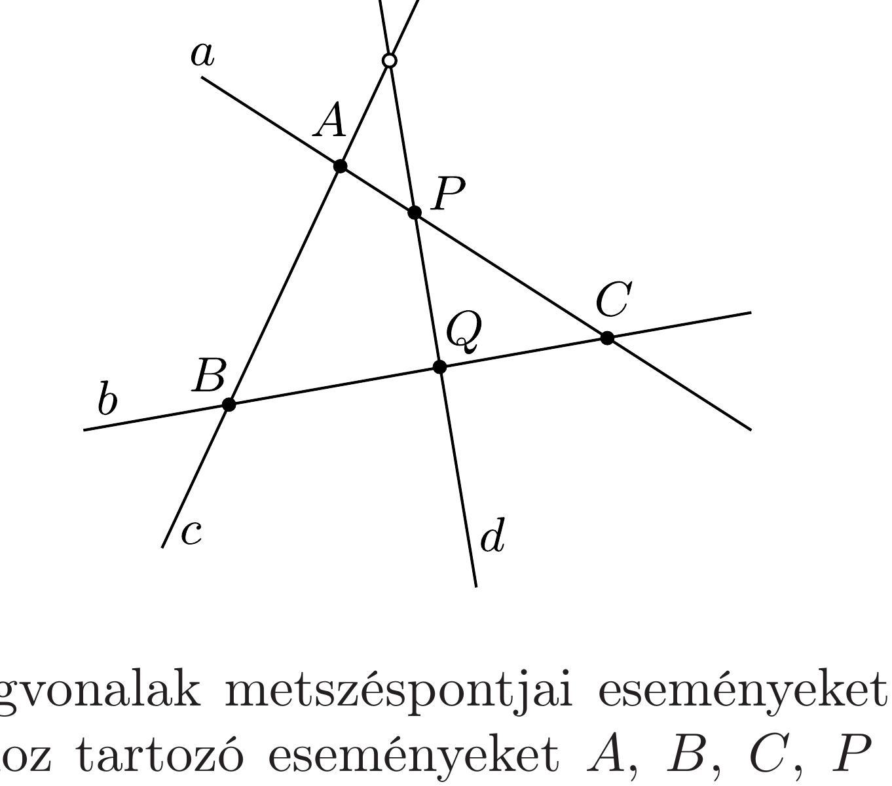

## Útmutatás

Rajzoljuk fel a csigák világvonalát a ( $2+1$ dimenziós) „téridőben”! Úgy is eljuthatunk a helyes válaszhoz, hogy felhasználjuk a különböző inerciarendszerek egyenértékúségét (a Galilei-szimmetriát).

## Megoldás

I. megoldás. Ha egy $x, y$ és $t$ tengelyú derékszögü koordináta-rendszerben felmérjük a csigák pillanatnyi térbeli (pontosabban: síkbeli) és időbeli adatait (ez az úgynevezett téridő-diagram), akkor az egyenes vonalban egyenletesen mozgó csigák „világvonala” egyenes lesz. Találkozások akkor következnek be, ha egyegy csiga ugyanakkor ugyanott van, vagyis ha a világvonalaik metszik egymást. A feladat állítása szerint a négy világvonal $(a, b, c$ és $d)$ a téridő 5 pontjában biztosan metszi egymást.

A téridőben a világvonalak metszéspontjai eseményeket jelentenek. Jelöljük az egyes találkozásokhoz tartozó eseményeket $A, B, C, P$ és $Q$ betúkkel (lásd az ábrát)! A téridó $A, B$ és $C$ pontjai egy síkot határoznak meg (az $a, b$ és $c$ világvonalak síkját), és mivel $P$ és $Q$ is ebben a síkban fekszik, a $d$ világvonalnak is benne kell lennie ebben a síkban. Ez viszont annyit jelent, hogy a $c$ és $d$ világvonal is metszi egymást. Mivel az „igen hosszú ideje” mozgó csigák múltjában a hatodik találkozás még nem valósult meg, ezért a jövőben biztosan be fog következni.
II. megoldás. Mivel 5 találkozás már bekövetkezett, biztosan van olyan csiga, amelyik mind a három társával találkozott már. Jelöljük ezt a csigát $\alpha$-val! Üljünk rá (képzeletben) $\alpha$ hátára, másképp fogalmazva: válasszunk olyan koordinátarendszert, amelyben $\alpha$ az origóban mozdulatlanul áll.

A másik három (mozgó) csiga $(\beta, \gamma$ és $\delta)$ találkozott $\alpha$-val, tehát áthaladtak az origón. Másrészt közülük az egyik (mondjuk $\beta$ ) találkozott a másik két mozgó társával (hiszen 5 találkozás zajlott le), ami csak úgy lehetséges, hogy $\beta, \gamma$ és $\delta$ ugyanazon egyenes mentén mozognak. Ekkor viszont - előbb vagy utóbb - $\gamma$ és $\delta$ is kell hogy találkozzon.
