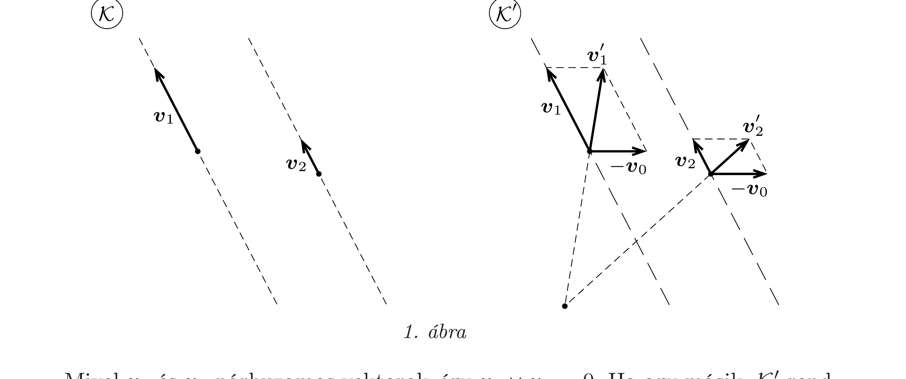
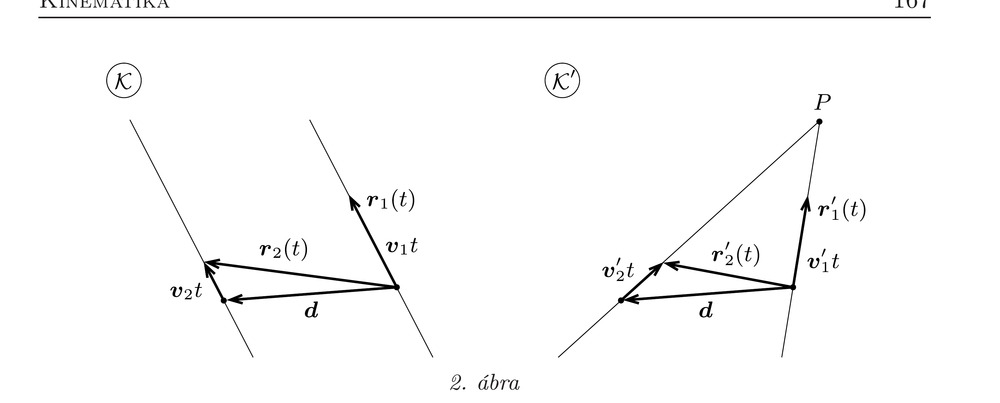

## Útmutatás

Vizsgáljuk a testek mozgását az eredeti és egy hozzá viszonyítva $\boldsymbol{v}_{0}$ sebességgel mozgó másik koordináta-rendszerben! Alkalmazzuk a Galilei-transzformáció összefüggéseit!

## Megoldás

a) Jelöljük a testek sebességét az eredeti $\mathcal{K}$ vonatkoztatási rendszerben $\boldsymbol{v}_{1}$-gyel és $\boldsymbol{v}_{2}$-vel. Ezek a sebességek egyben a $\mathcal{K}$ rendszerben párhuzamos pályák közös irányvektorai is, így a két pálya egy-egy tetszőleges pontját összekötő $\boldsymbol{b}$ vektorral együtt meghatároznak egy síkot. A $\mathcal{K}$-hoz képest mozgó vonatkoztatási rendszer $\boldsymbol{v}_{0}$ relatív sebességvektorának is ebben a síkban kell lennie, ellenkező esetben a két pálya egyenese nem metszhetné egymást. A metszésponthoz ugyanis teljesülnie kell a
\[
\lambda_{1}\left(\boldsymbol{v}_{1}-\boldsymbol{v}_{0}\right)-\lambda_{2}\left(\boldsymbol{v}_{2}-\boldsymbol{v}_{0}\right)=\boldsymbol{b}
\]
egyenletnek valamilyen $\lambda_{1}$ és $\lambda_{2}$ skalár paraméterrel, ami lehetetlen, ha $\boldsymbol{v}_{0}$ nincs benne az említett síkban. A továbbiakban tehát elegendő a $\boldsymbol{v}_{1}$ és $\boldsymbol{b}$ által meghatározott síkban fekvő vektorokkal foglalkoznunk.

Mivel $\boldsymbol{v}_{1}$ és $\boldsymbol{v}_{2}$ párhuzamos vektorok, így $\boldsymbol{v}_{1} \times \boldsymbol{v}_{2}=0$. Ha egy másik, $\mathcal{K}^{\prime}$ rendszer állandó $\boldsymbol{v}_{0}$ sebességgel mozog $\mathcal{K}$-hoz képest, akkor az ebben mért sebességek
\[
\boldsymbol{v}_{1}^{\prime}=\boldsymbol{v}_{1}-\boldsymbol{v}_{0} \quad \text { és } \quad \boldsymbol{v}_{2}^{\prime}=\boldsymbol{v}_{2}-\boldsymbol{v}_{0} .
\]
A két pálya akkor keresztezi egymást, ha $\boldsymbol{v}_{1}^{\prime}$ és $\boldsymbol{v}_{2}^{\prime}$ nem párhuzamos vektorok, vagyis
\[
\boldsymbol{v}_{1}^{\prime} \times \boldsymbol{v}_{2}^{\prime}=\left(\boldsymbol{v}_{1}-\boldsymbol{v}_{0}\right) \times\left(\boldsymbol{v}_{2}-\boldsymbol{v}_{0}\right)=\left(\boldsymbol{v}_{2}-\boldsymbol{v}_{1}\right) \times \boldsymbol{v}_{0} \neq 0 .
\]
Ez teljesíthető, ha a két (párhuzamosan mozgó) test sebességének nagysága különböző, és a két vonatkoztatási rendszer relatív sebessége $\left(\boldsymbol{v}_{0}\right)$ nem párhuzamos a testek sebességével (1. ábra).
b) A testek helyvektorai egy (önkényesen választott) kezdőpillanat után $t$ idővel a $\mathcal{K}$ vonatkoztatási rendszerben a következóképp adhatók meg:
\[
\boldsymbol{r}_{1}(t)=\boldsymbol{v}_{1} t, \quad \boldsymbol{r}_{2}(t)=\boldsymbol{v}_{2} t+\boldsymbol{d},
\]
ahol $\boldsymbol{d}$ a két test relatív helyzetét megadó vektor a $t=0$ pillanatban (2. ábra). (A vonatkoztatási rendszer origójának azt a pontot választottuk, ahol az 1-es test tartózkodik $t=0$-kor.)

A $\mathcal{K}^{\prime}$ vonatkoztatási rendszerben a testek helyvektorai
\[
\boldsymbol{r}_{1}^{\prime}(t)=\left(\boldsymbol{v}_{1}-\boldsymbol{v}_{0}\right) t, \quad \boldsymbol{r}_{2}^{\prime}(t)=\left(\boldsymbol{v}_{2}-\boldsymbol{v}_{0}\right) t+\boldsymbol{d} .
\]
Ha a két test a pályájuk metszéspontjában a $t=t_{0}$ időpontban találkozik (ahol $t_{0}$ lehet negatív is), akkor
\[
\boldsymbol{r}_{1}^{\prime}\left(t_{0}\right)=\boldsymbol{r}_{2}^{\prime}\left(t_{0}\right),
\]
vagyis
\[
\left(\boldsymbol{v}_{1}-\boldsymbol{v}_{2}\right) t_{0}=\boldsymbol{d} .
\]
Ez azonban csak akkor teljesülhet, ha $\boldsymbol{d}$ párhuzamos $\boldsymbol{v}_{1}$-gyel és $\boldsymbol{v}_{2}$-vel, vagyis a két test pályája a $\mathcal{K}$ vonatkoztatási rendszerben nemcsak hogy párhuzamos, de egybe is esik. A találkozás tehát a $\mathcal{K}$ rendszerben is megtörténik.

Megjegyzés. Eredményünk egyszerűbben is megfogalmazható. Ha a $\mathcal{K}^{\prime}$ vonatkoztatási rendszerben a két test találkozik (egyszerre vannak ugyanazon a helyen), akkor a $\mathcal{K}$ rendszerben is találkoznak. Két, egymással párhuzamosan mozgó test viszont csak akkor találkozhat, ha pályájuk egybeesik.
