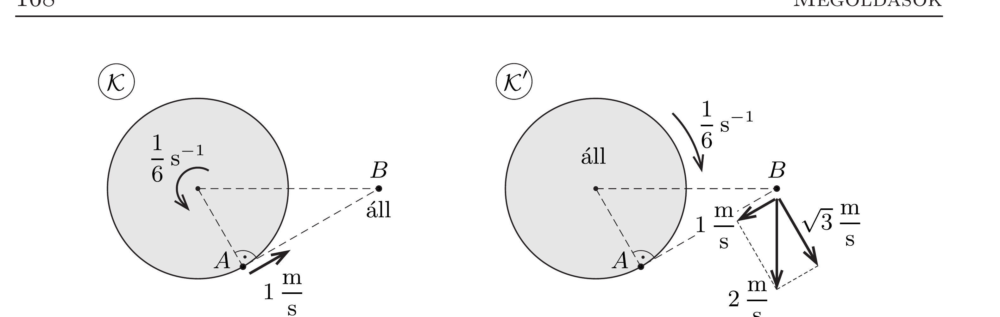

## Útmutatás

Vigyázat, a Galilei-féle relativitási elv csak inerciarendszerek között érvényes. Ezért hibás az a gondolat, hogy Anna is 1 m/s sebességgel látja Bélát mozogni.

## Megoldás

A feladatban leírtak alapján megállapíthatjuk, hogy Anna és Béla távolsága $6 \sqrt{3} \mathrm{~m}$, a körhinta kerületi sebessége $1 \mathrm{~m} / \mathrm{s}$, szögsebessége pedig $\frac{1}{6} \mathrm{~s}^{-1}$. Ha Anna a körhinta közepén ülne, akkor azt látná, hogy a körülötte lévő világ ugyanekkora szögsebességgel, de ellentétes körüljárási irányban forog, így a körhinta közepétől 12 méterre álló Bélát 2 m/s sebességgel látná mozogni a körhinta középpontjához képest érintőleges irányban. Bár Anna nem a körhinta közepén ül, hanem a szélén, de ez semmit sem változtat azon, hogy Anna szerint Béla sebessége 2 m/s. Az ábra bal oldali részén Béla szempontjából látjuk a relatív mozgást ( $\mathcal{K}$ vonatkoztatási rendszer), a jobb oldalon pedig Anna nézőpontjából $\left(\mathcal{K}^{\prime}\right.$ rendszer).

Mivel a $\mathcal{K}$ rendszer inerciarendszer, a $\mathcal{K}^{\prime}$ rendszer (azaz a forgó körhinta) viszont nem az, így nem alkalmazhatjuk a Galilei-féle relativitási elvet: Béla szerint Anna éppen feléje mozog 1 m/s sebességgel, viszont a forgó $\mathcal{K}^{\prime}$ rendszerből Anna úgy látja, hogy Béla nem feléje mozog, és a sebessége is más, 2 m/s. Ha Béla $\mathcal{K}^{\prime}$ rendszerbeli sebességét felbontjuk a jobb oldali ábrán látható két, egymásra merőleges összetevőre, akkor az Anna felé mutató sebességkomponens éppen 1 m/s nagyságú, míg az erre merőleges összetevő $\sqrt{3} \mathrm{~m} / \mathrm{s}$ értékú. Ezt úgy is értelmezhetjük, hogy Anna egyrészt azt látja, hogy Béla feléje mozog 1 m/s sebességgel, másrészt elfordul tőle $\left(\frac{1}{6} \mathrm{~s}^{-1}\right) \cdot 6 \sqrt{3} \mathrm{~m}=\sqrt{3} \mathrm{~m} / \mathrm{s}$ sebességgel.
