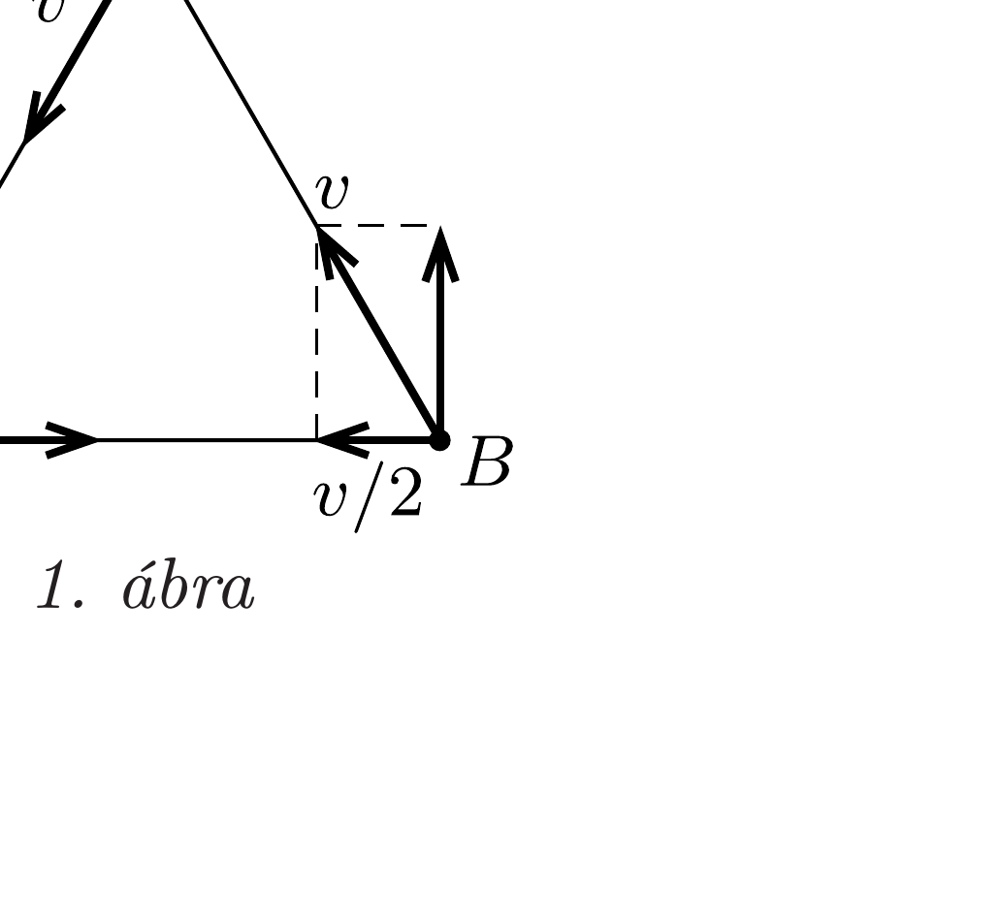
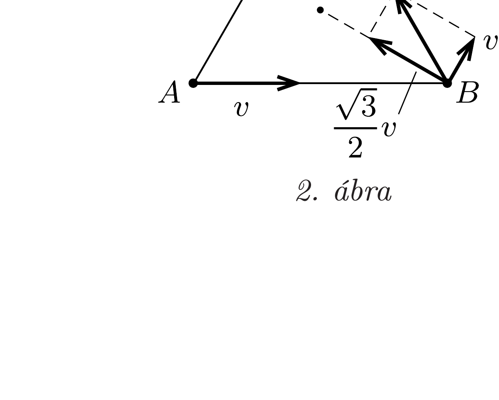
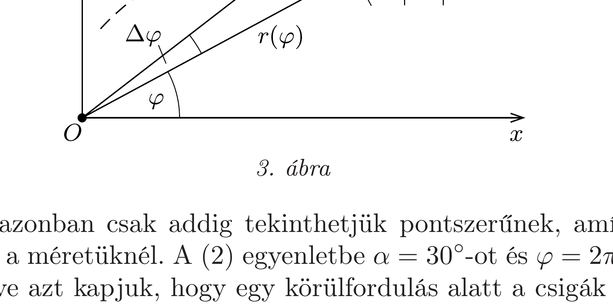
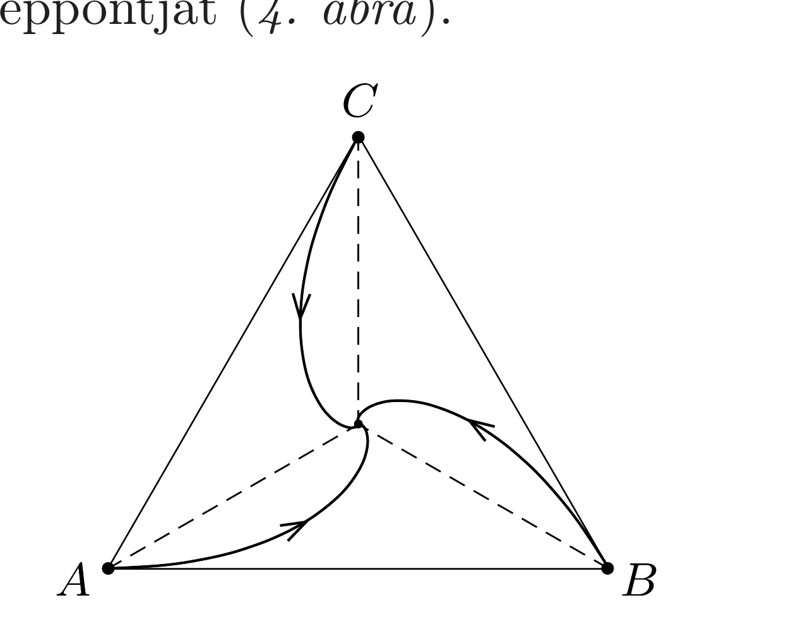

## Útmutatás

Próbálkozzunk a csigák sebességvektorának ügyes felbontásával! A pálya egyenletét a sebesség síkbeli polárkoordinátás felbontása segítségével határozhatjuk meg.

## Megoldás

Jelöljük a csigákat $A, B$ és $C$ betúkkel. Bontsuk fel a $B$ jelú csiga sebességvektorát az 1. ábrán látható módon az $A$ jelú csiga felé mutató és erre merőleges komponensekre. Ekkor ez a két csiga
\[
v+\frac{v}{2}=\frac{3 v}{2}=7,5 \frac{\mathrm{~cm}}{\text { perc }}
\]
sebességgel közeledik egymás felé, tehát a köztük lévő,

kezdetben 60 cm-es távolságot
\[
\frac{60 \mathrm{~cm}}{7,5 \mathrm{~cm} / \text { perc }}=8 \text { perc }
\]
alatt teszik meg, ennyi idó múlva találkoznak. Ezalatt az idó alatt mindegyik csiga 5 cm/perc sebességgel halad, tehát a találkozásig 40 cm utat tesznek meg.

Ugyanerre az eredményre juthatunk akkor is, ha a $B$ jelú csiga sebességvektorát a 2. ábrán látható módon, a csigák alkotta szabályos háromszög középpontja felé mutató és arra merőleges vektorokra bontjuk fel. Ezt úgy értelmezhetjük, hogy a csigák állandóan $\sqrt{3} v / 2=(\sqrt{3} / 2) \cdot 5 \mathrm{~cm} /$ perc sebességgel közelednek a háromszög középpontja felé (a szimmetria miatt itt találkoznak), miközben $v / 2$ kerületi sebességgel körbe is járják ezt a pontot. Geometriai megfontolások-
ból adódik, hogy kezdetben a csigák $(\sqrt{3} / 3) \cdot 60 \mathrm{~cm}$
távolságra vannak a háromszög középpontjától, tehát
\[
\frac{(\sqrt{3} / 3) \cdot 60 \mathrm{~cm}}{(\sqrt{3} / 2) \cdot 5 \mathrm{~cm} / \mathrm{perc}}=8 \text { perc }
\]
múlva találkoznak.
A pálya egyenletének kiszámításához általánosítsuk a feladatot! Vizsgáljuk egy pontszerú test mozgását, amely állandó ( $v$ nagyságú) sebességgel halad egy rögzített pont körül úgy, hogy a sebességvektora mindvégig ugyanakkora $\alpha$ (hegyes)szöget zár be a (kezdetben $r_{0}$ hosszúságú) vezérsugárral. Ha a vezérsugár a test kicsiny elmozdulása során $\Delta \varphi$ szöggel fordul el és hossza $\Delta r$ értékkel változik meg (3. ábra), akkor a sebességvektor és a vezérsugár közötti szög állandósága miatt a következő összefüggés írható fel:
\[
\frac{\Delta r}{\Delta \varphi}=-(\operatorname{ctg} \alpha) \cdot r(\varphi) .
\]
Az (1) egyenlet nagyon hasonlít a radioaktív bomlások
\[
\frac{\Delta N}{\Delta t}=-\lambda \cdot N(t)
\]
egyenletére (ahol $N(t)$ a mintában található, még el nem bomlott radioaktív atommagok száma az idő függvényében, $\lambda$ pedig a bomlásállandó), melynek ismert megoldása: $N(t)=N_{0} \mathrm{e}^{-\lambda t}$. Az analógia alapján megállapíthatjuk, hogy a kérdéses mozgás pályaegyenlete (polárkoordináta-rendszerben):
\[
r(\varphi)=r_{0} \mathrm{e}^{-(\operatorname{ctg} \alpha) \cdot \varphi} .
\]
Ez az úgynevezett logaritmikus spirális egyenlete, melyről leolvashatjuk, hogy az $r$ vezérsugár csak akkor tart a nullához, ha a szögelfordulás a végtelenhez tart, vagyis egy valóban pontszerú test a középpontot (véges idő alatt, véges út megtételével) végtelen sokszor megkerülve éri el.

A csigákat azonban csak addig tekinthetjük pontszerúnek, amíg távolságuk sokkal nagyobb a méretüknél. A (2) egyenletbe $\alpha=30^{\circ}$-ot és $\varphi=2 \pi$ szögelfordulást helyettesítve azt kapjuk, hogy egy körülfordulás alatt a csigák középponttól
mért távolsága néhány mikrométernyire csökken, ami reális méretú csigákat feltételezve elképzelhetetlen. Valójában tehát a csigák még egyszer sem kerülik meg teljesen a háromszög középpontját (4. ábra).

Megjegyzés. Az éjszakai repülő rovarok úgy próbálnak egyenes vonalban repülni, hogy egy távoli fényforrás (például a Hold) irányához képest állandó szögben haladnak. Ha egy közeli fényforrás megtéveszti óket, akkor a feladatnak megfelelően spirális pályán mozognak, csapdába kerülnek. Mivel sem a rovarok, sem a fényforrások nem pontszerúek, ezért előbb-utóbb beleütköznek a lámpába.
