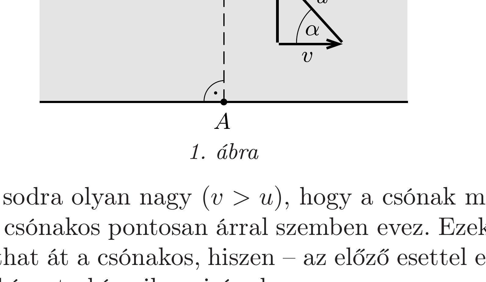
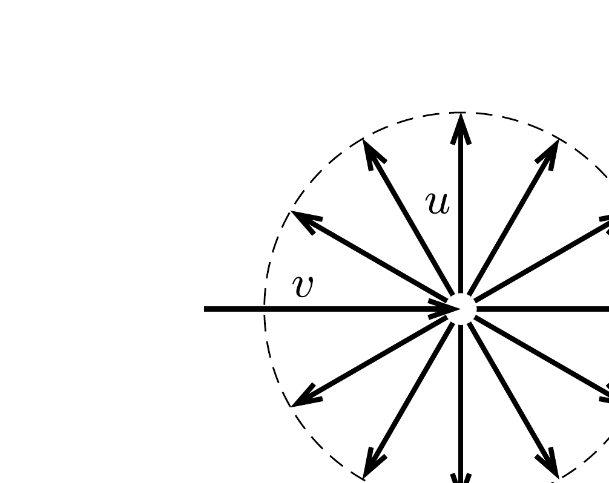
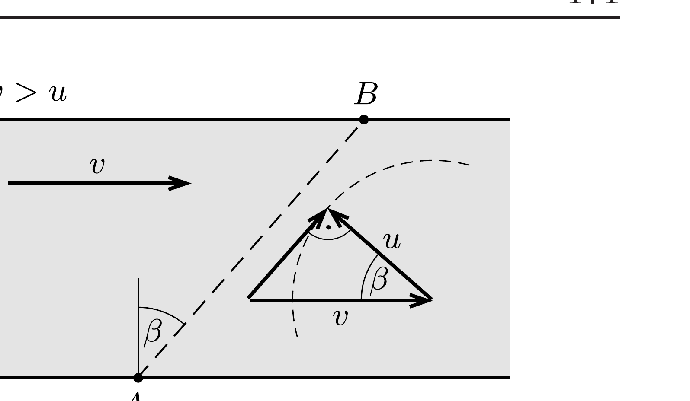

## Útmutatás

Az a) részben - mivel a csónak gyorsabb, mint a folyó - a partra merőleges átkelés megvalósítható. A b) rész esetében alkalmasan választott vektorösszeadás segítségével határozhatjuk meg azokat a lehetséges irányokat, amelyek felé a csónakos haladhat; ezek közül kell a legrövidebb útnak megfelelőt kiválasztani.

## Megoldás

Jelöljük a folyó sebességét $v$-vel, a csónakos (vízhez viszonyított) sebeségét pedig $u$-val. A két részfeladat közötti lényeges különbség az, hogy az $a$ ) esetben $v<u$, míg a $b$ ) részben $v>u$.
a) $v<u$ esetén a legrövidebb lehetséges út a partra merőleges irány. A csónak akkor halad erre, ha a csónakos az 1. ábrán látható irányba evez. Így a csónak sebessége a parthoz képest
\[
\sqrt{u^{2}-v^{2}}=\sqrt{5} \frac{\mathrm{~m}}{\mathrm{~s}} \approx 2,24 \frac{\mathrm{~m}}{\mathrm{~s}} .
\]
A csónakosnak a parthoz képest $\alpha$ szögben ferdén „visszafelé” (a sodrás ellen) kell eveznie. Mivel $\cos \alpha=v / u=2 / 3$, így $\alpha \approx 48,2^{\circ}$.

b) Ekkor a folyó sodra olyan nagy $(v>u)$, hogy a csónak még akkor is lefelé halad a folyón, ha a csónakos pontosan árral szemben evez. Ezek szerint a partra merőlegesen nem juthat át a csónakos, hiszen - az előzó esettel ellentétben - nem haladhat a parthoz képest akármilyen irányban.

A csónak lehetséges haladási irányait úgy határozhatjuk meg, hogy a folyó sebességéhez hozzáadjuk a csónak minden lehetséges állóvízbeli sebességét. Rajzoljuk fel a folyó sebességvektorát, majd ennek végpontjából rajzoljunk minden irányba olyan sebességvektorokat, melyek nagysága a csónak állóvízbeli sebességével egyezik meg. A sebességvektor-nyilak végpontja egy körön helyezkedik el, amint ezt a 2. ábra mutatja. A csónak lehetséges eredő sebességeit úgy kaphatjuk meg, hogy a folyó sebességvektorának talppontját összekötjük ennek a körnek az egyes pontjaival. A legrövidebb út az lesz, amely a folyó sodrásának irányával a legnagyobb szöget zárja be, vagyis ekkor az eredő sebességvektor a 3. ábrán látható módon éppen érinti a fenti kört.

Ezek szerint a csónak sebessége a parthoz viszonyítva
\[
\sqrt{v^{2}-u^{2}}=\sqrt{7} \frac{\mathrm{~m}}{\mathrm{~s}} \approx 2,65 \frac{\mathrm{~m}}{\mathrm{~s}} .
\]
A csónakosnak a parthoz képest $\beta$ szögben most is ferdén „visszafelé" kell eveznie. Mivel $\cos \beta=u / v=3 / 4$, így $\beta \approx 41,4^{\circ}$. A 3. ábráról az is leolvasható, hogy ekkor a csónak által megtett $A B$ útszakasz hossza a folyó szélességének 4/3-szorosa.
