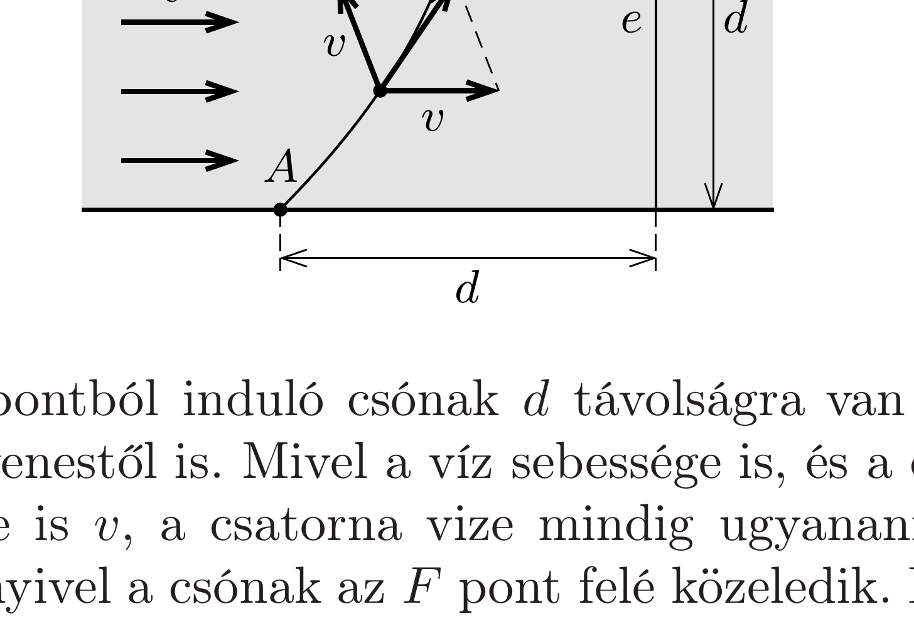

## Útmutatás

A csatorna vize mindig ugyanannyival sodorja el a csónakot, mint amennyivel az a szemben levő pont felé közeledik. A pálya alakját a kúpszeletek között kell keresnünk.

## Megoldás

Jelöljük a csatorna szélességét $d$-vel, és rajzoljunk a csatorna partjára merőlegesen egy $e$ egyenest, amely a csónak kezdeti helyzetétől szintén $d$ távolságra fekszik a víz sodrásirányában (lásd az ábrát).

Kezdetben az $A$ pontból induló csónak $d$ távolságra van a szemben lévő $F$ ponttól is, és az $e$ egyenestől is. Mivel a víz sebessége is, és a csónaknak a vízhez viszonyított sebessége is $v$, a csatorna vize mindig ugyanannyival sodorja le a csónakot, mint amennyivel a csónak az $F$ pont felé közeledik. Ez azt jelenti, hogy
a csónak mindig ugyanolyan messze lesz $F$-től, mint az $e$ egyenestől. Eszerint a csónak pályája egy parabola, amelynek fókusza az $F$ pont, vezéregyenese pedig az $e$ egyenes. Nagyon hosszú idő után a csónak a túlsó part közelébe kerül, az $F$ ponttól $d / 2$ távolságra. Ebbő́l a helyzetéből nem tud kiszabadulni, mert a csatorna vizének sebessége és az evezés sebessége éppen kiegyenlíti egymást.
