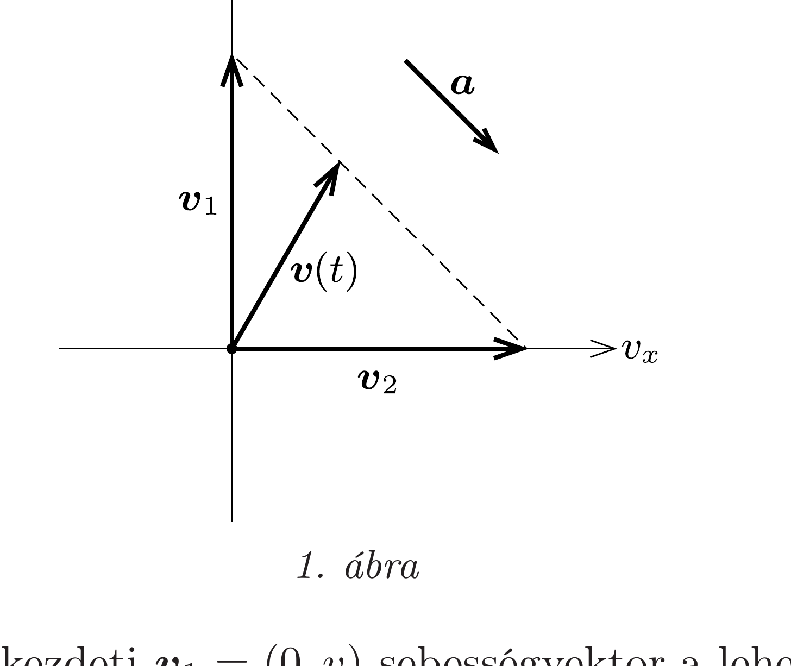
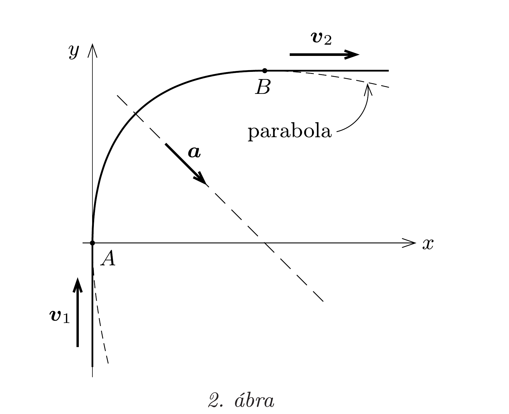
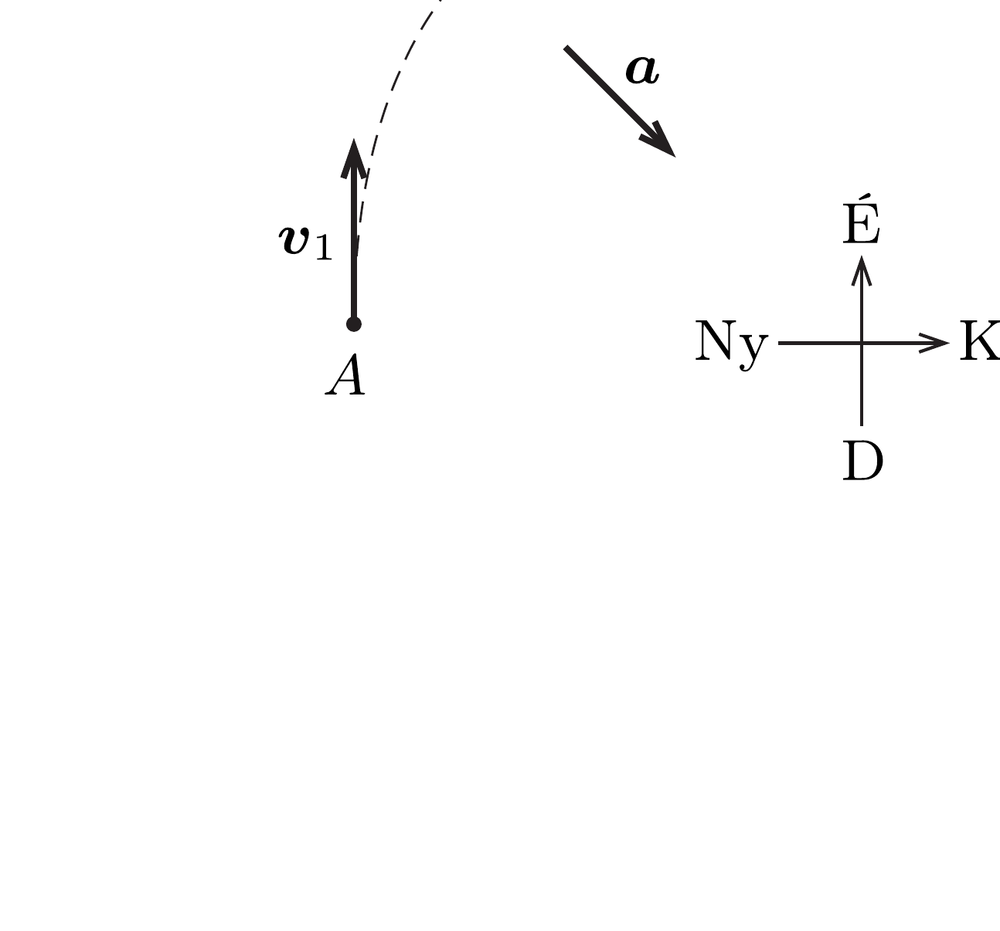
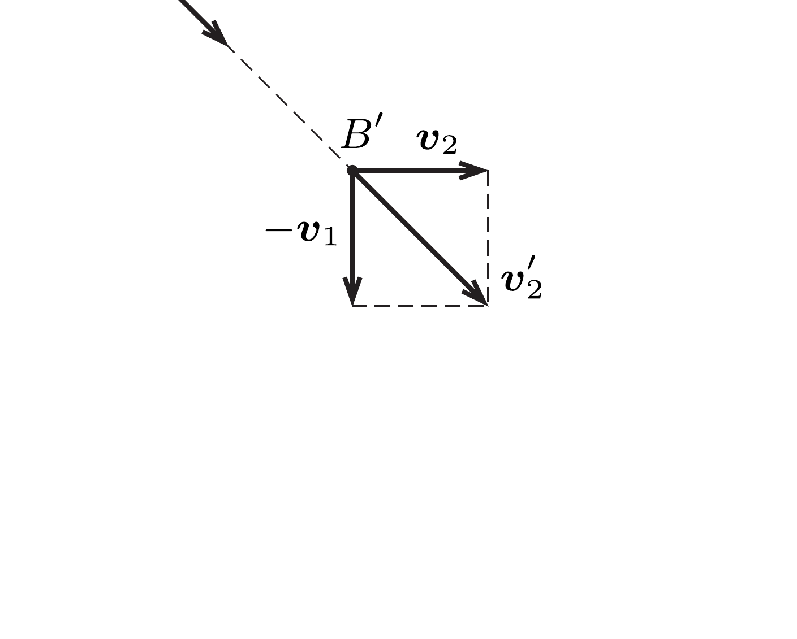

## Útmutatás

A feladat többféleképpen is megoldható. Az egyik lehetőség a kanyarodás vizsgálata a sebességkomponensek által kifeszített ( $v_{x}, v_{y}$ ) koordináta-rendszerben. Egy másik jó ötlet a jéghez képest alkalmas irányban mozgó inerciarendszer használata.

## Megoldás

I. megoldás. a) A feladatban leírt egyszerúsítést felhasználva (nevezetesen, hogy a fiú által a jégre kifejtett nyomóeró az átlagértékével, $m g$-vel helyettesíthető) megállapíthatjuk, hogy a fiú gyorsulása minden időpillanatban legfeljebb $\mu g$ nagyságú lehet. A gyorsulás iránya szabadon választható, de vajon mi az előnyösebb: ha a gyorsulás iránya a kanyarodás közben állandó marad, vagy ha folyamatosan változik? Erre a kérdésre úgy kaphatunk választ, hogy a mozgást a sebesség keleti $(x)$ és északi $(y)$ irányú komponensei által kifeszített $\left(v_{x}, v_{y}\right)$ koordináta-rendszerben vizsgáljuk (1. ábra).

Célunk az, hogy a kezdeti $\boldsymbol{v}_{1}=(0, v)$ sebességvektor a lehető legrövidebb idő alatt változzon át a végső $\boldsymbol{v}_{2}=(v, 0)$ sebességgé. A gyorsulás nem más, mint a sebesség változási üteme, azaz a sebességvektor végpontjának sebessége a $\left(v_{x}, v_{y}\right)$ síkon. Optimális esetben a sebességvektor hegyének a legrövidebb „úton”, vagyis a $\boldsymbol{v}_{1}$ és $\boldsymbol{v}_{2}$ vektorok végpontjait összekötő egyenesen kell mozognia, méghozzá a lehető leggyorsabb ütemben, $\mu g$ gyorsasággal. Így a kanyarodás minimális ideje:
\[
t=\frac{\left|\boldsymbol{v}_{2}-\boldsymbol{v}_{1}\right|}{\mu g}=\frac{\sqrt{2} v}{\mu g} \approx 7,2 \mathrm{~s} .
\]

Megjegyzés. A sebességvektor végpontja síkmozgások esetén a $\left(v_{x}, v_{y}\right)$ rendszerben, míg térbeli mozgásoknál a $\left(v_{x}, v_{y}, v_{z}\right)$ koordináta-rendszerben valamilyen görbét fut be, amit sebességhodográfnak neveznek. Belátható, hogy ferde hajítások esetében a sebességhodográf függőleges egyenes, míg bolygómozgásoknál a hodográf nemcsak körpályák esetén, hanem ellipszispályákra is kör.
b) Beláttuk, hogy a fiú gyorsulásának nagysága állandó, iránya pedig mindvégig délkeletre (az $x$ tengelyhez képest 45°-os szögben) mutat, így a pálya alakja
a kanyarodás szakaszában (a ferde hajításokhoz hasonlóan) a 2. ábrán látható parabolaív lesz. A parabola tengelye ÉNy-DK irányú, és a parabolaív $A$ és $B$ végpontjaiban a fiú pályájának egyenes szakaszai érintőlegesen csatlakoznak a kanyar ívéhez.

Megjegyzés. Megmutatható, hogy a fiú pályájának egyenlete az $A$ és $B$ pontok között a 2. ábrán látható koordináta-rendszerben:
\[
y=v \sqrt{\frac{2 \sqrt{2}}{\mu g}} \sqrt{x}-x .
\]
II. megoldás. a) Üljünk be a fiú kezdeti $\boldsymbol{v}_{1}$ sebességével mozgó $\mathcal{K}^{\prime}$ inerciarendszerbe! Az eredeti (jéghez rögzített) $\mathcal{K}$ vonatkoztatási rendszerben a $\boldsymbol{v}_{1}$ sebességvektort kell átváltoztatni $\boldsymbol{v}_{2}$ sebességvektorrá, míg a $\mathcal{K}^{\prime}$ koordináta-rendszerben a fiú kezdetben nyugalomban van $\left(\boldsymbol{v}_{1}^{\prime}=\mathbf{0}\right)$, a végsebessége pedig $\boldsymbol{v}_{2}^{\prime}=\boldsymbol{v}_{2}-\boldsymbol{v}_{1}$, amely délkeleti irányba mutat (3. ábra). A fiú végső sebességének nagysága a Pitagorasz-tétel alapján $\left|\boldsymbol{v}_{2}^{\prime}\right|=\sqrt{2} v$.

A Galilei-transzformáció a gyorsulást nem változtatja meg, így a $\mathcal{K}^{\prime}$ vonatkoztatási rendszerben a fiú lehetséges legnagyobb gyorsulásának nagysága szintén $\mu g$. Ebben a rendszerben nyilvánvaló, hogy a leggyorsabb kanyarodáshoz a fiúnak végig délkeleti irányban kell gyorsulnia. Így a sebességváltoztatáshoz szükséges legrövidebb idő:
\[
t=\frac{\left|\boldsymbol{v}_{2}^{\prime}\right|}{\mu g}=\frac{\sqrt{2} v}{\mu g} \approx 7,2 \mathrm{~s},
\]
ami megegyezik az I. megoldás eredményével.
b) A $\mathcal{K}^{\prime}$ vonatkoztatási rendszerben a fiú zérus kezdősebességú, egyenes vonalú, egyenletesen gyorsuló mozgást végez. Bármilyen más inerciarendszerben - feltéve, hogy a másik rendszer $\mathcal{K}^{\prime}$-höz viszonyított sebessége nem párhuzamos a futó $\mathcal{K}^{\prime}$ beli sebességével - a fiú pályája parabola, így a $\mathcal{K}$ rendszerben is az.
