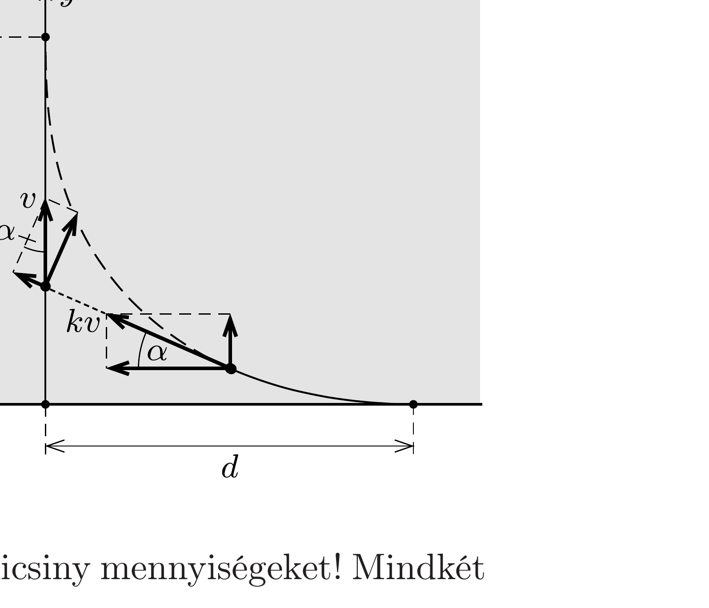

## Útmutatás

Hasonlítsuk össze a csempészhajó és az üldözője közötti távolság csökkenésének ütemét azzal, hogy mekkora sebességgel távolodik az órnaszád a parttól!

## Megoldás

Jelöljük $k \cdot v$-vel az órnaszád sebességét, vagyis a két hajó sebességének aránya legyen $k$. Az ábra alapján láthatjuk, hogyan csökken a két hajó közötti (kezdetben $d$ nagyságú) távolság $\Delta t$ idő alatt $\Delta d$ értékkel:
\[
\Delta d=k v \Delta t-v \Delta t \sin \alpha .
\]
A naszád távolsága a parttól eközben
\[
\Delta y=k v \Delta t \sin \alpha
\]
értékkel növekszik. ( $\alpha$ a naszád pillanatról pillanatra változó sebességvektorának a part-

hoz viszonyított szöge.)

Összegezzük az (1) és (2) egyenletben szereplő kicsiny mennyiségeket! Mindkét összegnek $d$-t kell adnia:
\[
\sum \Delta d=\sum k v \Delta t-\sum v \Delta t \sin \alpha=d,
\]
\[
\sum \Delta y=\sum k v \Delta t \sin \alpha=d .
\]
Ezen kívül felhasználhatjuk azt is, hogy a csempészek hajója egyenes vonalú egyenletes mozgással szintén $d$ távolságot tesz meg:
\[
\sum v \Delta t=d .
\]
Az (5) és (4) összefüggéseket a (3) egyenletbe helyettesítve megszabadulhatunk a nehezen kezelhető $\alpha$ szögtől, és $k$-ra egy meglehetősen egyszerú másodfokú egyenletet kapunk:
\[
k^{2}-k-1=0,
\]
amelynek pozitív gyöke:
\[
k=\frac{1+\sqrt{5}}{2} \approx 1,618 .
\]
Ez a szám a híres aranymetszés arányszáma. Ennyiszer gyorsabb az őrnaszád, ha éppen a leírt helyzetben éri utol a csempészeket.
