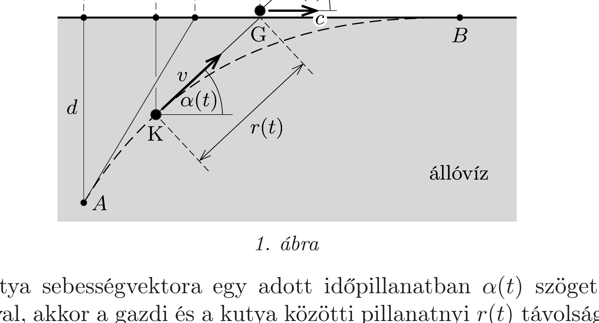
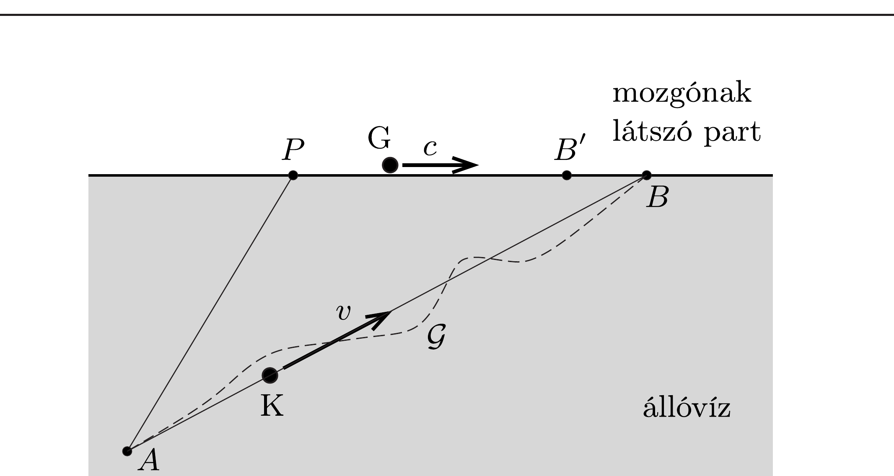
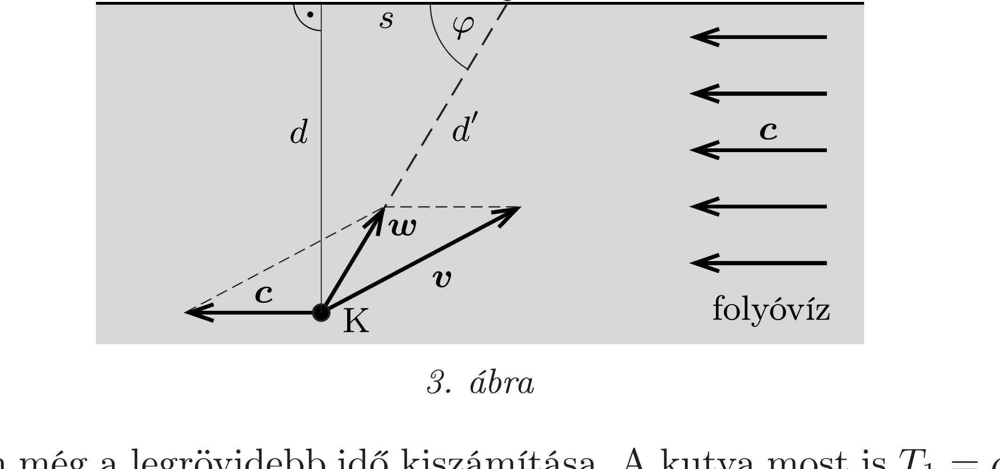

## Útmutatás

a) A mozgást a vízhez rögzített vonatkoztatási rendszerben a legegyszerúbb vizsgálni. A mozgás második szakaszában a labdával visszatérő kutya
útvonala meglehetősen bonyolult görbe lesz, ennek egyenletét azonban szerencsére nem kell meghatároznunk. Ehelyett érdemes összehasonlítani a kutya és a gazdája közötti távolság változásának sebességét a kutya sebességének vízfolyás irányú komponensével.
- b) Lássuk be, hogy az egyenes útvonalhoz tartozik a legrövidebb idő!

## Megoldás

a) Vizsgáljuk a kutya mozgását a vízhez rögzített koordináta-rendszerben! A mozgás elsó szakaszában, amikor a kutya a labda felé úszik, a vízhez képest a labda áll, a kutya pedig $v$ sebességgel halad, a $d$ távolságot tehát
\[
T_{1}=\frac{d}{v}=10 \mathrm{~s}
\]
idó alatt teszi meg. Ezalatt a labda a parthoz viszonyítva
\[
s=c T_{1}=c \frac{d}{v}=3 \mathrm{~m}
\]
távolsággal mozdul el.
A mozgás második szakaszában a vízzel együtt sodródó vonatkoztatási rendszerben a kutya (K) állóvízben $v$ sebességgel úszik a gazdája felé, a gazdi (G) pedig a parttal együtt $c$ sebességgel mozog a víz folyásirányával ellentétes irányban (1. ábra).

Ha a kutya sebességvektora egy adott időpillanatban $\alpha(t)$ szöget zár be a part vonalával, akkor a gazdi és a kutya közötti pillanatnyi $r(t)$ távolság változási üteme:
\[
\frac{\Delta r}{\Delta t}=-v+c \cos \alpha .
\]
Legyen a kutya aktuális helyzetének partra merőleges vetülete és a gazda pillanatnyi helyének távolsága $x(t)$. Ennek a mennyiségnek a változási sebessége:
\[
\frac{\Delta x}{\Delta t}=c-v \cos \alpha .
\]
Mivel a kutya mozgása közben $\alpha(t)$ változik, $x(t)$ és $r(t)$ meglehetősen bonyolult függvényei az időnek, meghatározásuk csak felsőbb matematikai eszközökkel vagy
numerikus módszerekkel lehetséges. Ha viszont kiküszöböljük a kezelhetetlen $\cos \alpha$ tényezőt, a következő egyszerú egyenletet kapjuk:
\[
v \frac{\Delta r}{\Delta t}+c \frac{\Delta x}{\Delta t}=c^{2}-v^{2},
\]
vagyis
\[
-\frac{\Delta[v \cdot r(t)+c \cdot x(t)]}{\Delta t}=v^{2}-c^{2}=\text { állandó. }
\]
A szögletes zárójelben álló kifejezés tehát időben egyenletesen csökken. A mozgás kezdetekor (az 1. ábrán $A$-val jelölt pontban) az $r$ és $x$ mennyiségek értéke
\[
r(0)=\sqrt{s^{2}+d^{2}} \quad \text { és } \quad x(0)=s,
\]
a kutya partot érésének $t=T_{2}$ időpillanatában (az 1. ábrán látható $B$ pontban) pedig
\[
r\left(T_{2}\right)=x\left(T_{2}\right)=0 .
\]
Ezeket felhasználva a mozgás második szakaszának $T_{2}$ időtartama kifejezhető:
\[
T_{2}=\frac{v \sqrt{s^{2}+d^{2}}+c \cdot s}{v^{2}-c^{2}}=\frac{\sqrt{c^{2}+v^{2}}+\left(c^{2} / v\right)}{v^{2}-c^{2}} d=23,8 \mathrm{~s} .
\]

A megadott módon úszó kutya tehát $T_{1}+T_{2}=33,8$ másodperc alatt ér vissza a labdával a gazdájához.

Megjegyzés. A megoldás során alkalmazott „trükk” (a bonyolult mozgás idejének elemi úton történő kiszámítása) lényegét tekintve megegyezik az előzó feladatban alkalmazott eljárással.
b) A legrövidebb idejú mozgás problémáját is a vízzel együtt mozgó vonatkoztatási rendszerben érdemes tárgyalni. A vízbe ugró kutya a tőle adott távolságban lévő labdát most is akkor éri el a leghamarabb, ha a legrövidebb úton, vagyis egyenesen úszik a labda felé. Megmutatjuk, hogy a labdával együtt visszatérő kutya úszásának ideje akkor a legrövidebb, ha pályája (akár a partról nézzük, akár a folyóvízhez viszonyítjuk) egyenes.

Tételezzük fel, hogy a kutya az eldobott labda helyének megfelelő $A$ pontból indulva valamilyen útvonal mentén haladva kiúszik a partra, és ott a $B$ pontban találkozik a $P$ pontból induló, $c$ sebességgel mozgó gazdájával (2. ábra). Belátjuk, hogy ha a kutya nem egyenesen, hanem attól különböző $\mathcal{G}$ görbe mentén úszik, akkor ez a mozgás biztosan nem lehet a legrövidebb idejü. Ha ugyanis stratégiát változtatva a $\mathcal{G}$ görbe helyett mégis az $A B$ egyenes mentén úszna, akkor rövidebb idő alatt érne a $B$ pontba, mint a gazdi. Az egyenesen úszó kutya a $B$ pontba tehát hamarabb, a $P$ pontba pedig később érkezne, mint a gazdája, ezért a két hely között léteznie kell egy olyan $B^{\prime}$ pontnak, amelyre a két mozgás ideje megegyezik. Ez az időtartam biztosan kisebb, mint a $B$ pontbeli találkozásnak megfeleló idő, ami ellentmond annak a feltevésünknek, hogy a $\mathcal{G}$ görbe mentén érhet a leghamarabb a partra a kutya.

A kutya sebessége tehát - optimális esetben - a parthoz képest $\boldsymbol{c}$ sebességú vízzel együtt mozgó rendszerből szemlélve nemcsak a nagyságát, hanem az irányát tekintve is időben állandó $\boldsymbol{v}$. Ekkor viszont a parthoz képest „álló” megfigyeló (pl. a gazdi) is időben állandó $(\boldsymbol{v}+\boldsymbol{c})$-nek észleli a kutya sebességvektorát, vagyis a pályáját egyenesnek látja.

Hátravan még a legrövidebb idő kiszámítása. A kutya most is $T_{1}=d / v=10 \mathrm{~s}$ idő alatt éri el a labdát, majd (a parthoz rögzített vonatkoztatási rendszerben) a 3. ábrán látható szaggatott vonalú egyenes pályán
\[
d^{\prime}=\sqrt{s^{2}+d^{2}}=\sqrt{34} \mathrm{~m}
\]
utat kell megtennie $\boldsymbol{w}=\boldsymbol{v}+\boldsymbol{c}$ sebességgel. A koszinusztétel segítségével kiszámíthatjuk a kutya eredő $\boldsymbol{w}$ sebességének nagyságát visszafelé a gazdihoz:
\[
v^{2}=w^{2}+c^{2}+2 w c \cos \varphi,
\]
ahol $\cos \varphi=s / d^{\prime}=0,514$. A fenti másodfokú egyenlet (pozitív) gyöke $w \approx$ $0,274 \mathrm{~m} / \mathrm{s}$, vagyis a kutya visszatérésének ideje $T_{2}=d^{\prime} / w \approx 21,3 \mathrm{~s}$.

Megjegyzés. Ugyanezt az eredményt természetesen a vízzel együtt mozgó koordinátarendszerben is megkaphatjuk. Ott a vízben $v$ sebességgel úszó kutya és a parton $c$ sebességgel „mozgó" gazdájának találkozási feltételét így írhatjuk fel:
\[
v T_{2}=\sqrt{d^{2}+\left(s+c T_{2}\right)^{2}} .
\]

Négyzetre emelés után ez az egyenlet is másodfokú, amelynek pozitív gyöke: $T_{2}=21,3 \mathrm{~s}$.
A „legügyesebb” stratégiát választó kutya tehát $T_{1}+T_{2}=31,3$ másodperc alatt ér vissza a labdával a gazdájához, ami mindössze 2,5 másodperccel rövidebb idő a húséges kutya „ússz mindig a gazdi felé” stratégiájával elért eredménynél.
