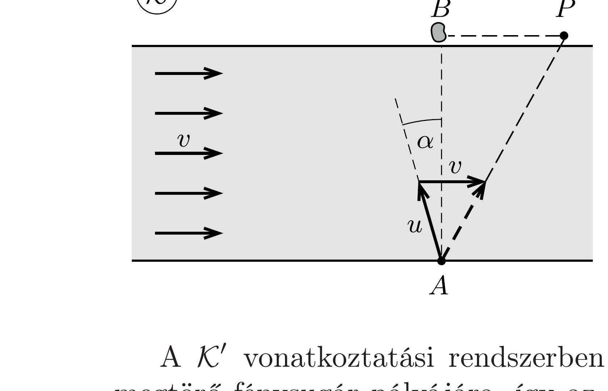
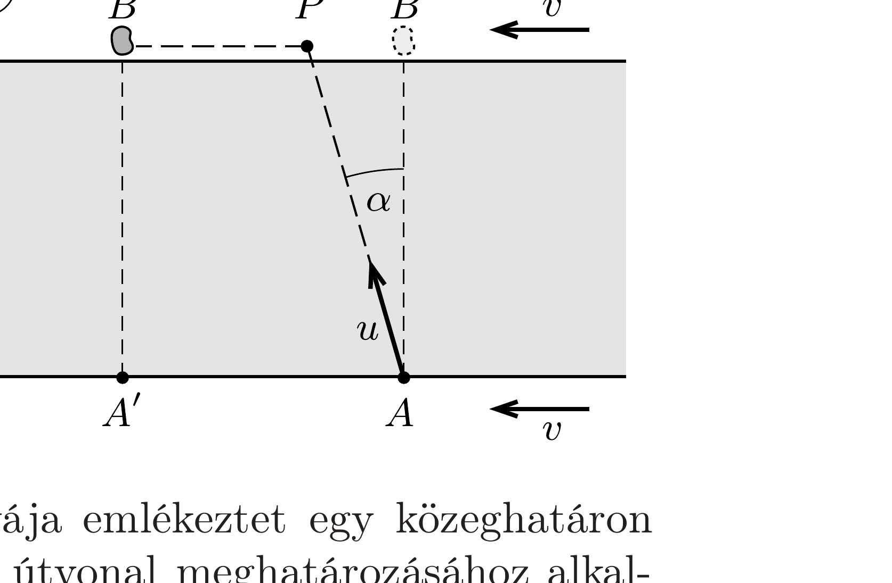

## Útmutatás

Érdemes Joe mozgását a folyóval együtt mozgó koordinátarendszerbő̌l leírni (magunkat a folyón sodródó ladikba képzelni). Ebben a vonatkoztatási rendszerben egy alkalmas optikai analógia és a Fermat-elv alkalmazásával már könnyen meghatározhatjuk Joe optimális útvonalát.

## Megoldás

Legyen a víz sebessége $v, u$ pedig jelölje azt a sebességet, amivel Joe futni, illetve evezni tud. Tegyük fel, hogy Joe először (egyenes pályán) átevez a folyón, majd a partot érés helyétől a part mentén gyalog megy az aranyröghöz.

Célszerú Joe mozgását a folyó vizével együtt mozgó $\mathcal{K}^{\prime}$ koordináta-rendszerből szemlélni. A parthoz rögzített $\mathcal{K}$ rendszerben jelöljük Joe indulási pontját $A$-val, a partot érés helyét $P$-vel, az aranyrög helyzetét pedig $B$-vel! A $\mathcal{K}^{\prime}$ rendszerben azt látjuk, hogy a folyópart az eredeti sodrásiránnyal ellentétesen mozog $v$ sebességgel, Joe az állónak látszó vízen $u$ sebességgel evez, sebessége a parton pedig $v+u$ nagyságú. Így Joe célbaéréséig az indulási pont az ábrán látható $A^{\prime}$ pontba, az aranyrög pedig a $B^{\prime}$ pontba kerül.

A $\mathcal{K}^{\prime}$ vonatkoztatási rendszerben Joe pályája emlékeztet egy közeghatáron megtörő fénysugár pályájára, így az optimális útvonal meghatározásához alkalmazhatjuk a Fermat-elvet. Ha Joe a legrövidebb idő alatt szeretne az aranyröghöz érni, akkor a $\mathcal{K}^{\prime}$ rendszerben olyan útvonalat kell választania, amilyen pályán egy $n=(v+u) / u$ törésmutatójú közegből a levegőbe átlépő fénysugár halad. Ekkor a beesési szög éppen a teljes visszaverődés határszöge, melyre $\sin \alpha=1 / n$. A $\mathcal{K}$ vonatkoztatási rendszerben tehát Joe-nak úgy kell eveznie, hogy csónakjának vízhez viszonyított sebessége a vízével $\pi / 2+\alpha$ szöget zárjon be, ahol
\[
\alpha=\arcsin \left(\frac{u}{v+u}\right) .
\]

A Fermat-elven alapuló gondolatmenet csak akkor helyes, ha a $\mathcal{K}^{\prime}$ vonatkoztatási rendszerben az aranyrög előbb ér a $P^{\prime}$ pontba, mint Joe, azaz ha az előbb kiszámolt $\alpha$ értékre
\[
v \geq u \sin \alpha .
\]
Ellenkezó esetben $(v<u \sin \alpha)$ időveszteség, ha Joe „túlevez" az aranyrögön, ezért inkább úgy érdemes eveznie, hogy a $\mathcal{K}$ rendszerben az eredő sebessége merőleges
legyen a folyó partvonalára. (Ebben az esetben tehát a legrövidebb mozgásidő a legrövidebb út esetén valósul meg.) Ekkor az ideális $\alpha$ szög
\[
\alpha=\arcsin \left(\frac{v}{u}\right) .
\]
A két esetet elválasztó határesetben az (1) és (2) összefüggésekből az
\[
v=u \frac{u}{v+u}
\]
egyenletet kapjuk, ahonnan
\[
\frac{u}{v}=\frac{\sqrt{5}+1}{2} \approx 1,618,
\]
ami az aranymetszés nevezetes arányszáma. (Ez az érdekes arányszám a 8. és a 302. feladatban is felbukkan.)

Megállapíthatjuk tehát, hogy amennyiben Joe gyors $(u \geq 1,618 v)$, akkor abban az esetben éri el leghamarabb az aranyrögöt, ha éppen feléje (azaz a partra merőlegesen) halad. Határesetben Joe-nak a vízhez viszonyítva az $A B$ szakasszal $\alpha_{\max } \approx \arcsin (0,618)=38,2^{\circ}$ szöget bezáró irányban, a folyón felfelé kell eveznie. Joe akár gyorsabb, akár lassabb a fenti határsebességnél, akkor ér céljához a leghamarabb, ha a partra meróleges egyeneshez képest ennél kisebb szögben evez a sodrással ferdén felfelé. Érdekes észrevennünk, hogy ez az $\alpha$ szög $\left(0<\alpha<\alpha_{\text {max }}\right)$ akkor is nullához tart, ha Joe sebessége végtelenhez tart, illetve akkor is, ha nullához közelít.

Megjegyzés. Általánosságban két különböző csónaksebességhez tartozik ugyanaz az ideális $\alpha$ szög, melyek között úgy találhatunk összefüggést, ha egyenlővé tesszük ezeknek a szögeknek a szinuszait: $u_{1} /\left(v+u_{1}\right)=v / u_{2}$, ahol $u_{1}$ a lassabb, $u_{2}$ pedig a gyorsabb evezési sebesség. Rendezés után ezt találhatjuk: $v^{2}=u_{1}\left(u_{2}-v\right)$, vagyis $u_{1}$ és $u_{2}-v$ mértani közepe mindig megegyezik a folyó $v$ sebességével.
