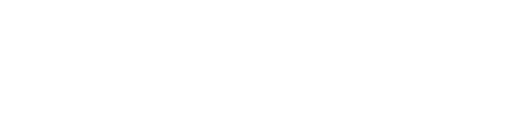

## Útmutatás

a) Számítsuk ki, mekkora sebességgel mozognak a pókhálószál egyes pontjai egy adott időpillanatban.
- b) Üljünk bele a pókhálószállal együtt „nyúló” koordináta-rendszerbe!

## Megoldás

a) A pókhálószál sebessége a faltól $x$ méter távolságban arányosan kisebb, mint a szál végének sebessége, tehát $x \cdot v_{0}$. Ha ez az érték nagyobb, mint a katica $v_{1}$ sebessége, akkor a katica távolodni kezd a faltól, és a helyzete egyre reménytelenebb lesz: soha nem éri el a falat. Ha viszont $v_{1}>x \cdot v_{0}$, akkor a katica eredó sebessége a fal felé mutat, és ez a sebesség az idő múltával egyre növekszik, tehát biztosan eléri a falat. A határeset az $x=v_{1} / v_{0}=0,25$ értéknek felel meg, tehát a pókhálószálon a faltól 25 cm távolságból elinduló katicabogár egyáltalán nem mozdul el.

b) Rajzoljunk gondolatban jeleket a kezdetben $\ell_{0}=1$ méter hosszúságú pókhálószálra, és írjuk oda melléjük, hogy az adott pontnak a faltól mért távolsága a szál teljes hosszának hányad része. Ezek a számok éppen az $a$ ) rész megoldásában szereplő $x$ koordináták ( $x=0$ a falnak, $x=1$ a póknak felel meg), melyek azonban most a pókhálószállal együtt „nyúlnak”.

Jelölje $\Delta t$ azt az időt, ami alatt a katica eljut egy $x$ jelü helyről egy közeli $x-\Delta x$ jelú helyre, ha a pók már $t$ ideje mozog. Mivel a kérdéses pontok távolsága $\left(\ell_{0}+v_{0} t\right) \Delta x$, és a katica $v_{1}$ sebességgel mozog, fennáll, hogy
\[
\Delta x=\frac{v_{1} \Delta t}{\ell_{0}+v_{0} t} .
\]
Összegezzük a fenti egyenlet mindkét oldalát a katicabogár teljes mozgására! Ha $x_{0}$ jelöli a katica kezdeti helyzetét, és $T$ azt az időtartamot, amely alatt eléri a falat, akkor fennáll, hogy
\[
x_{0} \approx \sum \frac{v_{1} \Delta t}{\ell_{0}+v_{0} t} \approx \int_{0}^{T} \frac{v_{1}}{\ell_{0}+v_{0} t} \mathrm{~d} t=\frac{v_{1}}{v_{0}} \ln \left(1+\frac{v_{0} T}{\ell_{0}}\right) .
\]
(A felosztást finomítva összegzésről integrálásra tértünk át.) Tekintettel arra, hogy a fenti integrál elegendően nagy $T$-t választva tetszőlegesen naggyá tehető, azt a meglepó eredményt kaptuk, hogy akármilyen gyorsan húzza is a pók a szál végét (tetszőlegesen nagy $v_{0}$, tetszőlegesen kicsiny $v_{1}$ és bármely $x_{0}$ érték esetén is) a katica véges
\[
T=\frac{\ell_{0}}{v_{0}}\left[\mathrm{e}^{\left(v_{0} / v_{1}\right) x_{0}}-1\right]
\]
idő alatt biztosan eléri a falat.
