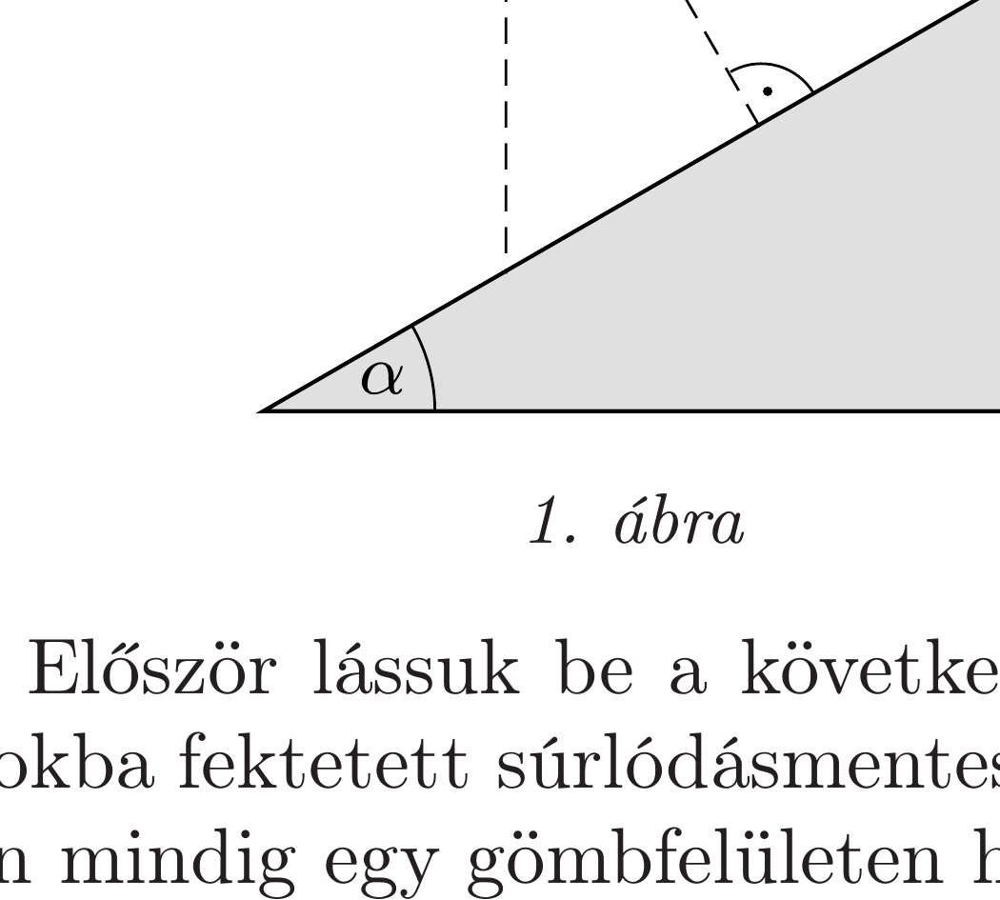
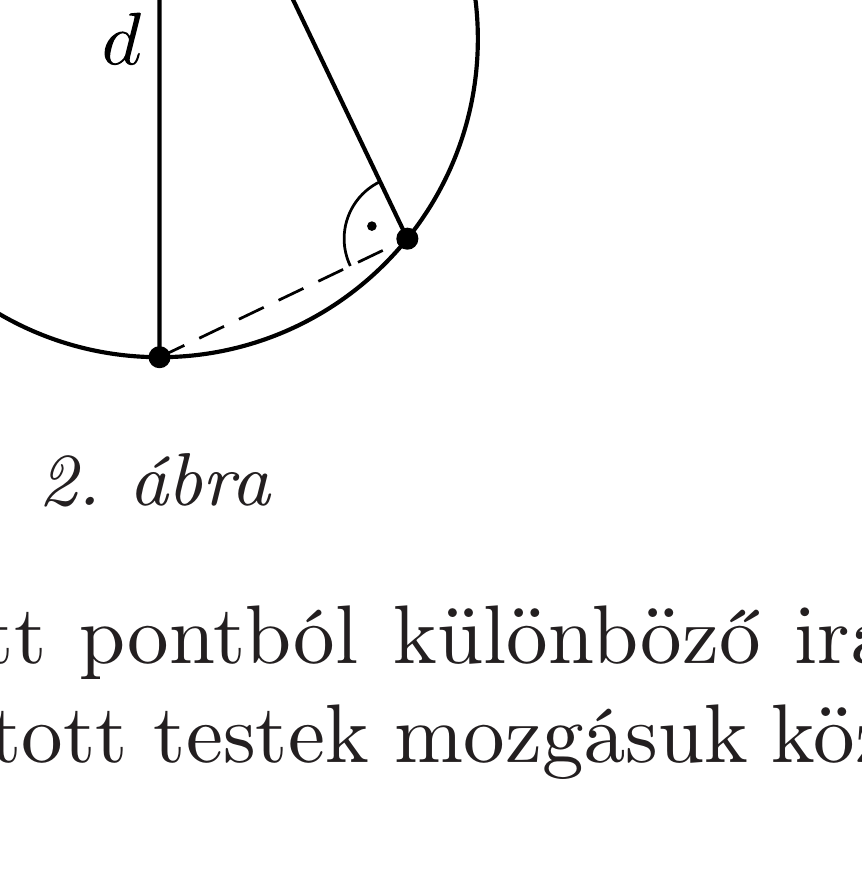
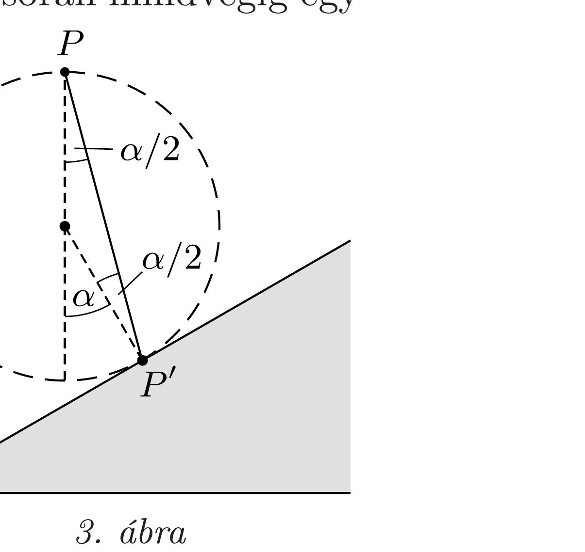

## Útmutatás

Bizonyítsuk be, hogy a $P$ pontból különböző irányokba fektetett súrlódásmentes lejtőkön az egyszerre indított testek mindig egy gömb felületén találhatóak!

## Megoldás

Tekintsük az 1. ábrán látható két irányt! Függőleges irányban legnagyobb a gyorsulás $(g)$, de viszonylag hosszú az út. A lejtőre merőleges irányban legrövidebb az út, de viszonylag kicsi a gyorsulás. Várható, hogy a legrövidebb elérési időt a két kijelölt irány között találjuk.

Először lássuk be a következó segédtételt: egy adott pontból különbözó irányokba fektetett súrlódásmentes lejtőkön egyszerre indított testek mozgásuk közben mindig egy gömbfelületen helyezkednek el.

A gömb legfelső pontja a 2. ábrának megfelelően az indítási pontban van. Az indítás után $t$ idővel a gömb átmérőjének $d=g t^{2} / 2$-nek kell lennie (szabadesés). A függőlegessel $\varphi$ szöget bezáró lejtőn egy test $g \cos \varphi$ gyorsulással mozog, útja a gömb kerületéig $d \cos \varphi$, vagyis ennek az útnak a megtételéhez is ugyanakkora $t$ idő kell, mint a függőleges mozgáshoz. Ezzel a segédtételt beláttuk.

Az eredeti feladatot a segédtétel alapján egyszerúen megoldhatjuk. A $P$ pontból különböző irányokba egyszerre indított testek mozgásuk során mindvégig egy olyan gömb felületére illeszkednek, amely időben növekszik, legfelső pontja pedig mindig a $P$ pont. Ez a növekvő gömb egyszercsak eléri a lejtőt, ekkor a gömb és a lejtő érinti egymást a $P^{\prime}$ pontban. A legrövidebb elérési idóhöz tehát a $P$ pontból a $P P^{\prime}$ szakasz mentén kell súrlódásmentesen lecsúszni.

A 3. ábra alapján könnyen meggyőződhetünk arról, hogy az $\alpha$ hajlásszögú lejtő esetén a $P P^{\prime}$ legrövidebb elérési irány a függőlegessel $\alpha / 2$ szöget zár be, vagyis a megoldás elején említett két iránynak éppen a szögfelezője a legkedvezőbb.

Megjegyzés. Bár a probléma térbeli, hiszen a $P$ pontból egyszerre induló testek azonos időben mindig egy gömbfelületen vannak, és a legrövidebb elérési irányt a $P$ pont és a növekvő sugarú gömb lejtőt érintő pontjának iránya adja, elegendő azonban a $P$ pontot tartalmazó, lejtőre meróleges, függőleges síkban vizsgálódnunk, ahogy ezt hallgatólagosan az ábrákon eddig is tettük.
