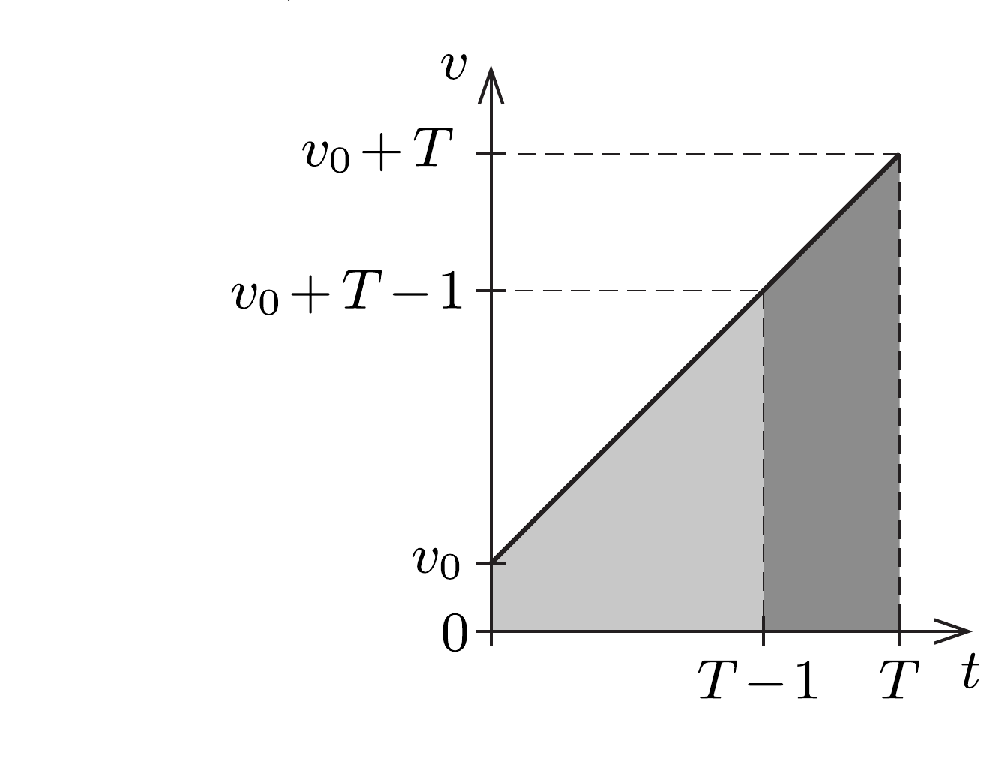
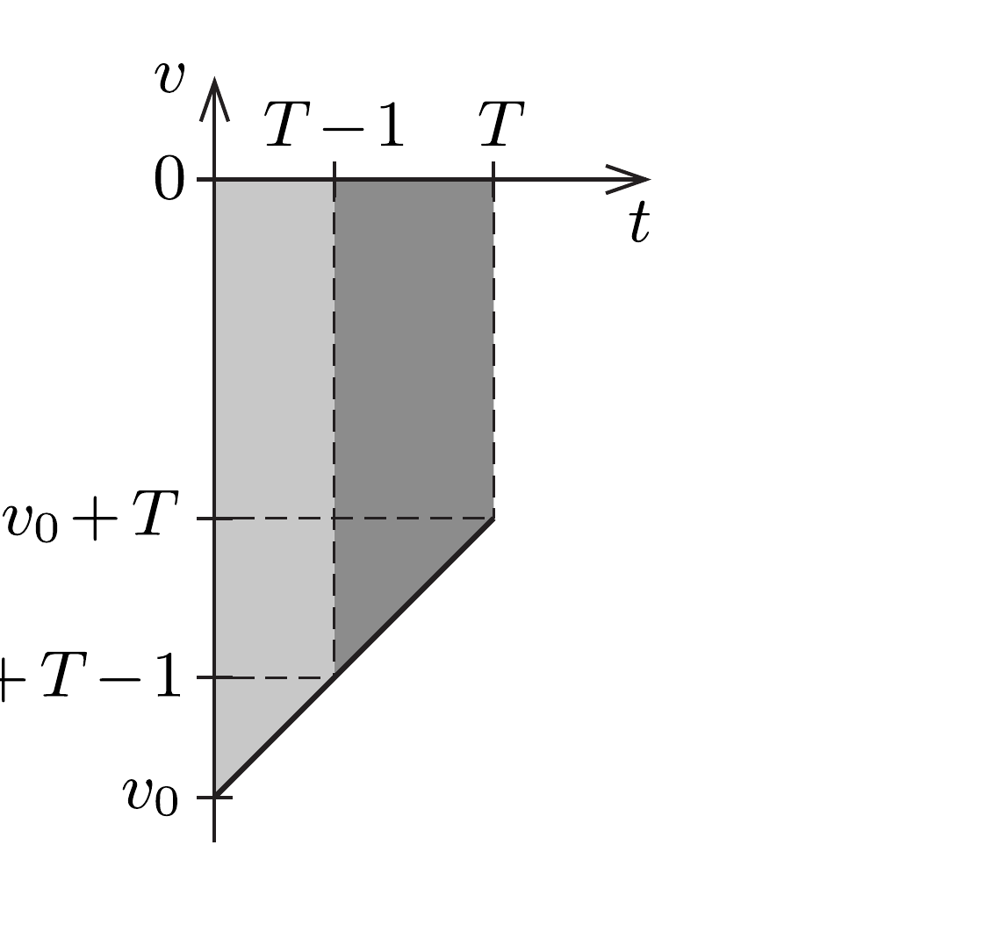
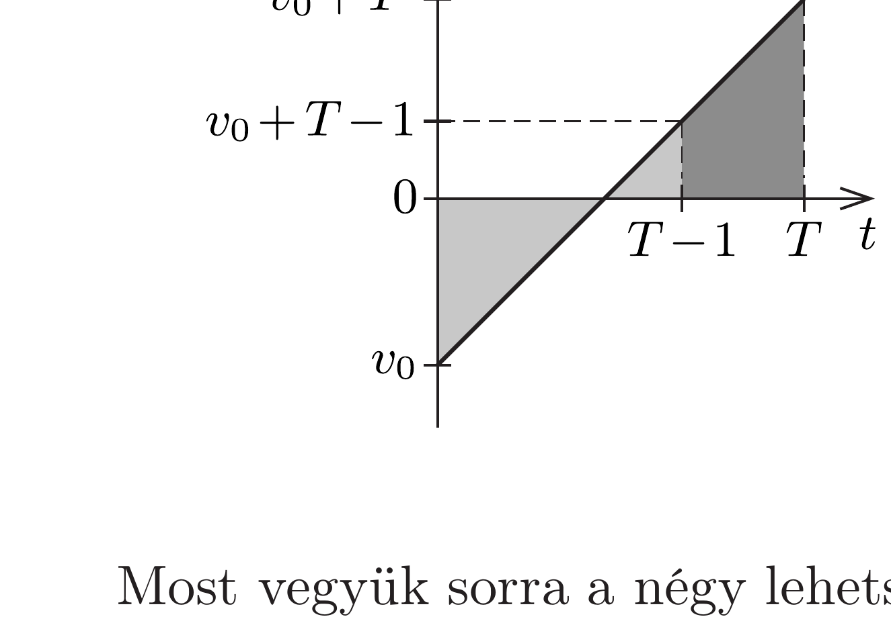
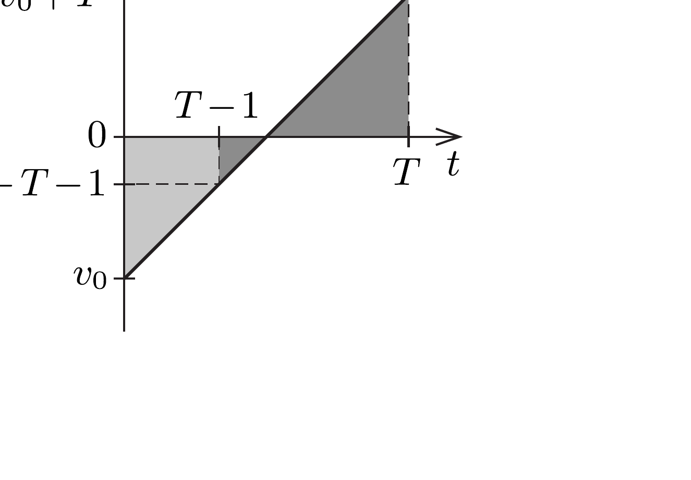

## Útmutatás

A kiskocsit elindíthatjuk a lejtőn lefelé vagy felfelé, az utóbbi eset háromféleképp is megvalósulhat. Lehetséges, hogy a kiskocsi mindvégig felfelé mozog, de az is, hogy útközben mozgásiránya megfordul, majd még legalább egy másodpercig lefelé mozog, esetleg az, hogy a kiskocsi sebessége a mozgás utolsó másodpercében csökken nullára, és indul el a kocsi lefelé.

A feladat megoldása nem függ a lejtő hajlásszögétől, vagyis a kiskocsi gyorsulásától, a gyorsulás nagysága tehát tetszőlegesen, akár (a számolás megkönnyítése érdekében) egységnyinek is választható.

## Megoldás

A kiskocsi gyorsulása a mozgás során a lejtő $\alpha$ hajlásszögétől függő állandó, $a=g \sin \alpha$. Ha valamekkora nagyságú gyorsulás mellett teljesül a feladat időtartamokra vonatkozó feltétele, akkor a pillanatnyi sebességeket egy $k$ számmal megszorozva továbbra is igaz marad az időarányokra vonatkozó feltétel; ebben az esetben azonban a gyorsulás nagysága a korábbi érték $k$-szorosa lesz. Mivel $k$ tetszőleges, a végeredmény nem függhet az $a$ gyorsulás nagyságától, az tehát akár $1 \mathrm{~m} / \mathrm{s}^{2}$-nek is választható. A számolás egyszerúsítése érdekében a továbbiakban ezzel a választással élünk, mindenhol SI mértékegységeket használunk, és azokat nem írjuk ki.

Válasszuk a lejtőn lefelé mutató irányt pozitívnak, és ábrázoljuk a kiskocsi sebességét az idő függvényében! Jelöljük a mozgás teljes idejét $T$-vel, a test kezdósebességét pedig $v_{0}$-lal; a gyorsulás értéke mindvégig $a=+1$. A leírt mozgás többféleképpen is megvalósulhat:
- $a)$ a kiskocsit a lejtőn lefelé lökjük meg;
- b) a kiskocsit a lejtőn felfelé lökjük meg, és az végig felfelé mozog;
- $c$ ) a felfelé meglökött kiskocsi megáll, majd még legalább 1 másodpercig mozog;
- d) a felfelé indított kiskocsi sebessége a mozgás utolsó másodpercében csökken nullára és vált előjelet.

A felsorolt négy esetben a sebesség az idő függvényében az 1. ábrán látható grafikonokkal szemléltethető. Az időtartamokra és utakra vonatkozó feltétel akkor teljesül, ha egy-egy ábrán a világosan és a sötéten jelölt terület nagysága megegyezik. Ez a feltétel kapcsolatot teremt $T$ és $v_{0}$ között, amiből leolvasható $T$ lehetséges legnagyobb értéke.

1. ábra

Most vegyük sorra a négy lehetséges esetet!
a) Ha a kiskocsit a lejtőn lefelé lökjük meg $\left(v_{0} \geq 0\right)$, a görbe alatti területek egyenlősége így írható fel:
\[
\left(v_{0}+\frac{T-1}{2}\right)(T-1)=v_{0}+T-\frac{1}{2},
\]
ahonnan a kezdősebesség kifejezhető $T$ segítségével:
\[
v_{0}=\frac{2-(T-2)^{2}}{2(T-2)} .
\]
A mozgás legalább egy másodpercig tart $(T>1)$, a kezdősebesség pedig pozitív $\left(v_{0} \geq 0\right)$. Ebből a két feltételből (1) felhasználásával kapjuk, hogy
\[
2<T \leq 2+\sqrt{2} \approx 3,41 .
\]
Ebben az esetben a leghosszabb mozgás $v_{0}=0$-nak felel meg, ekkor $T_{\text {max }}^{a}=3,41 \mathrm{~s}$.
b) Ha a kiskocsit a lejtőn felfelé lökjük meg, és az végig felfelé mozog, a képletek ugyanazok, mint az $a$ ) esetben:
\[
v_{0}=\frac{2-(T-2)^{2}}{2(T-2)},
\]
de most a feltétel $v_{0}+T \leq 0$, ami akkor teljesül, ha
\[
\sqrt{2} \leq T<2 .
\]
A mozgás idejének felső határát ( $T_{\text {max }}^{b}=2,0$ s-ot) akkor közelíthetjük meg, ha a kezdősebesség abszolút értéke nagyon nagy (tart a végtelenhez).
c) Ha a felfelé meglökött kiskocsi a mozgás utolsó másodpercében végig lefelé mozog, a megtett utak egyenlóségét kifejezó egyenlet:
\[
\frac{v_{0}^{2}}{2}+\frac{\left(v_{0}+T-1\right)^{2}}{2}=\frac{\left(v_{0}+T\right)^{2}}{2}-\frac{\left(v_{0}+T-1\right)^{2}}{2},
\]
ahonnan algebrai átalakítások után kapjuk, hogy
\[
v_{0}=\frac{2-T \pm \sqrt{T(4-T)}}{2} .
\]
A négyzetgyökjel miatt teljesülnie kell a $T \leq 4$ feltételnek, és a $T_{\text {max }}^{c}=4,0 \mathrm{~s}$ időhöz tartozó határeset $v_{0}=-1$ kezdősebesség esetén valósulhat meg. (Vegyük észre, hogy a $T=2,0 \mathrm{~s}$ időtartamhoz szintén a $v_{0}=-1$ kezdősebesség tartozik.)
d) Ha a felfelé meglökött kiskocsi a mozgás utolsó másodpercének kezdetekor még felfelé, a végén pedig már lefelé mozog:
\[
\frac{v_{0}^{2}}{2}-\frac{\left(v_{0}+T-1\right)^{2}}{2}=\frac{\left(v_{0}+T\right)^{2}}{2}+\frac{\left(v_{0}+T-1\right)^{2}}{2},
\]
ahonnan
\[
v_{0}=\frac{2-3 T \pm \sqrt{T(3 T-4)}}{2},
\]
továbbá teljesülnie kell még a $0 \leq v_{0}+T \leq 1$ feltételnek is. Ebből $4 / 3 \leq T \leq 2$ következik, vagyis $T_{\text {max }}^{d}=2,0 \mathrm{~s}$. A $T=2$ határesethez $v_{0}=-1$ kezdősebesség tartozik. Ebben a mozgásformában a test 1 másodpercig mozog felfelé, majd ugyanennyi ideig lefelé.

Összefoglalás. A fenti részletes elemzés azt mutatja, hogy a feltételeket kielégító leghosszabb mozgás legfeljebb $T_{\text {max }}=4,0 \mathrm{~s}$ ideig tarthat (ez a $c$ ) esetben valósulhat meg). Ehhez a kiskocsit úgy kell meglöknünk a lejtőn felfelé, hogy éppen 1 másodperc múlva álljon meg, miközben valamekkora $L$ utat tesz meg. Ezután a kiskocsi egyenletesen gyorsulva lefelé mozog tovább. A második másodpercben ugyancsak $L$ utat tesz meg, tehát $T=2,0 \mathrm{~s}$ idó eltelte után már teljesülnek a feladat feltételei, azonban a kiskocsi tovább mozogva a harmadik
másodpercben $3 L$, a negyedikben pedig $5 L$ utat tesz meg. (Már Galilei is megfigyelte, hogy a lejtőn mozgó testek egymás utáni azonos időközökben megtett útjainak aránya az egymást követő páratlan számok arányával egyezik meg.) Mivel $\frac{1}{2}(L+L+3 L+5 L)=5 L$, a feladatban leírt feltétel a negyedik másodperc végén is teljesül, de ennél hosszabb idejú mozgással már nem valósítható meg.

A 2. ábra mutatja a kezdősebesség és a mozgás ideje közötti meglehetősen összetett, az (1)-(3) egyenletek által leírt hiperbola- és ellipszisívekből összetehető kapcsolatot a különböző mozgásokra. Látható, hogy $v_{0}$ nem határozza meg egyértelmúen a mozgás teljes idejét, és általában $T$-hez sem rendelhetó egyértelmú kezdősebesség. Az is leolvasható a grafikonról és a számolásokból, hogy a mozgás teljes ideje nemcsak felülről, hanem alulról is korlátos: $T$ nem lehet kisebb, mint $T_{\min }=4 / 3$ másodperc (ez a $d$ ) esetben érhető el).

