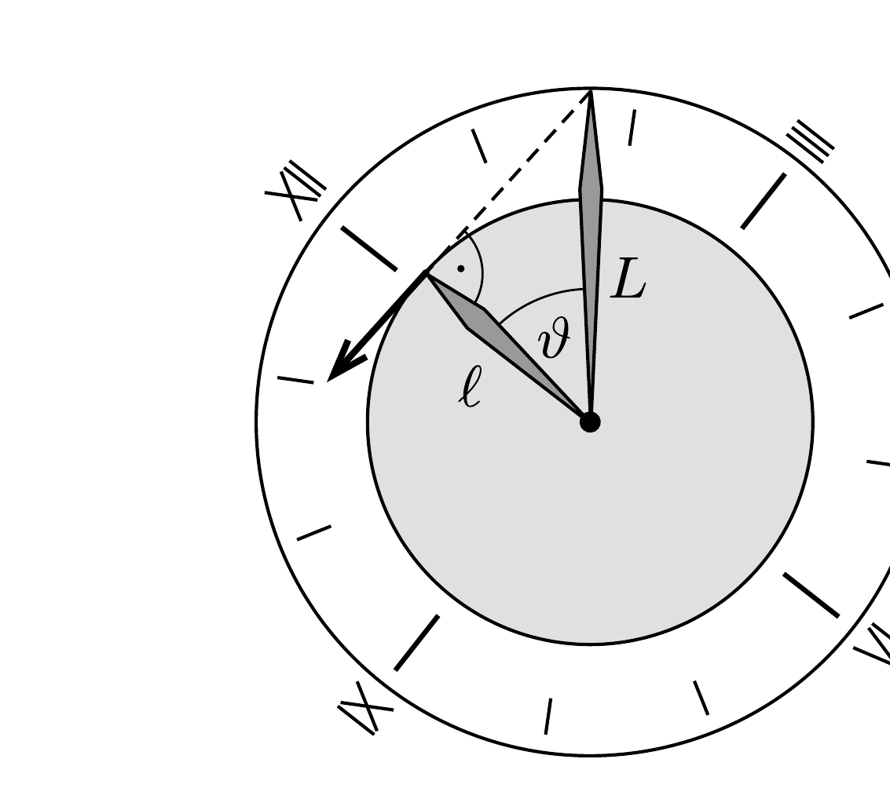
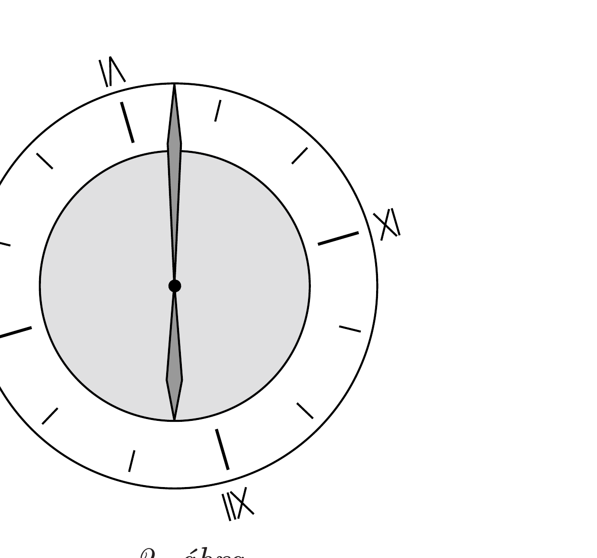

## Útmutatás

A feladat elemi úton is megoldható, ha „beleülünk” a nagymutatóval együtt forgó koordináta-rendszerbe.

## Megoldás

A nagymutatóval együtt forgó vonatkoztatási rendszerben a nagymutató áll, a kismutató pedig „az óramutató járásával ellentétes irányban” forog $11 \omega$ szögsebességgel, ahol $\omega=2 \pi /(12$ óra). Ebben a rendszerben a mutatók végpontjainak távolodási (közeledési) sebessége akkor a legnagyobb, ha a kismutató végpontjának sebességvektora a két végpontot összekötő egyenesre esik, vagyis utóbbi a kismutató végpontja által leírt kör érintője (1. ábra). A két végpont közötti távolság akkor változik a leglassabban, amikor éppen nem változik, azaz a kismutató végpontjának sebessége merőleges a végpontokat összekötő egyenesre.

Foglalkozzunk először azzal az esettel, amikor a mutatók végpontjainak távolsága a leggyorsabban változik. Az 1. ábráról leolvasható, hogy ekkor a két mutató által bezárt $\vartheta=11 \omega t$ szögre $\cos \vartheta=\ell / L=2 / 3$ (itt $t$ az éjfél óta eltelt idő, $\ell$ és $L$ pedig rendre a kis- és nagymutatók hossza). Innen $t=526 \mathrm{~s}$, azaz éjfél után leghamarabb 00:08:46-kor nó leggyorsabban a távolság. A másik megfelelő geometriai helyzetben (amikor a távolság a leggyorsabban csökken) $\cos (2 \pi-11 \omega t)=2 / 3$, amiből $t=3402 \mathrm{~s}$, ez 00:56:41 időpontnak felel meg.

A mutatók végpontjainak távolodási sebessége pont éjfélkor a leglassabb, illetve éjél után abban a $t$ időpontban, amelyre $11 \omega t=\pi$, azaz $t=1964 \mathrm{~s}$. Ez a pillanat 00:32:44-kor következik be (2. ábra).

Megjegyzés. A feladat „nyers erővel” (szélsőértékszámítással) is megoldható. A mutatók végpontjai távolságának idő szerinti differenciálhányadosa a változás sebessége, ennek minimumát és maximumát kell megkeresni.
