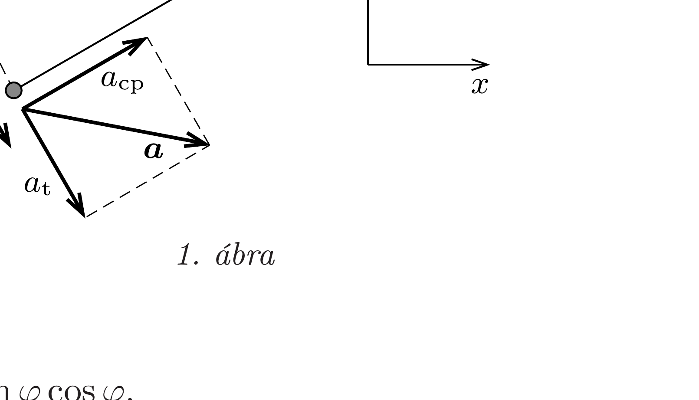
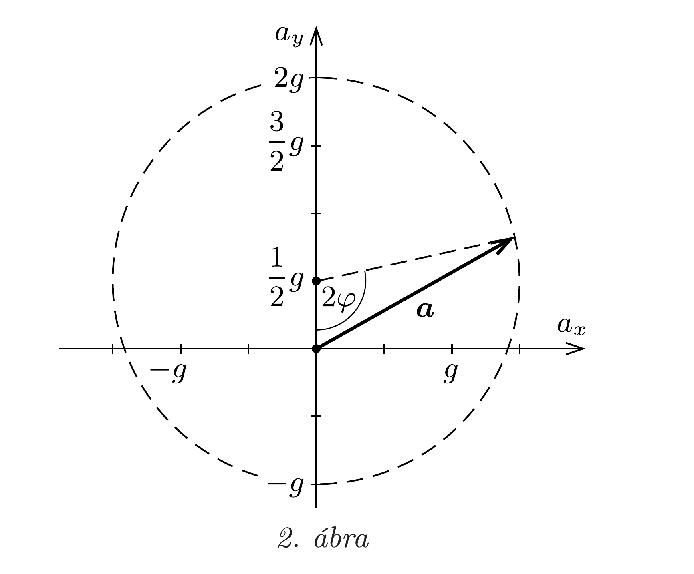

## Útmutatás

Számítsuk ki az inga gyorsulásának függőleges és vízszintes komponensét!

## Megoldás

Az inga helyzetét jellemezhetjük az indulási (vízszintes) helyzettől mért $\varphi$ szögelfordulással. A tangenciális gyorsulást a nehézségi eró érintőirányú komponense okozza:
\[
a_{\mathrm{t}}=g \cos \varphi .
\]
Az ingatest sebessége a mechanikai energiamegmaradás törvényéből számolható:
\[
v=\sqrt{2 g \ell \sin \varphi},
\]
a centripetális gyorsulás tehát
\[
a_{\mathrm{cp}}=\frac{v^{2}}{\ell}=2 g \sin \varphi .
\]
Az ingatest gyorsulásának vízszintes és füg-

gőleges komponense (lásd az 1. ábrát):
\[
\begin{aligned}
& a_{x}=a_{\mathrm{cp}} \cos \varphi+a_{\mathrm{t}} \sin \varphi=3 g \sin \varphi \cos \varphi, \\
& a_{y}=a_{\mathrm{cp}} \sin \varphi-a_{\mathrm{t}} \cos \varphi=2 g \sin ^{2} \varphi-g \cos ^{2} \varphi .
\end{aligned}
\]
Trigonometrikus azonosságok felhasználásával a kapott kifejezéseket tovább alakíthatjuk:
\[
a_{x}=\frac{3}{2} g \sin (2 \varphi), \quad a_{y}=\frac{1}{2} g-\frac{3}{2} g \cos (2 \varphi) .
\]

Ez pedig egy kör paraméteres egyenlete, amiből a kanonikus egyenletet is felírhatjuk:
\[
a_{x}^{2}+\left(a_{y}-\frac{1}{2} g\right)^{2}=\left(\frac{3}{2} g\right)^{2} .
\]
Az ingatest $\boldsymbol{a}$ gyorsulásvektorának végpontja tehát egy ( $0, g / 2$ ) középpontú, $3 g / 2$ sugarú körön söpör végig (2. ábra).

