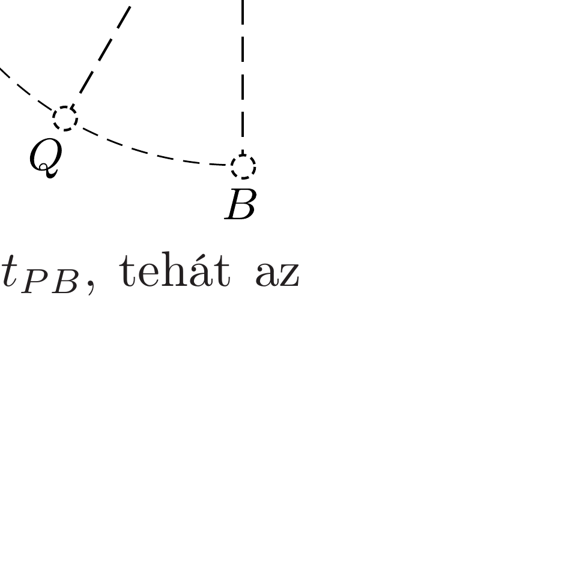

## Útmutatás

A két mozgásszakasz időtartamát pontosan meghatározni nagyon nehéz feladat. Ehelyett próbáljuk meg az $A P$ szakasz megtételéhez szükséges időt alulbecsülni, a $P B$ szakasz megtételéhez szükséges időt pedig felülbecsülni!

## Megoldás

Jelölje az inga hosszát $\ell$. Az $A P$ szakasz megtételéhez szükséges idő biztosan nagyobb, mintha az ingatest az $A$ és $P$ pontok magasságkülönbségének megfeleló utat szabadeséssel tette volna meg:
\[
t_{A P}>\sqrt{\frac{2 \ell \sin 30^{\circ}}{g}}=\sqrt{\frac{\ell}{g}},
\]
hiszen az ingatest függőleges irányú gyorsulása ezen a szakaszon legfeljebb $g$.
A $P B$ szakaszt bontsuk két részre a pálya másik, $Q$ harmadolópontjával! A $P$ és $Q$ pontokban az ingatest sebessége az energiamegmaradásból számítható:
\[
v_{P}=\sqrt{2 g \ell \sin 30^{\circ}}=\sqrt{g \ell}, \quad \text { illetve } \quad v_{Q}=\sqrt{2 g \ell \sin 60^{\circ}}=\sqrt{\sqrt{3} g \ell} .
\]

Az $\ell \pi / 6$ hosszúságú $P Q$ és $Q B$ szakaszokat az ingatest biztosan rövidebb idő alatt teszi meg, mintha az előbbi szakaszon végig $v_{P}$, az utóbbin pedig végig $v_{Q}$ sebességgel mozgott volna, azaz
\[
t_{P B}<\frac{\ell \pi}{6 v_{P}}+\frac{\ell \pi}{6 v_{Q}} \approx 0,92 \sqrt{\frac{\ell}{g}} .
\]

Az (1) és (2) egyenlőtlenségeket összevetve látható, hogy $t_{A P}>t_{P B}$, tehát az inga a $P B$ szakaszt teszi meg rövidebb idő alatt.
