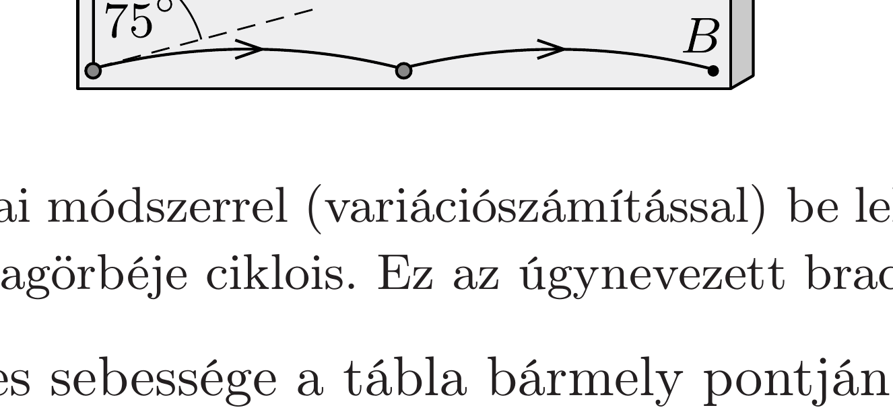

## Útmutatás

Keressünk olyan - matematikailag jól kezelhető, egyszerú - mozgást, amely során a golyó a mozgás elsó szakaszában minél nagyobb sebességre tesz szert, és az ebből adódó időnyereség fedezi a hosszabb út megtételéből adódó időveszteséget.

## Megoldás

a) Tételezzük fel, hogy a golyó függőlegesen szabadon esik 1 métert, majd a rajztábla alsó szélén lévő, súrún elhelyezkedő szögsoron végigpattogva, lényegében vízszintesen haladva jut el a $B$ pontig. A függőleges esés ideje $t_{1}=$ 0,45 s, ezalatt a golyó 4,4 m/s sebességre gyorsul fel, és a hátralevő 2 méteres utat $t_{2}=0,45 \mathrm{~s}$ alatt teszi meg. Mivel a golyó az $A B$ egyenesen csúszva $t_{3}=1,0 \mathrm{~s}>$ $t_{1}+t_{2}$ idő alatt jutott volna a $B$ pontba, ezért az első kérdésre a válasz: nem a legrövidebb úton jut el a golyó leggyorsabban a célba.

Megjegyzések. 1. Érdekesség, hogy mindössze két szög segítségével is elérhetjük, hogy a golyó előbb jusson el a $B$ pontba, mintha az $A B$ szakaszon csúszott volna: az egyik szöget a bal alsó sarokba, a másikat pedig a tábla alsó szélének közepére kell beütni (lásd az ábrát). A szögek pozícióját finoman úgy kell beállítani, hogy az egyes pattogások után a golyó sebességvektora a vízszintessel 15°-os szöget zárjon be. A mozgás teljes ideje ekkor $0,45 \mathrm{~s}+0,47 \mathrm{~s}=0,92$ s-nak adódik.

2. Felsőbb matematikai módszerrel (variációszámítással) be lehet látni, hogy a legrövidebb idejú mozgás pályagörbéje ciklois. Ez az úgynevezett brachisztochron-probléma.
b) A golyó függőleges sebessége a tábla bármely pontján legfeljebb akkora lehet, mint amekkora sebességgel rendelkezik egy, az $A$ pontból kezdősebesség nélkül elejtett és szabadon eső test ugyanekkora magasságban. (Mindkét test mozgási
energiáját és ezen keresztül a sebességét a függőleges elmozdulás nagysága határozza meg.) A pattogó golyó tehát nem érheti el hamarabb a rajztábla alját, mint amennyi idó alatt $\left(t_{1}=0,45 \mathrm{~s}\right)$ a szabadon esó test. A feladat kérdésére a válasz tehát: nem.
