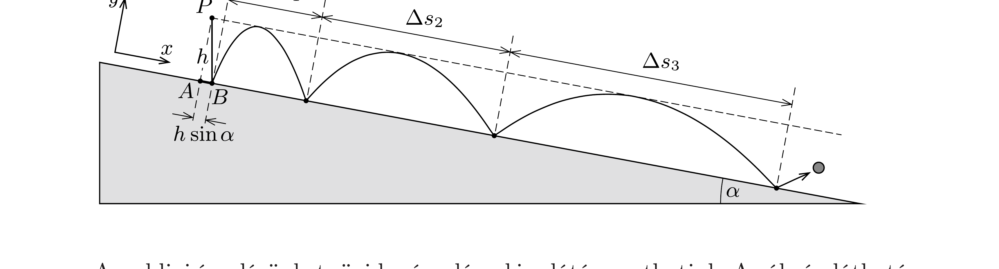

## Útmutatás

Írjuk le a labda mozgását a lejtőre merőleges, illetve a lejtővel párhuzamos elmozdulás- és gyorsuláskomponensek segítségével!

## Megoldás

Az ábrán látható, a lejtő hajlásához „illeszkedő” koordináta-rendszerból nézve a labda pattogását úgy látjuk, mintha egy vízszintes síkon $g^{\prime}=g \cos \alpha$ nehézségi gyorsulású térben pattogna egy labda, melyre a nehézségi erón kívül még egy állandó ( $m g \sin \alpha$ nagyságú) „vízszintes" eró is hat. Az $y$ irányú mozgás azonos magasságú, tehát azonos periódusidejú pattogásokból áll. Eközben a labda $x$ irányban egyenletesen gyorsul, a visszapattanások közti átlagsebesség egyenletesen növekszik, a pattanási helyek közötti távolságok tehát számtani sorozatot alkotnak.

Az eddigi érvelésünket rövid számolással is alátámaszthatjuk. Az ábrán látható $P$ pontból ( $h$ magasságból) elengedett labda $\Delta t$ idő alatt éri el a lejtőt, és ezalatt $h \sin \alpha$ távolságot tesz meg a „lejtő mentén" (az ábrán ez az $A B$ szakasz). Ezt követően minden egymás utáni pattanás időtartama $2 \Delta t$, vagyis az elengedés után a pattanások a $\Delta t, 3 \Delta t, 5 \Delta t, 7 \Delta t, \ldots$ időpillanatokban következnek be.

A labda lejtő menti gyorsulása mindvégig állandó $(g \sin \alpha)$, tehát az egymást követő pattanások közötti távolság a szomszédos páratlan számok négyzetének különbségével arányos: $(2 k+1)^{2}-(2 k-1)^{2}=8 k$.

A fentiekből az következik, hogy a feladatban kérdezett pattanások közötti távolság $\Delta s_{k}=8 k h \sin \alpha$, vagyis az $A B$ szakasz hosszának 8-szorosa, 16-szorosa, és így tovább. Érdekes, hogy ha $h$ értékét állandónak tartjuk, azonban a lejtő hajlásszögét 90°-hoz közelítjük, akkor a pattanások közötti távolságok $8 k h$-hoz tartanak.
