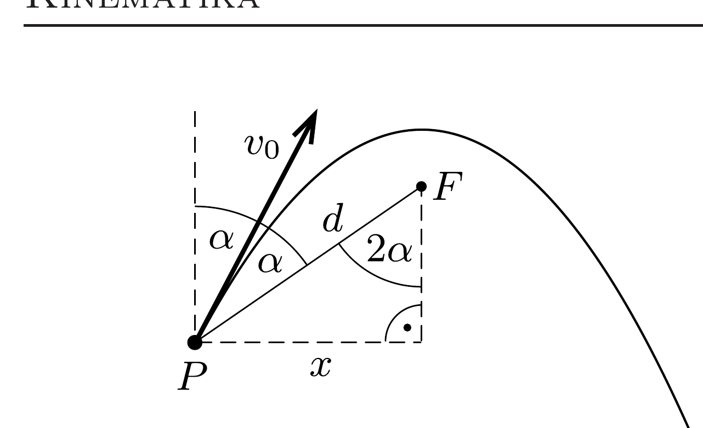
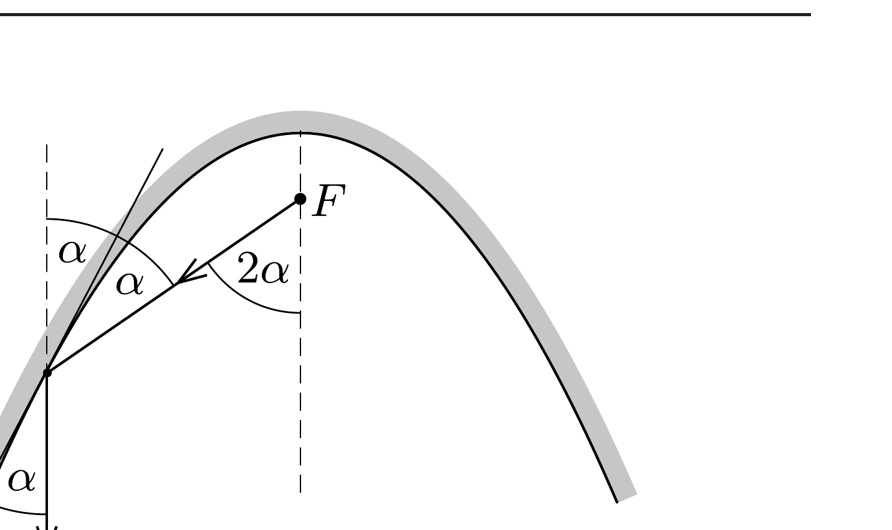

## Útmutatás

Használjuk fel, hogy a parabola adott $P$ pontbeli érintője feleakkora szöget zár be a parabola szimmetriatengelyével, mint a $P$ pontot a fókuszponttal összekötó szakasz.

## Megoldás

A parabola függőleges szimmetriatengelyén rajta van az $F$ fókuszpont. Legyen $d$ az eldobás $P$ pontjának távolsága $F$-től, a hajítás szöge pedig a függőlegeshez viszonyítva $\alpha$. Ekkor a $P F$ szakasz és az eldobás iránya közötti szög is éppen $\alpha$, ami könnyen belátható annak a ténynek a felhasználásával, hogy egy parabolatükör a fókuszpontból kiinduló sugarakat a tengellyel párhuzamosan veri vissza (lásd az ábra jobb oldali részét).

A test az eldobás után $t=\left(v_{0} \cos \alpha\right) / g$ idővel éri el pályájának legmagasabb pontját, ezalatt a vízszintes elmozdulása
\[
x=v_{0} t \sin \alpha=\frac{v_{0}^{2}}{2 g} \sin (2 \alpha) .
\]
A bal oldali ábrán látható derékszögú háromszögből leolvasható a fókuszpont távolsága az eldobás helyétől:
\[
d=\frac{x}{\sin (2 \alpha)}=\frac{v_{0}^{2}}{2 g} .
\]
Érdekes, hogy az eredmény független az eldobás szögétől. A bal oldali ábrán az is látszik, hogy $2 \alpha=90^{\circ}$, azaz 45°-os hajítási szög esetén lesz a fókuszpont az eldobás helyével azonos magasságban.

Megjegyzés. A gondolatmenetet tovább folytatva kitalálhatjuk a vezéregyenes elhelyezkedését is. Mivel a pálya szimmetriatengelye függőleges, ezért a vezéregyenesnek vízszintesnek kell lennie. A parabola ismert tulajdonsága, hogy minden pontja ugyanolyan messze van a fókuszponttól, mint a vezéregyenestől. Igaz ez az eldobás $P$ pontjára is, tehát a vezéregyenes a $P$ pont fölött, attól $d=v_{0}^{2} /(2 g)$ távolságra helyezkedik el, függetlenül a hajítási szögtől.
