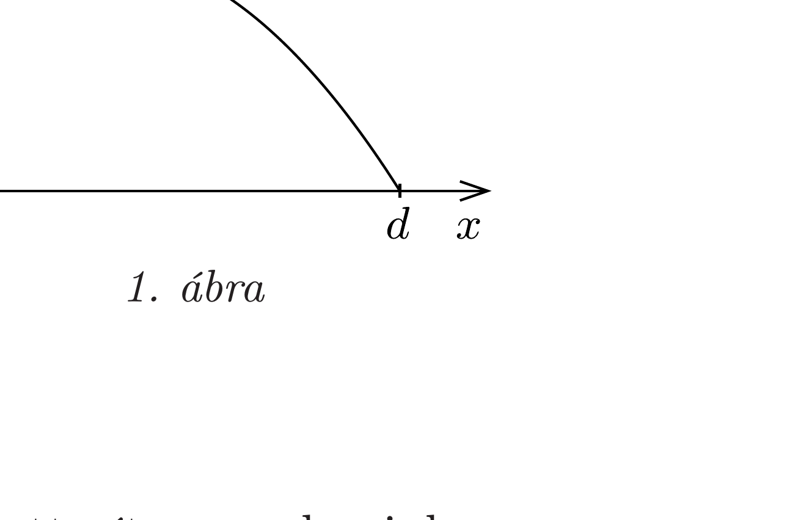
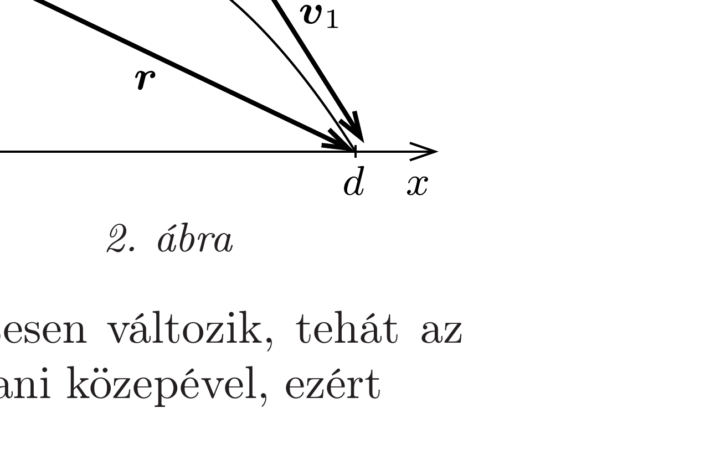
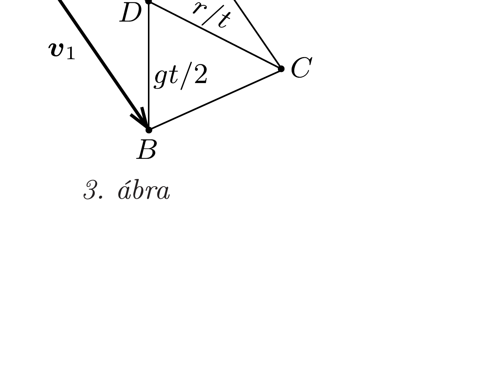
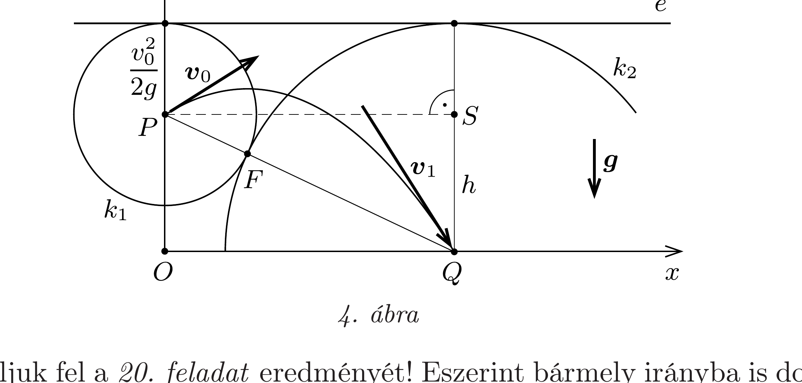

## Útmutatás

Próbáljunk differenciálszámítás helyett más módszerrel célbaérni (például egy másodfokú egyenlet valós gyökei számának vizsgálatával vagy vektoros szerkesztéssel)!

## Megoldás

I. megoldás. Írjuk le a test időbeli mozgását, vagyis a ferde hajítás folyamatát az 1. ábrán látható derékszögü koordináta-rendszerben!

A vízszintes ( $x$ irányú) mozgás egyenletes:
\[
x(t)=v_{0} \cos \alpha \cdot t,
\]
ahol $\alpha$ az elhajítás irányának a vízszintessel bezárt szöge. A függőleges, egyenletesen gyorsuló mozgást leíró összefüggés:

\[
y(t)=-\frac{g}{2} t^{2}+v_{0} \sin \alpha \cdot t+h .
\]
Az (1) egyenletből az időt kifejezve, majd ezt (2)-be helyettesítve megkapjuk a pályagörbe egyenletét:
\[
y=-\frac{g}{2 v_{0}^{2} \cos ^{2} \alpha} x^{2}+x \operatorname{tg} \alpha+h .
\]

A hajítás vízszintes távolságát, $d$-t úgy kapjuk meg, hogy a fenti egyenletben $y$ helyébe 0-t írunk (hiszen a földet érésre ez jellemző̌), és a hozzá tartozó $x$ éppen a szóban forgó $d$ lesz. Az egyenletek egyszerúsítése miatt érdemes a kezdősebességet $v_{0}=\sqrt{2 g H}$ alakban írni, ahol $H$ egy hosszúság dimenziójú állandó. ( $H$ szemléletes jelentése: ilyen magasról leejtett test éppen a feladatban szereplő $v_{0}$ sebességgel érne földet.) Így végül a következő egyenletre jutunk:
\[
0=-\frac{d^{2}}{4 H \cos ^{2} \alpha}+d \operatorname{tg} \alpha+h
\]
Használjuk fel az $1 / \cos ^{2} \alpha=1+\operatorname{tg}^{2} \alpha$ trigonometrikus azonosságot! Ekkor az $u=\operatorname{tg} \alpha$ jelöléssel a következőt kapjuk:
\[
\left(1+u^{2}\right) d^{2}-4 u H d-4 h H=0 .
\]
Ez az egyenlet nemcsak $d$-re nézve másodfokú, hanem (adott $d$ esetén) az $u$ változóra nézve is:
\[
u^{2} \cdot d^{2}-u \cdot 4 d H+\left(d^{2}-4 h H\right)=0,
\]
amelynek akkor van valós megoldása (azaz adott $d$ távolsághoz akkor találunk megfelelő hajítási szöget), ha a diszkriminánsa nemnegatív, azaz
\[
(2 d H)^{2}-d^{2}\left(d^{2}-4 h H\right) \geq 0 .
\]
Innen
\[
d \leq 2 \sqrt{H^{2}+h H}
\]
adódik, és a határeset (az egyenlőség) éppen a legnagyobb hajítási távolságnak felel meg. Felhasználva, hogy $H=v_{0}^{2} /(2 g)$, a végeredmény így is írható:
\[
d_{\max }=\frac{v_{0}}{g} \sqrt{v_{0}^{2}+2 g h} .
\]
II. megoldás. Jelöljük a kezdősebesség vektorát $\boldsymbol{v}_{0}$-lal, a földet érés sebességét $\boldsymbol{v}_{1}$-gyel, a teljes mozgáshoz tartozó elmozdulásvektort $\boldsymbol{r}$-rel, a nehézségi gyorsulást (mint vektort) pedig $\boldsymbol{g}$-vel (2. ábra).

Az elhajított test gyorsulása állandó, ezért
\[
\frac{\boldsymbol{v}_{1}-\boldsymbol{v}_{0}}{t}=\boldsymbol{g},
\]

ahol $t$ a mozgás időtartama. A sebesség időben egyenletesen változik, tehát az átlagsebesség megegyezik a kezdeti- és végsebesség számtani közepével, ezért
\[
\frac{\boldsymbol{v}_{1}+\boldsymbol{v}_{0}}{2} \cdot t=\boldsymbol{r} .
\]

Szorozzuk össze a (3) és (4) vektoregyenleteket skaláris szorzással:
\[
\frac{v_{1}^{2}-v_{0}^{2}}{2}=\boldsymbol{g} \boldsymbol{r}=g h,
\]
azaz a földet érés sebességének nagysága
\[
v_{1}=\sqrt{v_{0}^{2}+2 g h} .
\]
Ez az összefüggés nem váratlan, hiszen az energiamegmaradás törvényéből ezt már korábban is tudtuk. Meglepő eredményt kapunk azonban akkor, ha a (3) és (4) egyenleteket vektoriális szorzással szorozzuk össze. Felhasználva a vektoriális szorzat $\boldsymbol{v}_{0} \times \boldsymbol{v}_{1}=-\boldsymbol{v}_{1} \times \boldsymbol{v}_{0}$, továbbá $\boldsymbol{v}_{0} \times \boldsymbol{v}_{0}=\boldsymbol{v}_{1} \times \boldsymbol{v}_{1}=0$ tulajdonságait azt kapjuk, hogy
\[
\boldsymbol{v}_{1} \times \boldsymbol{v}_{0}=\boldsymbol{g} \times \boldsymbol{r} .
\]
Képezzük a fenti egyenlet mindkét oldalának abszolút értékét:
\[
\left|\boldsymbol{v}_{1} \times \boldsymbol{v}_{0}\right|=\left|\boldsymbol{v}_{0}\right| \cdot\left|\boldsymbol{v}_{1}\right| \sin \gamma=v_{0} \sqrt{v_{0}^{2}+2 g h} \cdot \sin \gamma=|\boldsymbol{g} \times \boldsymbol{r}|=g \cdot d,
\]
ahol $\gamma$ a kezdeti és a becsapódási sebesség iránya által bezárt szög. (Felhasználtuk, hogy $\boldsymbol{g}$ és $\boldsymbol{r}$ vektoriális szorzásánál $\boldsymbol{r}$-nek csak a vízszintes komponense számít, ennek hossza pedig éppen a keresett vízszintes elmozdulás.)

Az (5) egyenletből leolvasható, hogy $d$ akkor a legnagyobb, amikor a $\boldsymbol{v}_{0}$ és a $\boldsymbol{v}_{1}$ vektorok merőlegesek egymásra, és a legnagyobb hajítási távolság
\[
d_{\max }=\frac{v_{0}}{g} \sqrt{v_{0}^{2}+2 g h},
\]
összhangban az I. megoldás eredményével.
Ha a kezdősebesség vízszintessel bezárt szögét a korábbiaknak megfelelően $\alpha$ val jelöljük, akkor a sebesség vízszintes komponensének állandóságából, valamint a kezdő- és végsebesség merőlegességéből $v_{0} \cos \alpha=v_{1} \cos \left(90^{\circ}-\alpha\right)=v_{1} \sin \alpha$, azaz
\[
\operatorname{tg} \alpha=\frac{v_{0}}{v_{1}}=\frac{v_{0}}{\sqrt{v_{0}^{2}+2 g h}}
\]
adódik.
III. megoldás. Kövessük a II. megoldás gondolatmenetének elejét, írjuk fel a (3) és (4) egyenleteket, majd tekintsük a kezdeti- és a végsebesség vektora által kifeszített $K B C A$ paralelogrammát (3. ábra)!

Számítsuk ki a paralelogramma $T$ területét kétféleképpen. Egyrészt a $T=\left|\boldsymbol{v}_{0}\right| \cdot\left|\boldsymbol{v}_{1}\right| \sin \gamma$ összefüggéssel, másrészt a
\[
T=A B \cdot K M=g t \cdot \frac{d}{t}=g d
\]

módon! Az utóbbi lépésnél felhasználtuk, hogy az $A B$ szakasz függőleges és (3) szerint $g t$ hosszúságú, valamint (4) alapján $K D$ hossza $r / t$, tehát $K D$ vízszintes vetülete $K M=d / t$. A kétféle számítás eredményét összehasonlítva kapjuk, hogy
\[
d=\frac{1}{g}\left|\boldsymbol{v}_{0}\right| \cdot\left|\boldsymbol{v}_{1}\right| \sin \gamma \leq \frac{v_{0}}{g} \sqrt{v_{0}^{2}+2 g h}=d_{\max } .
\]
Látható az is, hogy az egyenlőség akkor teljesül, amikor a kezdeti- és a végsebesség merőleges egymásra, továbbá az elhajítás $\alpha$ szögére ilyenkor (a $K M A$ és $B K A$ derékszögü háromszögek hasonlósága miatt) fennáll:
\[
\operatorname{tg} \alpha=\frac{A M}{K M}=\frac{A K}{K B}=\frac{v_{0}}{v_{1}}=\frac{v_{0}}{\sqrt{v_{0}^{2}+2 g h}} .
\]
IV. megoldás. Jelöljük a test indulási pontját $P$-vel, a becsapódási pontot $Q$-val, a torony talppontját (és egyben a 4. ábrán látható koordináta-rendszer origóját) $O$-val. A $P O$ szakasz éppen a torony magassága, ezért hossza $h$.

Használjuk fel a 20. feladat eredményét! Eszerint bármely irányba is dobjuk el a testet $v_{0}$ kezdősebességgel, az általa befutott parabolapálya $F$ fókuszpontjának rajta kell lennie a $P$ középpontú, $v_{0}^{2} /(2 g)$ sugarú $k_{1}$ körön. Ennek értelmében
\[
P F=\frac{v_{0}^{2}}{2 g} .
\]
A parabola $e$ vezéregyenese vízszintes, és ugyanolyan távol helyezkedik el a $P$ ponttól, mint a fókuszpont, tehát szükségképpen érinti a $k_{1}$ kört. (A vezéregyenes helyzete tehát rögzített $v_{0}$ esetén független a hajítás szögétól.) A $Q$ becsapódási pont rajta van a parabolán, ezért ugyanolyan távolságra helyezkedik el a vezéregyenestől, mint az $F$ fókuszponttól, azaz
\[
F Q=h+\frac{v_{0}^{2}}{2 g} .
\]
A fentiekből az is következik, hogy a $Q$ középpontú, $F Q$ sugarú $k_{2}$ kör érinti az $e$ egyenest.

Általában a $k_{1}$ és $k_{2}$ köröknek két metszéspontja van: ezek két olyan parabolapálya fókuszpontjai, melyek becsapódási pontja egybeesik. Ebben az esetben a $P Q$ távolság kisebb, mint a $P F$ és $F Q$ távolságok összege. Ha azonban a kezdősebesség iránya éppen megfelelő, akkor a metszéspontok egybeesnek, vagyis a két kör (a parabola fókuszpontjában) érinti egymást. Az eldobási és a becsapódási pontok távolsága (és így a hajítás távolsága is) ekkor lesz a legnagyobb, mégpedig
\[
P Q=P F+F Q=h+\frac{v_{0}^{2}}{g}
\]
A 4. ábrán látható $P Q S$ háromszögre felírt Pitagorasz-tétel segítségével ebből a hajítás lehetséges legnagyobb távolsága már kiszámítható:
\[
d_{\max }=\sqrt{P Q^{2}-h^{2}}=\frac{v_{0}}{g} \sqrt{v_{0}^{2}+2 g h},
\]
összhangban korábbi eredményeinkkel.
Megjegyzés. Valamennyi eredményünk érvényben marad akkor is, ha $h<0$ (de természetesen $v_{0}^{2}>2 g|h|$ ). Ilyenkor a feladat egyik lehetséges megfogalmazása így hangzik:
„Egy adott mélységú gödörből földet lapátolunk ki. Milyen irányban dobjuk el a kiásott földet, ha azt akarjuk elérni, hogy a lehető legnagyobb távolságban érje el a külső talajszintet, és mekkora ez a távolság? (Feltételezhetjük, hogy a föld eldobásának kezdősebessége független a dobás irányától, továbbá az eldobott föld nem ütközik a gödör falába.)"
