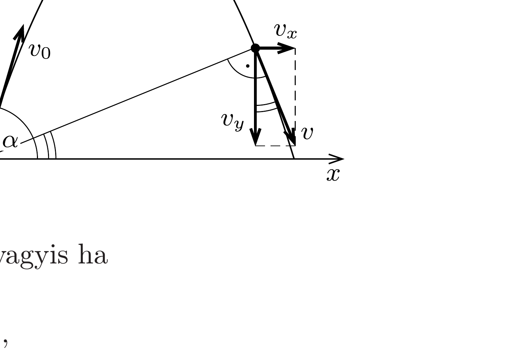

## Útmutatás

A kő addig távolodik tőlünk, amíg a sebességének a helyvektorral párhuzamos komponense nullára nem csökken. Ha ez soha nem következik be, akkor teljesül a feladat szövegében megfogalmazott feltétel.

## Megoldás

A kő elmozdulása és sebessége az ábrán látható koordináta-rendszerben a következő összefüggésekkel írható le:
\[
\begin{array}{ll}
x=v_{0} \cos \alpha \cdot t, & v_{x}=v_{0} \cos \alpha, \\
y=v_{0} \sin \alpha \cdot t-\frac{g}{2} t^{2}, & v_{y}=v_{0} \sin \alpha-g t .
\end{array}
\]

A kő akkor kerül a legtávolabb az origótól, amikor a sebessége éppen merőleges a helyvektorára. Ennek feltétele:
\[
\frac{y}{x}=-\frac{v_{x}}{v_{y}},
\]
amiből az időre egy másodfokú egyenletet kapunk:
\[
t^{2}-\frac{3 v_{0} \sin \alpha}{g} t+\frac{2 v_{0}^{2}}{g^{2}}=0 .
\]

Ha ennek az egyenletnek a diszkriminánsa negatív, vagyis ha
\[
\left(\frac{3 v_{0} \sin \alpha}{g}\right)^{2}<4\left(\frac{2 v_{0}^{2}}{g^{2}}\right),
\]
akkor a kő állandóan távolodni fog tőlünk, sosem lesz „legtávolabb”. A feltétel $\sin \alpha<\sqrt{8 / 9}$ esetén, azaz $\alpha<70,5^{\circ}$-os szögeknél teljesül.
