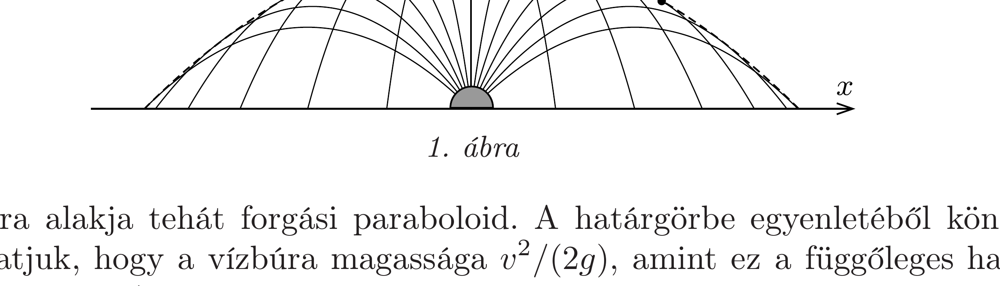
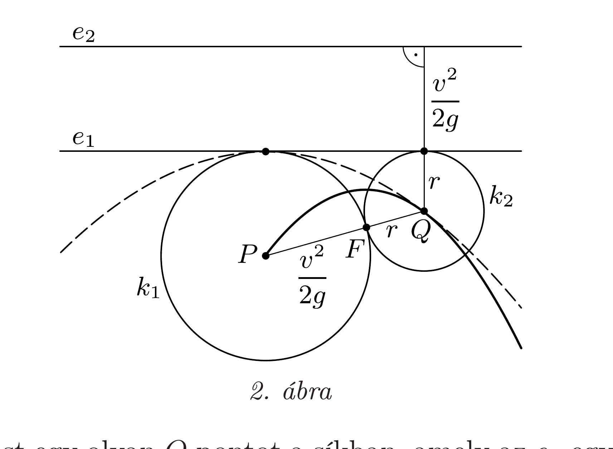

## Útmutatás

Az ugyanonnan induló, azonos kezdősebességú, parabolapályákat befutó vízsugarak közös burkolófelületét kell meghatároznunk. Vizsgáljuk meg, mi a feltétele annak, hogy egy adott térbeli ponthoz találjunk rajta áthaladó vízsugarat.

## Megoldás

I. megoldás. A vízbúra a szórófej helyén állított függőleges egyenesre nézve hengerszimmetrikus, tehát elég egy síkban, sőt egyetlen félsíkban megoldanunk a feladatot. A pontszerünek tekinthető szórófej legyen egy $x-y$ koordinátarendszer origójában, ahonnan a vízsugarak a ferde hajításnak megfelelően parabolapályákon haladnak (1. ábra). Matematikailag a feladat az, hogy ennek a parabolaseregnek a burkolóját megtaláljuk.

A vízszintessel $\alpha$ szöget bezáró irányban $v$ sebességgel induló hajítás pályaegyenlete:
\[
y=x \operatorname{tg} \alpha-\frac{g}{2 v^{2} \cos ^{2} \alpha} x^{2},
\]
amit az $u=\operatorname{tg} \alpha$ jelöléssel
\[
\frac{g x^{2}}{2 v^{2}} \cdot u^{2}-x \cdot u+\left(y+\frac{g x^{2}}{2 v^{2}}\right)=0
\]
alakban is felírhatunk.
Rögzített $(x, y)$ esetén a fenti összefüggés $u$-ra nézve másodfokú egyenlet, melynek akkor van valós megoldása, ha a diszkrimináns nem negatív:
\[
x^{2}-4 \frac{g x^{2}}{2 v^{2}}\left(y+\frac{g x^{2}}{2 v^{2}}\right) \geq 0, \quad \text { vagyis } \quad y \leq \frac{v^{2}}{2 g}-\frac{g}{2 v^{2}} x^{2} .
\]
Ez az egyenlőtlenség két tartományra osztja az $x-y$ síkot, melyeket egy parabola választ el egymástól. A parabola (térben forgásparaboloid) alatti pontokba eljuthat a víz, a parabola fölé nem, a határeset pedig éppen a keresett burkológörbének felel meg.

A vízbúra alakja tehát forgási paraboloid. A határgörbe egyenletéből könnyen leolvashatjuk, hogy a vízbúra magassága $v^{2} /(2 g)$, amint ez a függőleges hajítás alapján várható. A medence vizébe a vízbúra kört rajzol, amelynek sugarát az $y=$ 0 feltételből olvashatjuk le: $v^{2} / g$. Eszerint legalább négyszer olyan nagy átmérőjü medencére van szükség a szökőkút zavartalan múködéséhez, mint amilyen magasra emelkedik benne a víz.
II. megoldás. Vizsgálódjunk most is a vízbúra szimmetriatengelyén átmenő síkban! A 20. feladat megoldásában láttuk, hogy egy $v$ kezdősebességgel ferdén
elhajított test parabolapályájának fókuszpontja az eldobás $P$ pontjától $v^{2} /(2 g)$ távolságra van. A szórófejből kiinduló vízsugarak által kirajzolt parabolák fókuszpontjai tehát a $P$ középpontú, $v^{2} /(2 g)$ sugarú $k_{1}$ körön helyezkednek el (2. ábra). A parabolák vezéregyenesei vízszintesek, és ugyanolyan távol kell lenniük a $P$ ponttól, mint a fókuszpont, ezért az összes parabola vezéregyenese közös: ez a $k_{1}$ kört érintő $e_{1}$ egyenes.

Tekintsünk most egy olyan $Q$ pontot a síkban, amely az $e_{1}$ egyenes alatt, attól $r$ távolságra helyezkedik el! Ha van olyan vízsugár, amely eléri a $Q$ pontot, akkor pályája fókuszpontjának rajta kell lennie az $e_{1}$ egyenest érintő, $Q$ középpontú, $r$ sugarú $k_{2}$ körön. A $Q$ pontot 2, 0 vagy 1 darab vízsugár éri el rendre aszerint, hogy a $k_{1}$ és $k_{2}$ körök metszik egymást (ekkor $Q$ a vízbúra belsejében helyezkedik el), nincs közös pontjuk (ekkor $Q$ a vízburán kívülre esik) vagy érintik egymást (azaz $Q$ rajta van a burkológörbén).

Rajzoljuk fel az $e_{1}$ egyenessel párhuzamos, afölött $v^{2} /(2 g)$ távolságra elhelyezkedő $e_{2}$ egyenest! Ha a $Q$ pont rajta van a burkológörbén, akkor $Q$ ugyanolyan távolságra helyezkedik el a $P$ ponttól, mint az $e_{2}$ egyenestől. A burkológörbe pontjai tehát egy $P$ fókuszpontú, $e_{2}$ vezéregyenesú parabolán helyezkednek el: a vízbúra alakja térben forgásparaboloid, melynek fókusza éppen a szórófej helyén van.

Megjegyzés. A szökőkút vízburája akkor éri el a medence vízfelszínét, amikor az egymást érintő $k_{1}$ és $k_{2}$ körök egyforma nagyok. Ebből következik, hogy a vízbúra átmérője éppen négyszerese a magasságának, összhangban az I. megoldásban kapott eredménnyel.
