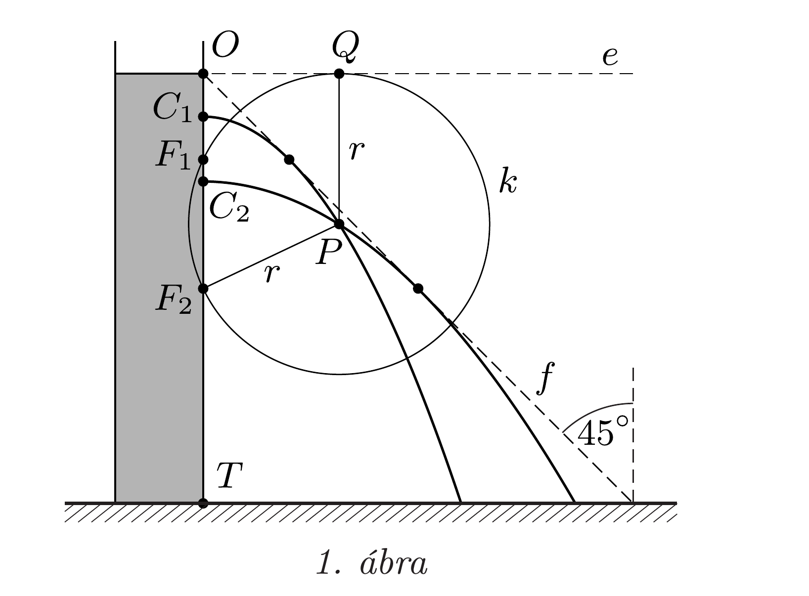
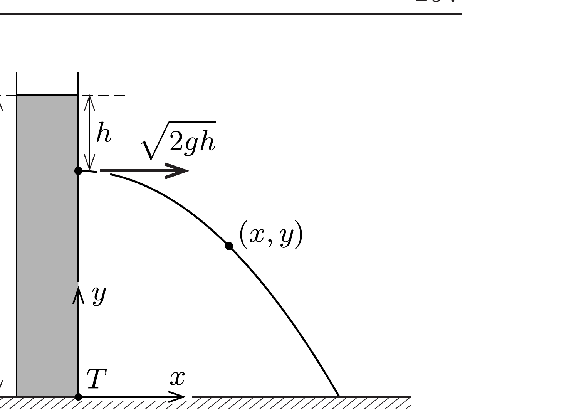

## Útmutatás

A vízsugarak alakja (a vízszintes hajítás pályagörbéjéhez hasonlóan) parabola. Határozzuk meg, hogy hol található az egyes parabolák fókuszpontja és vezéregyenese, majd használjuk fel a parabola geometriai definícióját!

A feladat koordinátageometriai módszerrel is megoldható, ha megkeressük azon pontok koordinátáit, ahová még éppen eljuthat vízsugár. Ehhez egy másodfokú egyenlet diszkriminánsát kell megvizsgálnunk.

Egy harmadik lehetséges út a megoldáshoz, ha felhasználjuk azt a közismert tényt, hogy egy vízszintes síkról adott kezdősebességgel eldobott testek közül a 45°-os szögben induló éri el legmesszebb a talajt.

## Megoldás

I. megoldás. A hengerbeli vízszint alatt $h$ távolságban lévő lyukon a víz a Torricelli-féle kiömlési törvény értelmében $v_{0}=\sqrt{2 g h}$ sebességgel lövell ki, majd (a vízszintes hajítások pályájához hasonlóan) parabolaív mentén halad.

Megjegyzés. Ez az eredmény az ideális (belső súrlódástól mentes) folyadékokra alkalmazott energiamegmaradásból adódik. Egy kicsiny $\Delta m$ tömegú vízmennyiség kifolyásakor a maradék víz helyzeti energiája éppen annyival csökken, mintha a $\Delta m$ tömeg a szabad felszíntől a kicsiny nyílásig süllyedt volna, és a helyzeti energia csökkenése fedezi a kiáramló víz mozgási energiáját. Így a kiáramlás $v_{0}$ sebessége akkora, amekkorával egy szabadon esố test $h$ távolság megtétele után rendelkezne.

A 20. feladatban láttuk, hogy egy adott pontból $v_{0}$ kezdősebességgel elhajított testek parabolapályájának fókuszpontja a hajítási ponttól $v_{0}^{2} /(2 g)$ távolságra van (függetlenül a kezdősebesség irányától). Ezt alkalmazva a hengerből $h$ mélységben kilépő vízsugárra azt az eredményt kapjuk, hogy a fókuszpont a kiömlési pont alatt $h$ távolságra található, a parabola $e$ vezéregyenese pedig éppen a hengerben lévő víz szintjénél van ( $h$ értékétől függetlenül).

Tekintsünk most egy tetszőleges $P$ pontot a mérőhengeren kívül, a szabad vízfelszín (azaz a kilépő vízsugarak közös $e$ vezéregyenese) alatt $r$ távolságban! Az 1. ábrán látható síkban rajzoljuk fel a $P$ középpontú, $r$ sugarú $k$ kört (amely az $e$ egyenest a $Q$ pontban érinti). A $P$ pont helyzetétől függően három eset lehetséges. Az első esetben a $k$ kör a mérőhenger falának $T O$ egyenesét két pontban ( $F_{1}$ és $F_{2}$ ) metszi; ekkor (a parabola geometriai definíciója szerint) a $P$ pontba kétféleképpen juthat el a víz, méghozzá az $F_{1}$ és az $F_{2}$ fókuszpontú parabolapályán (a megfelelő $C_{1}$ és $C_{2}$ kiömlési pontok rendre az $F_{1} O$ és $F_{2} O$ szakaszok felezőpontjában találhatók). A második lehetséges esetben a $k$ kör nem metszi a mérőhenger falának $T O$ egyenesét, ekkor a $P$ pontba nem jut el vízsugár. Az elsó és második esetet elválasztó határeset, amikor a $k$ kör éppen érinti a $T O$ szakaszt; ekkor a $P$ pont rajta van a vízsugarak burkológörbéjén.

A burkoló pontjai tehát ugyanakkora távolságra helyezkednek el az $e$ vezéregyenestől, mint a mérőhenger $T O$ falától, így a burkológörbe az $O$ pontból 45°-ban „lefelé” induló, az ábrán szaggatott vonallal jelölt $f$ egyenes. Térben a vízsugarak burkolófelülete az $f$ egyenes megforgatásával kapható csonkakúp.
II. megoldás. Az előzó feladat megoldásához hasonlóan koordinátageometriai módszerrel is célhoz érhetünk. Vegyük fel derékszögú koordináta-rendszerünk origóját a mérőhenger $T$ talppontjában (lásd a 2. ábrát)! A $h$ mélységből $\sqrt{2 g h}$ sebességgel kiáramló vízsugár $t$ idő múlva az $(x, y)$ koordinátájú pontba jut, ahol
\[
x=\sqrt{2 g h} \cdot t, \quad y=H-h-\frac{g}{2} t^{2} .
\]
$\mathrm{A} t$ paraméter kiküszöbölésével megkaphatjuk a pálya egyenletét:
\[
y=H-h-\frac{x^{2}}{4 h} .
\]
Rendezzük át ezt a kifejezést úgy, hogy $h$-ra nézve másodfokú egyenletet kapjunk:
\[
4 h^{2}-4(H-y) h+x^{2}=0 .
\]

Ennek a $h$-ra vonatkozó egyenletnek $x$ és $y$ értékétől függően nulla, egy vagy két valós gyöke lehet. Két valós gyök esetén kétféle kiindulási pontból is eljuthat a kiválasztott $(x, y)$ pontba a vízsugár, mégpedig különböző érkezési szögben, tehát az ilyen pont nem lehet rajta a burkolón. Ha egy adott $(x, y)$ számpárra nincs valós megoldásunk, akkor abba a pontba sehonnan sem juthat el vízsugár. Végül, ha pontosan egy valós megoldás van, akkor megtaláltuk a burkológörbe egy pontját! Utóbbi eset akkor áll fenn, ha az egyenlet diszkriminánsa nulla:
\[
16(H-y)^{2}-16 x^{2}=0,
\]
amiból a rendkívül egyszerú $y=H-x$ egyenlet következik. Ez az $y=H$ pontból induló, 45°-os szögben csökkenő egyenes egyenlete, melyet a mérőhenger tengelye körül megforgatva megkapjuk a feladat megoldását, ami egy csonkakúp palástja.
III. megoldás. Az energiamegmaradás törvényéből következik, hogy egy adott vízszintes síkon áthaladó összes vízsugár sebessége ugyanakkora nagyságú (lásd az I. megoldás megjegyzését). Ezek közül a vízsugarak közül az alkotja (az adott síkon) a burkolófelület egy pontját, amely a lehető legmesszebb halad a hengertől.

Ismert, hogy vízszintes síkon az adott nagyságú kezdősebességgel elhajított testek közül a 45°-os szögben induló jut legmesszebbre, és az elhajítás helyétől a pálya tetőpontjáig mért vízszintes elmozdulás is ebben az esetben lesz a legnagyobb. Képzeljük el a kiválasztott vízszintes síkon áthaladó vízsugarak mozgását időben visszafelé! A különböző vízsugaraknak megfeleltethetünk egy-egy adott nagyságú, de különböző irányú kezdősebességgel eldobott testet. Ezek közül annál a testnél lesz legnagyobb a pálya tetőpontjának és az eldobás helyének vízszintes távolsága, amelyiknél a kezdősebesség 45°-os szöget zár be a vízszintessel. Ugyanez érvényes a vízsugarakra is: adott vízszintes síkban az kerül legmesszebb a hengertől, amelyik érintője 45°-os szöget zár be a vízszintessel.

A fentiekből az következik, hogy a burkolófelület minden egyes pontjában az érintősík $45^{\circ}$-os szöget zár be a vízszintessel, tehát a burkoló egy $90^{\circ}$-os nyílásszögü csonkakúp.

Megjegyzés. Ha a mérőhenger vízszintes felületen áll, akkor elegendő csak a felső felében elkészíteni az apró lyukakat, mert a burkoló legtávolabbi pontját a $H / 2$ magasságból érkező vízsugár éri el, ami éppen 45°-os szögben csapódik be $H$ távolságra a henger aljától.
