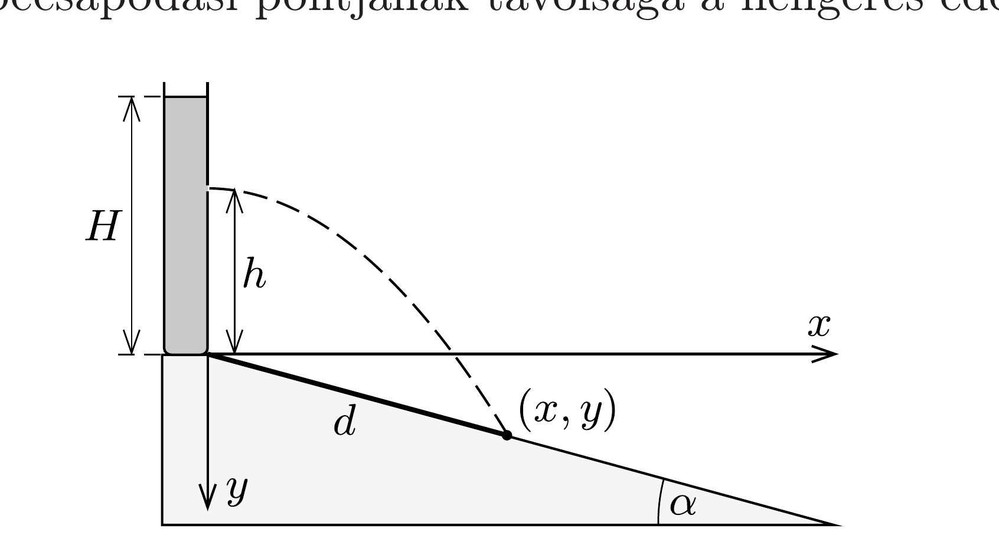
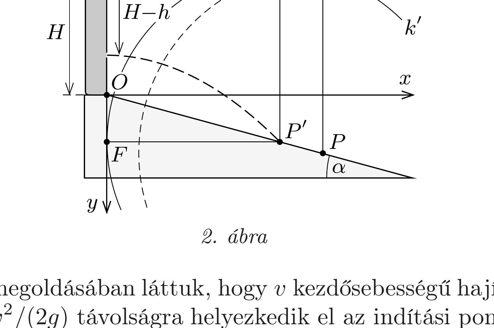

## Útmutatás

A válasz elemi úton is megkapható. Írjuk fel azt az egyenletet, amely megadja egy adott becsapódási távolsághoz tartozó $h$-t (vagy $h$-kat), és vizsgáljuk, mikor van (valós) megoldása ennek az egyenletnek.

Más utat is választhatunk: keressük meg a kilövellő vízsugár alakját leíró parabola vezéregyenesét és fókuszpontját, majd nézzük meg, hogy mi a geometriai feltétele annak, hogy a lejtő egy adott pontjába eljusson a víz.

## Megoldás

I. megoldás. Használjuk az 1. ábrán látható koordináta-rendszert, és legyen a vízsugár becsapódási pontjának távolsága a hengeres edény aljától $d$.

Az edény aljától számított $h$ magasságban $v$ sebességgel kilövellő vízsugár alakját a vízszintes hajítás összefüggéseiből kaphatjuk meg:
\[
y(x)=-h+\frac{g}{2 v^{2}} x^{2} .
\]
A víz kezdősebessége a Torricelli-féle kiömlési törvény szerint $v=\sqrt{2 g(H-h)}$ nagyságú. Mivel a lejtő hajlásszöge $\alpha$, a becsapódási pont koordinátái közötti kapcsolat $y=x \operatorname{tg} \alpha$. Ezeket a kifejezéseket a parabolapálya fenti egyenletébe helyettesítve a következő másodfokú egyenletet kapjuk a becsapódási pont vízszintes koordinátájára:
\[
\frac{x^{2}}{4(H-h)}-x \operatorname{tg} \alpha-h=0 .
\]
Ennek az egyenletnek tetszőleges $0 \leq h<H$ esetén pontosan egy pozitív valós megoldása van $\left(x_{+}\right)$, az $x_{+}(h)$ függvény szélsőértéke azonban csak hosszú és bonyolult számolás után kapható meg. Szerencsére van egyszerúbb eljárás is!

Tekintsük az (1) egyenletet, és határozzuk meg adott becsapódási távolság (vagyis adott $x$ ) mellett azt a $h$ értéket (vagy értékeket), amely éppen ehhez az $x$-hez tartozik. Az (1) egyenlet $h$-ra nézve is másodfokú:
\[
h^{2}+h(x \operatorname{tg} \alpha-H)+\left(\frac{x^{2}}{4}-H x \operatorname{tg} \alpha\right)=0
\]
amelynek akkor van (valós) megoldása, ha a diszkriminánsa nemnegatív:
\[
(x \operatorname{tg} \alpha-H)^{2}-x^{2}+4 H x \operatorname{tg} \alpha=[x(\operatorname{tg} \alpha+1)+H][x(\operatorname{tg} \alpha-1)+H] \geq 0 .
\]
Az első szögletes zárójelben álló kifejezés pozitív, ezért a második szögletes zárójelben álló kifejezés sem lehet negatív, így $x$-re az
\[
x \leq \frac{H}{1-\operatorname{tg} \alpha}
\]
egyenlőtlenség adódik, az egyenlőség pedig éppen a keresett szélsőértéknek felel meg. Ebből a lehetséges legtávolabbi becsapódás lejtőn mért távolsága
\[
d=\frac{x}{\cos \alpha}=\frac{H}{\cos \alpha-\sin \alpha} .
\]
A (3) eredményt a (2) egyenletbe helyettesítve az optimális kiömlési magasság is meghatározható:
\[
h=\frac{1-2 \operatorname{tg} \alpha}{2-2 \operatorname{tg} \alpha} H .
\]

Mivel $h$ nem lehet negatív, ezért eddigi eredményeink csak $\operatorname{tg} \alpha<1 / 2$ (azaz $\alpha<26,6^{\circ}$ ) esetén érvényesek. Az $\alpha>26,6^{\circ}$ esetben nem a (3) kifejezés, hanem az edény aljától induló vízsugárnak megfelelő $x=4 H \operatorname{tg} \alpha$ adja meg a legnagyobb becsapódási távolság vízszintes vetületét. Ekkor tehát (4) helyébe a
\[
d=\frac{4 H \operatorname{tg} \alpha}{\cos \alpha},
\]
(5) helyébe pedig a $h=0$ kifejezés lép.
II. megoldás. A hengeres edény oldalán $v=\sqrt{2 g(H-h)}$ sebességgel kilövellő vízsugár olyan parabola mentén halad, melynek vezéregyenese vízszintes, $F$ fókuszpontja pedig a 2. ábrán látható koordináta-rendszer $y$ tengelyén található.

A 20. feladat megoldásában láttuk, hogy $v$ kezdősebességú hajítás esetén a pálya fókuszpontja $v^{2} /(2 g)$ távolságra helyezkedik el az indítási ponttól, az eldobás irányától függetlenül. A parabola minden pontja (így az indítási pont is) ugyanakkora távolságra van a fókuszponttól, mint az $e$ vezéregyenestől, ezért utóbbi a kilövellési pont fölött $v^{2} /(2 g)=H-h$ magasságban, vagyis ( $h$ értékétől függetlenül) éppen az edényben lévố víz szintjénél található.

Tekintsünk egy tetszőleges $P$ pontot a lejtőn, és jelöljük ennek a vezéregyenesre vett merőleges vetületét $Q$-val. Ha létezik (legalább egy) olyan lehetséges vízsugár, amely áthalad a $P$ ponton, akkor annak fókuszpontja ugyanolyan távol helyezkedik el $P$-től, mint az $e$ vezéregyenes. Rajzoljunk ezért $P$ köré egy $P Q$
sugarú $k$ kört! Tegyük fel, hogy a kiválasztott $P$ pont olyan, hogy a $k$ körnek nincs közös pontja a koordináta-rendszer $y$ tengelyével. Ez azt jelenti, hogy nincs olyan parabolapálya, amely áthaladna a $P$ ponton: ide nem juthat el a víz.

Ha most a $P$ pontot közelíteni kezdjük az edényhez a lejtő mentén, akkor egy bizonyos $P^{\prime}$ ponthoz érve a $P^{\prime}$ középpontú, $P^{\prime} Q^{\prime}$ sugarú $k^{\prime}$ kör már érinteni fogja az $y$ tengelyt. Az érintési pont éppen megadja annak a parabolának az $F$ fókuszpontját, amelyet a legmesszebbre jutó vízsugár rajzol ki.

A 2. ábráról leolvasható, hogy
\[
P^{\prime} F=O F+H \quad \text { és } \quad O F=P^{\prime} F \cdot \operatorname{tg} \alpha,
\]
amibớl $P^{\prime} F=H /(1-\operatorname{tg} \alpha)$, így a legmesszebbre eljutó vízsugár a lejtő tetejétől
\[
P^{\prime} O=\frac{P^{\prime} F}{\cos \alpha}=\frac{H}{\cos \alpha-\sin \alpha}
\]
távolságra csapódik be.
A kilövellési pont fele olyan távol van a vezéregyenestől, mint a fókuszpont, ezért fennáll a $H-h=\frac{1}{2} P^{\prime} F$ összefüggés (itt felhasználtuk, hogy $P^{\prime} F=P^{\prime} Q^{\prime}$ ). Ebből azt kapjuk, hogy a lyukat az edény aljától számítva
\[
h=\frac{1-2 \operatorname{tg} \alpha}{2-2 \operatorname{tg} \alpha} H
\]
magasra kell fúrni.
Meredek lejtő esetén megtörténhet, hogy az $O F$ távolság nagyobbnak adódik, mint $H$. Az $O F=H$ határesetet vizsgálva a lejtő kritikus hajlásszögére
\[
\operatorname{tg} \alpha^{*}=\frac{O F}{P^{\prime} F}=\frac{H}{2 H}, \quad \text { azaz } \quad \alpha^{*} \approx 26,6^{\circ}
\]
adódik. $\alpha>\alpha^{*}$ hajlásszögek esetén a fenti szerkesztéssel kapott optimális kiömlési pont az $O$ pont alá süllyedne, ami nem lehetséges. Ilyenkor az edény aljánál ( $h=0$ magasságban, az $O$ pontban) kell lyukat fúrnunk. A $k^{\prime}$ kör ekkor már nem érinti, hanem az $O$ pontban metszi a koordináta-rendszer $y$ tengelyét, a maximális $P^{\prime} O$ távolságot pedig az $O F=H$ és $P^{\prime} O=P^{\prime} Q^{\prime}$ feltételekből határozhatjuk meg, az eredmény:
\[
P^{\prime} O=\frac{4 H \operatorname{tg} \alpha}{\cos \alpha},
\]
összhangban az I. megoldással.
