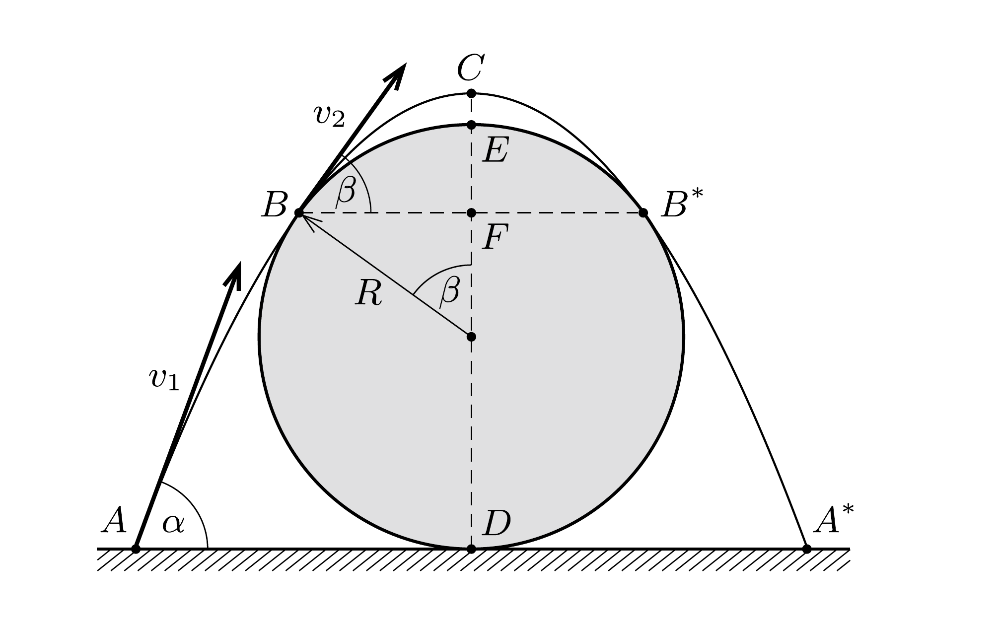

## Útmutatás

Elhanyagolható légellenállás esetén a szöcske pályája parabolaív lesz. Tévedés lenne azonban annak feltételezése, hogy a keresett parabola a hengert legfelül, egyetlen pontban érinti (vagyis a szöcske éppen átcsúszik a fatörzs felett).

## Megoldás

Logikusnak látszik az a sejtés, hogy egy olyan parabola adja a kívánt megoldást, amely a hengert legfelül, egyetlen pontban érinti. Ezt a sejtést azonban még be kell bizonyítani, mint ahogy az is kiderülhet, hogy nem is igaz. Ezért csak annyit tételezünk fel, hogy a kívánt pálya (az ábrán látható módon) a fatörzs két oldalán, ugyanolyan magasságban érinti a fatörzset.

Az ábrán $B$ és $B^{*}$ jelöli az érintési pontokat. A szöcske az $A$ pontból ugrik el $v_{1}$ kezdősebességgel, a vízszintessel $\alpha$ szöget bezáró irányban. Az érintési pontokban a sebesség $v_{2}$, a vízszintessel bezárt szög $\beta$. A parabolapálya legfelső $(C)$ pontjában a sebesség vízszintes irányú.

A feladatban $v_{1}$ minimális értékét kell meghatározni. Ehhez válasszuk független változónak a $\beta$ szöget! Ezzel ugyanis $v_{2}$ kifejezhető, $v_{2}$ segítségével pedig felírható $v_{1}$.

A $B C$ hajítási pályán $t$-vel jelölve az emelkedés idejét, a függőleges sebességkomponens a $B$ pontban
\[
v_{2} \cdot \sin \beta=g t,
\]
az elmozdulás vízszintes irányú $B F$ vetülete pedig
\[
v_{2} \cdot \cos \beta \cdot t=R \cdot \sin \beta .
\]
E két egyenlet összevetéséből kapjuk:
\[
v_{2}^{2}=\frac{g R}{\cos \beta} .
\]
Most írjuk fel az energiatételt az $A$ és a $B$ pontok között:
\[
\frac{1}{2} m v_{1}^{2}=\frac{1}{2} m v_{2}^{2}+m g R(1+\cos \beta) .
\]
Az (1) és (2) egyenletekből megkapjuk $v_{1}$ és $\beta$ kapcsolatát:
\[
v_{1}^{2}=2 g R\left(1+\cos \beta+\frac{1}{2 \cos \beta}\right) .
\]

Mekkora $\beta$ szögnél lesz az elrugaszkodás $v_{1}$ sebessége a legkisebb? Elsó sejtésünk szerint $\beta=0^{\circ}$ esetben, amikor éppen átcsúszik a szöcske a fatörzs tetején. Ekkor a (3) egyenletben $\cos \beta+1 /(2 \cos \beta)$ értéke 1,5. A kérdés az, hogy lehet-e ez a kifejezés kisebb, mint 1,5?

Írjuk fel a számtani és a mértani közepek közötti egyenlőtlenséget a $\cos \beta$ és $1 /(2 \cos \beta)$ mennyiségekre! (Felhasználjuk, hogy $\cos \beta \geq 0$, hiszen $0 \leq \beta \leq 90^{\circ}$.)
\[
\frac{1}{2}\left(\cos \beta+\frac{1}{2 \cos \beta}\right) \geq \sqrt{\cos \beta \frac{1}{2 \cos \beta}}=\frac{\sqrt{2}}{2} .
\]
Tehát $\cos \beta+1 /(2 \cos \beta)$ legkisebb értéke $\sqrt{2}$, amit $\beta=45^{\circ}$-nál vesz fel. Azt a meglepó eredményt kaptuk, hogy az optimális pálya a legfelső pontjában nem érinti a fatörzset, hanem fölé emelkedik! A szöcske helyzeti energiája a legmagasabb pontban nagyobb ugyan, mint az „éppen átcsúszik” esetben, de a mozgási energiája - sőt az összenergiája is - kisebb. A szöcske minimális elrugaszkodási sebességét most már (3) alapján meghatározhatjuk:
\[
v_{1, \min }=\sqrt{2 g R(1+\sqrt{2})} \approx 2,2 \frac{\mathrm{~m}}{\mathrm{~s}} .
\]

Megjegyzések. 1. Megmutatható, hogy a parabolapálya $B$ pont fölötti része mindenhol a fatörzs felett halad.
2. Bár a feladat nem kérdezte, de kiszámíthatjuk az $\alpha$ elrugaszkodási szög értékét is az optimális ugrás esetén:
\[
\alpha=67,5^{\circ}=\frac{3 \pi}{8},
\]
illetve az $A D$ távolságot is (meglepő módon $A D=D F$ ):
\[
A D=R\left(1+\frac{\sqrt{2}}{2}\right) \approx 17 \mathrm{~cm} .
\]
3. További érdekesség, hogy a minimális kezdősebességú ugrás esetén az ábrán jelölt $F$ pont éppen a parabola fókuszpontjával esik egybe (lásd a 20. feladatot).
