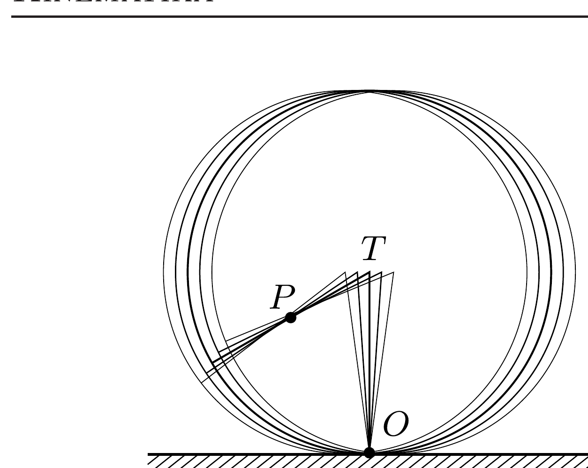
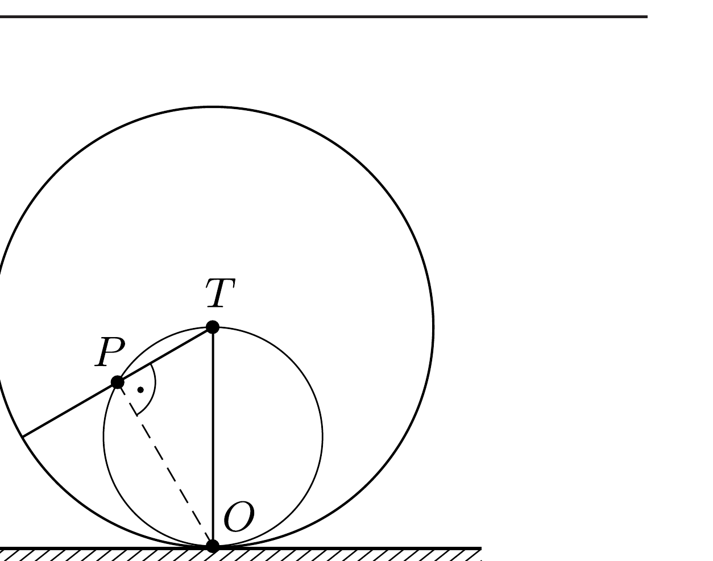

## Útmutatás

Azok a pontok látszanak élesen a fényképen, amelyek sebessége éppen küllőirányú.

## Megoldás

Ha egy vízszintesen repülő nyílvesszőről nem túl rövid expozíciós idejú fényképfelvételt készítünk, csak a nyílhegy és a toll képe lesz elmosódott. A nyílvessző többi pontja nem különböztethető meg egymástól: ezek az elmozdulás során egymásba mennek át, emiatt a nyílvessző egésze élesen látszik.

A kerékpár küllőinek pontjai sem különböznek egymástól, így mindazok a küllőpontok, amelyek a kerék elmozdulása és elfordulása során „küllőirányú" sebességgel rendelkeznek, a képen viszonylag élesen látszanak. Az 1. ábrán - amelyen az áttekinthetőség kedvéért csak két küllőt rajzoltunk be - a kerék öt, egymáshoz közeli állapotát látjuk. Megfigyelhetjük, hogy a kerék pillanatnyi forgástengelyének megfeleló $O$ ponton kívül a $P$ pont is viszonylag élesen látszik ezen a „sztroboszkopikus felvételen". (A $P$ pont nem a küllő egy bizonyos pontjának, hanem különböző - de a fényképfelvételen ugyanarra a helyre kerülő - küllőpontoknak felel meg.)

Mi jellemzi az ilyen tulajdonságú $P$ pontokat? Az, hogy a küllő ottani sebességvektora (ami merőleges $O P$-re) éppen a küllő $T P$ irányával esik egybe, vagyis az $O P T$ háromszög derékszögü (2. ábra).

Ezek szerint a $P$ pontok az $O T$ egyeneshez tartozó Thalész-körön helyezkednek el.

Megjegyzés. Mivel a kerékpárok küllői csak közelítőleg sugárirányúak, a gyakorlatban mindig egymást keresztezó irányúak, így a valóságos esetben a nem-elmosódott pontok felerészben a megoldásban szereplő Thalész-körön belül, felerészben pedig azon kívül találhatóak.
