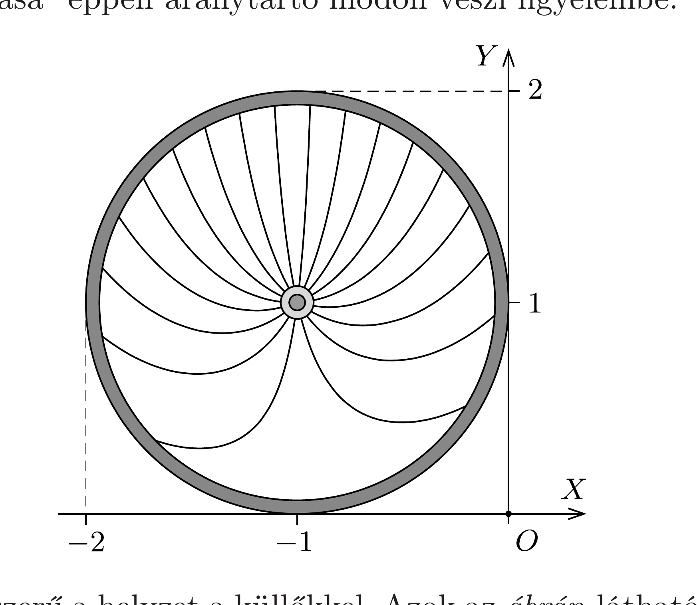

## Útmutatás

Próbáljuk meg felírni a küllők „látszólagos” alakjának egyenletét derékszögü koordináta-rendszerben!

## Megoldás

Az egyszerúség kedvéért válasszuk a kerék sugarát és a sebességét egységnyinek (ekkor a szögsebessége is egységnyi lesz). Válasszunk olyan koordinátarendszert, amelynek $x$ tengelye a vízszintes pályán haladó kerékpár sebességének irányába mutat, az $y$ tengely pedig függőlegesen felfelé irányul.

Amikor a kerék tengelye a (-1, 1) pontban van (tehát amikor a kerék legeleje éppen eléri az $x=0$ helyen lévó célvonalat), akkor az $x$ tengellyel $\alpha$ szöget bezáró küllő egyenlete:
\[
y-1=\operatorname{tg} \alpha \cdot(x+1) .
\]
(A feladat szövegének megfelelően úgy tekintettük, mintha valamennyi küllő meghosszabbítása a kerék tengelyén haladna át.) Bizonyos $t$ idő elteltével a küllő $-t$ szöggel elfordul, a kerék pedig a pozitív $x$ tengely irányában $t$ szakasznyit elmozdul, a küllő egyenlete tehát ekkor
\[
y-1=\operatorname{tg}(\alpha-t) \cdot(x-t+1)
\]
lesz. A célfotón az $y$ tengelyen fekvő, vagyis az $x=0$-nak megfelelő pontok láthatók, méghozzá
\[
Y=\left.y(t)\right|_{x=0}=1+\operatorname{tg}(\alpha-t) \cdot(1-t)
\]
magasságban, vízszintesen pedig (az egységnyi haladási sebességnek megfelelően) az $X=-t$ pontba helyezve. (A célfotón leolvasható „virtuális valóságot" megadó koordinátákat nagybetűkkel jelöltük, ezek nem tévesztendők össze a kerék és a küllők valódi, kisbetús koordinátáival.)

Ábrázoljuk az
\[
Y(X)=1+\operatorname{tg}(\alpha+X) \cdot(X+1)
\]
függvényt különböző (mondjuk 20°-onként növekvő) $\alpha$ értékek mellett! A kerék abroncsa a célfotón is körnek látszik, hiszen egy tiszta elforgatás a kört körbe viszi át, a kerék egészének transzlációs mozgását pedig a képpontok megfelelő nagyságú „elektronikus eltolása” éppen aránytartó módon veszi figyelembe.

Nem ilyen egyszerú a helyzet a küllőkkel. Azok az ábrán látható módon erősen eltorzítva jelennek meg a képen, alakjuk jól egyezik az elektronikus célfotókon ténylegesen megfigyelhető (a nagyobb kerékpáros versenyek után az interneten is megjelenő és tanulmányozható) küllő-alakokkal.
