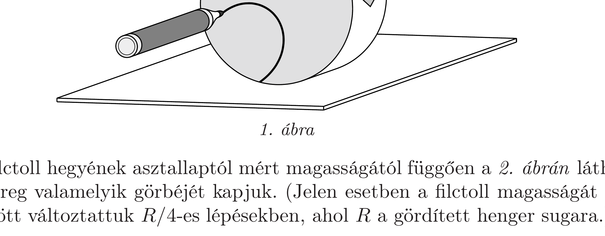
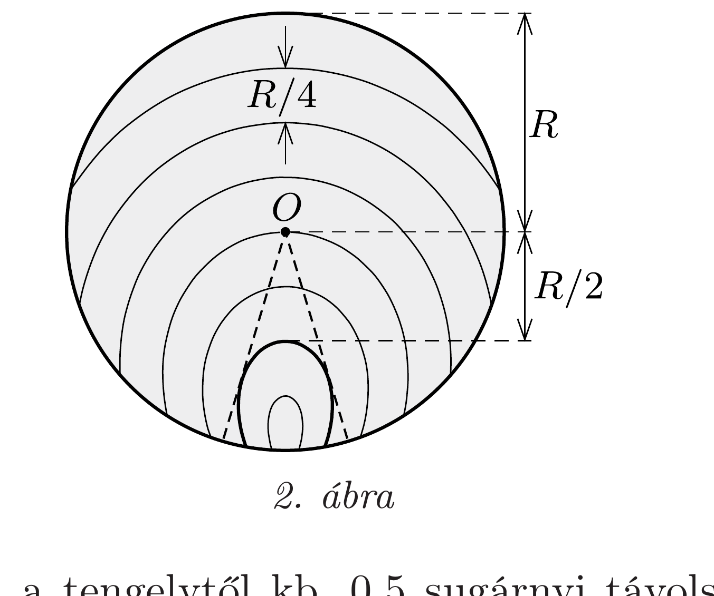

## Útmutatás

Hibás az a gondolatmenet, mely szerint a nyílvessző legfeljebb annyi ideig tartózkodhat a kocsikerék két küllője között, amíg a kerék $360^{\circ} / 12=30^{\circ}$-kal elfordul. A kocsi kereke ugyanis nem egyhelyben forog, hanem a tiszta gördülés miatt haladó mozgást is végez. A kérdésre a helyes választ grafikus módszerrel találhatjuk meg a legegyszerúbben.

## Megoldás

A feladat egyenértékú a következő kérdéssel: Mennyi ideig dughatjuk be a talajhoz képest mozdulatlanul tartott ujjunkat a gördülő kocsikerék küllői közé anélkül, hogy a küllők vagy a kerék abroncsa hozzáérne az ujjunkhoz?

A tisztán gördülő kocsikerék küllőinek mozgása bonyolult, a probléma analitikus tárgyalása nehéz. Ehelyett oldjuk meg a feladatot grafikusan! Ragasszunk egy henger (például befőttesüveg vagy konzervdoboz) alaplapjára papírkorongot, és miközben a hengert sík asztallapon gördítjük, érintsünk hozzá a papírhoz egy (az asztalhoz képest mozdulatlanul tartott) filctollat az 1. ábrán látható módon.

A filctoll hegyének asztallaptól mért magasságától függően a 2. ábrán látható görbesereg valamelyik görbéjét kapjuk. (Jelen esetben a filctoll magasságát 0 és $2 R$ között változtattuk $R / 4$-es lépésekben, ahol $R$ a gördített henger sugara.)

Ki kell választanunk azt a görbét, amelyik megrajzolásánál a gördített henger a legtöbbet mozdul el, miközben a filctoll hegye két „küllő“ (a papírkorongon két $360^{\circ} / 12=30^{\circ}$-os szöget bezáró sugár) között marad. Csak olyan görbét választhatunk, amelyik nem metszi egyik küllőt sem, illetve ha metszi, akkor csak a metszéspontok közötti szakaszát szabad figyelembe vennünk. A keresett optimális esetet akkor kapjuk, amikor a megrajzolt görbét a 2 . ábrán látható módon érinti két „küllő“ egyenese. Elegendően nagy korongot gördítve azt találjuk, hogy ez akkor valósul meg, amikor a filctoll hegye kb. 0, $5 \Omega$ magasságban van az asztallap síkja felett.

A nyílvesszőt tehát a tengelytől kb. 0,5 sugárnyi távolságban kell két küllő közé belőni. Ebben a magasságban a kerék vízszintes húrja $2 \sqrt{1-0,5^{2}} R \approx 1,7 R$ hosszúságú, vagyis a nyílvessző annyi ideig tartózkodhat a küllők között, ameddig a kerék tengelye hozzávetőlegesen 1,7 sugárnyit mozdul el. Az ehhez szükséges idő
\[
t=\frac{1,7 \cdot 0,5 \mathrm{~m}}{15 \mathrm{~m} / \mathrm{s}} \approx 0,057 \mathrm{~s},
\]
tehát a nyílvessző sebessége legalább
\[
v=\frac{0,2 \mathrm{~m}}{0,057 \mathrm{~s}} \approx 3,5 \frac{\mathrm{~m}}{\mathrm{~s}} .
\]

Megjegyzések. 1. Pontosabb eredményt differenciálszámítás segítségével, illetve egy trigonometrikus egyenlet numerikus megoldásával kaphatunk. Így az adódik, hogy a kerék tengelyétől 0,524 sugárnyi távolságra érdemes belőni a nyílvesszőt. Nem is ad olyan rossz becslést a grafikus megoldás!
2. A kiszámított $t=57 \mathrm{~ms}$ idő alatt egy szabadon esó́ test függőleges elmozdulása legalább $\Delta h=(1 / 2) g(t / 2)^{2} \approx 4 \mathrm{~mm}$, ez a nyílvessző hosszához, illetve a kerék sugarához viszonyítva valóban elhanyagolható.
