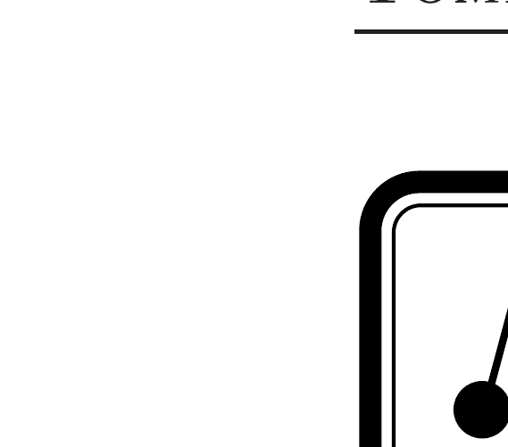
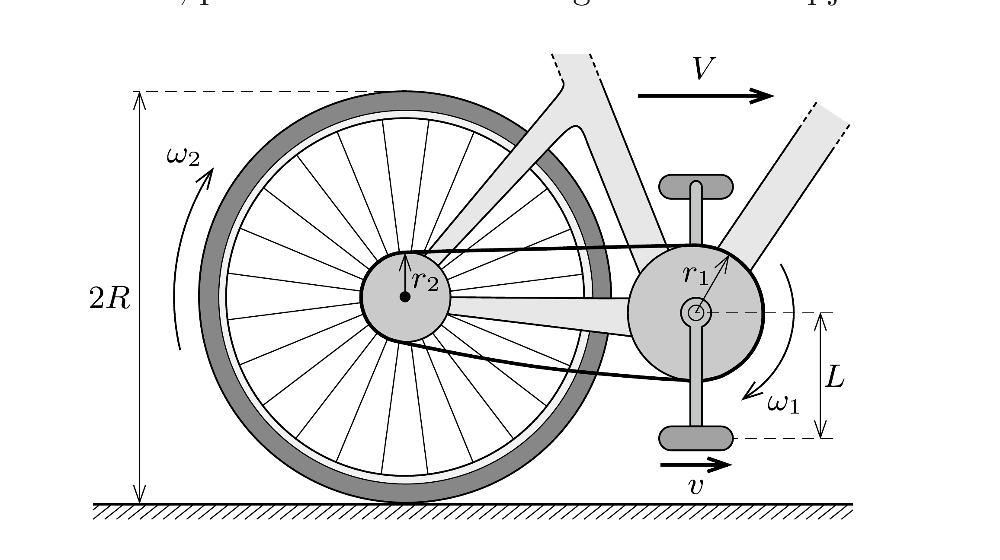
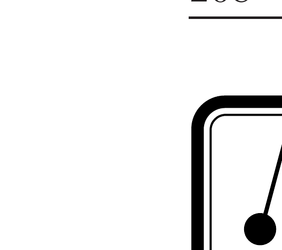

## Útmutatás

Fogjunk egy kerékpárt, és próbáljuk ki!

\section*{Tömegpontok dinamikája}

## Megoldás

a) A külső eró munkája mindenképpen pozitív, barátunk kezének (és így az alsó pedálnak is) a talajhoz képest tehát biztosan hátrafelé kell elmozdulnia.
b) Jelöljük az első fogaskerék sugarát $r_{1}$-gyel, a hátsóét $r_{2}$-vel, a hátsó kerék sugarát $R$-rel, a pedál hajtókarának hosszát pedig $L$-lel az ábrán látható módon.

A kerékpár a rá ható erők eredőjének (a pedálra ható, hátrafelé mutató erő és a súrlódási eró vektori összegének) irányába indul el. Ez az irány kitalálható az erők vizsgálata nélkül, pusztán kinematikai megfontolások alapján is.

Keressünk kapcsolatot a kerékpár $V$ haladási sebessége és a legalsó helyzetben lévó pedál $v$ sebessége között! Tegyük fel, hogy az első fogaskerék az ábrán jelölt forgásirányban $\omega_{1}$ szögsebességgel forog. Ekkor a hátsó fogaskerék szögsebessége ugyanilyen irányú, nagysága pedig (a lánc nyújthatatlansága miatt)
\[
\omega_{2}=\frac{r_{1}}{r_{2}} \omega_{1} .
\]
Az itt szereplő $r_{1} / r_{2}=N$ hányadost szokás áttételnek nevezni. A hátsó fogaskerék együtt forog a bicikli hátsó kerekével, ezért a kerékpár előrefelé halad $V=R \omega_{2}$ sebességgel. Az első fogaskerék tengelye a talajhoz képest ugyanekkora sebességgel halad előre, miközben $\omega_{1}$ szögsebességgel forog is, így a hajtókar függőleges helyzetében az alsó pedál talajhoz viszonyított sebessége
\[
v=V-L \omega_{1} .
\]
Az eddigiek felhasználásával a
\[
v=V\left(1-\frac{L}{N R}\right)
\]
összefüggésre jutunk. Ez az egyenlet a feladat megoldásának kulcsa.
Ha a zárójelben álló kifejezés pozitív, akkor a kerékpár ugyanabba az irányba indul el, mint az alsó pedál, ellenkező esetben pedig éppen ellentétes irányba. Váltó nélküli kerékpároknál (amilyen az ábrán is látható) $N>1$, a hajtókar pedig rövidebb a kerék sugaránál, így a zárójeles mennyiség pozitív: a bicikli tehát az alsó pedál mozgásirányával megegyezően, hátrafelé indul el (az ábrán látható nyilakkal éppen ellentétesen).

Egyes „többsebességes” bicikliknél (pl. speciális hegyi kerékpároknál) olyan kis áttétel is lehetséges, hogy a fenti zárójelben negatív szám jelenik meg, ilyen esetben a kerékpár a kísérletben előrefelé mozdul el.

Megjegyzés. Előfordulhat, hogy $N=L / R$, ekkor hiába húzzuk hátrafelé a legalsó helyzetében lévő pedált, a kerékpár nem mozdul meg. A húzóerốt növelve a hátsó keréknél ható tapadási súrlódási eró is növekszik, egészen addig, míg a kerék meg nem csúszik. Ez szemléletesen a következőképp magyarázható: a pedál az $N$ áttétel és az $R / L$ aránytól függően hurkolt cikloist, nyújtott cikloist, vagy éppen közönséges (csúcsos) cikloist ír le. A legutóbbi esetben a ciklois érintője a legalsó pontban függőleges, ilyen kényszerpályán vízszintes erő hatására a pedál nem tud elindulni.

\section*{Tömegpontok dinamikája}
