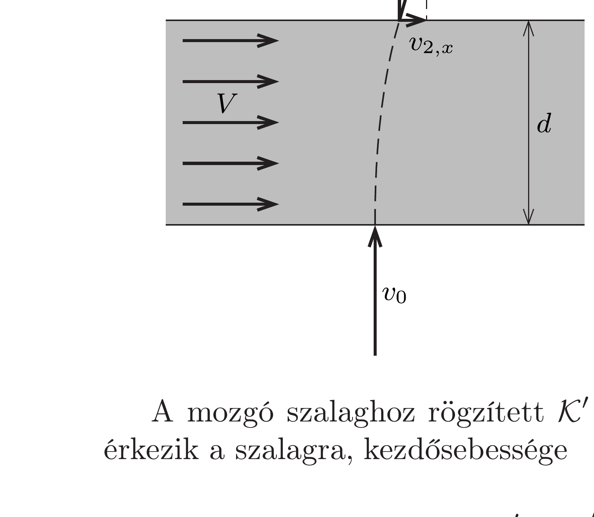
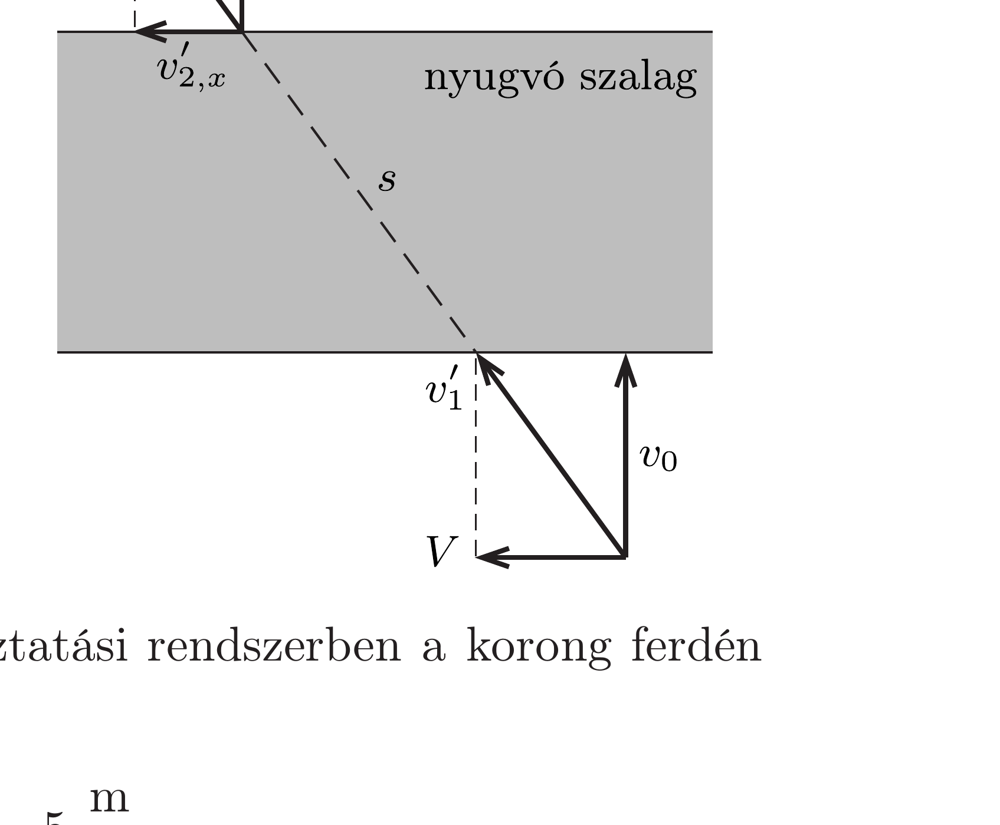

## Útmutatás

A korong mozgásának leírása az asztalhoz rögzített koordináta-rendszerben meglehetősen bonyolult. Próbálkozzunk a futószalaggal együtt mozgó vonatkoztatási rendszer használatával!

## Megoldás

A korong mozgására elvben többféle „forgatókönyv” is elképzelhető. Kicsiny súrlódás és nagy kezdősebesség esetén a korong - lényegében sebességváltozás nélkül - átszáguld az asztalon. Ha a súrlódás nagy, viszont a kezdősebesség kicsi, akkor a korong nem halad át a futószalagon, hanem „hozzátapad”, és így a mozgó gumiszalag eljuttatja a korongot az asztal jobb oldali széléhez. Ez az utóbbi lehetőség azt sugallja, hogy talán érdemes a jelenséget az asztallaphoz rögzített $\mathcal{K}$ vonatkoztatási rendszer helyett a futószalaggal együtt mozgó $\mathcal{K}^{\prime}$ rendszerben leírni.

A mozgó szalaghoz rögzített $\mathcal{K}^{\prime}$ vonatkoztatási rendszerben a korong ferdén érkezik a szalagra, kezdősebessége
\[
v_{1}^{\prime}=\sqrt{v_{0}^{2}+V^{2}}=5 \frac{\mathrm{~m}}{\mathrm{~s}} .
\]
A súrlódási erő hatására a $\mathcal{K}^{\prime}$ vonatkoztatási rendszerben a korong egyenes vonalú, egyenletesen lassuló mozgást végez, és ha nem veszti el az összes mozgási energiáját, akkor átjut a futószalagon, majd súrlódásmentesen, egyenletes mozgással halad tovább a sima asztalon. Ezt az esetet mutatja az ábra mind a két
koordináta-rendszerben. A korong úthossza a szalagon:
\[
s=d \frac{v_{1}^{\prime}}{v_{0}}=d \sqrt{1+\frac{V^{2}}{v_{0}^{2}}}=1,25 \mathrm{~m} .
\]
A korong lassulása állandó, melynek nagysága $\mu g$, így a szalag elhagyásakor a végsebessége (például a munkatétel alapján)
\[
v_{2}^{\prime}=\sqrt{v_{1}^{\prime 2}-2 \mu g s} \approx 3,57 \frac{\mathrm{~m}}{\mathrm{~s}} .
\]
Esetünkben tehát a korong valóban elhagyja a futószalagot, de vajon hol? Ennek meghatározásához számítsuk ki, mennyi ideig volt a korong a szalagon:
\[
t_{1}=\frac{2 s}{v_{1}^{\prime}+v_{2}^{\prime}} \approx 0,29 \mathrm{~s} .
\]

Most térjünk vissza az asztalhoz rögzített $\mathcal{K}$ vonatkoztatási rendszerbe! Ebben a rendszerben a szalag $V t_{1}$ távolságot tesz meg jobbra, miközben a korong a szalaghoz képest $\left(V / v_{0}\right) d$ távolsággal balra mozdul el. Így a korong elmozdulása a futószalag elhagyásának pillanatáig
\[
\Delta x_{1}=V t_{1}-d \frac{V}{v_{0}} \approx 0,125 \mathrm{~m}
\]
jobbra. A kilépési pontban a korong sebességének a szalag szélére merőleges összetevője mindkét vonatkoztatási rendszerben ugyanakkora:
\[
v_{2, y}=v_{2, y}^{\prime}=\frac{v_{2}^{\prime}}{v_{1}^{\prime}} v_{0} \approx 2,86 \frac{\mathrm{~m}}{\mathrm{~s}} .
\]
A szalag szélével párhuzamos sebességkomponens a $\mathcal{K}$ rendszerben:
\[
v_{2, x}=V-v_{2, x}^{\prime}=V-\frac{v_{2}^{\prime}}{v_{1}^{\prime}} V \approx 0,86 \frac{\mathrm{~m}}{\mathrm{~s}} .
\]
Az asztal széléig tartó, $d=1 \mathrm{~m}$ széles, súrlódásmentes sávon történő áthaladáshoz szükséges idő:
\[
t_{2}=\frac{d}{v_{2, y}}=0,35 \mathrm{~s},
\]
ezalatt a korong elmozdulása jobbra:
\[
\Delta x_{2}=v_{2, x} t_{2} \approx 0,301 \mathrm{~m} .
\]
Így a korong teljes elmozdulása jobbra $\Delta x_{1}+\Delta x_{2}=0,426 \mathrm{~m}$. Ez az érték kisebb, mint 1,5 m, tehát a korong a kiindulási pontjával átellenes oldalon esik le az asztalról, mégpedig az oldal közepétől 42,6 cm távolságra jobbra.

Megjegyzés. A futószalaghoz rögzített $\mathcal{K}^{\prime}$ vonatkoztatási rendszerből látszik, hogy a korong gyorsulása mindvégig ugyanolyan irányú és nagyságú, így az asztallap $\mathcal{K}$ rendszerében a korong szalagon befutott pályájának alakja (a ferde hajításokhoz hasonlóan) egy parabolaív, melynek tengelye párhuzamos a gyorsulás irányával.
