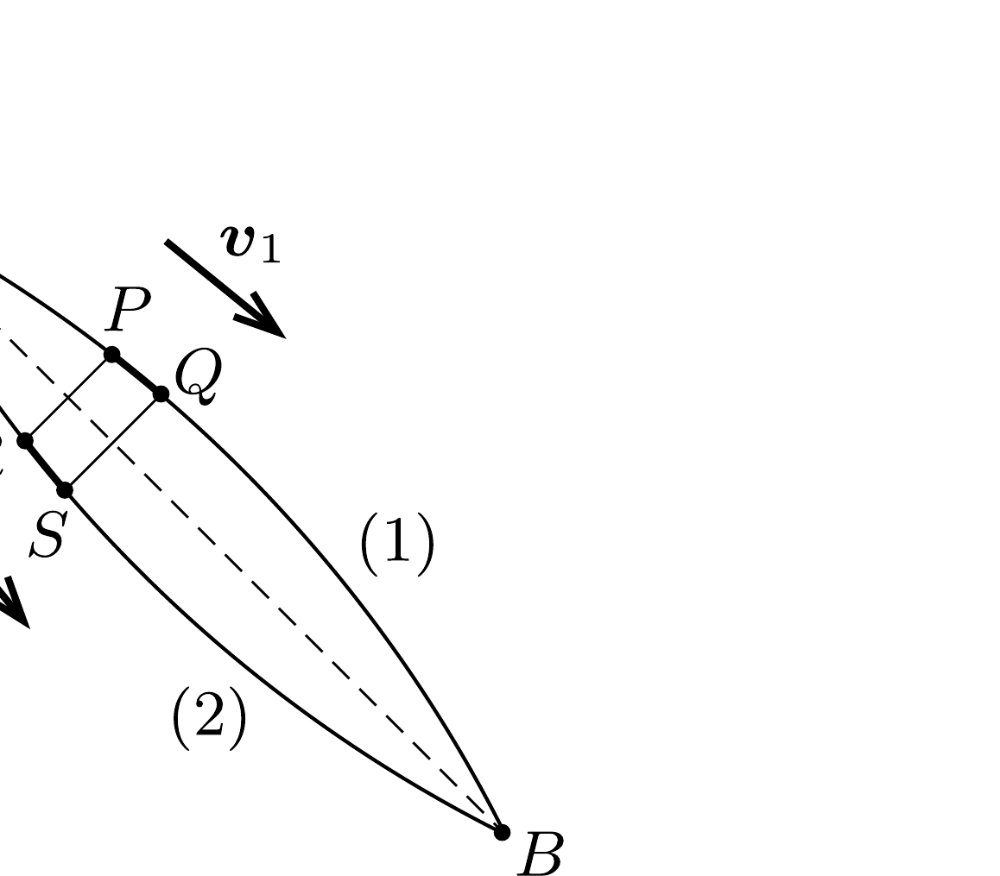
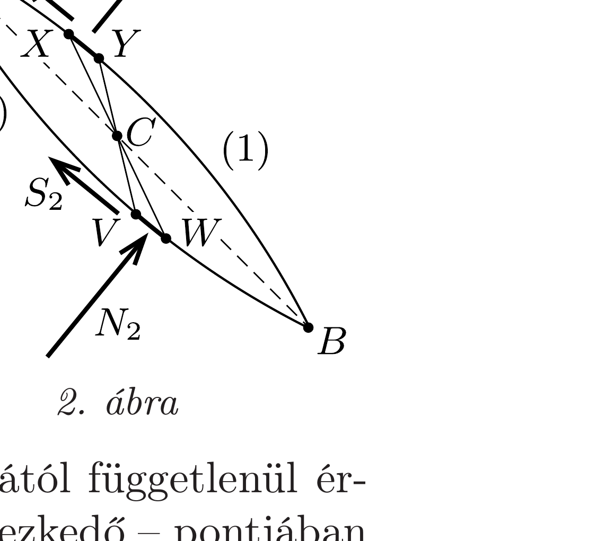

## Útmutatás

Súrlódásmentes esetben a végsebességek a mechanikai energia megmaradása miatt megegyeznek. A többi kérdés megválaszolásához keressünk a két pályán
a) azonos hosszúságú kis szakaszokat, és nézzük meg, melyiket éri el nagyobb sebességgel a kis test;
b) azonos meredekségú kis szakaszokat, és nézzük meg, melyiken nagyobb a testre ható súrlódási erő!

## Megoldás

a) Az $A$ és $B$ pont között mindkét pályán haladva ugyanannyit változik a gravitációs helyzeti energia, tehát - ha nincs súrlódás - a lecsúszó test végsebességének is ugyanakkorának kell lennie a két esetben.

A mozgási idők összehasonlítása érdekében tekintsünk két kis szakaszt, $P Q$-t és $R S$-t, melyek egymásnak az $A B$ egyenesre vett tükörképei, tehát a hosszuk ugyanakkora (1. ábra). Mivel $R S$ „alacsonyabban" fekszik, mint $P Q$, ezért a kis test $v_{2}$ se-

bessége a (2)-es pálya ezen szakaszán nagyobb, mint az (1)-es pálya $P Q$ ívén mérhető $v_{1}$. Tehát a test rövidebb idő alatt futja be az $R S$ ívet, mint $P Q$-t. Ez mindegyik kis szakaszra, és így az egész mozgásra is igaz, ezért a (2)-es pályán ér le hamarabb a kis test.
b) Számottevő súrlódás esetén a végsebességeket a munkatétel segítségével hasonlíthatjuk össze. A gravitációs erő munkája mindkét pályán ugyanakkora, a súrlódási munka viszont különböző lehet.

Tekintsünk most is két kis pályaelemet, $X Y$-t és $V W$-t, melyek az $A B$ szakasz $C$ felezőpontjára nézve középpontosan tükrös helyzetüek, tehát a hosszuk és a meredekségük ugyanakkora (2. ábra).

A lecsúszó test centripetális gyorsulását a nyomóerőnek és a nehézségi erő normálirányú (sebességre merőleges) komponensének az eredóje biztosítja. A két kis pályaelem egyforma meredeksége miatt a nehézségi eró normálirányú összetevője ugyanakkora a két helyzetben. A centripetális gyorsulás mindkét pályán a körívek középpontja felé mutat: az (1)-es pályán ferdén „lefelé", a (2)-esen pedig „felfelé” irányul. Emiatt az $X Y$ szakaszon ható $N_{1}$ nyomóeró ki-

sebb, mint a nehézségi eró normálirányú komponense, a $V W$ szakaszon ható $N_{2}$ pedig nagyobb annál.
Eddigi gondolatmenetünk a kis pályaszakaszok megválasztásától függetlenül érvényes, ezért a pálya minden - középpontosan tükrösen elhelyezkedő - pontjában $N_{1}<N_{2}$, és ugyanez mondható el a súrlódási erók nagyságáról is. A súrlódás munkája tehát a (2)-es pályán nagyobb, ezért az itt haladó testnek lesz kisebb a végsebessége.

A fenti megfontolás érvényét veszti, ha a kis test nem tudja befutni a teljes (2)-es útszakaszt, vagy ha el sem indul az (1)-es pályán.
