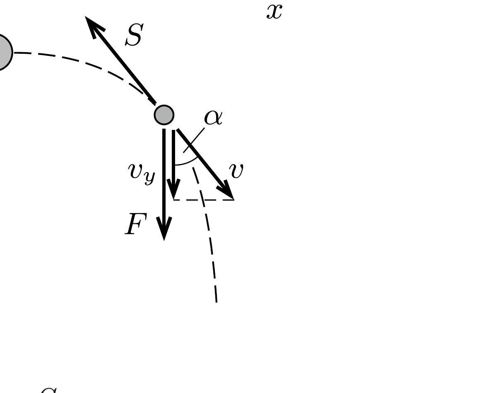

## Útmutatás

Számítsuk ki, mennyit változik egységnyi idő alatt a meglökött fiú sebességének nagysága, illetve a sebességének lejtőirányú összetevője. Keressünk kapcsolatot e két mennyiség változási üteme között.

## Megoldás

Ha a fiúk már kis lökés hatására is egyenletes sebességgel csúsznának lefelé, akkor a rájuk ható nehézségi eró lejtóirányú $F$ komponensének és az $S$ súrlódási erốnek egyenló nagyságúnak kell lennie: $F=S$.

A súrlódási erő - amelynek iránya minden pillanatban a sebességgel ellentétes csökkenti a sebesség nagyságát, az $F$ erő pedig a sebesség lejtőirányú komponensét igyekszik növelni. Természetesen ez a két hatás egyszerre jelentkezik, és végül egy meglehetősen bonyolult (görbevonalú, változó gyorsulású) mozgás alakul ki. Ennek ellenére a végsebességet egyszerúen, a mozgás részletes leírása nélkül is meghatározhatjuk.

Vegyük fel a lejtő síkjában az ábrán látható koordináta-rendszert, és jelöljük a csúszó fiú pillanatnyi sebességének nagyságát $v$-vel, $y$ irányú komponensét pedig $v_{y}$-nal. Számítsuk ki, mennyit változik ez a két mennyiség kicsiny $\Delta t$ idő alatt. Newton II. törvénye szerint:
\[
\begin{aligned}
m \Delta v & =(-S+F \cos \alpha) \Delta t, \\
m \Delta v_{y} & =(F-S \cos \alpha) \Delta t .
\end{aligned}
\]

Adjuk össze ezt a két egyenletet, és használjuk fel, hogy $F=S$.
\[
\Delta v+\Delta v_{y}=\Delta\left(v+v_{y}\right)=0,
\]
azaz
\[
v+v_{y}=\text { állandó. }
\]
Ez az állandó a kezdeti feltétel miatt $v_{0}=1 \mathrm{~m} / \mathrm{s}$ nagyságú. A lefelé csúszó fiú $v_{\infty}$ végsebességének lejtőirányúnak kell lennie, nagyságát pedig a fenti „megmaradási tétel" egyértelmúen meghatározza:
\[
v_{\infty}=\frac{v_{0}}{2}=0,5 \frac{\mathrm{~m}}{\mathrm{~s}} .
\]
