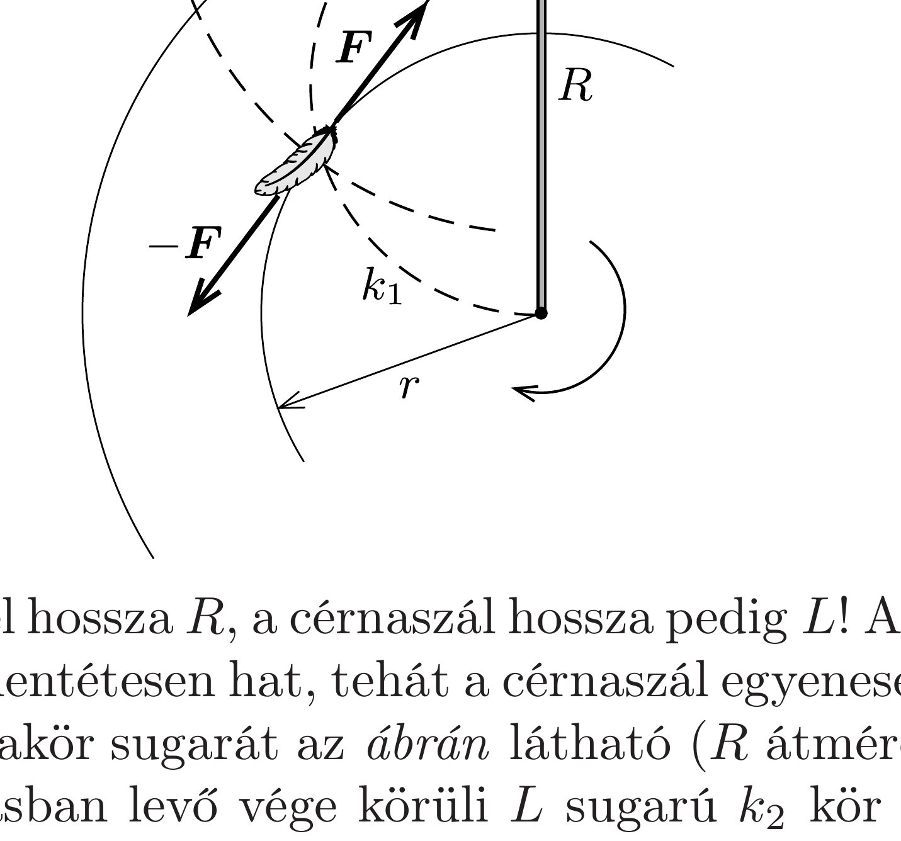

## Útmutatás

A pihére jellemző, hogy elhanyagolhatóan kicsi a tömege, emiatt a rá ható nehézségi erốt elhanyagolhatjuk, és a Newton-féle mozgásegyenletben ma helyébe nullát írhatunk.

## Megoldás

Ha a tollpihe valamilyen állandósult pályán mozog, akkor ez csak kör lehet, hiszen ilyenkor a tollpihe az ostornyéllel együtt forgó koordináta-rendszerből szemlélve áll. A tollpihe elhanyagolhatóan kicsi tömege miatt a Newton-egyenletben a nehézségi erố és $m a$ helyébe nullát írhatunk. A mozgásegyenlet tehát erre az állításra egyszerúsödik: a cérnaszálban ható erő és a közegellenállási erő eredője nulla.

Legyen az ostornyél hossza $R$, a cérnaszál hossza pedig $L$ ! A közegellenállási erő a sebesség irányával ellentétesen hat, tehát a cérnaszál egyenese a tollpihe pályakörének érintője. A pályakör sugarát az ábrán látható ( $R$ átmérőjú) $k_{1}$ Thalész-kör és az ostornyél mozgásban levő vége körüli $L$ sugarú $k_{2}$ kör metszéspontja adja meg; nagysága
\[
r=\sqrt{R^{2}-L^{2}} .
\]

Ha a cérna hosszabb, mint a pálca, akkor a tollpihének nincs stabil (állandósult) pályája.
