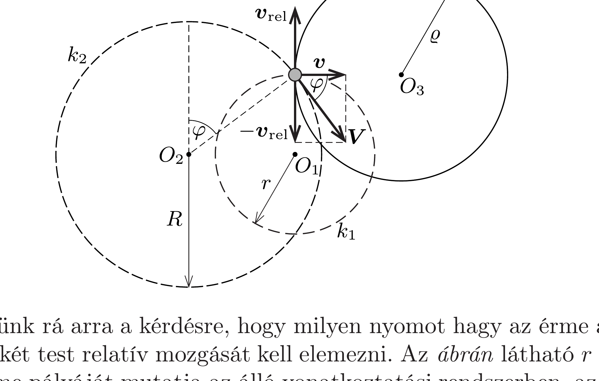

## Útmutatás

Érdemes elvégezni a kísérletet. Mivel az érme kicsiny és nem jön forgásba, ezért tömegpontként kezelhető. A mozgás egy kezdeti átmeneti szakasz után állandósul, és az érme körpályára áll. Ebből következik, hogy a rajztáblán hagyott grafitnyom is kör alakú lesz. Ennek a körnek a sugarát az érme és a rajztábla relatív mozgásának vizsgálatával határozhatjuk meg.

## Megoldás

Ha a rajztábla és a pénzérme között a súrlódási tényező elegendően nagy lenne $\left(\mu>R \omega^{2} / g\right)$, akkor a pénzérme nem csúszna meg, hanem a táblához tapadva követné annak mozgását. A feladat szövege szerint nem ez a helyzet, így a rajztábla indításakor a pénzérme azonnal megcsúszik. Sejthető, hogy néhány periódusidőnyi átmeneti (tranziens) szakasz után az érme mozgása állandósul. Megmutatjuk, hogy az egyenletes körmozgást végző pénzérme kielégíti a Newtonféle mozgásegyenletet.

Az $m$ tömegú pénzérmére vízszintes irányban egyetlen erő hat: a $\mu m g$ nagyságú, de állandóan változó irányú csúszási súrlódási erő. Stacionárius körmozgás esetén az érme sebességének nagysága állandó, ezért a súrlódási erő mindig merőleges a sebességvektorra. A pénzérme körmozgásának szögsebessége nem lehet más, mint a rajztábla mozgásának $\omega$ körfrekvenciája. A körpálya $r$ sugarát a mozgásegyenletből határozhatjuk meg:
\[
\mu m g=m r \omega^{2}, \quad \text { ebből } \quad r=\frac{\mu g}{\omega^{2}} .
\]
Érdekes, hogy $r$ nem függ a rajztábla pályájának $R$ sugarától.

Most térjünk rá arra a kérdésre, hogy milyen nyomot hagy az érme a rajztáblán! Ehhez a két test relatív mozgását kell elemezni. Az ábrán látható $r$ sugarú $k_{1}$ kör a pénzérme pályáját mutatja az álló vonatkoztatási rendszerben, az $R$ sugarú $k_{2}$ kör a rajztábla éppen az érmével érintkező pontjának későbbi pályáját jelzi, végül pedig a $\varrho$ sugarú $k_{3}$ kör a táblán hagyott grafitnyomnak felel meg. Az érmére ható csúszási súrlódási eró az $O_{1}$ pont felé mutat, ezzel ellentétes tehát az érme rajztáblához viszonyított $\boldsymbol{v}_{\text {rel }}$ sebessége. Az érme álló vonatkoztatási rendszerhez viszonyított $\boldsymbol{v}$ sebessége viszont erre merőleges, így a rajztábla érmével éppen érintkező pontjának $\boldsymbol{V}=\boldsymbol{v}-\boldsymbol{v}_{\text {rel }}$ sebességére fennáll a Pitagorasz-tétel:
\[
\boldsymbol{V}^{2}=\boldsymbol{v}^{2}+\boldsymbol{v}_{\mathrm{rel}}^{2} .
\]
Mivel az állandósult mozgásszakaszban mindhárom sebességvektor $\omega$ szögsebességgel forog az időben, a nagyságukat kifejezhetjük a körpályák sugarával:
\[
|\boldsymbol{V}|=R \omega, \quad|\boldsymbol{v}|=r \omega, \quad\left|\boldsymbol{v}_{\text {rel }}\right|=\varrho \omega,
\]
amit a (2) egyenletbe írva a sugarak között kapunk összefüggést:
\[
R^{2}=r^{2}+\varrho^{2} .
\]
Ezt és az (1) eredményt felhasználva megkapjuk a pénzérme által a rajztáblán hagyott kör alakú grafitnyomok $\varrho$ sugarát:
\[
\varrho=\sqrt{R^{2}-\left(\frac{\mu g}{\omega^{2}}\right)^{2}} .
\]
Az érme megcsúszásának $\mu<R \omega^{2} / g$ feltétele miatt ez mindig valós.
Megjegyzések. 1. Az ábráról leolvasható, hogy az érme mozgása nincs szinkronban a rajztábla mozgásával, hanem ahhoz képest folyamatosan „késik”. A fáziskésés $\varphi$ szögét is a sebességvektorok által kifeszített derékszögü háromszög segítségével határozhatjuk meg:
\[
\cos \varphi=\frac{|\boldsymbol{v}|}{|\boldsymbol{V}|}=\frac{r}{R}=\frac{\mu g}{R \omega^{2}},
\]
amely csúszó érme esetén biztosan kisebb 1-nél.
2. Részletesebb elemzéssel megmutatható, hogy az állandósult mozgásszakaszban leírt pálya alakja a pénzérmét kitérítő kis hatásokra (perturbációkra) nézve stabil.
