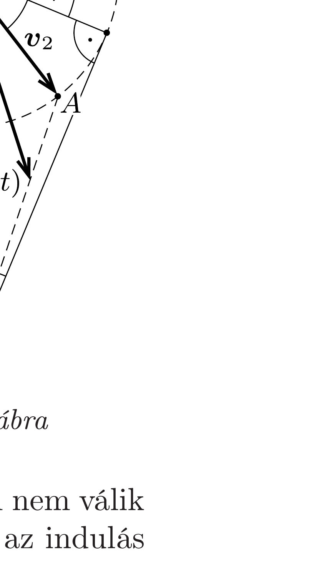

## Útmutatás

Vizsgáljuk meg, hogyan változik időben a gyöngy pillanatnyi sebességvektorának és a végsebesség vektorának a különbsége!

## Megoldás

A nehézségi eró és a közegellenállási eró hatására mozgó $m$ tömegú gyöngy mozgásegyenlete:
\[
m \frac{\Delta \boldsymbol{v}(t)}{\Delta t}=m \boldsymbol{g}-k \boldsymbol{v}(t) .
\]
A közegellenállás erőtörvényében szereplő $k$ állandót a végsebesség nagysága rögzíti:
\[
0=m \boldsymbol{g}-k \boldsymbol{v}_{1}, \quad \text { azaz } \quad k=\frac{m g}{v_{1}} .
\]
A mozgásegyenlet tehát így alakítható:
\[
\frac{\Delta \boldsymbol{v}(t)}{\Delta t}=\boldsymbol{g}-\frac{g}{v_{1}} \boldsymbol{v}(t) .
\]

Érdemes a gyöngy sebessége helyett annak és a végsebességnek az eltérését, vagyis az
\[
\boldsymbol{u}(t)=\boldsymbol{v}(t)-\boldsymbol{v}_{1}
\]
vektort vizsgálnunk. Ennek időbeli változását (1) értelmében a
\[
\frac{\Delta \boldsymbol{u}(t)}{\Delta t}=-\frac{g}{v_{1}} \cdot \boldsymbol{u}(t)=- \text { állandó } \cdot \boldsymbol{u}(t)
\]
egyenlet írja le. Eszerint az $\boldsymbol{u}(t)$ vektor a kezdeti $\boldsymbol{v}_{2}-\boldsymbol{v}_{1}$ értékről fokozatosan (de nem egyenletesen) csökkenve nullává válik, miközben az iránya nem változik:
\[
\boldsymbol{u}(t)=\lambda(t)\left(\boldsymbol{v}_{2}-\boldsymbol{v}_{1}\right),
\]
ahol $\lambda(0)=1$, és elegendően hosszú idő múlva $\lambda(t)$ nullára csökken. (Belátható, hogy $\lambda(t)$ - a radioaktív bomlások időbeli lefolyásához hasonlóan - exponenciálisan csökkenó függvény.)
a) Visszatérve az eredeti kérdéshez, (2) és (3) alapján megállapíthatjuk, hogy a gyöngy sebességét a
\[
\boldsymbol{v}(t)=[1-\lambda(t)] \cdot \boldsymbol{v}_{1}+\lambda(t) \cdot \boldsymbol{v}_{2}
\]
összefüggés adja meg. Geometriailag ez annyit jelent, hogy a gyöngy (közös $O$ pontból felmért) sebességvektorainak végpontja egy olyan egyenes szakasz mentén mozog, melynek egyik végpontja a vízszintes irányú kezdősebesség $\boldsymbol{v}_{2}$ vektorának $A$ végpontja, a másik pedig a végsebesség $\boldsymbol{v}_{1}$ vektorának $B$ végpontja (1. ábra). Az ábráról leolvasható, hogy a legkisebb sebességet úgy kapjuk, ha az $O$ pontból merőlegest bocsátunk az $A B$ szakaszra:
\[
v_{\min }=O P=\frac{v_{1} v_{2}}{\sqrt{v_{1}^{2}+v_{2}^{2}}} .
\]
(Az utolsó lépésnél felhasználtuk, hogy az $O P B$ és az $A O B$ derékszögü háromszögek hasonlóak.)
b) Ha a gyöngyszem kezdősebessége nem vízszintes, hanem azzal valamekkora $\alpha$ szöget zár be, akkor az $A$ pont egy $O$ középpontú, $v_{2}$ sugarú körvonal valamelyik pontja lesz. A 2. ábrán látható, hogy a $v_{2}<v_{1}$ esetben a gyöngy sebességének nagysága folyamatosan növekszik, amennyiben
\[
\alpha>\varphi=\arcsin \frac{v_{2}}{v_{1}} .
\]

Megjegyzés. $v_{2}>v_{1}$ esetben a gyöngy sebessége valamikor biztosan csökken. Belátható, hogy $\alpha<\arcsin \left(v_{1} / v_{2}\right)$ esetén a sebesség kezdetben csökken, majd egy idő után növekszik, míg az ellenkező esetben $v(t)$ mindvégig csökken.

