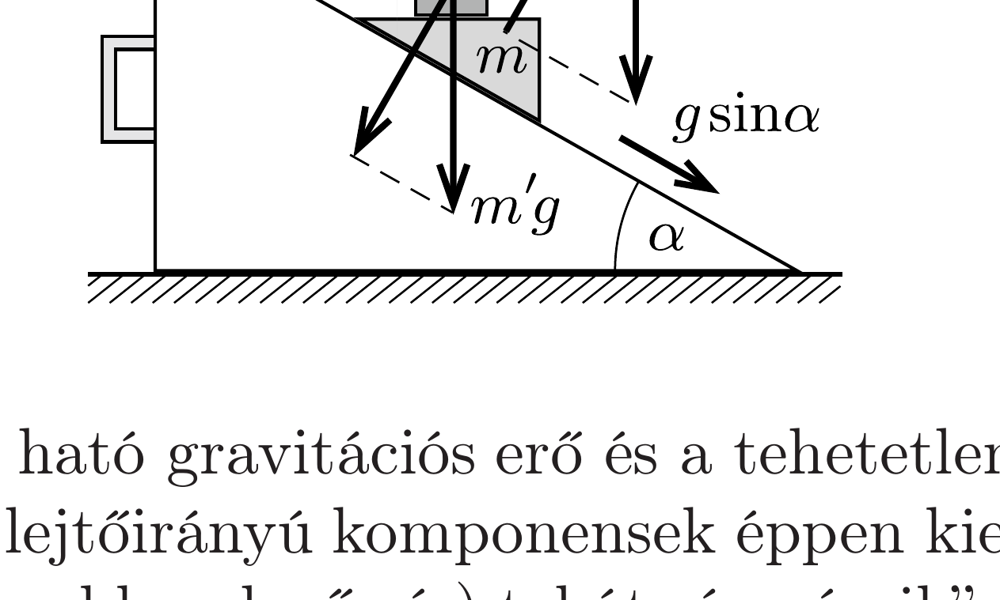

## Útmutatás

Vizsgáljuk a mozgást az ékhez rögzített koordináta-rendszerből!

## Megoldás

Az ékre a gravitációs eró és a lejtóre meróleges (esetleg időben változó nagyságú) $K$ eró hat. Ezen két erő hatására az ék (inerciarendszerbeli) gyorsulásának lejtőirányú komponense $g \sin \alpha$. Az ékhez rögzített (tehát gyorsuló) koordináta-rendszerben a Newton-féle mozgásegyenletek csak úgy maradnak érvényben, ha minden testnél a ténylegesen ható erókhöz hozzáadunk még egy $-m^{\prime} \boldsymbol{a}$ „tehetetlenségi erốt”, ahol $m^{\prime}$ a vizsgált testnek (például a folyadék valamely kicsiny részének) a tömege, $\boldsymbol{a}$ pedig az ék gyorsulása.

Az $m^{\prime}$ tömegú testre ható gravitációs erő és a tehetetlenségi erő eredője a lejtőre merőleges, hiszen a lejtőirányú komponensek éppen kiejtik egymást. Az éken levó testek (a pohár és az abban levő víz) tehát „úgy érzik”, mintha egy megváltozott, a lejtőre merőleges irányú gravitációs mezőben lennének, a víz felszíne tehát erre az irányra merólegesen, a lejtő síkjával párhuzamosan fog beállni.

Ez az állítás független attól, hogy a lejtő rögzített-e, vagy szabadon mozoghat, esetleg - külső erők hatására - ide-oda mozog. Mindaddig, amíg a lejtő és az ék közötti súrlódás elhanyagolható, továbbá biztosak lehetünk benne, hogy az ék nem emelkedik fel a lejtőről, a vízfelszín alakja nem térhet el a lejtóvel párhuzamos síktól.

Külön megfontolást érdemel az $m \gg M$ határeset. Ekkor az ék „kilöki” maga alól a lejtőt, és majdnem szabadon esik. Az éken levő testeknek (így a pohár
víznek is) majdnem teljesen „elvész a súlya”, de még az a kicsiny erő is, ami a vizet a pohárban tartja, a vízfelszínt a lejtő síkjával párhuzamosra állítja be.

Megjegyzés. Ha nyugalmi helyzetból indítjuk a rendszert, akkor a víz kilöttyenhet a pohárból; a lejtővel párhuzamos vízfelszín csak hosszú idő után, meglehetősen hosszú lejtőn alakulna ki. Emiatt a szokásos körülmények között kísérletileg nem tudjuk megvizsgálni ezt az érdekes jelenséget.
