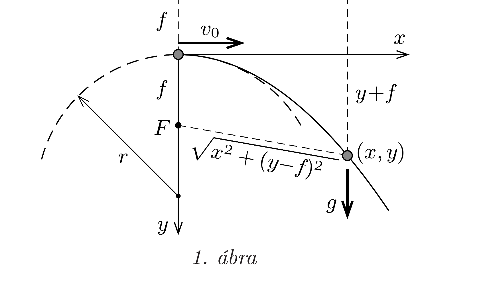
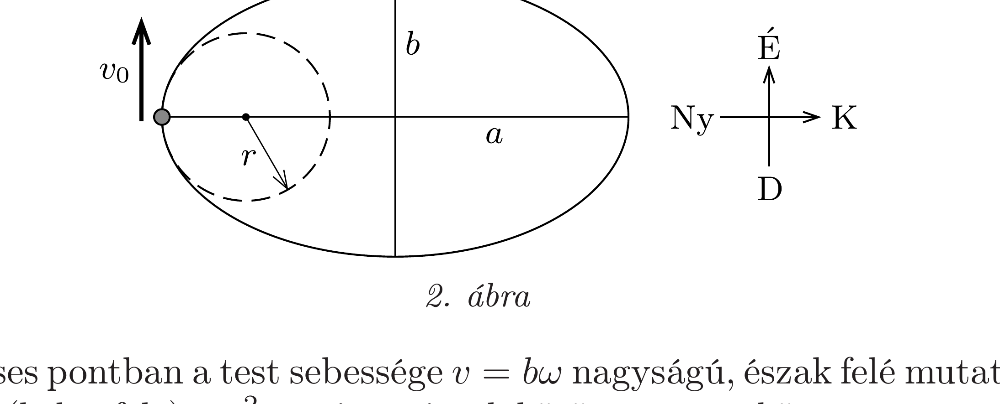
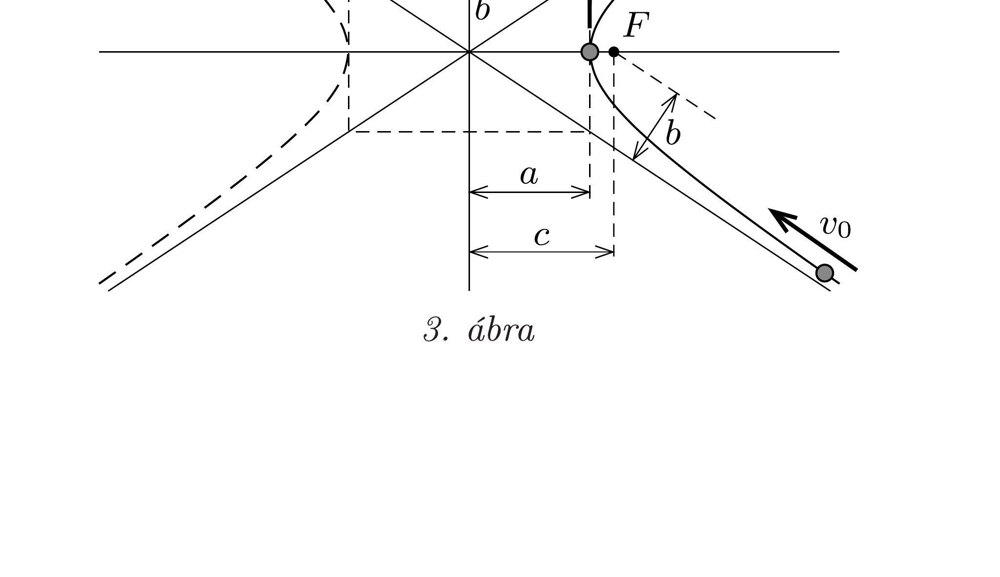

## Útmutatás

A görbületi sugár $(r)$ fogalma a fizikában a körmozgás centripetális gyorsulásának képletében bukkan fel: $a=v^{2} / r$, ahol $v$ a pillanatnyi sebesség. Ez az összefüggés a dinamika $F=m a$ alaptörvényével kombinálva - alkalmasan választott erőtörvény és kezdősebesség mellett - lehetőséget ad a görbületi sugár „fizikus módon” történő meghatározására.

## Megoldás

$a)$ Egy $f$ fókusztávolságú parabola egyenlete az 1. ábrán látható koordináta-rendszerben:
\[
x^{2}=4 f y,
\]
amint az a parabolát definiáló $(y+f)^{2}=(y-f)^{2}+x^{2}$ egyenletből közvetlenül adódik.

Mekkora sebességgel kell vízszintesen elhajítanunk egy kis testet, hogy annak pályája éppen a megadott parabola legyen? A hajítás kinematikai képletei szerint
\[
x=v_{0} t \quad \text { és } \quad y=\frac{g}{2} t^{2}
\]
ahonnan a pálya egyenlete
\[
y=\frac{g}{2 v_{0}^{2}} x^{2}=\frac{1}{4 f} x^{2}, \quad \text { ha } \quad v_{0}^{2}=2 g f .
\]

A pálya kezdőpontjában (a parabola csúcspontjában) a szabadon eső test sebességre merőleges (centripetális) gyorsulása éppen $g$, sebessége $v_{0}$, innen a görbületi sugárra
\[
r=\frac{v_{0}^{2}}{g}=2 f
\]
adódik.
Megjegyzés. Ugyanezt az eredmény optikai megfontolással is megkaphatjuk, hiszen jól ismert, hogy egy $r$ sugarú gömbtükör (optikai) fókusztávolsága $f=r / 2$, és ez megegyezik
azon forgásparaboloid vezérgörbéjének (matematikai értelemben vett) fókusztávolságával, amely felületét a szóban forgó gömbtükör a legjobban közelíti.
b) Tekintsünk egy $m$ tömegü testet, amely egy $\ell$ hosszúságú fonál végén - kúpingaként - térbeli mozgást végezhet. Kicsiny kezdősebesség esetén a test az egyensúlyi helyzete körül kis amplitúdójú harmonikus rezgéseket végez, a lengések körfrekvenciája (a kitérítés irányától függetlenül) $\omega$. (A körfrekvencia nagyságát az inga hossza és a nehézségi gyorsulás határozza meg, konkrét értékére azonban nincs szükségünk.)

Ha a testet megfeleló sebességgel indítjuk el, elérhetjük, hogy kelet-nyugat irányban $a$ amplitúdójú harmonikus mozgást végezzen, észak-dél irányban pedig 90°-os fáziseltolódással $b$ amplitúdójú, ugyancsak harmonikus rezgőmozgással mozogjon. Pályája ekkor $a$ és $b$ féltengelyú ellipszis lesz $(a>b)$, és ennek az ellipszisnek keressük a görbületi sugarát a nagytengely egyik végpontjában (2. ábra).

A kérdéses pontban a test sebessége $v=b \omega$ nagyságú, észak felé mutató vektor. Gyorsulása (kelet felé) $a \omega^{2}$, amit a simulókörön végzett körmozgás centripetális gyorsulásának $\left(a_{\mathrm{cp}}\right)$ is tekinthetünk. Eszerint $v^{2} / r=a_{\mathrm{cp}}$, a keresett görbületi sugár tehát
\[
r=\frac{v^{2}}{a_{\mathrm{cp}}}=\frac{b^{2} \omega^{2}}{a \omega^{2}}=\frac{b^{2}}{a} .
\]
c) Kepler (általánosított) I. törvénye szerint az égitestek olyan kúpszelet alakú pályán mozognak, amelynek egyik $F$ fókuszpontja a Nap. Ez a pálya lehet hiperbola is, ha az égitest sebessége még a „végtelenben" (értsd: a Naptól nagyon messze) is valamekkora $v_{0}>0$ érték.

Jelöljük az égitest sebességét a napközeli pontban (a perihéliumban) $v_{1}$-gyel! A 3. ábra jelöléseit követve az energia- és a perdületmegmaradás törvénye így írható fel:
\[
\frac{1}{2} m v_{0}^{2}=\frac{1}{2} m v_{1}^{2}-\gamma \frac{m M}{c-a},
\]
illetve
\[
v_{0} b=v_{1}(c-a),
\]
ahol $b=\sqrt{c^{2}-a^{2}}$ a hiperbola (képzetes) kistengelye.
A fenti összefüggésekből kiszámítható az égitest napközeli sebességnégyzete:
\[
v_{1}^{2}=\gamma M \frac{b^{2}}{a(c-a)^{2}},
\]
és mivel a gyorsulása (Newton gravitációs törvénye szerint) $a_{\text {grav }}=\gamma M /(c-a)^{2}$, így a pálya görbületi sugara
\[
r=\frac{v_{1}^{2}}{a_{\mathrm{grav}}}=\frac{b^{2}}{a},
\]
ami alakilag megegyezik az ellipszisnél kapott eredménnyel.
d) Utolsó példaként számítsuk ki egy szinuszgörbe simulókörének sugarát a görbe szélsőérték-pontjaiban! Ha egy $D$ rugóállandójú, függőlegesen felfüggesztett rugó alsó végére egy $m$ tömegú testet erősítünk, és azt $A$ amplitúdójú, függőleges rezgésbe hozzuk, akkor a rezgés periódusideje
\[
T=2 \pi \sqrt{\frac{m}{D}} .
\]

Szemléljük ezt a mozgást egy olyan vonatkoztatási rendszerből, amely egyenletes $v$ sebességgel mozog vízszintes irányban. Ebből a rendszerből nézve a test pályája $A$ amplitúdójú, $\lambda=v T$ hullámhosszúságú szinuszgörbe. A legnagyobb kitérésú pontokban a test vízszintes sebessége $v$, gyorsulása Newton II. törvénye szerint szerint $a=D A / m$, a görbe simulókörének sugara tehát
\[
r=\frac{v^{2}}{a}=\frac{\lambda^{2}}{T^{2}} \cdot \frac{m}{D A}=\frac{\lambda^{2}}{4 \pi^{2} A} .
\]
