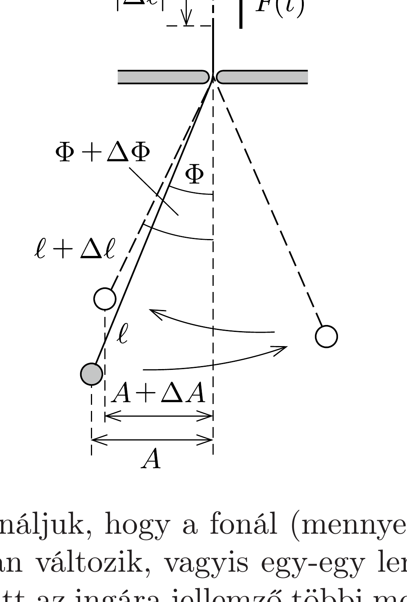

## Útmutatás

Számítsuk ki, hogy mekkora átlagos eróvel kell tartanunk a fonalat, és mekkora munkát végzünk akkor, ha egy-egy lengés alatt a fonál hosszát kicsiny $\Delta \ell$ értékkel csökkentjük.

## Megoldás

Vizsgáljuk meg, mekkora munkát végzünk, miközben a fonál hosszát valamekkora $\Delta \ell<0$ értékkel megváltoztatjuk, vagyis a fonál végét $|\Delta \ell|$ távolsággal megemeljük. Ez a munka az ingatest teljes mechanikai energiájának megváltozásával egyenlő. Az energiát az inga (pillanatnyi) hosszával és a lengések amplitúdójával kifejezve beláthatjuk, hogy a végzett munka hatására a lengések szögkitérése növekszik, a lineáris kitérés pedig csökken.

A továbbiakban felhasználjuk, hogy a fonál (mennyezettől az ingatestig mérhetó) $\ell$ hossza időben lassan változik, vagyis egy-egy lengés alatt a relatív megváltozása $|\Delta \ell| / \ell \ll 1$. Emiatt az ingára jellemző többi mennyiség (pl. a maximális szögkitérés, a legnagyobb lineáris kitérés) is csak lassan változik, egy-egy lengés ideje alatt állandónak tekinthető, a fonálerő pedig a (felülvonással jelölt) időbeli átlagértékével helyettesíthető.

Jelöljük az inga maximális szögkitérését $\Phi$-vel, a lineáris kitérést (amplitúdót) pedig $A$-val $(A=\ell \Phi)$. Az ingatest $\varphi(t)$ szögkitérését és $v(t)$ pillanatnyi sebességét az idő függvényében a harmonikus rezgőmozgást leíró
\[
\varphi(t)=\Phi \sin (\omega t) \quad \text { és } \quad v(t)=\Phi \ell \omega \cos (\omega t)
\]
összefüggések adják meg, ahol $\omega=\sqrt{g / \ell}$ az aktuális ingahosszhoz tartozó körfrekvencia.

Igaz ugyan, hogy az $m g$ nehézségi erőnek csak $m g \cos \varphi \leq m g$ komponense járul hozzá a fonálerőhöz, viszont a centripetális gyorsuláshoz szükséges $m v^{2} / \ell$ „többleterót” is a fonálnak kell fedeznie. Emiatt a fonalat feszítő eró (kis szögkitérések esetén)
\[
F(t)=m g \cos \varphi+\frac{m v^{2}}{\ell} \approx m g\left(1-\frac{\varphi^{2}}{2}\right)+\frac{m v^{2}}{\ell} .
\]
Az (1) egyenletek felhasználásával:
\[
F(t)=m g+m g \Phi^{2}\left(-\frac{\sin ^{2}(\omega t)}{2}+\cos ^{2}(\omega t)\right),
\]
melynek időátlaga $\overline{\sin ^{2} \varphi}=\overline{\cos ^{2} \varphi}=1 / 2$ miatt
\[
\bar{F}=m g\left(1+\frac{\Phi^{2}}{4}\right) .
\]

Az inga teljes mechanikai energiája (ha a helyzeti energiát a mennyezetnél választjuk nullának)
\[
E=-m g \ell+\frac{1}{2} m v_{\max }^{2}=-m g \ell+\frac{1}{2} m \Phi^{2} \ell^{2} \omega^{2},
\]
amit a körfrekvencia értékének behelyettesítésével így is írhatunk:
\[
E=m g \ell\left(-1+\frac{\Phi^{2}}{2}\right) .
\]
Ha az inga hosszát kicsiny $\Delta \ell$ értékkel megváltoztatjuk, és eközben szögkitérése $\Delta \Phi$ szöggel változik, akkor a mechanikai energia kis megváltozását (3) alapján a következő módon számolhatjuk:
\[
\Delta E=m g \Delta \ell\left(-1+\frac{\Phi^{2}}{2}\right)+m g \ell \Phi \Delta \Phi .
\]

Alkalmazzuk most a munkatételt az inga egy lengésére!
\[
\bar{F} \cdot|\Delta \ell|=\Delta E,
\]
ami (2) és (4) alapján így írható:
\[
-m g \Delta \ell\left(1+\frac{\Phi^{2}}{4}\right)=m g \Delta \ell\left(-1+\frac{\Phi^{2}}{2}\right)+m g \ell \Phi \Delta \Phi,
\]
amiből rendezés után kapjuk, hogy
\[
\frac{\Delta \Phi}{\Phi}=-\frac{3}{4} \frac{\Delta \ell}{\ell}>0 .
\]

Ez az összefüggés azt mutatja, hogy az inga hosszának csökkentésével a lengések szögkitérése lassan növekszik, az $A=\ell \Phi$ lineáris kitérés nagysága viszont csökken, mert
\[
\frac{\Delta A}{A}=\frac{\Delta \Phi}{\Phi}+\frac{\Delta \ell}{\ell}=+\frac{1}{4} \frac{\Delta \ell}{\ell}<0 .
\]

Megjegyzés. Szorozzuk meg az (5) egyenlet mindkét oldalát $\ell^{3} \Phi^{4}$-nel. Rendezés után a következőt kapjuk:
\[
4 \ell^{3} \Phi^{3} \Delta \Phi+3 \Phi^{4} \ell^{2} \Delta \ell=0,
\]
ami még
\[
\Delta\left(\ell^{3} \Phi^{4}\right)=0
\]
alakban is felírható. Ezek szerint az inga hosszának lassú csökkentésekor az $\ell^{3} \Phi^{4}$ mennyiség nem változik.

Ebből a „megmaradási törvényből” az is következik, hogy az inga energiájának a helyzeti energiát nem tartalmazó $E^{*}=E+m g \ell$ részének és a körfrekvenciának a hányadosa az ingahossz fokozatos változása ellenére jó közelítéssel állandó marad:
\[
\frac{E^{*}}{\omega}=\frac{\frac{1}{2} m g \ell \Phi^{2}}{\sqrt{g / \ell}}=\frac{m \sqrt{g}}{2} \sqrt{\ell^{3} \Phi^{4}} .
\]
Az ilyen tulajdonságú mennyiségeket (amelyek egy paraméter lassú változása során gyakorlatilag nem változnak) adiabatikus invariánsoknak nevezzük. Ezek fontos szerepet kapnak a kvantumelméletben is. Az inga lengéseihez hasonló „rezgő rendszerek" (harmonikus oszcillátorok) kvantált energiaszintjeit az
\[
E_{n}=\left(n+\frac{1}{2}\right) \hbar \omega, \quad(n=0,1,2, \ldots)
\]
formula adja meg. Az $E / \omega$ hányados adiabatikus invariáns volta azt biztosítja, hogy egy külső paraméter (esetünkben $\ell$ ) lassú változása, tehát külső munkavégzés során az $n$ kvantumszám állandó marad. A kvantumállapot $n$ „indexe” ezért csak rendezetlen energiaátadással, hőközléssel változtatható meg. (Lásd a 359. feladat II. megoldását.)
