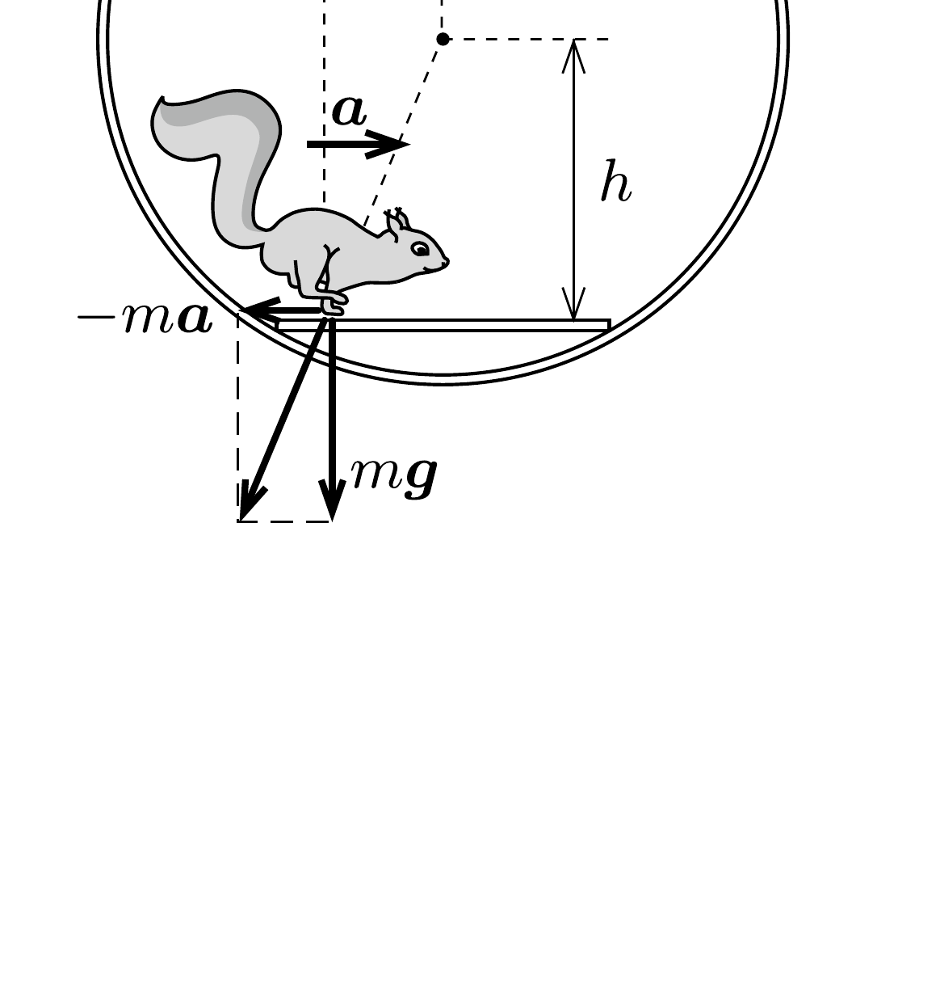

## Útmutatás

A mókus - ha gyorsulva mozog - vízszintes irányú eróvel is hat a létrára. Ennek az erőnek a forgatónyomatéka kiegyensúlyozhatja a mókus súlyából származó forgatónyomatékot.

## Megoldás

Jelöljük a létra középpontjának a kerék tengelyétől mért távolságát $h$-val, a mókus és a létra középpontjának (előjeles) távolsága pedig legyen $x$ (lásd az ábrát).

Az $m$ tömegű mókus egy adott pillanatban akkor tud $a$ gyorsulással mozogni, ha a létra ma nagyságú súrlódási eróvel hat rá. Ennek az erőnek az ellenereje mah forgatónyomatékot, a mókus súlya pedig $m g x$ forgatónyomatékot fejt ki a kerékre. A mókuskerék (és a létra) akkor maradhat mozdulatlan, ha
\[
m a h+m g x=0, \quad \text { azaz } \quad a=-\frac{g}{h} x .
\]
Ez az összefüggés egy olyan harmonikus rezgőmozgásra jellemző, amelynek körfrekvenciája $\omega=\sqrt{g / h}$, fél periódusideje pedig
\[
T=\frac{\pi}{\omega}=\pi \sqrt{\frac{h}{g}}=\pi \sqrt{\frac{\sqrt{3} R}{2 g}}=0,66 \mathrm{~s} .
\]
Ennyi idő alatt futhat át a mókus a mozdulatlan létrán, ha ügyesen választja meg mozgásának „ütemét”.
