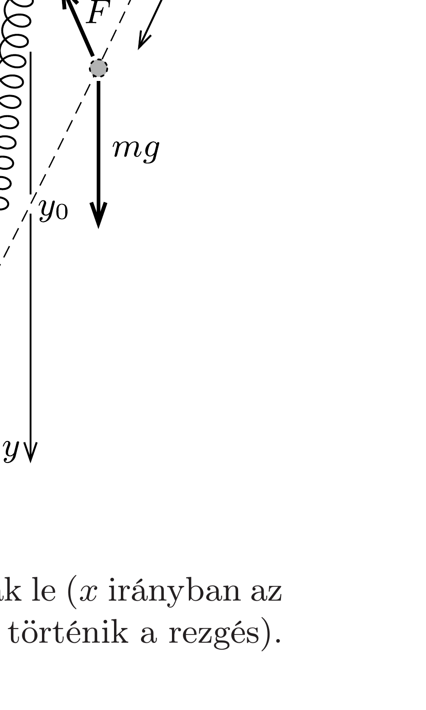

## Útmutatás

Az adott körülmények között az $m$ tömegü test vízszintes és függőleges mozgása egyaránt harmonikus rezgőmozgással közelíthető.

## Megoldás

Kezdetben - a rugó lazasága miatt - a test lényegében szabadon esik. A rugó hossza hamarosan az eredeti érték többszöröse lesz, és a mozgás további szakaszában a rugó nyújtatlan hosszát a tényleges hossza mellett akár el is hanyagolhatjuk. Ebben a közelítésben a test mozgása mind vízszintesen, mind függőlegesen azonos frekvenciájú harmonikus rezgőmozgás lesz. Mivel a testet kezdősebesség nélkül indítjuk, a felfüggesztési pont alá a vízszintes mozgás negyed periódusideje után érkezik. Ezalatt a függőleges mozgás is egy negyed periódust fut be, tehát éppen az egyensúlyi helyzetéig, $m g / D$ mélységig süllyed le a test. (Ez sokkal nagyobb, mint $L$.)

Megjegyzések. 1. A mozgást számításokkal is nyomon követhetjük. Az ( $y$ irányban erősen zsugorított méretarányú) ábrán látható koordináta-rendszerben az $(x, y)$ helyvektorú pontban levó test mozgásegyenletei:
\[
\begin{aligned}
& m a_{x}=-D\left(\sqrt{x^{2}+y^{2}}-L\right) \frac{x}{\sqrt{x^{2}+y^{2}}}, \\
& m a_{y}=-D\left(\sqrt{x^{2}+y^{2}}-L\right) \frac{y}{\sqrt{x^{2}+y^{2}}}+m g .
\end{aligned}
\]
A mozgás kezdeti szakaszában (amikor a rugó megnyúlása még nem sokkal nagyobb, mint $L$ ), a rugóerőt elhanyagolhatjuk. Amikor viszont $\sqrt{x^{2}+y^{2}} \gg L$, akkor a rugó nyújtatlan hosszát hanyagolhatjuk el, és a mozgásegyenletek a következő egyszerú alakot öltik:

\[
m a_{x}=-D x \quad \text { és } \quad m a_{y}=-D y+m g .
\]
Ezek az egyenletek azonos frekvenciájú harmonikus rezgőmozgást írnak le ( $x$ irányban az origó körül, $y$ irányban pedig az $y_{0}=m g / D$ egyensúlyi helyzet körül történik a rezgés).

Az indítási feltételekhez igazodó megoldás:
\[
x(t)=L \cos \left(\sqrt{\frac{D}{m}} t\right), \quad y(t)=\frac{m g}{D}\left[1-\cos \left(\sqrt{\frac{D}{m}} t\right)\right] .
\]
A felfüggesztési pont alá akkor ér a test, amikor $x(t)=0$, ekkor $y=y_{0}=m g / D$, összhangban a fenti érveléssel.
2. A rezgőmozgást leíró függvények a mozgás kezdeti szakaszára (ahol szigorúan véve még nem érvényesek) $x(t) \approx L$ és $y(t) \approx g t^{2} / 2$ módon közelíthetők, és ezek összhangban állnak az akkor érvényes (szabadesést leíró) képletekkel.
