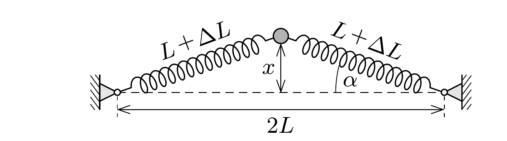
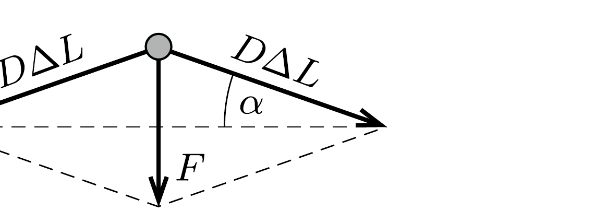

## Útmutatás

Kis kitéréseknél a rugók által kifejtett visszatérítő erő nem arányos a kitéréssel, a test rezgése ezért nem harmonikus. Energetikai megfontolásokkal vagy dimenzióanalízissel azonban kideríthetjük, hogyan függ a kapott erőtörvény szerint mozgó test periódusideje a tömegétől, a rugóállandótól és a rezgés amplitúdójától.

## Megoldás

I. megoldás. a) Ha a testet eredeti helyzetéből $x$ távolsággal kitérítjük, akkor az eredetileg $L$ hosszúságú rugók megnyúlása
\[
\Delta L=\sqrt{L^{2}+x^{2}}-L,
\]
a testre ható eredő erő tehát
\[
F=-2 D \Delta L \sin \alpha=-2 D\left(\sqrt{L^{2}+x^{2}}-L\right) \frac{x}{\sqrt{L^{2}+x^{2}}},
\]
ahol $\alpha$ a kitérített helyzetú rugó szöge az eredeti irányához viszonyítva (lásd az ábrát).

A rugók megnyúlását megadó (1) összefüggést
\[
\Delta L \cdot(\Delta L+2 L)=x^{2}
\]
alakra hozhatjuk. Ha a test kitérése kicsi $(x \ll L)$, akkor $\Delta L \ll 2 L$, a fenti zárójelben levő első tag tehát elhanyagolható a második tag mellett. Ebben a közelítésben
\[
\Delta L \approx \frac{x^{2}}{2 L}, \quad \text { illetve } \quad F \approx-D \frac{x^{3}}{L^{2}} .
\]
b) Hogyan függ egy ilyen - anharmonikus rezgést végző - test periódusideje az amplitúdótól? Mivel a rugók megnyúlása $x^{2}$-tel arányos, a bennük tárolt rugalmas energia a kitérés negyedik hatványával arányosan növekszik. Ha összehasonlítjuk az 1 cm-es és a 2 cm-es amplitúdójú rezgést, megállapíthatjuk, hogy a jobban kitérített testnél a rendszer teljes energiája $2^{4}=16$-szor nagyobb, mint a kevésbé kitérítettnél. Ugyanez az arány a legnagyobb mozgási energiák között is, amiből következik, hogy a jobban kitérített test legnagyobb sebessége 4-szer nagyobb, mint az eredeti esetben volt.

Hasonló érveléssel látható be, hogy a 2 cm-ról indított test sebessége nem csak az egyensúlyi helyzeten való áthaladáskor, hanem minden helyzetben 4-szerese az 1 cm-es amplitúdójú mozgás megfeleló (felére kicsinyített helyzetú) sebességének. 2 cm-es amplitúdónál tehát a teljes (2-szer hosszabb) utat fele annyi idő alatt teszi meg a test, mint 1 cm-es amplitúdó esetén, ezért a 2 cm-es amplitúdójú rezgés periódusideje 1 s.
II. megoldás. b) Keressünk kapcsolatot a periódusidő és az amplitúdó között egy olyan anharmonikus rezgőmozgásnál, melyet (kis kitérések esetén) az
\[
F=-k \cdot x^{3}
\]
mozgásegyenlet ír le. A $T$ periódusidő függhet a $k$ arányossági tényezőtől, a test $m$ tömegétől és a rezgés $A$ amplitúdójától. A kérdéses kapcsolat - dimenzionális okokból - csakis
\[
T \sim \sqrt{\frac{m}{k A^{2}}}
\]
alakú lehet. Ezek szerint adott $D, L$ és $m$ esetén a periódusidó fordítottan arányos a legnagyobb kitéréssel, a kérdéses 2 cm-es amplitúdónál tehát $T=1 \mathrm{~s}$.
