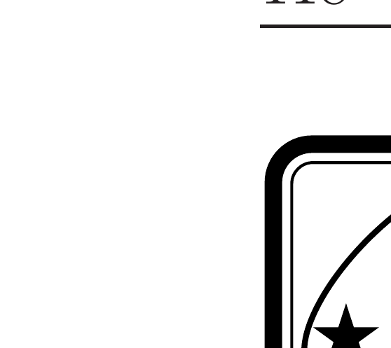
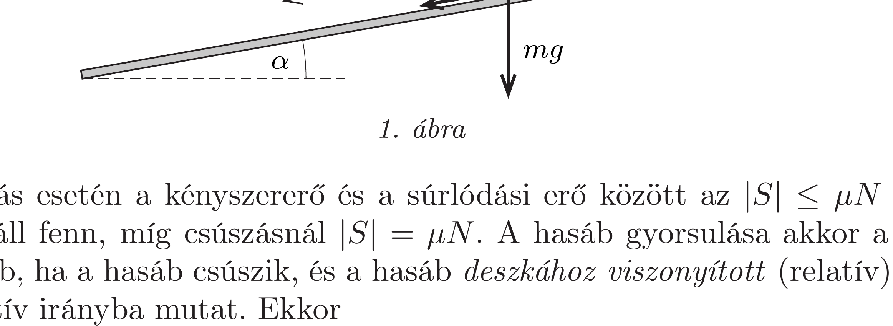
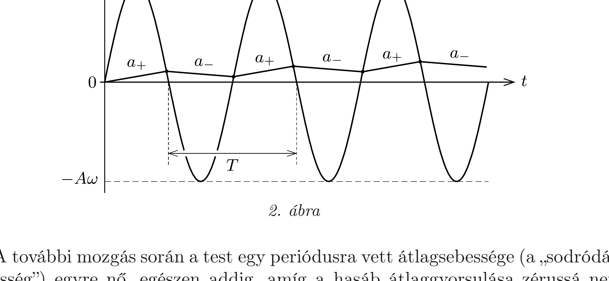
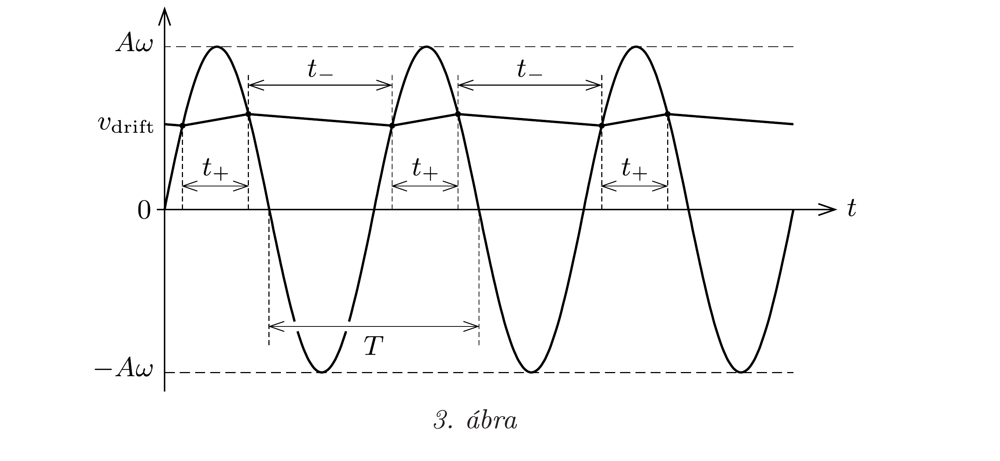
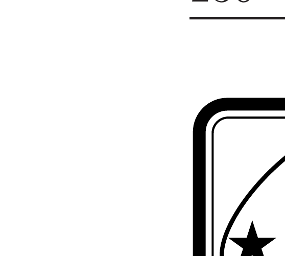

## Útmutatás

Megmutatható, hogy a hasáb a rezgetés közben nem tapadhat a deszkalaphoz, hanem azon (felfelé vagy lefelé) mindig csúszik. A hasáb sebessége időben szakaszonként egyenletesen változik: az egyik szakaszban nő, a rá következőben csökken. A gyorsan kialakuló, többé-kevésbé állandósult mozgásállapotban a sebesség egy bizonyos $v_{\text {drift }}$ érték körül ingadozik; ennek a „sodródási sebességnek" a nagysága határozza meg a leérkezés idejét.

\section*{Gravitáció, bolygómozgás}

## Megoldás

Az $m$ tömegú hasábra az $m g$ nehézségi erő, a lejtőre merőleges $N$ kényszereró és az $S$ (csúszási vagy tapadási) súrlódási eró hat, utóbbi iránya a deszkalap rezgetése során változik. A test mozgásegyenletei a lejtőre merőleges, illetve azzal párhuzamos irányban:
\[
N-m g \cos \alpha=0, \quad S+m g \sin \alpha=m a .
\]
Az a gyorsulás előjelét a lejtés irányában választottuk pozitívnak (1. ábra).

Tapadás esetén a kényszererő és a súrlódási erő között az $|S| \leq \mu N$ egyenlőtlenség áll fenn, míg csúszásnál $|S|=\mu N$. A hasáb gyorsulása akkor a lehető legnagyobb, ha a hasáb csúszik, és a hasáb deszkához viszonyított (relatív) sebessége negatív irányba mutat. Ekkor
\[
a_{\max }=g(\sin \alpha+\mu \cos \alpha),
\]
amelyre az adatok behelyettesítése után $a_{\max } \approx 5,6 \mathrm{~m} / \mathrm{s}^{2}$ adódik. A deszkalap legnagyobb gyorsulása a harmonikus rezgés következtében $A \omega^{2}=250 \mathrm{~m} / \mathrm{s}^{2}$, ami több mint 40-szer akkora, mint $a_{\text {max }}$ értéke, így a hasáb a rezgetés indításakor azonnal megcsúszik. Látni fogjuk, hogy a test a további mozgása során sehol sem tapad meg, tehát mindvégig az állandó nagyságú csúszási súrlódási erő hat rá - jóllehet annak iránya állandóan váltakozik.

A hasáb gyorsulása a mozgás során tehát kétféle értéket vehet fel aszerint, hogy a hasábra ható súrlódási eró éppen pozitív vagy negatív irányba mutat:
\[
a_{ \pm}=g(\sin \alpha \pm \mu \cos \alpha),
\]
és mivel a megadott számadatok szerint $\mu>\operatorname{tg} \alpha$, így $a_{+}$előjele pozitív, $a_{-}$ előjele pedig negatív. Ha a hasáb a rezgetés bekapcsolását követő első periódusban egyhelyben maradna, akkor a $T=2 \pi / \omega$ periódusidő alatt a hasáb $T / 2$ ideig $a_{+}$ gyorsulással, majd további $T / 2$ ideig $a_{-}$gyorsulással mozogna. Mivel $\left|a_{+}\right|>\left|a_{-}\right|$, így az első periódus alatt a hasáb gyorsulásának időbeli átlaga nem nulla, azaz a hasáb nem marad egyhelyben, hanem elindul a lejtőn lefelé. A 2. ábrán a hasáb és a lejtő sebességét láthatjuk az idő függvényében. A hasáb sebességének grafikonja $a_{+}$és $a_{-}$meredekségú egyenes szakaszokból áll, és láthatjuk, hogy a sebesség, ha „töredezve” is, de fokozatosan növekszik, miközben a hasáb lefelé sodródik a deszkán.

A további mozgás során a test egy periódusra vett átlagsebessége (a „sodródási sebesség") egyre nő, egészen addig, amíg a hasáb átlaggyorsulása zérussá nem válik. Ez az állandósult mozgás a viszonylag nagy rezgetési frekvencia miatt hamar kialakul, így a teljes mozgási idő becslésekor a kezdeti felgyorsulás időszakát el is hanyagolhatjuk.

A stacionárius, lefelé „sodródó" mozgás alatt a hasáb sebessége egy állandó $v_{\text {drift }}$ érték körül ingadozik. A 3. ábrán látható grafikon a deszka és a hasáb sebességét mutatja az idő függvényében, amikor a hasáb egy rezgetési periódusra vett átlagsebessége már nem növekszik tovább. Az $a_{+}$gyorsulású mozgásszakasz addig tart, amíg a deszka (előjeles) sebessége nagyobb a hasáb sebességénél, míg
az $a_{-}$gyorsulású szakaszban a helyzet éppen fordított. Az állandósult sodródás feltétele, hogy a test egy periódusra átlagolt gyorsulása nulla legyen:
\[
\langle a\rangle \equiv \frac{a_{+} t_{+}+a_{-} t_{-}}{T}=0,
\]
ahol $t_{+}$és $t_{-}$jelentése a 3. ábráról leolvasható. A két időtartam között természetesen fennáll a következő összefüggés:
\[
T=t_{+}+t_{-} .
\]

Az (1)-(3) egyenletekből megkaphatjuk a $t_{+}$időtartam hosszát:
\[
t_{+}=\frac{a_{-}}{a_{-}-a_{+}} T=\left(1-\frac{\operatorname{tg} \alpha}{\mu}\right) \frac{T}{2} .
\]
A sodródási sebességet pedig abból a feltételből határozhatjuk meg, hogy a hasáb gyorsulása akkor vált irányt, amikor a deszka és a hasáb sebessége megegyezik. A sebesség ( $v_{\text {drift }}$ értékéhez képest kicsiny) fluktuációját elhanyagolva:
\[
v_{\mathrm{drift}} \approx A \omega \sin \left(\frac{\pi}{2}-\omega \frac{t_{+}}{2}\right)=A \omega \cos \left(\omega \frac{t_{+}}{2}\right) .
\]
Behelyettesítve (4)-et a következő végeredményre jutunk:
\[
v_{\mathrm{drift}}=A \omega \cos \left[\left(1-\frac{\operatorname{tg} \alpha}{\mu}\right) \frac{\pi}{2}\right]=A \omega \sin \left(\frac{\pi \operatorname{tg} \alpha}{2 \mu}\right) .
\]
A számszerú adatokat felhasználva $v_{\text {drift }} \approx 0,32 \mathrm{~m} / \mathrm{s}$ értéket kapunk, így a hasáb mozgásának becsült ideje:
\[
t=\frac{L}{v_{\mathrm{drift}}} \approx 18,8 \mathrm{~s} .
\]

Hátravan még annak belátása, hogy a hasáb valóban nem tapad meg soha a lejtőn. A megtapadásnak két feltétele van: az egyik, hogy egy adott pillanatban
a test és a deszkalap sebessége megegyezzen; a másik, hogy ugyanebben a pillanatban a deszka gyorsulásának nagysága kisebb legyen $\left|a_{+}\right|$-nál vagy $\left|a_{-}\right|$-nál aszerint, hogy a deszka épp lefelé vagy felfelé gyorsul. Az elsó feltétel a 3. ábrán láthatóan minden rezgetési periódusban kétszer teljesül, éppen akkor, amikor a csúszási súrlódási eró irányt vált, de ezek a pillanatszerú „együttmozgások” nem tekinthetők tartós, valódi megtapadásnak. A sebesség-idő grafikonról látszik, hogy a tartós megtapadások mindkét feltétele csak akkor teljesülhet egyszerre, amikor a deszka gyorsulása nagyon kicsi, azaz sebessége nagy ( $A \omega$-hoz közeli). Ekkora sebességre azonban nem tud felgyorsulni a hasáb, mert már előbb beáll az ennél jóval kisebb $v_{\text {drift }}$ sebességérték. A hasáb tehát valóban mindvégig csúszva halad a lejtőn.

Megjegyzés. A megoldás során felhasználtuk, hogy a mozgás első, átmeneti szakasza (amely alatt a hasáb átlagsebessége eléri a $v_{\text {drift }}$ értéket) rövid. Részletesebb számolással megmutatható, hogy ez az időtartam közelítőleg
\[
\tau \approx \frac{A \omega}{\mu g \cos \alpha} \approx 0,13 \mathrm{~s},
\]
tehát a becslésnél elkövetett hibánk valóban elhanyagolható (1-2\% körüli érték).

\section*{Gravitáció, bolygómozgás}
