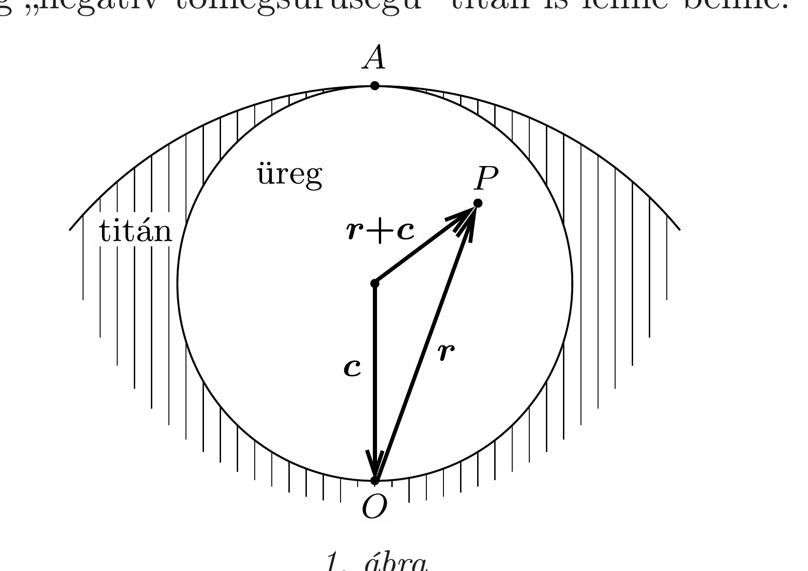
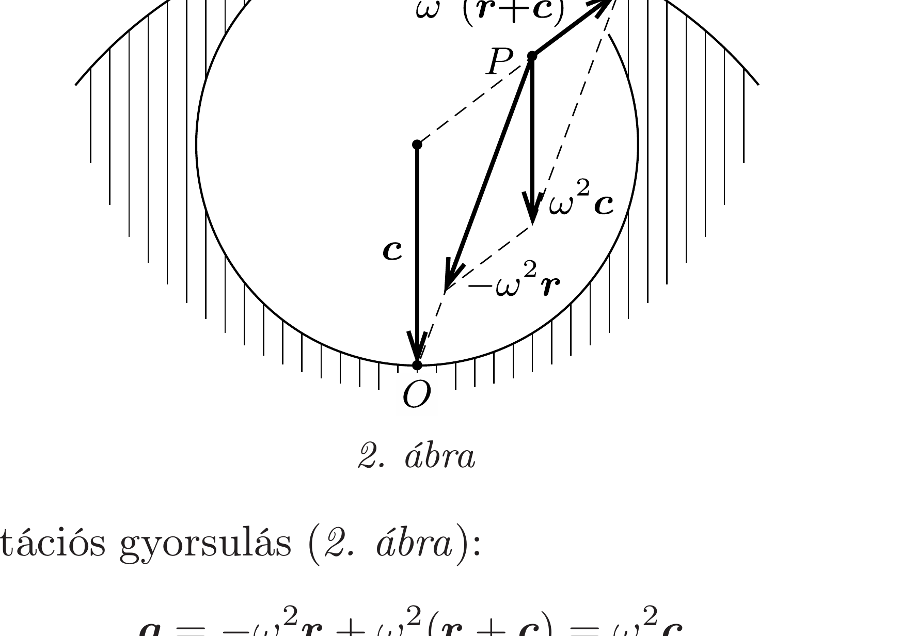

## Útmutatás

Szükségünk lesz arra az ismeretre, hogy egy homogén tömegeloszlású gömb belsejében a gravitációs gyorsulás a középponttól mért távolsággal egyenesen arányos. A lyukas gömb gravitációs tere egy homogén gömb és egy „negatív tömegsúrúségú", feleakkora sugarú gömb terének szuperpozíciójaként állítható elő.

## Megoldás

Először foglalkozzunk a keskeny (a kisbolygó egészéhez képest elhanyagolható térfogatú) próbafurattal! A kisbolygó súrúsége legyen $\varrho$, sugara pedig $R!$ A középponttól $r$ távolságra a gravitációs gyorsulás úgy számolható, mintha csak az „alatta” levő $r$ sugarú gömb lenne jelen:
\[
g(r)=\gamma \frac{m(r)}{r^{2}}=\gamma \frac{\varrho \frac{4}{3} \pi r^{3}}{r^{2}}=\frac{4 \pi \gamma \varrho}{3} r .
\]
A gravitációs gyorsulás tehát a középponttól mért távolsággal egyenesen arányos, iránya mindig a kisbolygó középpontja felé mutat. Eszerint az első szerencsétlenül járt zöld emberke $R$ amplitúdójú harmonikus rezgőmozgással haladt a végzete felé, ami negyedperiódusnyi idő múlva érte el. Az (1) kifejezésben $r$ együtthatója éppen $\omega^{2}$-tel, a rezgési körfrekvencia négyzetével egyezik meg:
\[
\omega=\sqrt{\frac{4 \pi \gamma \varrho}{3}},
\]
ebből az esési idő:
\[
T_{1}=\frac{1}{4} \cdot \frac{2 \pi}{\omega}=\frac{1}{4} \sqrt{\frac{3 \pi}{\gamma \varrho}} .
\]
A becsapódási sebességet az amplitúdó és a körfrekvencia szorzataként kaphatjuk meg:
\[
v_{1}=R \omega=2 R \sqrt{\frac{\pi \gamma \varrho}{3}} .
\]

A második szerencsétlenség idején a titánfalók már kitermelték a kisbolygó anyagának egynyolcadát. Meg kell határoznunk a gravitációs mezőt a felszíntől a középpontig terjedő gömb alakú üregben. Ezt a szuperpozíciós elv „trükkös” alkalmazásával tesszük: az üreget úgy képzeljük el, mintha „rendes" titán töltené ki, és emellett még „negatív tömegsúrúségú" titán is lenne benne.

A teljesen tömör kisbolygó és az egynyolcadnyi „antititán gömb” gravitációs terét kell összeadnunk. Az üreg egy tetszóleges $P$ pontjába mutató $\boldsymbol{r}$ helyvektort, az üreg középpontjából a kisbolygó középpontjába mutató $\boldsymbol{c}$ vektort, valamint az üreg középpontjából a $P$ pontba mutató $\boldsymbol{r}+\boldsymbol{c}$ vektort az 1. ábrán tüntettük fel. A gravitációs gyorsulások (a homogén kisbolygóé, az üregé, valamint az eredójük) a helyvektorokkal arányosak, az arányossági tényező a korábban $\omega^{2}$-tel jelölt állandó (illetve annak -1-szerese).

Az eredő gravitációs gyorsulás (2. ábra):
\[
\boldsymbol{g}=-\omega^{2} \boldsymbol{r}+\omega^{2}(\boldsymbol{r}+\boldsymbol{c})=\omega^{2} \boldsymbol{c} .
\]
Ez a gravitációs gyorsulás a $P$ pont helyzetétől függetlenül mindenhol ugyanakkora nagyságú és ugyanolyan irányú vektor. Az üregben tehát homogén gravitációs tér alakul ki, amelynek állandó gravitációs gyorsulása megegyezik a próbafurat felénél (az üreg középpontjánál) fellépő $\omega^{2} R / 2$ nagyságú gyorsulással.

Megjegyzés. Ugyanígy megmutatható, hogy a bolygó belsejében vájt bármekkora gömb alakú üregben homogén gravitációs mező jön létre, a gravitációs gyorsulás nagysága és iránya pedig megegyezik azzal a térerősséggel, amit az üreg középpontjában mérnénk, ha az titánnal lenne kitöltve.

Az egyenletesen gyorsuló mozgás ismert összefüggéseinek alkalmazásával számíthatjuk ki a második kicsi zöld emberke $T_{2}$ esési idejét és $v_{2}$ becsapódási sebességét:
\[
T_{2}=\frac{2}{\omega}=\sqrt{\frac{3}{\pi \gamma \varrho}} \quad \text { és } \quad v_{2}=2 R \sqrt{\frac{\pi \gamma \varrho}{3}} .
\]
Ezzel megadhatjuk a szakértő jelentésében szereplő arányokat:
\[
\frac{T_{1}}{T_{2}}=\frac{\pi}{4}, \quad \text { illetve } \quad \frac{v_{1}}{v_{2}}=1 .
\]
Látható, hogy a második zöld emberke zuhanása valamivel tovább tartott, mint az elsó esése, azonban mindketten ugyanakkora sebességgel csapódtak a bolygó közepébe.

A sebességek egyezése - mint azt az energiaviszonyok összevetése mutatja - nem véletlen! Az első esetben a furat alján a gravitációs potenciál alacsonyabb, mint a felszínen, ennek megfelelően gyorsul fel, szerez mozgási energiát az első balesetet szenvedett zöld emberke. A második eset a tömör kisbolygóhoz képest annyiban más, hogy a „negatív tömegsürúségú" üreg gravitációs potenciálját is figyelembe kell vennünk. A balesetet szenvedett emberke az üreg egyik szélétől a másik széléig esett, az üregtől származó gravitációs potenciálja tehát nem változott meg. A szuperpozíciós elvet a gravitációs potenciálokra alkalmazva végül azt kapjuk, hogy a teljes potenciál megváltozása a két esetben megegyezik, tehát a két áldozat sebességváltozása is ugyanakkora.
