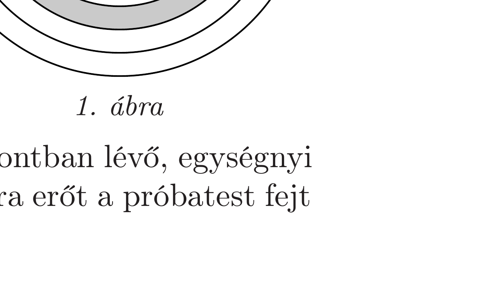
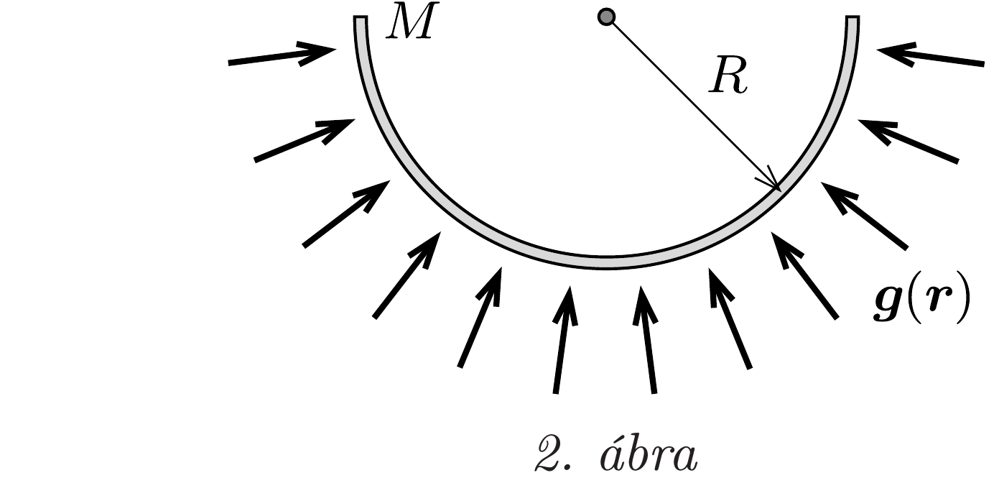
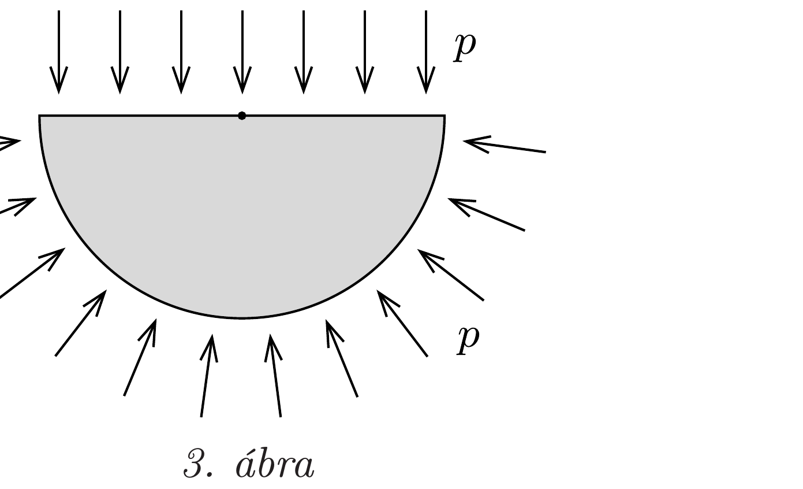

## Útmutatás

Bontsuk fel a félgömböt képzeletben nagyon sok egyforma vastagságú félgömbhéjra! Lássuk be, hogy ezen héjak mindegyike ugyanakkora gravitációs térerősséget hoz létre a kérdéses pontban!

## Megoldás

Vágjuk fel a félgömböt képzeletben nagyon sok egyforma vastagságú, koncentrikusan elhelyezkedő félgömbhéjra! Vajon mekkora erőt fejtenek ki ezek a félgömbhéjak egy egységnyi tömegü „próbatestre” a gömb középpontjában? Mivel a héjak tömege a sugaruk négyzetével egyenesen, az egyes darabkák által kifejtett erő pedig fordítottan arányos a távolság négyzetével, így a különböző sugarú (de azonos vastagságú) gömbhéjak által létrehozott gravitációs gyorsulás a középpontban mind ugyanakkora (1. ábra).

Ha $n$ számú félgömbhéjunk van, akkor a legkülső héj tömege $2 \pi R^{2}(R / n) \varrho$, ahol $R$ a kisbolygó sugara, $\varrho$ pedig a súrúsége. A teljes félgömb gravitációs tere a középpontban a legkülső héj terének $n$-szerese, azaz akkora, mintha $M=2 \pi R^{3} \varrho$ tömeg helyezkedne el a félgömb felületén egyenletesen elosztva. (Ez a tömeg a félgömb tényleges tömegének 3 -szorosa.)

Mekkora erőt fejt ki az $M$ tömegú félgömbhéj a középpontban lévő, egységnyi tömegú testre? Nagyságát tekintve éppen akkorát, amekkora erőt a próbatest fejt
ki a félgömbhéjra, vagyis felületegységenként
\[
p=\frac{1}{2 \pi R^{2}} \cdot \frac{\gamma M}{R^{2}}=\frac{\gamma \varrho}{R}
\]
nagyságút. Ugyanilyen hatást fejtene ki egy $p$ nyomású gáz is a félgömbhéjra (2. ábra). A gáz nyomásából származó (a félgömbhéjra ható) erők eredője viszont éppen akkora, mint a félgömb körlapjára kifejtett nyomóerő (hiszen egy gázba helyezett, tömör félgömbre ható eredó erón nulla), vagyis $g=p \cdot R^{2} \pi=\gamma \varrho R \pi$ (3. ábra).

Ha még azt is figyelembe vesszük, hogy a gömb alakú kisbolygó felszínén
\[
g_{0}=\gamma \varrho \frac{4 \pi R^{3}}{3} \cdot \frac{1}{R^{2}}
\]
volt a gravitációs gyorsulás, a fentebb kiszámított érték
\[
g=\frac{3}{4} g_{0}=7,36 \frac{\mathrm{~cm}}{\mathrm{~s}^{2}} .
\]
A titán súrúségének ismeretében a kisbolygó (eredeti) sugarát is meghatározhatjuk: $R \approx 78$ km-es érték adódik.
