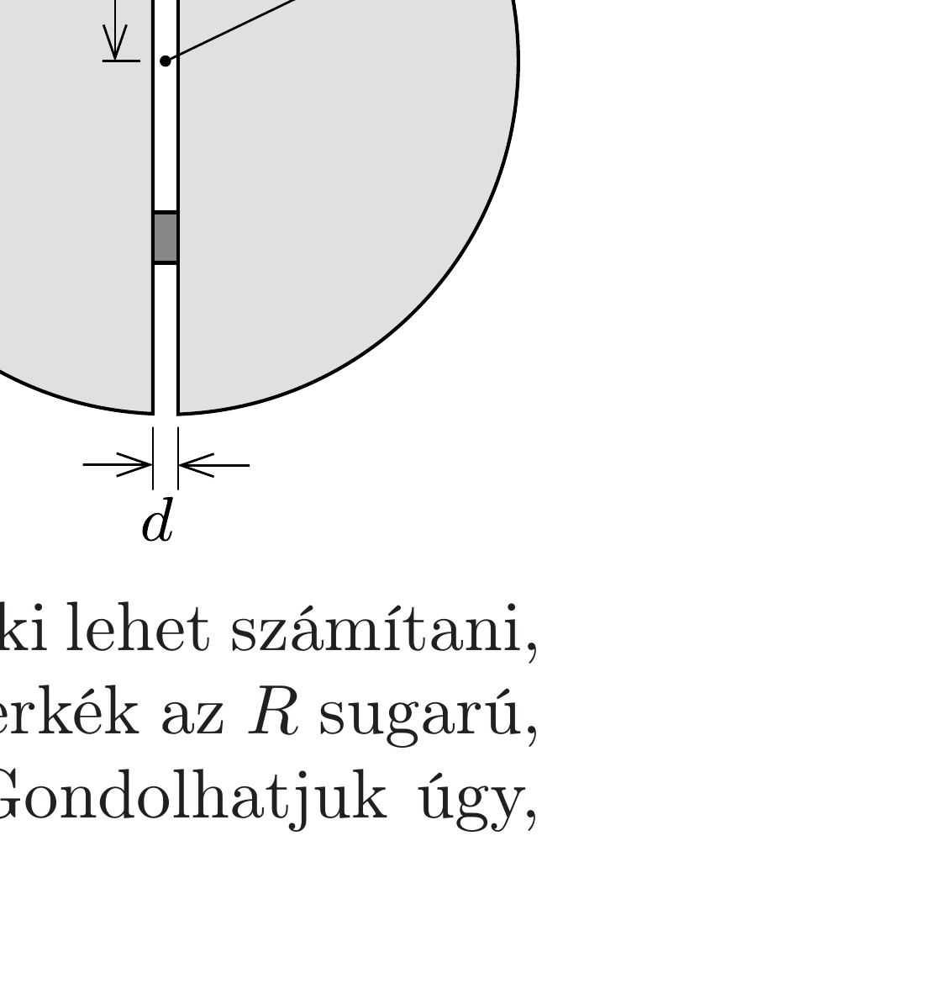

## Útmutatás

Számítsuk ki, mekkora eróvel tudta volna egy „mesebeli óriás" 1 méternyire széthúzni a képzeletben kettévágott kisbolygó két felét! Az óriás által befektetett munka teljes egészében a bolygó anyagának gravitációs potenciális energiájának növelésére fordítódik.

## Megoldás

Ha sikerülne kiszámítani, hogy egy „mesebeli óriás" mekkora $W$ munkavégzés árán tudná az $R$ sugarú, $M$ tömegü kisbolygó két felét $d=1 \mathrm{~m}$ távolságra széthúzni, akkor a $W=F \cdot d$ összefüggésből már a húzóerőt is ismernénk. De vajon hogyan határozhatjuk meg könnyen $W$-t? Közvetlenül, az eró és az elmozdulás szorzatából nem lenne célszerú, hiszen akkor visszajutnánk az eredeti problémához, az erő kiszámításához. Keressünk valamilyen más eljárást!

A kisbolygó két felének széthúzása során megnő a rendszer gravitációs helyzeti energiája, $W$ pedig éppen

az energianövekedéssel egyenlő. Ezt az energianövekedést úgy is ki lehet számítani, hogy meghatározzuk, mekkora munkát végeztek a kis zöld emberkék az $R$ sugarú, $d$ vastagságú korongban lévő titán felszínre hozatala során. (Gondolhatjuk úgy,
hogy a felhozott anyagot - könnyen gördüló szállítóeszközökkel - egyenletesen szétterítették a kisbolygó felszínén.)

Számítsuk ki a keresett munkát a különböző mélységekből felszínre hozott anyag helyzeti energiájának növekedéséből! Jelöljük a felszíni gravitációs gyorsulást $g$-vel, így a középponttól $x$ távolságban a gravitációs gyorsulás $g(x)=g x / R$. Tekintsük az $x$ és $x+\Delta x$ sugárértékek közé eső $\Delta V=d \cdot 2 \pi x \cdot \Delta x$ térfogatú, $\Delta m=\varrho \Delta V$ tömegú anyagmennyiséget! (Itt $\varrho=3 M /\left(4 \pi R^{3}\right)$ az $M$ tömegú kisbolygó sűrúségét jelöli.) Ezt az anyagot ugyanolyan mélyről kell felszínre hozni, érdemes tehát a munkavégzés szempontjából egyetlen darabként kezelni. Erre az anyagdarabra a kitermelés helyén $\Delta m \cdot g x / R$ erő, a felszínen pedig már $\Delta m \cdot g$ eró hat. Mivel a felhozatal során a gravitációs eró egyenletesen növekszik, számolhatunk a kezdeti és a végső erő számtani közepével. A teljes elmozdulás $R-x$, a munkavégzés tehát
\[
\Delta W=\Delta m \frac{g+g x / R}{2}(R-x)=\Delta m g \frac{R^{2}-x^{2}}{2 R}=\frac{3}{4} \frac{M g d}{R^{4}}\left(R^{2}-x^{2}\right) x \Delta x .
\]
A teljes munkavégzés a különböző mélységekből felhozott anyag kiemelése során végzett munkák összege:
\[
W=\sum \Delta W=\frac{3 M g d}{4 R^{4}} \sum\left(R^{2}-x^{2}\right) x \Delta x .
\]
A fenti összeg - a rétegek vastagságának fokozatos finomításával - egy integrálba megy át:
\[
\sum\left(R^{2}-x^{2}\right) x \Delta x \longrightarrow \int_{0}^{R}\left(R^{2}-x^{2}\right) x \mathrm{~d} x=\frac{R^{4}}{4}
\]
a munkavégzés pedig $W=\frac{3}{16} M g d$.
Megjegyzés. Ugyanezt az eredményt megkaphatjuk integrálszámítás alkalmazása nélkül is. Vezessük be $x$ helyett az $u=x^{2} / R^{2}$ új változót $(0 \leq u \leq 1)$, és a különböző mélységú rétegekre vett összegzést fogalmazzuk meg a különböző $u$-khoz tartozó tagok összegzésével. Az $u=x^{2} / R^{2}$ és $u+\Delta u=(x+\Delta x)^{2} / R^{2}$ összefüggésekből (a kicsiny $\Delta x$ négyzetének elhanyagolása után) a munkavégzés így fejezhető ki:
\[
W=\frac{3}{8} M g d \sum(1-u) \Delta u .
\]
A jobb oldalon álló összegzést könnyen ki tudjuk számítani, hiszen $1-u$ egyenletesen változik 1-től 0-ig, átlagosan tehát $\frac{1}{2}$-nek vehető, $\Delta u-\mathrm{k}$ összege pedig 1. Így végül a munkavégzésre valóban a fentebb megadott érték adódik.

A mesebeli óriás tehát $W=\frac{3}{16} M g d$ munkát végez, miközben $d$ távolságra távolítja el a két félgömböt. A széthúzáshoz szükséges eró tehát $F=\frac{3}{16} M g$, ugyanekkora erővel vonzza egymást a kisbolygó két fele, összességében a dúcfáknak ekkora nyomóerőt kellett volna kibírni. A kisbolygó sugarának és a titán súrúségének ismeretében az eró numerikusan is meghatározható:
\[
F=\frac{3}{16} M \cdot \frac{\gamma M}{R^{2}}=\frac{3}{16}\left(\frac{4 \pi R^{3} \varrho}{3}\right)^{2} \frac{\gamma}{R^{2}}=\frac{\gamma R^{4} \varrho^{2} \pi^{2}}{3} \approx 4,4 \cdot 10^{13} \mathrm{~N} .
\]

A nagyságrendek érzékeltetése kedvéért számítsuk ki az egységnyi felületre vonatkoztatott átlagos terhelést:
\[
p=\frac{F}{R^{2} \pi}=1,4 \cdot 10^{5} \mathrm{~Pa},
\]
amely a földi légköri nyomás másfélszerese. Ez 14 tonnányi anyag (földi!) súlya négyzetméterenként, amit kellően erős dúcfáknak ki kellene bírni, feltéve, hogy nőnek egyáltalán fák a titán kisbolygón.
